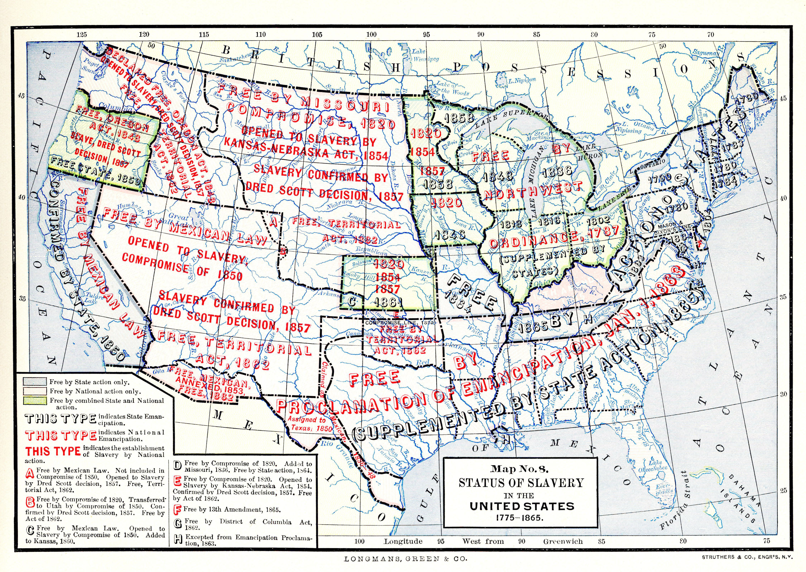

The complex interplay of historical justice, particularly slavery reparations, and modern financial practices like algorithmic trading offers a unique lens through which to view U.S. socio-economic structures. This article examines the historical context of slavery reparations, the ongoing quest for justice in the United States, and the role of algorithmic trading in shaping economic opportunities. While these topics may initially seem unrelated, a combined analysis provides a deeper understanding of persistent inequalities and economic disparities that continue to shape American society.

Slavery reparations serve as a pivotal historical and moral issue that seeks to address the injustices and economic disadvantages experienced by Black Americans. The concept of reparations—financial compensation for the descendants of enslaved individuals—stems from a long history marked by promises and failures, such as the post-Civil War proposition of "40 acres and a mule." Advocates argue that acknowledging and redressing these injustices is crucial for narrowing the racial wealth gap and promoting equity.

On the other hand, algorithmic trading represents a modern financial innovation that has transformed global markets. Through the use of complex algorithms and technological advancements, algorithmic trading has increased the speed and efficiency of trading processes. However, this advancement also brings challenges, including concerns around market fairness and volatility. Understanding the implications of algorithmic trading helps us consider whether such financial tools might perpetuate existing disparities or potentially contribute to reducing them.

By exploring why reparations are considered a necessary step towards addressing historical injustices and assessing the role of algorithmic trading in the contemporary economic landscape, this article aims to highlight broader narratives about justice, opportunity, and the American economy. Engaging with these topics prompts crucial conversations about how historical context and technological advancements converge to impact economic equity and justice.

## Table of Contents

## Historical Context of Slavery Reparations

The concept of slavery reparations in the United States traces its origins to the post-Civil War era, specifically through the proposal known colloquially as "40 acres and a mule." This idea emerged from Union General William Tecumseh Sherman's Special Field Order No. 15 in January 1865. The order aimed to redistribute land confiscated from Confederate landowners along the southeastern coast to newly freed Black families, offering them a fresh start and a means to economic self-sufficiency. However, this promise was largely unfulfilled, as President Andrew Johnson later reversed the order, returning most of the land to its previous owners.

Over the subsequent decades, the discussion surrounding reparations evolved significantly. In the early 20th century, activists like Callie House and organizations such as the National Ex-Slave Mutual Relief, Bounty and Pension Association advocated for direct payments to former slaves. The civil rights movements of the 1960s further invigorated these discussions, emphasizing the need for reparatory justice.

Key legislative efforts have intermittently bolstered the reparations debate. For instance, in 1989, Congressman John Conyers introduced H.R.40, a bill calling for the study of reparations for African Americans. Although it did not pass, the bill has been reintroduced repeatedly, symbolizing persistent advocacy for reparations. Public attitudes toward reparations have also evolved, with increasing awareness of systemic racial inequalities.

The long-term economic impact of slavery on Black Americans is profound, contributing significantly to current wealth disparities. According to Federal Reserve data, the median wealth of white families was $188,200 in 2019, roughly eight times that of Black families, which stood at $24,100. This disparity underscores the enduring economic legacy of slavery and subsequent discriminatory practices like Jim Crow laws and redlining.

Various reparations efforts and proposals have been initiated across different parts of the U.S. In 2021, the city of Evanston, Illinois, made headlines by approving a plan to distribute $10 million in reparations to Black residents using funds from a cannabis tax. This program aims to address historical housing discrimination and has been both lauded and critiqued as a model for other municipalities.

Internationally, several countries have implemented reparations programs with mixed outcomes. Germany's reparations to Holocaust survivors are often cited as a successful precedent. These reparations included monetary payments and support programs, significantly contributing to survivors' economic and psychological recovery. In contrast, reparations following the end of apartheid in South Africa, consisting largely of symbolic gestures and limited monetary compensation, have been criticized for failing to adequately address structural inequalities. These international examples provide valuable insights and lessons for ongoing discussions in the U.S. regarding an effective reparations framework.

## The Case for Reparations

The subject of reparations for slavery involves intricate economic and moral considerations directed towards bridging the racial wealth gap in the United States. This section reviews the basis of such reparations, assessing the structural inequalities that justify their need and discussing contemporary proposals aimed at their implementation.

### Economic and Moral Arguments for Reparations

The argument for reparations is rooted in both economic justice and moral rectitude. Economically, the legacy of slavery and subsequent discriminatory practices have contributed significantly to the racial wealth gap prevalent in the U.S. According to a 2016 report by Prosperity Now and the Institute for Policy Studies, White households held about ten times the wealth of Black households.[^1] This disparity has historical roots in denied opportunities for wealth accumulation for Black Americans, ranging from slavery to segregation and redlining. Reparations, in this context, serve as a corrective measure to redistribute resources and rectify historical inequities.

Morally, reparations are seen as a necessary acknowledgment of past wrongs and an essential step in healing and national reconciliation. Advocates argue that addressing the injustices faced by enslaved people and their descendants is a reflection of a society's commitment to justice and equality. This moral imperative is supported by historical precedents where other communities have received reparations for injustices; examples include reparations for Japanese Americans interned during World War II and compensation for Holocaust survivors.

### Racial Wealth Gap

The racial wealth gap is a crucial indicator of systemic inequality, with wealth disparities contributing to divergent economic opportunities and intergenerational poverty among Black Americans. Government policies and institutional practices have historically marginalized Black communities, restricting access to essential wealth-building resources such as education, property ownership, and affordable credit. Addressing these disparities through reparations could potentially narrow the wealth gap, fostering economic empowerment and creating a more equitable society.

### Proponents and Opponents of Reparations

Supporters of reparations argue that they can serve as a vital component in addressing racial injustices and promoting equality. Economists, such as William Darity Jr., suggest comprehensive reparations programs that include direct payments to descendants of enslaved people, educational grants, and systemic reforms to dismantle institutional barriers.[^2] Critics, however, often question the practicality and fairness of reparations, citing challenges in determining eligibility and potential divisiveness. Furthermore, opponents argue that reparations could potentially perpetuate racial divisions and undermine social cohesion.

### Current Proposals and Their Impacts

Several proposals for reparations have emerged, ranging from local initiatives to federal legislative efforts. These include cash payments, land grants, and targeted investments in Black communities. Current legislative efforts include H.R. 40, a bill that seeks to establish a commission to study and develop reparation proposals for African Americans.[^3]

The potential impacts of these proposals are significant; they aim to enhance economic opportunities for historically marginalized communities, improve educational and healthcare outcomes, and foster a more inclusive society. However, the realization of these goals depends on carefully designed policies that address both immediate needs and long-term systemic reforms.

### Insights from Economists, Historians, and Legal Experts

Economic theories and historical analyses provide essential insights into the feasibility and ethics of reparations. Leading economists argue that reparations could stimulate economic growth by increasing consumption and investment capabilities among beneficiaries. Historians emphasize the importance of acknowledging historical contexts and injustices in shaping reparations programs. Legal experts highlight the necessity for robust frameworks to ensure that reparations are implemented fairly and effectively.

In conclusion, the case for reparations encompasses both economic imperatives and moral responsibilities, challenging society to confront historical wrongs and pursue equitable futures. [^4]

[^1]: Prosperity Now & Institute for Policy Studies. (2016). "The Ever-Growing Gap."
[^2]: Darity, W. A. Jr., & Mullen, A. K. (2020). "From Here to Equality: Reparations for Black Americans in the Twenty-First Century."
[^3]: "H.R.40 - Commission to Study and Develop Reparation Proposals for African Americans Act." U.S. Congress, 116th Congress.
[^4]: Coates, T.-N. (2014). “The Case for Reparations.” The Atlantic.

## Algorithmic Trading: An Overview

Algorithmic trading involves the use of computer algorithms to automate the process of buying and selling financial instruments. These algorithms execute trades based on pre-defined criteria such as timing, price, or [volume](/wiki/volume-trading-strategy), and they have become a dominant force in financial markets. This trading method leverages complex mathematical models and high-speed data analysis to maximize trading efficiency and capitalize on market opportunities that may not be apparent to human traders.

Technological advancements have significantly contributed to the rise of [algorithmic trading](/wiki/algorithmic-trading). The increase in computational power, the development of sophisticated trading software, and the ability to process vast amounts of market data in real-time have all been crucial. High-frequency trading ([HFT](/wiki/high-frequency-trading-strategies)), a subset of algorithmic trading, exemplifies these advancements by exploiting small price discrepancies across different markets or instruments within microseconds. The proliferation of electronic trading platforms, combined with improvements in [artificial intelligence](/wiki/ai-artificial-intelligence) and [machine learning](/wiki/machine-learning), has further accelerated the adoption and evolution of algorithmic trading.

The benefits of algorithmic trading are numerous. It enhances market [liquidity](/wiki/liquidity-risk-premium), allows for precise and rapid execution of transactions, and reduces transaction costs. By eliminating human errors caused by emotional trading, algorithmic systems can offer consistent performance outcomes. Moreover, these systems operate around the clock, enabling continuous market participation.

However, algorithmic trading is not without its risks. One primary concern is market [volatility](/wiki/volatility-trading-strategies). Algorithms can amplify market movements, causing rapid and large-scale shifts in prices, potentially leading to flash crashes. For instance, the 2010 Flash Crash saw the Dow Jones Industrial Average plummet nearly 1,000 points within minutes, largely due to automated, algorithm-driven trading. Additionally, the 'black-box' nature of some algorithms—where the decision-making process is opaque—can contribute to unfair trading practices and raise ethical concerns about transparency and accountability in financial markets.

Critics argue that algorithmic trading can create an uneven playing field. Access to high-speed trading technology often depends on significant capital investment, potentially excluding smaller traders and investors from competing effectively. This concentration of market power among a few well-resourced entities can lead to concerns about market fairness and equitable access.

Regulation of algorithmic trading presents further challenges. Regulatory bodies worldwide have attempted to address the potential risks associated with this trading mode by implementing safeguards. For instance, circuit breakers and trading halts can mitigate extreme volatility by pausing trading during substantial market movements. Regulations also often mandate detailed reporting of algorithmic strategies and emphasize the importance of rigorous testing to ensure that algorithms behave within acceptable parameters. Despite these measures, there is ongoing debate about the adequacy of current regulatory frameworks in fully capturing the complexities and potential systemic risks introduced by algorithmic trading.

In conclusion, while algorithmic trading has revolutionized financial markets with its speed and efficiency, it has also introduced new risks and challenges that require careful management through technological, ethical, and regulatory means.

## Intersection of Historical Justice and Modern Economics

Historical injustices, such as slavery, have left a significant imprint on the economic landscape of America, influencing contemporary economic realities. The effects of slavery, particularly through systemic racism and entrenched socio-economic disparities, are evident in the persistent racial wealth gap, where Black households possess significantly less wealth compared to their White counterparts. This discrepancy is not merely a relic of the past but a fulfillment of long-standing inequalities perpetuated through discriminatory practices, like redlining and unequal access to education and employment opportunities.

Algorithmic trading, which has gained prominence in modern financial markets, plays a nuanced role in either perpetuating or bridging these economic disparities. At its core, algorithmic trading utilizes complex algorithms and high-speed data processing to execute trades rapidly, often leading to significant influences on market prices and trends. While it offers opportunities for increased market efficiency and liquidity, it can also exacerbate existing inequities if access to such technology is unevenly distributed. Large financial institutions often have more resources to develop and deploy these advanced trading algorithms, potentially marginalizing smaller players lacking similar capabilities.

In assessing whether modern economic tools like algorithmic trading can contribute to financial equity, it's crucial to consider their application and governance. Properly regulated, algorithmic trading could be structured to enhance market access and transparency for underrepresented populations. For example, democratizing access to high-frequency trading technologies through educational initiatives and support for fintech innovations tailored to underserved communities may increase market participation among marginalized groups.

Exploring the prospects of algorithmic trading to support financial reparations presents a novel approach. Financial technologies could be harnessed to design automated systems that facilitate the redistribution of wealth or manage reparations programs efficiently. Such systems could leverage data analytics to identify the most affected communities, tailor investment opportunities towards them, and track the outcome of reparative measures. This would require a robust ethical framework and regulatory oversight to ensure intentions align with equitable outcomes.

The integration of historical context with technological advances is paramount for achieving holistic economic justice. Understanding the enduring impacts of historical injustices provides the foundation for deploying modern economic tools in ways that are transformative and fair. Algorithmic trading, if governed thoughtfully, presents opportunities to mend the fractures within the economic system, promoting broader economic inclusion and rectifying historical wrongs. Ensuring equitable economic outcomes in the digital age requires continuous reflection on past injustices and proactive measures to foster an inclusive economy for all.

## Conclusion

Addressing historical injustices, such as the long-standing economic and social inequalities stemming from slavery, remains crucial as modern financial practices evolve. The dual forces of historical justice and algorithmic trading present both challenges and opportunities in shaping the American socio-economic landscape. A comprehensive approach is necessary to ensure that economic tools, including algorithmic trading, contribute positively to rectifying past inequities and do not serve to perpetuate them.

Economic tools like algorithmic trading have the potential to either hinder or promote efforts towards historical justice. These tools, if leveraged correctly, could aid in creating more equitable financial markets, providing increased access and opportunity to traditionally marginalized groups. However, without careful consideration and ethical implementation, they risk exacerbating existing disparities by favoring those with existing wealth and technological capabilities.

The necessity of policy interventions is clear in the pursuit of equitable economic opportunities. Policymakers must craft regulations that ensure algorithmic trading and other financial innovations are accessible and fair to all participants. Measures could include promoting financial literacy, increasing transparency in financial systems, and ensuring algorithms are free from biases that could disadvantage minority groups.

Reflecting on the ongoing pursuit of economic equity in the U.S., it is evident that progress has been made, yet significant work remains. The integration of historical context with modern technological advancements is essential in crafting solutions that address inequality comprehensively. The journey towards economic equity is ongoing, requiring persistent efforts to overcome structural barriers and to create an inclusive economic system.

Encouraging continued dialogue and action is vital for addressing these complex issues in a comprehensive manner. Stakeholders from various sectors, including policymakers, economists, technologists, and community leaders, must collaborate to foster a just economic environment. This engagement ensures that as financial technologies advance, they do so in a manner that respects and addresses historical injustices, paving the way for a fairer economic future for all.

## References & Further Reading

[1]: Darity, W. A. Jr., & Mullen, A. K. (2020). ["From Here to Equality: Reparations for Black Americans in the Twenty-First Century."](https://www.jstor.org/stable/10.5149/9781469654997_darity) The University of North Carolina Press.

[2]: Coates, T.-N. (2014). ["The Case for Reparations."](http://pscourses.ucsd.edu/ps108/6%20Reparations/Coates%202014-%20The%20Case%20for%20Reparations.pdf) The Atlantic.

[3]: U.S. Congress (116th Congress). ["H.R.40 - Commission to Study and Develop Reparation Proposals for African Americans Act."](https://www.congress.gov/bill/116th-congress/senate-bill/1083)

[4]: Prosperity Now & Institute for Policy Studies. (2016). ["The Ever-Growing Gap."](https://ips-dc.org/report-ever-growing-gap/)

[5]: Lopez de Prado, M. (2018). ["Advances in Financial Machine Learning."](https://www.amazon.com/Advances-Financial-Machine-Learning-Marcos/dp/1119482089) Wiley.

[6]: Chan, E. P. (2008). ["Quantitative Trading: How to Build Your Own Algorithmic Trading Business."](https://github.com/ftvision/quant_trading_echan_book) Wiley.

[7]: Jansen, S. (2020). ["Machine Learning for Algorithmic Trading."](https://github.com/stefan-jansen/machine-learning-for-trading) Second Edition.