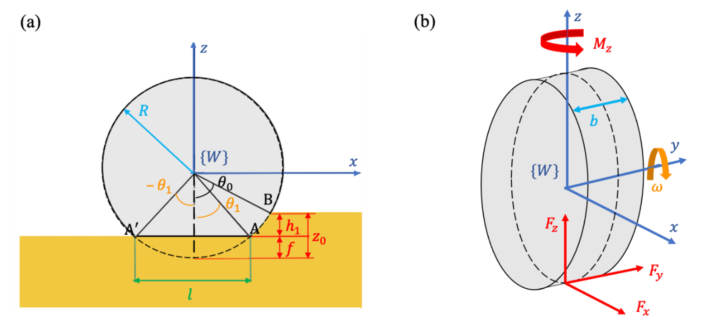

Slippage is a critical concept in algorithmic trading, defined as the divergence between the expected price of a trade and its actual execution price. This discrepancy can arise from a variety of factors, each of which has the potential to significantly affect the profitability and efficiency of automated trading systems. Properly understanding and estimating slippage is crucial for traders aiming to optimize their trading strategies and maximize returns.

This article will examine the importance of slippage estimation in algorithmic trading, highlighting the factors that contribute to this pricing phenomenon. These factors include market liquidity, volatility, execution delays, and order type, among others. By understanding these variables, traders can better predict and mitigate the negative impact of slippage on their trades.



Moreover, this article will provide insights into how traders can accurately measure and reduce slippage in an algorithmic trading environment. Techniques such as the utilization of trade logs, statistical tools, and software will be discussed as means to quantify slippage and inform trading strategies.

In conclusion, understanding the intricacies of slippage estimation is vital for traders utilizing automated systems. Through careful analysis and strategic implementation, traders can minimize the drawbacks of slippage, ultimately enhancing the efficacy of their trading approaches.

## Table of Contents

## Understanding Slippage in Algorithmic Trading

Slippage occurs when there is a delay between a trade signal and its execution, resulting in an unexpected change in the price at which the trade is executed. In algorithmic trading, slippage can be attributed to various sources, such as market volatility, liquidity issues, and technical delays. Market volatility, for example, can cause rapid price fluctuations, increasing the likelihood of a discrepancy between the expected and actual execution prices. Liquidity issues may arise when there is insufficient volume to execute a trade at the desired price, forcing traders to accept less favorable prices.

Technical delays, including those caused by network latency or slow broker responses, can also contribute to slippage. These delays can become critical during times of high market activity, where every millisecond counts and even minor latencies can lead to noticeable slippage.

To illustrate how slippage manifests in real-world trading scenarios, consider a trader who issues a buy order during a period of high market [volatility](/wiki/volatility-trading-strategies). The expectation might be to purchase a stock at $100, but due to slippage, the execution might occur at $100.50. This 0.50 change in price exemplifies the impact of slippage on order execution, particularly in fast-moving markets.

Slippage can significantly affect trading outcomes, influencing both profits and losses. For profitable trades, excessive slippage can erode expected gains, transforming a lucrative trade into a less profitable one. Conversely, when losses occur, slippage can exacerbate the trader's detriment by increasing the realized loss. Understanding these dynamics is vital for algorithmic traders, who rely on precise execution to maintain the profitability of their strategies. Accurately estimating and managing slippage is crucial for minimizing its impact on trading performance.

## Factors Contributing to Slippage

Several critical factors contribute to slippage in [algorithmic trading](/wiki/algorithmic-trading), encompassing both market-driven and technical aspects.

Delays in trade execution are one of the primary contributors to slippage. These delays can arise due to network latency and broker performance issues. Network latency refers to the time taken for data to travel from a trader’s computer to the exchange server and back. Any lag in this process can lead to slippage as the market price may change before the order is executed. Broker performance issues, such as slow order processing times, can exacerbate this problem. Ensuring low latency in data transmission and selecting brokers with fast execution speeds can help reduce the incidents of slippage.

Market conditions play a crucial role in slippage occurrence. Sudden changes in market conditions, including unexpected news releases or economic events, can cause significant price fluctuations. Such volatility can lead to orders being executed at prices far from their expected levels. Additionally, a lack of [liquidity](/wiki/liquidity-risk-premium) exacerbates this issue as there may not be enough buy or sell orders at the desired price level, forcing trades to be executed at less favorable prices.

The size of trade orders also impacts slippage. Large orders can move the market, especially in less liquid stocks or [forex](/wiki/forex-system) pairs. This movement is due to shifts in the supply and demand dynamics, which cause the price to adjust as the order is filled. As a result, traders often experience slippage when placing large orders, as the market needs to accommodate the [volume](/wiki/volume-trading-strategy) being traded.

Different order types further influence the extent of slippage experienced. Market orders are more prone to slippage because they are executed immediately at the best available price, regardless of the price changes that occur between the initiation of the order and its execution. Conversely, limit orders, where a specific target price is set, can help mitigate slippage by ensuring that trades are only executed at the desired price. However, this comes at the risk of the order not being filled if the price does not reach the target level.

In conclusion, effectively managing slippage requires an understanding of these contributing factors and strategies to mitigate their impact. Reducing network latency, choosing capable brokers, adjusting order sizes, and selecting appropriate order types can all help in minimizing the unforeseen costs associated with slippage.

## Measuring Slippage Effectively

Measuring slippage effectively is a crucial task for traders who seek to optimize their algorithmic trading systems. It involves assessing the discrepancy between the expected price of a trade and its actual execution price. This difference can affect trading outcomes significantly and, therefore, needs careful evaluation.

To effectively measure slippage, traders begin by comparing the expected trade price with the price at which the trade is executed. This comparison highlights any deviations that signify slippage. The formula for slippage ($S$) can be expressed as:

$$
S = P_{\text{executed}} - P_{\text{expected}}
$$

Where $P_{\text{executed}}$ is the price at which the trade was executed, and $P_{\text{expected}}$ is the anticipated trade price.

Empirical analysis of slippage is grounded in the thorough examination of trade logs and order records, which provide comprehensive data about historical trades and executions. These records offer insights into instances of slippage and its underlying causes, allowing traders to identify patterns or technical issues that may contribute to this discrepancy.

Statistical tools and analytical software are vital in quantifying slippage as they facilitate the understanding of its frequency and extent. Tools such as Python libraries for data manipulation and statistical analysis, like Pandas and SciPy, are invaluable for analyzing large datasets of trade records. For instance, traders can use Python code to calculate the average slippage over a set of trades:

```python
import pandas as pd

# Sample data containing expected and executed prices
trade_data = pd.DataFrame({
    'expected_price': [100.5, 101.0, 99.8, 100.0],
    'executed_price': [100.7, 101.3, 100.0, 99.9]
})

# Calculate slippage for each trade
trade_data['slippage'] = trade_data['executed_price'] - trade_data['expected_price']

# Calculate average slippage
average_slippage = trade_data['slippage'].mean()
print(f"Average Slippage: {average_slippage}")
```

Beyond raw data analysis, the use of statistical models to interpret trends in slippage over time further enhances traders' ability to predict future occurrences and adjust their strategies accordingly. They can utilize regression models or time series analysis to study the correlation between slippage levels and market conditions, such as volatility and liquidity.

Thus, effectively measuring slippage involves a combination of empirical data analysis, statistical quantification, and the application of robust software tools to equip traders with the necessary insights to improve trade execution and profitability.

## Strategies for Estimating Slippage

Estimating slippage accurately is vital for optimizing algorithmic trading strategies. One of the effective strategies for estimating slippage is engaging in live paper trading. This approach involves executing trades in a simulated environment that mirrors real-market conditions, allowing traders to observe and compare initial fills with open prices to model deviations. This practice provides practical insights into potential slippage by mimicking real trading without financial risk.

Analyzing trade volume and market volatility is crucial in refining slippage estimates. High trade volumes can lead to market impact, where large orders disrupt the market equilibrium, causing price shifts. Similarly, volatility affects price stability, potentially increasing the likelihood of slippage. By incorporating these factors into their analysis, traders can improve the precision of their slippage computations.

Another robust method involves utilizing simulation and [backtesting](/wiki/backtesting) engines integrated with slippage assumptions. These tools enable traders to model trading strategies using historical data, incorporating hypothetical slippage scenarios. By including slippage as a variable, these engines can forecast potential deviations in execution, providing valuable information for strategy optimization. For instance, a basic simulation approach in Python might involve adjusting trade execution prices by a slippage [factor](/wiki/factor-investing), computed based on historical data, and observing the impacts on strategy outcomes.

```python
import numpy as np

# Simulated trade prices and slippage factor
trade_prices = np.array([100, 101, 102, 99, 103])
slippage_factor = 0.002  # 0.2% slippage

# Calculate slippage-adjusted prices
adjusted_prices = trade_prices * (1 + slippage_factor)

print("Trade Prices:", trade_prices)
print("Adjusted Prices:", adjusted_prices)
```

This code snippet illustrates a simple model where trade prices are adjusted by a slippage factor, aiding in the anticipatory analysis of potential trading outcomes. By continually testing and refining these strategies, traders can better anticipate slippage impacts, thus optimizing their trading systems for improved performance.

## Methods to Reduce Slippage

To mitigate slippage in algorithmic trading, traders can adopt several strategies aimed at minimizing the disparity between expected and executed trade prices. One effective approach is opting for limit orders over market orders. A limit order specifies the maximum or minimum price at which the trader is willing to buy or sell a security, thereby providing more control over execution prices and reducing the possibility of slippage. In contrast, market orders, which are executed at the best available price, are more susceptible to slippage, especially in volatile markets.

Further, selecting brokers with high-speed execution capabilities and utilizing low-latency trading platforms can substantially decrease trade execution delays. Brokers with robust infrastructure are better equipped to process orders swiftly, minimizing the time lapse that often leads to slippage. Low-latency platforms leverage cutting-edge technology to facilitate rapid data transmission and processing, thus enhancing the precision of trade executions.

Monitoring market conditions is also crucial in mitigating slippage. By keeping an eye on factors such as volatility, liquidity, and trading volume, traders can time their orders to coincide with favorable market conditions, reducing the risk of adverse price movements. In addition, adopting hedging strategies can offset slippage risks. Hedging involves taking a position in a related security to mitigate potential losses from slippage. For instance, traders might use derivatives like options or futures contracts to hedge against unfavorable price changes.

To implement these strategies in a trading system, algorithms can be adjusted to incorporate these methods. Featuring in code, for instance, traders could set up conditions to use limit orders or cancel trades if the slippage exceeds predefined thresholds.

```python
def execute_trade(order_type, price, slippage_tolerance):
    # Example function to execute trade based on order type and slippage tolerance
    if order_type == 'limit':
        # Execute limit order logic
        print("Executing limit order at price:", price)
    elif order_type == 'market':
        # Check slippage
        actual_price = market_price()  # Hypothetical function to get the current market price
        if abs(actual_price - price) <= slippage_tolerance:
            print("Executing market order at price:", actual_price)
        else:
            print("Slippage too high, order canceled")
    else:
        print("Invalid order type")
```

Overall, these methodologies aim to enhance the predictability and control of trade executions, ensuring that traders can improve their trading strategies' overall efficiency and profitability by minimizing slippage.

## Conclusion

Accurate estimation and management of slippage are essential for optimizing the performance of algorithmic trading systems. Slippage can significantly affect trade profitability, making it crucial for traders to assess its potential impacts rigorously. By understanding the contributing factors, such as market volatility, trade execution delays, and liquidity constraints, traders can implement strategies to mitigate slippage's adverse effects. 

Employing techniques like choosing appropriate order types, such as limit orders, and selecting brokers with superior execution speeds can help in minimizing slippage. Furthermore, leveraging low-latency trading platforms ensures faster data processing and order execution, reducing the delay between trade signals and actual trades. 

Modeling slippage using statistical tools and software aids in quantifying its frequency and magnitude, enabling traders to better anticipate potential discrepancies. Continuous evaluation of trading strategies and adaptation to ever-changing market conditions are essential to enhance the accuracy and efficiency of slippage predictions. 

By adopting these strategies, traders can minimize slippage's negative impacts on their trading outcomes, maintaining more consistent profitability. Ultimately, an integrative approach to slippage estimation and management strengthens algorithmic trading systems' resilience and adaptability, leading to improved long-term performance.

## References & Further Reading

[1]: Aldridge, I. (2013). ["High-Frequency Trading: A Practical Guide to Algorithmic Strategies and Trading Systems"](https://www.wiley.com/en-us/High+Frequency+Trading%3A+A+Practical+Guide+to+Algorithmic+Strategies+and+Trading+Systems%2C+2nd+Edition-p-9781118343500). Wiley.

[2]: Kissell, R. (2013). ["The Science of Algorithmic Trading and Portfolio Management."](https://www.sciencedirect.com/book/9780124016897/the-science-of-algorithmic-trading-and-portfolio-management) Academic Press.

[3]: Prado, M. L. (2018). ["Advances in Financial Machine Learning"](https://books.google.com/books/about/Advances_in_Financial_Machine_Learning.html?id=oU9KDwAAQBAJ). Wiley.

[4]: Chan, E. P. (2008). ["Quantitative Trading: How to Build Your Own Algorithmic Trading Business"](https://github.com/ftvision/quant_trading_echan_book). Wiley.

[5]: Narang, R. K. (2013). ["Inside the Black Box: The Simple Truth About Quantitative Trading"](https://onlinelibrary.wiley.com/doi/book/10.1002/9781118267738). Wiley.

[6]: Darrell Duffie, James D. Hamilton, & John B. Taylor (2009). ["Bearish Slippage in Financial Trading."](https://archive.org/details/roadaheadforfed0000unse) Journal of Economic Perspectives.

[7]: Kissell, R., & Glantz, M. (2003). ["Optimal Trading Strategies: Quantitative Approaches for Managing Market Impact and Trading Risk"](https://www.semanticscholar.org/paper/Optimal-Trading-Strategies%3A-Quantitative-Approaches-Kissell-Glantz/0552eba9819c8b3091684cbe8c94fc68724e739e). AMACOM. 

[8]: Jansen, S. (2020). ["Machine Learning for Algorithmic Trading"](https://github.com/stefan-jansen/machine-learning-for-trading). Packt Publishing.