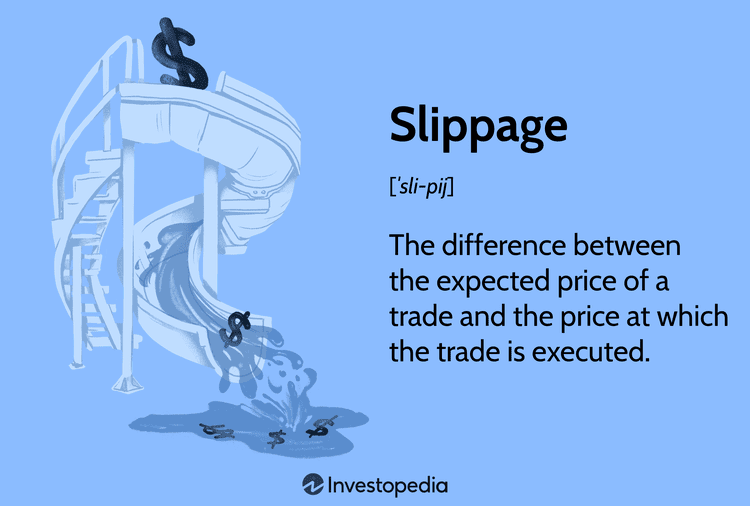

Slippage is a term in finance and trading that describes the difference between the projected price of a trade and the actual price at which it is executed. This variance can be particularly noticeable in situations of market volatility, potentially affecting the efficiency and success of trading strategies. Both novice and seasoned traders can find themselves challenged by slippage, as it demands careful consideration in the planning of trades.

Understanding slippage is crucial because it has direct implications on trading outcomes. When a trader places an order, certain expectations about the trade execution price are set. However, during the brief moment from order submission to execution, the actual conditions of the market may change, resulting in an execution price that differs from the expectation. This differential can potentially reduce the profit on a trade or increase the cost, creating a notable impact, especially when trading large volumes or when frequent trading forms a core strategy.



In finance and algorithmic trading, market conditions—such as high volatility or low liquidity—drive slippage. Markets like equities, bonds, foreign exchange, and cryptocurrencies can all experience slippage to varying degrees. It can manifest as either positive or negative: a positive slippage results when a trade is executed at a better price than anticipated, whereas a negative slippage leads to an execution at a less favorable price.

This article examines the mechanisms by which slippage arises, its broader implications for trading, and identifies strategies to minimize its effects. As trading increasingly shifts towards automation, understanding and managing slippage in algorithmic contexts becomes ever more critical. By anticipating and planning for slippage, traders can enhance their strategies and optimize trading processes, effectively navigating the complexities of modern financial markets.

## Table of Contents

## Understanding Slippage in Trading

Slippage in trading is a phenomenon that manifests when there is a discrepancy between the anticipated price of a trade and the actual price at which it is executed. This common occurrence can happen across various financial markets, such as equities, bonds, and foreign exchange (forex). Slippage is particularly prevalent during periods of significant market volatility or when liquidity is deficient.

High volatility can cause prices to move rapidly, meaning that by the time an order reaches the market, the price may have shifted. Similarly, in situations with low liquidity, large orders can move the market against the trade, causing slippage. It's crucial to note that slippage is not inherently negative and can potentially result in better prices than expected, known as positive slippage, or worse, known as negative slippage. In some cases, trades might execute at the intended price, resulting in no slippage.

Market orders are particularly susceptible to slippage. Unlike limit orders, which specify a price ceiling or floor, market orders instruct the broker to execute a trade immediately at the best available price. This urgency leaves little room for price negotiation, meaning that any rapid price movements between the order time and execution can lead to slippage. For example, if a trader places a market order to buy shares of a stock at an expected price of $50, during high [volatility](/wiki/volatility-trading-strategies), the order might execute at $51 due to rapid price increases—indicating negative slippage. Conversely, if the price falls to $49 during the execution, the trader experiences positive slippage.

To differentiate the scenarios:

- **Positive Slippage**: Occurs when traders receive a better price than expected. For example, a buy order is executed at a lower price or a sell order at a higher price.
- **Negative Slippage**: Takes place when the execution results in a worse price. This includes buy orders executed at a higher price or sell orders at a lower price than anticipated.
- **No Slippage**: The trade executes at the expected price.

Understanding these scenarios can aid traders in better anticipating the potential impacts on their trading outcomes. While market orders are convenient, their susceptibility to slippage underlines the importance of strategizing trade executions, especially during times of high market volatility or low [liquidity](/wiki/liquidity-risk-premium).

## The Mechanics of Slippage in Algorithmic Trading

Algorithmic trading involves executing financial transactions through automated computer programs designed to work at optimal speed and precision. These algorithms aim to reduce human intervention, capitalize on market efficiencies, and achieve optimal trade execution, typically measured in microseconds or milliseconds. However, this high-frequency trading environment can exacerbate slippage due to factors such as market impact and order execution speed.

Slippage occurs in [algorithmic trading](/wiki/algorithmic-trading) primarily because of the significant market impact that large or rapid trades can have and the finite speed at which market data can be processed and trades can be executed. The immediate execution of a large order can move the market against the intended position of the trader, resulting in unfavorable execution prices. Furthermore, the delay between the decision to trade and the execution—however brief—can allow for price movement that leads to slippage.

To manage slippage, trading algorithms are often designed with several mitigation strategies. Algorithms may incorporate predictive models to estimate the potential impact of an order on the market and adjust trade sizes or timing accordingly. These adjustments help in minimizing the market impact, thus limiting slippage.

Despite these design considerations, slippage remains an unavoidable aspect of automated trading. Factors such as latency, market volatility, and liquidity constraints contribute to its inevitability. The latency inherent in any technology stack—often described as the delay from the decision-point in the algorithm to the market response—can be a significant source of slippage, particularly in volatile markets where prices flail with ease.

Backtesting is crucial in understanding and managing the impact of slippage. It involves simulating an algorithm through historical market data to evaluate its likely performance under various conditions. While historical data may not perfectly predict future market behavior, [backtesting](/wiki/backtesting) can provide insight into how different strategies weather fluctuations in volatility and liquidity, helping refine algorithms to be more resilient to slippage.

Python, with its extensive suite of libraries and tools, is frequently used in algorithmic trading for backtesting algorithms. Libraries such as Backtrader or Zipline allow for comprehensive historical testing of trading strategies. Consider the following simple Python code snippet, which uses the Backtrader library to test a trading strategy's resilience to slippage:

```python
import backtrader as bt

class SlippageStrategy(bt.SignalStrategy):
    def __init__(self):
        self.signal_add(bt.SIGNAL_LONG, self.data.close > 100)

    def notify_order(self, order):
        if order.status in [order.Completed]:
            print(f'Order executed at {order.executed.price}, Slippage: {order.executed.price - order.created.price}')

# Set up data feed and cerebro engine
data = bt.feeds.YahooFinanceData(dataname='AAPL', fromdate=datetime(2020, 1, 1), todate=datetime(2021, 1, 1))
cerebro = bt.Cerebro()
cerebro.adddata(data)

# Add the strategy and run
cerebro.addstrategy(SlippageStrategy)
cerebro.run()
```

In this code, the `notify_order` method collects and prints details about each trade's slippage compared to the intended price. This example illustrates how backtesting can help identify and quantify slippage in potential trading strategies. This analysis is a necessary step in algorithmic trading to enhance precision and profitability.

Slippage, therefore, while prevalent, can be mitigated through careful algorithm design and robust backtesting. Understanding these dynamics enables traders to better sculpt their algorithms, making them more adept at executing trades efficiently in the fast-paced financial markets.

## Minimizing Slippage in Trading Strategies

Despite its inevitability, several methods exist to reduce slippage's negative impact. A straightforward approach to managing slippage is through the use of limit orders instead of market orders. A limit order is an order to buy or sell a security at a specified price or better. This type of order provides more control over the execution price, thereby reducing the potential for negative slippage. Unlike market orders, which are executed at the current market price, limit orders will only be executed at the predetermined price level or more favorable prices. Employing limit orders help traders avoid unfavorable execution prices, particularly during times of market volatility.

Traders can also minimize slippage by executing trades during periods of reduced market volatility. Market volatility often leads to rapid price changes, increasing the likelihood of slippage. By trading at times when markets are traditionally calm, such as during the overlap of Asian and European trading sessions in the [forex](/wiki/forex-system) market, traders can encounter less price movement, leading to more predictable trade outcomes. Understanding the concept of Average True Range (ATR), a measure of market volatility, can assist traders in determining optimal trading times.

Incorporating slippage management tools like stop-loss orders and price alerts into trading strategies further enhances control over trade execution. Stop-loss orders automatically sell a security when it reaches a certain price, protecting against excessive losses due to slippage. They are particularly useful in highly volatile markets, where prices can shift dramatically. When combined with price alerts, which notify traders of significant price movements, stop-loss orders enable traders to react promptly to adverse market conditions.

These strategies, when effectively implemented, allow traders to mitigate the adverse effects of slippage and achieve more consistent trading performance. As markets continue to evolve, adapting these tactics is crucial for maintaining an edge in trading execution and profitability.

## Slippage Across Different Markets

Slippage varies across different financial markets due to their unique characteristics, and understanding these differences can provide traders with a significant edge. 

In the forex market, slippage is often influenced by factors such as time zones and currency pair liquidity. Forex trading operates 24 hours a day, with different sessions opening and closing across global financial hubs. This continuous operation means that liquidity can fluctuate significantly, affecting slippage. For instance, the overlap of the London and New York sessions often provides high liquidity and narrower spreads, thus potentially reducing slippage. In contrast, during off-peak hours, when fewer traders are active, liquidity decreases, and slippage can increase. Furthermore, currency pairs involving major currencies (like EUR/USD) generally experience lower slippage due to their higher liquidity compared to exotic or less traded pairs.

Cryptocurrency trading presents a different set of challenges regarding slippage. The [cryptocurrency](/wiki/cryptocurrency) market is known for its high volatility and variable liquidity, which can result in frequent and significant slippage. The high volatility stems from factors such as speculative trading, regulatory news, and technological developments. Cryptocurrencies also have periods of extreme demand, leading to drastic price movements and potential slippage beyond expected levels. To manage slippage in this market, traders might consider executing trades during periods of increased market activity to ensure better liquidity, or they may use tools like slippage-tolerant order types specific to cryptocurrency exchanges.

To adjust trading strategies for market-specific slippage characteristics, traders can employ several tactics. For forex trading, automation through algorithms can help by executing trades at optimal times and adjusting to liquidity shifts across time zones. Similarly, employing limit orders rather than market orders can be an effective way to manage price execution. In cryptocurrency markets, traders could leverage real-time data analytics to recognize periods of heightened volatility or low liquidity and adjust their strategies accordingly. Additionally, developing algorithms that [factor](/wiki/factor-investing) in liquidity trends of specific cryptocurrencies may help minimize slippage impacts.

By tailoring strategies to the specific dynamics of each market, traders can effectively manage slippage and enhance their trading performance.

## Advanced Techniques in Algorithmic Trading to Combat Slippage

Algorithmic trading is a powerful approach to contemporary financial markets, offering the ability to execute large volumes of trades quickly and efficiently. However, slippage poses a notable challenge. Employing advanced techniques helps mitigate its impact, thereby enhancing trade efficiency and profitability.

Real-time data analytics forms the backbone of effective algorithmic trading strategies. By utilizing high-frequency data feeds, algorithms can make rapid decisions and dynamically adjust trading parameters as market conditions change. This approach helps identify optimal entry and [exit](/wiki/exit-strategy) points, reducing the likelihood of adverse price movements that result in slippage. For example, [artificial intelligence](/wiki/ai-artificial-intelligence) and [machine learning](/wiki/machine-learning) techniques can predict short-term price movements by analyzing historical patterns and real-time data streams. These predictive models allow for preemptive adjustments to trading strategies, ensuring trades are executed closer to the intended price.

Implementing robust algorithms that account for market liquidity and volatility is also essential in combating slippage. Algorithms that dynamically assess liquidity conditions can determine the most opportune moments to execute trades. They analyze [order book](/wiki/order-book-trading-strategies) depth and adjust trade size or timing to minimize market impact. Volatility-sensitive algorithms modulate their aggressiveness based on prevailing market conditions, reducing the chances of executing trades during detrimental price swings.

One practical method to reduce slippage is the use of limit orders, which specify the maximum or minimum price a trader is willing to accept. This prevents trades from being executed at unfavorable prices, a common occurrence with market orders. Here is an illustration of using Python to set limit orders:

```python
from alpaca_trade_api import REST

api = REST('your_api_key', 'your_secret_key', base_url='https://paper-api.alpaca.markets')

def place_limit_order(symbol, qty, limit_price, side='buy'):
    order = api.submit_order(
        symbol=symbol,
        qty=qty,
        side=side,
        type='limit',
        time_in_force='gtc',  # 'gtc' stands for Good Till Canceled
        limit_price=limit_price
    )
    return order

# Example usage
order = place_limit_order('AAPL', 10, 150.00, 'buy')
print(order)
```

This Python code demonstrates setting a limit order to buy 10 shares of Apple Inc. ('AAPL') at a maximum price of $150. By specifying a limit price, traders ensure that the order will only execute at the desired price or better, effectively controlling the extent of slippage.

In conclusion, while slippage is an unavoidable aspect of algorithmic trading, advanced techniques such as real-time data analytics, robust algorithm design, and strategic use of limit orders can significantly reduce its impact. These methods enhance the alignment of executed prices with expected prices, thereby optimizing trading outcomes in volatile and fast-moving markets.

## Conclusion

Slippage remains an intrinsic aspect of trading that can significantly influence profitability and overall market strategy. Its impact is notably pronounced during periods of high volatility or when liquidity is scarce, making it crucial for traders to understand slippage's mechanics to effectively mitigate its effects.

Grasping the implications of slippage is essential; it is the deviation between the expected and actual execution prices. This deviation can adversely affect the net gains from a trade if not adequately managed. To counteract this, traders can employ a variety of strategies tailored to the specific characteristics of the markets they operate in. One such strategy is the use of limit orders in place of market orders. Limit orders ensure that a trade is executed at a specific price, thus reducing the uncertainty that comes with slippage. Additionally, executing trades during calmer market periods can also help avoid the adverse effects of volatility-induced slippage.

Algorithmic trading presents itself as a potent tool in managing and, to some extent, minimizing slippage. Through the use of sophisticated algorithms, traders can execute trades at optimal prices with enhanced precision and speed. Algorithms can integrate real-time data analytics to make quick decisions, adjusting trading parameters dynamically to account for shifts in market liquidity and volatility. A robust algorithm considers these factors and uses historical data for backtesting under various scenarios, which helps in evaluating and refining its performance to minimize slippage.

Moreover, traders must remain adaptable, as market conditions are continually evolving. Continuously refining strategies is vital for keeping up with these changes and maintaining trading effectiveness. This involves not only updating algorithmic parameters but also staying informed about market trends and new technologies in trading platforms.

In conclusion, slippage cannot be entirely eliminated but can be managed through a deep understanding of its dynamics and strategic application of algorithmic tools. By doing so, traders can better align their strategies with market conditions, thus safeguarding profitability and enhancing their market approach.

## References & Further Reading

[1]: Pardo, R. (2008). ["The Evaluation and Optimization of Trading Strategies."](https://onlinelibrary.wiley.com/doi/book/10.1002/9781119196969) Wiley.

[2]: Kissell, R. (2013). ["The Science of Algorithmic Trading and Portfolio Management."](https://www.sciencedirect.com/book/9780124016897/the-science-of-algorithmic-trading-and-portfolio-management) Academic Press.

[3]: Narang, R.K. (2013). ["Inside the Black Box: A Simple Guide to Quantitative and High-Frequency Trading."](https://onlinelibrary.wiley.com/doi/book/10.1002/9781118662717) Wiley.

[4]: Aldridge, I. (2013). ["High-Frequency Trading: A Practical Guide to Algorithmic Strategies and Trading Systems."](https://books.google.com/books/about/High_Frequency_Trading.html?id=8QpIsVUMhmEC) Wiley.

[5]: Dhanani, B.A. (2019). ["Algorithmic Trading: Winning Strategies and Their Rationale."](https://www.semanticscholar.org/paper/Algorithmic-Trading%3A-Winning-Strategies-and-Their-Chan/8220c62caf83863b7f5fb279366d545e720ee062) CRC Press.

[6]: Bouchaud, J.P., & Potters, M. (2003). ["Theory of Financial Risk and Derivative Pricing."](https://www.cambridge.org/core/books/theory-of-financial-risk-and-derivative-pricing/5BBBA04CE72ED9E5E7C1C028D9A94FCB) Cambridge University Press.

[7]: Hasbrouck, J. (2007). ["Empirical Market Microstructure: The Institutions, Economics, and Econometrics of Securities Trading."](https://academic.oup.com/book/52241) Oxford University Press.