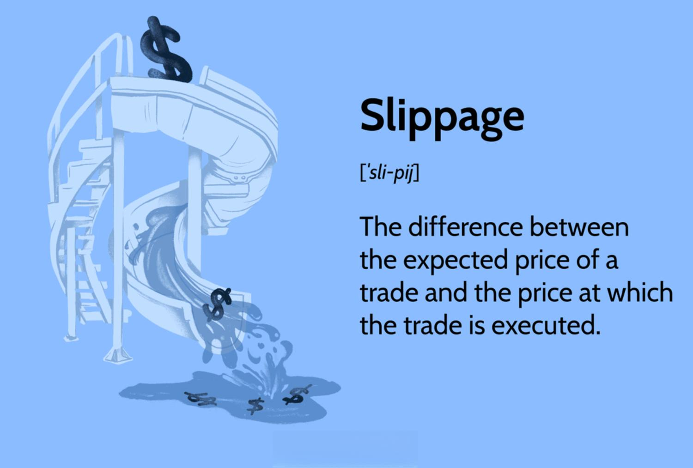

## Table of Contents

## What is slippage in financial markets?

Slippage in financial markets happens when the price at which you want to buy or sell something changes before your trade goes through. Imagine you want to buy a stock at $10, but by the time your order gets processed, the price has gone up to $10.05. That difference, the extra $0.05, is what we call slippage. It can happen in any market, like stocks, forex, or cryptocurrencies, and it's more common during times when lots of people are trading and prices are moving fast.

Slippage isn't always bad. Sometimes it can work in your favor if the price moves in the direction you want. For example, if you're selling and the price goes down a bit before your order is filled, you could end up selling at a better price than you expected. However, most of the time, traders try to minimize slippage because it can eat into their profits. Using limit orders, where you set a specific price you're willing to trade at, can help control slippage, but it's not always possible to avoid it completely.

## How does slippage occur in trading?

Slippage happens in trading when the price of what you want to buy or sell changes before your order gets filled. Let's say you decide to buy a stock at $50. You put in your order, but before it goes through, the stock's price jumps to $50.10 because a lot of other people are buying it too. That extra 10 cents is slippage. It can happen because markets are always moving, and sometimes they move fast, especially when big news comes out or when the market opens or closes.

Slippage can also happen because of the way orders are handled. When you use a market order, which means you want to buy or sell right away at the current price, you might get slippage if there aren't enough people willing to trade at that price. If you're trying to buy a lot of something, you might use up all the offers at the current price and have to buy at a higher price. This is more likely to happen in markets that aren't very busy or when trading something that's not very common.

## What are the common causes of slippage?

Slippage happens a lot when the market is moving fast. This can be because of big news, like a company announcing something important or a big economic report coming out. When this happens, lots of people want to buy or sell at the same time, and the price can change quickly. If you put in an order to buy or sell something, but the price changes before your order goes through, you get slippage. This is more likely to happen at the start or end of the trading day when the market is opening or closing.

Another reason for slippage is how orders are handled. When you use a market order, which means you want to trade right away at the current price, you might get slippage if there aren't enough people willing to trade at that price. If you're trying to buy or sell a lot of something, you might use up all the offers at the current price and have to trade at a different price. This is more common in markets that aren't very busy or when you're trading something that's not very common.

## Can slippage be positive or negative?

Slippage can be both positive and negative. It's negative when the price moves against you. For example, if you want to buy a stock at $10 but the price goes up to $10.05 before your order goes through, you end up paying more than you planned. This is bad because it means you're spending more money or getting less profit than you expected.

On the other hand, slippage can be positive when the price moves in your favor. If you're selling a stock and the price drops from $10 to $9.95 before your order is filled, you end up selling at a better price than you thought. This is good because it means you're making more money or losing less than you expected. Whether slippage is positive or negative depends on which way the price moves and what kind of trade you're making.

## How can traders measure slippage?

Traders can measure slippage by comparing the price they expected to trade at with the price they actually traded at. For example, if you wanted to buy a stock at $50 but ended up buying it at $50.10, the slippage would be $0.10. This difference shows how much the price changed between when you placed your order and when it was filled.

To keep track of slippage over time, traders can look at their trading records. They can add up all the slippage from different trades to see how much it's costing them overall. This helps them understand if slippage is a big problem and if they need to change how they trade to reduce it.

## What is the difference between slippage and spread?

Slippage and spread are two different things that can affect how much money you make or lose when you trade. Slippage happens when the price of what you want to buy or sell changes between the time you decide to trade and when your order goes through. For example, if you want to buy a stock at $10 but by the time your order is filled, the price has gone up to $10.05, the difference, which is $0.05, is called slippage. It can happen because the market is moving fast or because there aren't enough people willing to trade at the price you want.

Spread, on the other hand, is the difference between the price you can buy something at and the price you can sell it at, at the same time. If you see a stock with a buy price of $10 and a sell price of $10.05, the spread is $0.05. This difference is always there and is how brokers and market makers make money. Unlike slippage, which you might be able to avoid with certain types of orders, the spread is something you have to pay every time you trade.

## How does market volatility affect slippage?

Market volatility means that prices are moving up and down a lot, and this can make slippage more common. When the market is volatile, big news or events can make lots of people want to buy or sell at the same time. This can cause prices to change quickly. If you put in an order to buy or sell something, but the price changes before your order goes through, you end up with slippage. The more the market moves, the bigger the chance that the price will change a lot before your order is filled.

During times of high volatility, like when the market opens or closes, or when important news comes out, it's harder to predict what will happen to prices. This unpredictability can lead to bigger differences between the price you want to trade at and the price you actually get. So, if you're trading in a volatile market, you need to be ready for more slippage and think about how you can manage it, maybe by using different types of orders or being more careful about when you trade.

## What strategies can traders use to minimize slippage?

Traders can minimize slippage by using limit orders instead of market orders. A limit order lets you set a specific price you're willing to trade at. If the market price doesn't reach your limit price, your order won't go through. This can help you avoid buying or selling at a worse price than you planned. But remember, using limit orders means you might miss out on a trade if the market price never hits your limit.

Another way to reduce slippage is to trade during times when the market is less busy. Slippage happens more often when lots of people are trading and prices are moving fast. So, if you trade when the market is quieter, like in the middle of the day instead of at the start or end, you might see less slippage. Also, be careful when big news is coming out, because that can make the market more volatile and increase the chance of slippage.

Lastly, traders can choose to trade in more liquid markets. Liquidity means there are a lot of people buying and selling, so it's easier to find someone to trade with at the price you want. In a liquid market, there's usually less slippage because there are more offers to buy and sell at different prices. So, if you're worried about slippage, trading things that are popular and have a lot of activity can help.

## How does the size of an order impact slippage?

When you place a big order, it can cause more slippage. Imagine you want to buy a lot of a stock at once. If you use up all the offers to sell at the current price, you might have to buy at a higher price. This is because there aren't enough people willing to sell at the price you wanted. So, the bigger your order, the more likely it is that you'll use up all the offers at one price and have to trade at a different price, which means more slippage.

To avoid this, you can break your big order into smaller ones. Instead of buying everything at once, you can buy a little bit at a time. This way, you're less likely to use up all the offers at one price and have to trade at a worse price. By spreading out your order, you can reduce the chance of slippage and get a better overall price for what you're buying or selling.

## What role do market makers play in slippage?

Market makers are people or companies that help make sure there's always someone to buy or sell in the market. They do this by always being ready to buy and sell things at certain prices. When you want to trade, you might trade with a market maker. They can affect slippage because they set the prices you can trade at. If the market is moving fast and a lot of people want to trade, market makers might change their prices quickly. This can cause slippage if the price changes before your order goes through.

But market makers also help reduce slippage. They try to keep the market running smoothly by always offering to buy and sell. This means there's usually someone to trade with, even when the market is busy. So, while market makers can cause slippage by changing prices, they also help by making sure there's enough trading happening to keep prices stable.

## How do different types of orders affect slippage?

Different types of orders can have a big impact on slippage. A market order means you want to buy or sell right away at the current price. But if the market is moving fast, the price can change before your order goes through, causing slippage. This is more likely to happen in busy markets or when you're trading something that's not very common. So, if you use market orders, you might end up with more slippage.

On the other hand, using a limit order can help you avoid slippage. A limit order lets you set a specific price you're willing to trade at. If the market price doesn't reach your limit price, your order won't go through. This means you won't buy or sell at a worse price than you planned. But the downside is that you might miss out on a trade if the market price never hits your limit. So, limit orders can help control slippage, but they don't guarantee that your order will be filled.

## What advanced tools or algorithms can be used to manage slippage in high-frequency trading?

In high-frequency trading, traders use special tools and computer programs to handle slippage. One tool they use is called a "slippage control algorithm." This program looks at how the market is moving and tries to guess if there will be a lot of slippage. If it thinks there will be, it can change the order to a limit order or break it into smaller orders. This helps the trader get a better price and avoid big changes in price that could hurt their profits.

Another tool they use is called "smart order routing." This tool sends the trader's order to different places where people are buying and selling. It picks the place where the trader is most likely to get the best price with the least slippage. By using these tools, high-frequency traders can trade faster and with less risk of losing money because of slippage.

## What is Slippage Analysis and Evaluation?

Regular analysis of slippage is crucial for traders as it provides insights that can significantly enhance the performance of algorithmic trading strategies. By examining slippage patterns, traders can adjust strategies to reduce negative impacts on trade execution and profitability. 

Evaluating the impact of slippage on profitability is a vital step in refining trading algorithms. This analysis involves calculating the average slippage per trade and evaluating its overall effect on the net results of trading activities. For example, if the expected execution price consistently diverges from the realized price, it may indicate frequent slippage issues that require addressing to improve decision-making. Quantifying slippage's effect can be done using metrics such as the average slippage per trade or the slippage ratio, defined as:

$$
\text{Slippage Ratio} = \frac{\text{Total Slippage}}{\text{Total Trade Volume}}
$$

Understanding tendencies in slippage under varying market conditions enables traders to better optimize execution strategies. Market conditions, such as high volatility or low liquidity, can exacerbate slippage effects. By analyzing historical data, traders can identify market scenarios where slippage is more pronounced and tailor their algorithms to mitigate these effects. For example, during anticipated high volatility events, implementing tighter control over order execution through strategies like limit orders could lessen adverse slippage occurrences.

Additionally, employing advanced data analysis tools and [machine learning](/wiki/machine-learning) techniques can uncover hidden patterns in trading data to forecast slippage across different market conditions. Python libraries such as NumPy, Pandas, and Scikit-learn are often employed to handle large datasets and apply statistical models for slippage prediction.

```python
import pandas as pd
from sklearn.model_selection import train_test_split
from sklearn.ensemble import RandomForestRegressor
import numpy as np

# Example: Using Random Forest to predict slippage
# Load historical trading data
data = pd.read_csv("trading_data.csv")

# Feature variables could include market volatility, order size, etc.
features = data[['volatility', 'order_size', 'liquidity_index']]
target = data['slippage']

# Split data into training and test sets
X_train, X_test, y_train, y_test = train_test_split(features, target, test_size=0.2, random_state=42)

# Train a Random Forest model
model = RandomForestRegressor(n_estimators=100, random_state=42)
model.fit(X_train, y_train)

# Predicting slippage
y_pred = model.predict(X_test)

# Evaluate model accuracy
accuracy = np.mean(y_pred - y_test < 0.01)
print(f"Model accuracy in predicting slippage: {accuracy:.2f}")
```

Through consistent analysis and evaluation of slippage, traders are positioned to refine their trading strategies, enhance algorithmic performance, and improve overall market outcomes.

## References & Further Reading

[1]: Vanderbei, R. J. (2008). ["Linear Programming: Foundations and Extensions."](https://link.springer.com/book/10.1007/978-3-030-39415-8) Springer.

[2]: Aldridge, I. (2013). ["High-Frequency Trading: A Practical Guide to Algorithmic Strategies and Trading Systems."](https://www.wiley.com/en-us/High+Frequency+Trading%3A+A+Practical+Guide+to+Algorithmic+Strategies+and+Trading+Systems%2C+2nd+Edition-p-9781118343500) Wiley Finance Series.

[3]: Kissell, R. (2013). ["The Science of Algorithmic Trading and Portfolio Management."](https://www.sciencedirect.com/book/9780124016897/the-science-of-algorithmic-trading-and-portfolio-management) Academic Press.

[4]: Cartea, Á., Jaimungal, S., & Penalva, J. (2015). ["Algorithmic and High-Frequency Trading."](https://assets.cambridge.org/97811070/91146/frontmatter/9781107091146_frontmatter.pdf) Cambridge University Press.

[5]: Hasbrouck, J. (2007). ["Empirical Market Microstructure: The Institutions, Economics, and Econometrics of Securities Trading."](https://searchworks.stanford.edu/view/6759272) Oxford University Press.