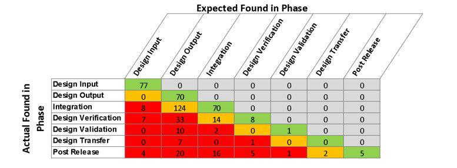

Algorithmic trading, commonly referred to as algo trading, employs pre-programmed instructions to automatically execute trades based on predefined conditions. This type of trading is recognized for its efficiency and speed, allowing traders to capitalize on market opportunities more effectively than with manual trading methods. However, algo trading is not without challenges, one of which is the phenomenon known as slippage.

Slippage in trading is defined as the discrepancy between the expected price of a trade at the time an order is placed and the actual price at which the trade is executed. This difference can substantially impact a trader's profitability, as even small variations can accumulate over numerous trades. Slippage is particularly pronounced in fast-moving and volatile markets where price changes can occur rapidly.



To better understand the implications of slippage in algo trading, it's crucial to recognize its various types and causes. This can allow traders to develop strategies to mitigate its impact. In the subsequent sections of this article, we will explore the concept of slippage in greater detail, examining its types, causes, and the techniques that can be employed to minimize its effects. By doing so, traders can refine their algorithms to enhance overall trading performance and profitability.

## Table of Contents

## Understanding Slippage in Algo Trading

Slippage in algorithmic trading refers to the discrepancy that can occur between the expected price of a trade and the price at which the trade is actually executed. This variance frequently arises due to sudden and unforeseen price movements, which are prevalent in volatile markets. Algorithmic trading, by design, uses automated systems to execute trades at high speed and in large volumes. While these systems offer precision and efficiency, they cannot entirely eliminate slippage. The fast-paced nature of trading and the sheer volume of transactions contribute to the persistence of slippage in this context.

Slippage can manifest in two forms: positive and negative. Positive slippage occurs when the execution price is more favorable than the intended price. Conversely, negative slippage arises when a trade executes at a worse price. Both forms have distinct implications for traders. Positive slippage can enhance profitability, providing traders with better returns than anticipated. Negative slippage, however, can erode profits or exacerbate losses, impacting the overall trade outcome unfavorably.

In practice, slippage is represented mathematically by the equation:

$$
\text{Slippage} = \text{Execution Price} - \text{Expected Price}
$$

Managing slippage requires a comprehensive understanding of market dynamics and the implementation of strategic measures to mitigate its effects. Such measures may include adjusting algorithms to account for anticipated market [volatility](/wiki/volatility-trading-strategies), employing specific order types like limit orders to set execution price boundaries, and optimizing trade execution timing to avoid periods of unpredictable market fluctuations.

## Types of Slippage

Slippage in [algorithmic trading](/wiki/algorithmic-trading) can manifest in various forms, impacting the profitability and execution quality of trades. The primary types of slippage include market impact slippage, execution slippage, and bid-ask spread slippage.

Market Impact Slippage arises when large orders influence market prices during execution. This type of slippage is particularly significant for institutional traders or hedge funds dealing with substantial trade volumes. When an order is large enough to affect the current market price, it can lead to the order being filled at a price different from the intended one, thereby impacting the expected return of the trade.

Execution Slippage occurs due to delays in processing and completing a trade request. In algorithmic trading, even the slightest lag in execution can lead to discrepancies between the expected and actual executed price. This form of slippage can be exacerbated by technical issues such as latency in trading platforms or network delays, which can cause a delay in the execution of the algorithmic instructions.

Bid-Ask Spread Slippage results from differences in buy and sell offers. The bid price is the highest price a buyer is willing to pay, while the ask price is the lowest price a seller is willing to accept. When a trade is executed, it usually happens at the ask price for buyers and the bid price for sellers, resulting in an inherent slippage equivalent to the spread. In highly liquid markets, the spread is relatively narrow, minimizing slippage, whereas in less liquid markets, a wider spread can result in more significant slippage.

Understanding these types of slippage is crucial for traders employing algorithms, as it aids in refining strategies to minimize potential costs associated with these phenomena.

## Causes of Slippage in Algo Trading

Slippage in algorithmic trading is influenced by several factors, each stemmed in the inherent characteristics of financial markets and technological limitations. Understanding these factors is crucial for devising strategies to manage slippage effectively.

High market volatility is a primary cause of slippage in algorithmic trading. During periods of rapid price fluctuations, executing a trade at the intended price becomes challenging. Volatility can be quantified using statistical measures like standard deviation, which represents price variability. When volatility is high, the likelihood of sudden price shifts increases, leading to discrepancies between the expected price at the time of the order and the eventual execution price.

Low [liquidity](/wiki/liquidity-risk-premium) is another significant contributor to slippage. In markets with limited participation, the availability of buyers and sellers at desired prices diminishes, causing orders to be executed at less favorable prices. Liquidity can be evaluated by analyzing the bid-ask spread and market depth. A narrow spread and substantial market depth often correlate with high liquidity, facilitating execution close to expected prices.

Order size also impacts slippage. Large transactions tend to have a noticeable market impact, potentially moving the price against the trader before the entire order is filled. Executing a massive order might require breaking it into smaller chunks to minimize market disturbance. For example, using time-weighted average price (TWAP) or [volume](/wiki/volume-trading-strategy)-weighted average price (VWAP) algorithms can help in distributing the order over time to reduce slippage.

Platform latency, or the delay between a trading signal and execution, is a technological limitation affecting slippage. Latency arises from processing delays within the trading infrastructure and the transmission time between the trader and the market. Algorithmic traders must optimize their systems to reduce latency, ensuring swift execution. Techniques such as co-location, where trading servers are placed near exchange servers, and using fast programming languages like C++ can help in minimizing latency-induced slippage.

Each of these factors contributes to the complexity of managing slippage in algorithmic trading, requiring continuous analysis and adaptation to mitigate its impact on trading outcomes.

## Techniques to Reduce Slippage

Using effective techniques can significantly reduce slippage in algorithmic trading, thereby improving execution quality and profitability. Implementing these strategies requires an understanding of market dynamics and the use of sophisticated tools, often involving algorithmic adjustments and trading platform features.

One of the primary techniques to mitigate slippage is the use of limit orders. Limit orders allow traders to specify a maximum or minimum price at which they are willing to buy or sell an asset. This strategy ensures that a trade will only be executed at the desired price or better, thus providing more control over the execution and reducing the likelihood of slippage. For example, if a trader sets a limit buy order at $100, the order will only be fulfilled if the asset's price is at $100 or less.

Another effective approach is to avoid trading during periods of high market volatility. Volatility often leads to rapid and unpredictable price movements, increasing the chances of slippage. By analyzing market conditions and timing trades to coincide with more stable periods, traders can minimize unexpected price variations. Statistical analysis tools and financial news services can help in identifying such volatility patterns.

Trading in markets with high liquidity is also crucial. Markets with greater liquidity typically have smaller bid-ask spreads and more stable prices, which leads to better order fulfillment and reduced slippage. High liquidity ensures that large orders can be executed quickly without affecting the market price significantly. Traders can assess liquidity by examining metrics such as trading volume and market depth.

The adoption of automated trading systems is a key component in reducing slippage. Automation ensures that trades are executed quickly and efficiently, often faster than what is achievable manually. This swift execution minimizes latency-related issues, a common cause of slippage. Automated systems can instantly respond to market changes based on pre-programmed criteria, enabling consistent execution at desired prices.

Here is a simple Python example to illustrate how an automated trading system might work using limit orders:

```python
def place_limit_order(order_type, price, amount):
    # Simulate the process of placing a limit order
    print(f"Placing {order_type} limit order for {amount} units at ${price:.2f}")

def automated_trading_strategy(current_market_price, predefined_limit_price, trade_amount):
    # Determine if the market price meets the criteria for placing a limit order
    if current_market_price <= predefined_limit_price:
        place_limit_order('buy', predefined_limit_price, trade_amount)
    else:
        print("No trade executed. Market price is above the limit price.")

# Example scenario
current_price = 98.50
limit_price = 100.00
amount = 10

automated_trading_strategy(current_price, limit_price, amount)
```

In this example, the automated trading strategy places a buy limit order when the current market price is equal to or less than the predefined limit price, ensuring that the trade is executed only under favorable conditions. Such automation can be scaled to handle numerous trades and market conditions, further reducing potential slippage impacts.

## Implementing Risk Management Strategies

Implementing risk management strategies is crucial for mitigating the potential adverse effects of slippage in algorithmic trading. Effective techniques can safeguard your investments and contribute to more stable trading outcomes.

Employing stop losses is a fundamental risk management tool. A stop loss order automatically closes a position when the market price hits a predetermined level, thus limiting potential losses. For example, if a trader buys a stock at $100 and sets a stop loss at $95, the position will be automatically sold if the price falls to $95, capping the loss at $5 per share. This mechanism protects against steep price declines that could occur due to slippage in volatile market conditions, ensuring that losses are contained.

Hedging positions involves taking offsetting positions to mitigate risk. In practice, this can mean entering a trade that will profit if the primary trade incurs a loss. For instance, if a trader holds a long position on a stock, they might purchase a put option, which increases in value as the stock price decreases. This strategy effectively cushions the overall portfolio against adverse price movements. The principle behind hedging is to maintain a balanced risk exposure, especially in unpredictable markets where slippage might exacerbate losses.

Choosing the right time frame is essential for aligning trading strategies with market behavior. Different time frames can expose traders to varying levels of price volatility and slippage. Short-term traders might face frequent, smaller price fluctuations, while long-term investors could encounter significant slippage due to broader market trends. By tailoring trading activities to appropriate time frames, traders can reduce their exposure to rapid price movements. For instance, day traders might opt for shorter time frames with tighter stop losses, while position traders could focus on longer time frames with broader risk parameters.

Implementing these strategies effectively requires a thorough understanding of market dynamics and meticulous planning. It is essential to continuously monitor market conditions and adjust trading strategies accordingly to minimize the impact of slippage and protect investments.

## Conclusion

Slippage is an inherent aspect of trading, but its negative impact can be substantially mitigated through the application of targeted strategies and techniques. By thoroughly understanding the root causes of slippage—such as high market volatility, low liquidity, large order sizes, and platform latency—traders can devise effective risk management frameworks and optimize their trading practices. 

Implementing strategies such as the use of limit orders, avoiding trades during high volatility periods, trading in high-liquidity markets, and adopting automated trading systems can reduce the likelihood of incurring significant slippage. Furthermore, employing risk management techniques like stop losses, position hedging, and aligning trading strategies with appropriate time frames are crucial for safeguarding investments against severe price movements.

Continual evaluation and adaptation of trading strategies in response to evolving market conditions are also vital for maintaining efficacy in slippage reduction. By regularly analyzing market trends and adjusting algorithms accordingly, traders can enhance their strategies' resilience and boost overall profitability. 

In conclusion, while slippage cannot be entirely eliminated, a disciplined approach to understanding its mechanics and consciously applying mitigative strategies can significantly protect traders' investments, ensuring a more profitable trading environment.

## References & Further Reading

[1]: ["Quantitative Trading: How to Build Your Own Algorithmic Trading Business"](https://www.amazon.com/Quantitative-Trading-Build-Algorithmic-Business/dp/1119800064) by Ernest P. Chan

[2]: Lopez de Prado, M. (2018). ["Advances in Financial Machine Learning."](https://www.amazon.com/Advances-Financial-Machine-Learning-Marcos/dp/1119482089) Wiley.

[3]: Kissell, R. (2013). ["The Science of Algorithmic Trading and Portfolio Management."](https://www.sciencedirect.com/book/9780124016897/the-science-of-algorithmic-trading-and-portfolio-management) Academic Press.

[4]: Aldridge, I. (2013). ["High-Frequency Trading: A Practical Guide to Algorithmic Strategies and Trading Systems."](https://www.amazon.com/High-Frequency-Trading-Practical-Algorithmic-Strategies/dp/1118343506) Wiley.

[5]: Derman, E. (2011). ["Models.Behaving.Badly: Why Confusing Illusion with Reality Can Lead to Disaster, on Wall Street and in Life."](https://archive.org/details/modelsbehavingba0000derm) Free Press.

[6]: ["Machine Learning for Algorithmic Trading: Predictive models to extract signals from market and alternative data for systematic trading strategies with Python, 2nd Edition"](https://www.amazon.com/Machine-Learning-Algorithmic-Trading-alternative/dp/1839217715) by Stefan Jansen