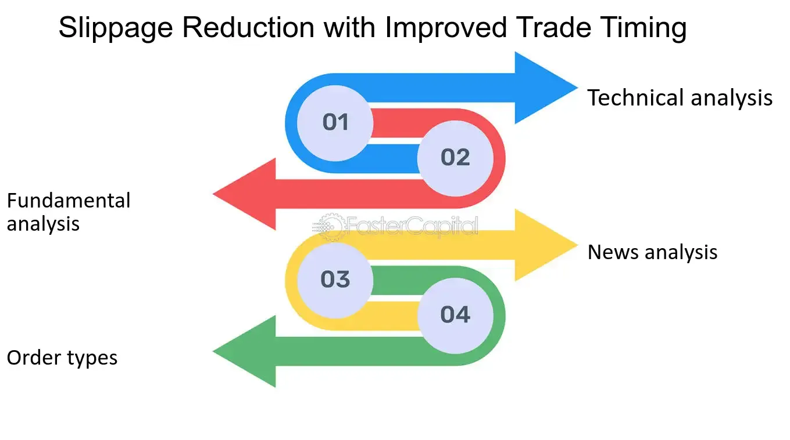

## Table of Contents

## What is slippage in trading?

Slippage in trading happens when the price at which you want to buy or sell a stock or other asset is different from the price at which your order actually gets filled. This difference can occur because markets move quickly, and the price can change between the time you place your order and the time it is executed. Slippage can happen in any market, but it's more common in fast-moving or volatile markets.

Slippage can be positive or negative. Positive slippage means you get a better price than you expected, which is good for you. Negative slippage means you get a worse price, which is not good. Traders need to be aware of slippage because it can affect their profits and losses. To manage slippage, traders might use limit orders, which let them set a specific price at which they are willing to buy or sell, helping to control the risk of unexpected price changes.

## Why is slippage important to manage?

Slippage is important to manage because it can affect how much money you make or lose when trading. If you're not careful, slippage can make your trades less profitable or even turn a winning trade into a losing one. For example, if you want to buy a stock at $100 but due to slippage you end up buying it at $101, you've already lost $1 before the stock even moves.

Managing slippage helps you keep more control over your trades. By using tools like limit orders, you can set the exact price you're willing to buy or sell at, which reduces the chance of unexpected price changes hurting your trade. This way, you can plan your trades better and have a clearer idea of what your potential profits or losses might be.

## What are the common causes of slippage?

Slippage often happens because markets can move very fast. When you place an order, there might be a delay before it gets filled. In that short time, the price can change, causing slippage. This is more likely to happen when the market is busy or when big news comes out that makes everyone want to buy or sell at the same time.

Another reason for slippage is when there aren't enough buyers or sellers at the price you want. If you want to buy a stock at a certain price but no one is selling at that price, your order might get filled at a higher price. The same thing can happen if you're trying to sell and no one is buying at your price, so you end up selling for less.

Sometimes, the way your order is set up can also lead to slippage. If you use a market order, which tells the broker to buy or sell right away at the best available price, you're more likely to experience slippage. But if you use a limit order, which lets you set a specific price, you can avoid some slippage, though it might mean your order doesn't get filled if the market doesn't reach your price.

## How does market volatility affect slippage?

Market volatility can make slippage more likely and bigger. When the market is moving a lot, prices can change really fast. If you want to buy or sell something, the price might be different by the time your order goes through. This is because lots of people are trying to trade at the same time, and the price can jump around a lot.

In a volatile market, it's harder to find someone to buy from or sell to at the price you want. If everyone is trying to buy, the price might go up quickly, and you could end up paying more than you planned. If everyone is trying to sell, the price might drop fast, and you might have to sell for less than you hoped. So, when the market is really up and down, you need to be extra careful about slippage.

## What is the difference between positive and negative slippage?

Positive slippage happens when you get a better price than you expected. For example, if you want to buy a stock at $100 but you end up buying it for $99, that's positive slippage. It's good for you because you save money or make more profit. Positive slippage can happen when the market moves in your favor quickly between the time you place your order and when it gets filled.

Negative slippage is the opposite. It happens when you get a worse price than you planned. If you want to buy a stock at $100 but you end up buying it for $101, that's negative slippage. This is bad because it can reduce your profits or increase your losses. Negative slippage can occur when the market moves against you fast, or if there aren't enough buyers or sellers at the price you want.

## What basic strategies can beginners use to reduce slippage?

Beginners can use limit orders to reduce slippage. A limit order lets you set the exact price you want to buy or sell at. This means you won't get a worse price than you planned, but it also means your order might not get filled if the market doesn't reach your price. Using limit orders can help you avoid negative slippage, but you need to be okay with the possibility that your trade might not happen if the market moves too far away from your set price.

Another way to reduce slippage is to trade when the market is less busy. Slippage often happens more when lots of people are trading at the same time, like when big news comes out. If you trade during quieter times, there's less chance of big price jumps, which can help you get the price you want. Just remember, even in quiet markets, slippage can still happen, so always keep an eye on how the market is moving.

Lastly, beginners can try to avoid trading during times of high market volatility. When the market is moving a lot, prices can change very quickly, making slippage more likely. By staying away from trading during these times, you can lower your chances of experiencing slippage. It's good to check the news and see if there are any big events coming up that might make the market more volatile before you decide to trade.

## How can setting appropriate stop-loss orders help in reducing slippage?

Setting appropriate stop-loss orders can help reduce slippage by making sure your trade closes at a price you are okay with, even if the market moves fast. A stop-loss order tells your broker to sell your stock if it drops to a certain price. This can help you avoid selling at a much lower price than you planned if the market suddenly goes down. By setting your stop-loss at the right level, you can limit how much you might lose and reduce the chance of negative slippage.

When setting a stop-loss, it's important to think about how much the market might move. If you set it too close to the current price, your order might get filled at a worse price during a small market move, causing slippage. But if you set it too far away, you might lose more money than you want. Finding a good balance can help you manage slippage and protect your investment.

## What role does the choice of broker play in slippage?

The choice of broker can affect how much slippage you experience when trading. Some brokers have faster systems that can fill your orders more quickly, which can help reduce slippage. If a broker's platform is slow or has a lot of delays, there's a bigger chance that the price will change between when you place your order and when it gets filled. This means you might end up with more slippage. So, choosing a broker with a good reputation for fast order execution can help you manage slippage better.

Another thing to think about is the fees and the way the broker handles your orders. Some brokers might charge extra fees that can make slippage worse, especially if they add these fees to the price you pay. Also, some brokers might use a system where they fill your order at a slightly different price than what you see on the market, which can lead to more slippage. By [picking](/wiki/asset-class-picking) a broker that is clear about their fees and how they handle orders, you can reduce the chance of unexpected slippage and keep more control over your trades.

## How can algorithmic trading be used to minimize slippage?

Algorithmic trading can help minimize slippage by using computer programs to place orders very quickly. These programs can watch the market all the time and make trades in a split second. This means they can often get the price you want before it changes too much. For example, if you want to buy a stock at a certain price, the algorithm can place the order right away, reducing the chance that the price will move against you before your order is filled.

Another way [algorithmic trading](/wiki/algorithmic-trading) helps is by breaking up big orders into smaller ones. If you want to buy a lot of a stock, doing it all at once can move the price and cause slippage. But if you use an algorithm to buy the stock in smaller chunks over time, it can help keep the price from jumping around too much. This way, you can get closer to the price you want without causing big changes in the market.

## What advanced techniques involve using limit orders to control slippage?

One advanced technique to control slippage using limit orders is called "order slicing." This means breaking up a big order into smaller ones and placing them at different prices. For example, if you want to buy 1000 shares of a stock, you can set limit orders for 200 shares at five different prices. This way, you can get some shares at different prices, which can help you get closer to the average price you want without moving the market too much. It's like slowly filling up a bucket with smaller scoops instead of dumping it all in at once.

Another technique is called "pegging." With pegging, you set your limit order to automatically adjust to the market price. For example, if you want to buy a stock, you can set your limit order to always be a little bit below the current best price. This way, your order stays competitive and has a better chance of getting filled without causing too much slippage. It's like moving with the market instead of staying in one spot, which can help you get the price you want more often.

## How do high-frequency trading strategies impact slippage?

High-frequency trading ([HFT](/wiki/high-frequency-trading-strategies)) strategies can make slippage more likely because these traders use super fast computers to buy and sell lots of stocks very quickly. When they do this, they can move the market prices a lot in a short time. If you want to buy or sell a stock at the same time as these traders, the price might change before your order goes through, causing slippage. So, if the market is full of high-frequency traders, it can be harder for you to get the price you want.

On the other hand, high-frequency traders can also help reduce slippage for some people. Because they trade so much and so fast, they can make the market more liquid, which means there are more buyers and sellers around. When there are more people trading, it can be easier to find someone to buy from or sell to at the price you want. This can help you get your order filled quicker and at a better price, reducing the chance of slippage. So, while HFT can make slippage worse sometimes, it can also make it better in other situations.

## What are the latest research and technologies aimed at reducing slippage?

Researchers and tech companies are working on new ways to cut down on slippage. One big focus is on improving how fast orders can be processed. They're making computer systems and networks faster so that when you place an order, it gets filled quicker. This means the price is less likely to change before your order goes through. Another area they're looking at is using [artificial intelligence](/wiki/ai-artificial-intelligence) (AI) to predict market movements. By using AI to guess where the market might go next, traders can place their orders at better times and prices, which helps lower slippage.

Another technology being developed is called "smart order routing." This tech looks at different places where you can buy or sell a stock and picks the best one to get you the best price. It's like having a smart helper that always finds the best deal for you. Also, some new trading platforms are using blockchain technology to make trading faster and more transparent. By keeping a clear record of all trades, blockchain can help make sure orders are filled at the right prices, which can reduce slippage.

## What is Slippage in Algo Trading and How Can It Be Understood?

Slippage in algorithmic trading refers to the discrepancy that can occur between the expected price of a trade and the price at which the trade is actually executed. This variance frequently arises due to sudden and unforeseen price movements, which are prevalent in volatile markets. Algorithmic trading, by design, uses automated systems to execute trades at high speed and in large volumes. While these systems offer precision and efficiency, they cannot entirely eliminate slippage. The fast-paced nature of trading and the sheer [volume](/wiki/volume-trading-strategy) of transactions contribute to the persistence of slippage in this context.

Slippage can manifest in two forms: positive and negative. Positive slippage occurs when the execution price is more favorable than the intended price. Conversely, negative slippage arises when a trade executes at a worse price. Both forms have distinct implications for traders. Positive slippage can enhance profitability, providing traders with better returns than anticipated. Negative slippage, however, can erode profits or exacerbate losses, impacting the overall trade outcome unfavorably.

In practice, slippage is represented mathematically by the equation:

$$
\text{Slippage} = \text{Execution Price} - \text{Expected Price}
$$

Managing slippage requires a comprehensive understanding of market dynamics and the implementation of strategic measures to mitigate its effects. Such measures may include adjusting algorithms to account for anticipated market [volatility](/wiki/volatility-trading-strategies), employing specific order types like limit orders to set execution price boundaries, and optimizing trade execution timing to avoid periods of unpredictable market fluctuations.

## References & Further Reading

[1]: ["Quantitative Trading: How to Build Your Own Algorithmic Trading Business"](https://www.amazon.com/Quantitative-Trading-Build-Algorithmic-Business/dp/1119800064) by Ernest P. Chan

[2]: Lopez de Prado, M. (2018). ["Advances in Financial Machine Learning."](https://www.amazon.com/Advances-Financial-Machine-Learning-Marcos/dp/1119482089) Wiley.

[3]: Kissell, R. (2013). ["The Science of Algorithmic Trading and Portfolio Management."](https://www.sciencedirect.com/book/9780124016897/the-science-of-algorithmic-trading-and-portfolio-management) Academic Press.

[4]: Aldridge, I. (2013). ["High-Frequency Trading: A Practical Guide to Algorithmic Strategies and Trading Systems."](https://www.amazon.com/High-Frequency-Trading-Practical-Algorithmic-Strategies/dp/1118343506) Wiley.

[5]: Derman, E. (2011). ["Models.Behaving.Badly: Why Confusing Illusion with Reality Can Lead to Disaster, on Wall Street and in Life."](https://archive.org/details/modelsbehavingba0000derm) Free Press.

[6]: ["Machine Learning for Algorithmic Trading: Predictive models to extract signals from market and alternative data for systematic trading strategies with Python, 2nd Edition"](https://www.amazon.com/Machine-Learning-Algorithmic-Trading-alternative/dp/1839217715) by Stefan Jansen