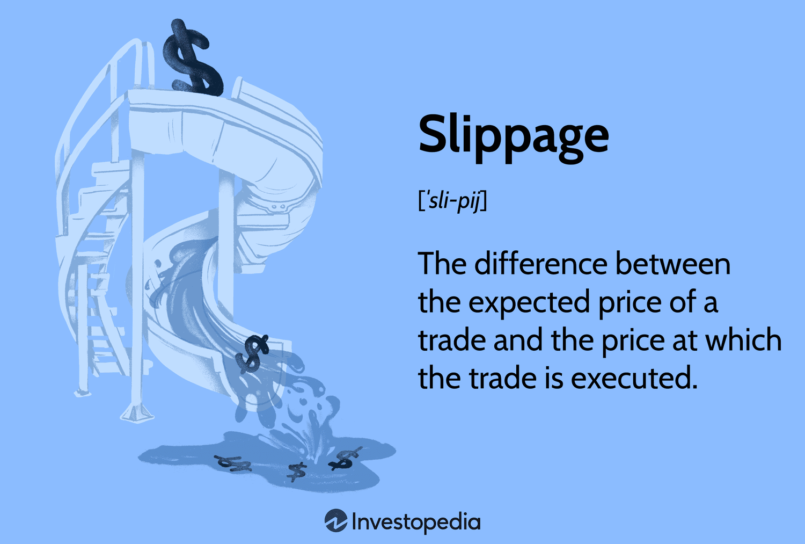

## Table of Contents

## What is slippage in trading?

Slippage in trading happens when the price at which you want to buy or sell a stock or other financial product changes before your trade goes through. This means you might end up buying at a higher price or selling at a lower price than you planned. It's common in fast-moving markets where prices can change quickly.

Slippage can be caused by many things, like high demand for a stock or delays in the trading system. It's important for traders to know about slippage because it can affect how much money they make or lose. While you can't always avoid slippage, understanding it can help you make better trading decisions.

## How does slippage occur in financial markets?

Slippage happens in financial markets when the price of a stock or other asset changes between the time a trader decides to buy or sell and when the trade actually happens. Imagine you want to buy a stock at $10, but by the time your order goes through, the price has gone up to $10.05. That extra $0.05 is slippage. It can happen because there are a lot of people trying to buy or sell at the same time, or because the market is moving fast and prices are changing quickly.

There are a few reasons why slippage might occur. One big reason is when there's a lot of demand for a stock, and there aren't enough sellers to meet that demand at the current price. This can push the price up before your buy order is filled. Another reason is delays in the trading system. If it takes a little longer for your order to go through, the price might change in the meantime. While you can't always stop slippage from happening, knowing about it can help you be ready for it and maybe even use it to your advantage in your trading strategy.

## What are the common causes of slippage?

Slippage happens when the price of a stock or other thing you want to buy or sell changes before your trade goes through. This can be because a lot of people want to buy or sell the same thing at the same time. Imagine everyone at a store wants to buy the last toy on the shelf. The price might go up quickly because so many people want it. In the stock market, this can happen when a lot of people want to buy or sell a stock, making the price move fast.

Another reason for slippage is delays in the trading system. Sometimes, it takes a little time for your order to go through, and in that time, the price can change. It's like waiting in line at a busy store; by the time you get to the front, the price might be different. These delays can be because of the trading platform you're using or because the market is very busy. While you can't always stop slippage from happening, knowing why it happens can help you be ready for it.

## Can slippage be positive or is it always negative?

Slippage can be both positive and negative. It's negative when the price moves against you. For example, if you want to buy a stock at $10 but the price goes up to $10.05 before your order is filled, you end up paying more than you planned. This is bad because it costs you more money. On the other hand, slippage is positive when the price moves in your favor. If you want to buy a stock at $10 but the price drops to $9.95 before your order goes through, you get a better deal than you expected. This is good because you spend less money.

Understanding that slippage can be both positive and negative is important for traders. While negative slippage can hurt your profits, positive slippage can help them. It's all about being ready for the market to move quickly and knowing that sometimes the price might change in a way that helps you, not just hurts you.

## How can traders measure slippage?

Traders can measure slippage by comparing the price they expected to buy or sell at with the actual price at which the trade was executed. For example, if a trader wants to buy a stock at $10 but ends up buying it at $10.05, the slippage is $0.05. This difference between the expected price and the actual price is what traders look at to see how much slippage they experienced.

To track slippage over time, traders can keep a record of their trades, noting down the intended price and the executed price for each one. By doing this, they can calculate the average slippage they experience, which can help them understand how much impact slippage has on their trading strategy. This information can be useful for making better decisions and maybe even finding ways to reduce slippage in the future.

## What strategies can traders use to minimize slippage?

Traders can use a few strategies to minimize slippage. One way is to use limit orders instead of market orders. A limit order lets you set a specific price at which you want to buy or sell a stock. This means your trade will only go through if the price is at or better than what you set, helping you avoid buying at a higher price or selling at a lower price than you planned. Another strategy is to trade during times when the market is less busy. When fewer people are trading, there's less chance of big price changes happening quickly, which can reduce slippage.

Another approach is to use a trading platform that's fast and reliable. If the platform is slow, it can take longer for your order to go through, increasing the chance of slippage. Also, traders can break up big orders into smaller ones. Instead of trying to buy or sell a lot of stock all at once, they can do it in smaller chunks. This can help avoid big price swings that might happen if everyone sees a huge order coming in. By using these strategies, traders can better manage slippage and make their trading more effective.

## How does market volatility affect slippage?

Market [volatility](/wiki/volatility-trading-strategies) can make slippage worse. When the market is very up and down, prices can change a lot in a short time. This means if you want to buy or sell something, the price might be different by the time your order goes through. Imagine you want to buy a stock at $10, but the market is moving fast. Before your order is filled, the price could go up to $10.10 because a lot of people are buying at the same time. That extra $0.10 is slippage, and it happens more often when the market is volatile.

To deal with this, traders can use different strategies. One way is to use limit orders, which let you set a specific price for buying or selling. This can help you avoid buying at a higher price or selling at a lower price than you planned. Another way is to trade when the market is less busy. When fewer people are trading, there's less chance of big price changes happening quickly, which can reduce slippage. By understanding how market volatility affects slippage, traders can make better choices and manage their trades more effectively.

## What is the difference between slippage and spread?

Slippage and spread are two different things that can affect how much money you make or lose when trading. Slippage happens when the price of a stock or other thing you want to buy or sell changes between the time you decide to trade and when your trade actually goes through. For example, if you want to buy a stock at $10 but the price goes up to $10.05 before your order is filled, that extra $0.05 is slippage. It can happen because the market is moving fast or there are a lot of people trying to buy or sell at the same time.

On the other hand, spread is the difference between the price at which you can buy something (the ask price) and the price at which you can sell it (the bid price). For example, if the ask price for a stock is $10.05 and the bid price is $10, the spread is $0.05. This difference is what the market makers or brokers take as their fee for making the trade happen. While slippage is about unexpected price changes, spread is a known cost that you can see before you make a trade. Both slippage and spread can affect your profits, but they come from different parts of the trading process.

## How do different order types impact slippage?

Different order types can affect how much slippage you experience when trading. A market order is when you want to buy or sell something right away at the current price. This type of order can lead to more slippage because the price might change quickly before your order goes through, especially in a fast-moving market. On the other hand, a limit order lets you set a specific price at which you want to buy or sell. This can help you avoid slippage because your trade will only happen if the price is at or better than what you set. If the market moves too far away from your limit price, your order might not get filled at all, but you won't have to deal with unexpected price changes.

Another type of order that can impact slippage is a stop order. A stop order turns into a market order once the price reaches a certain level, which you set in advance. This can be useful for limiting losses or locking in profits, but it can also lead to slippage if the market is moving fast when the stop price is hit. For example, if you set a stop order to sell a stock at $10 and the price drops quickly to $9.90 before your order is filled, you'll experience slippage. By understanding how different order types work, traders can choose the best one for their situation and try to minimize the impact of slippage on their trades.

## What role does liquidity play in slippage?

Liquidity is how easy it is to buy or sell something without the price changing a lot. When there's a lot of [liquidity](/wiki/liquidity-risk-premium), it means there are many people buying and selling, so it's easier to trade without big price changes. This can help reduce slippage because the price is more likely to stay stable when you want to make a trade. If you want to buy a stock and there are a lot of people selling it at around the same price, you're more likely to get the price you expect.

On the other hand, when there's not much liquidity, it can make slippage worse. If there aren't many people trading, your order might move the price a lot. For example, if you want to buy a stock and there aren't many sellers, your order might push the price up before it's filled. This means you could end up paying more than you planned. So, understanding liquidity can help traders know when they might face more slippage and plan their trades better.

## How do high-frequency trading and algorithmic trading influence slippage?

High-frequency trading and [algorithmic trading](/wiki/algorithmic-trading) can make slippage worse because they trade very fast and in large amounts. These types of trading use computers to buy and sell stocks quickly, often in milliseconds. When a lot of high-frequency or algorithmic traders are trying to buy or sell at the same time, it can cause the price to change a lot. If you're trying to trade during these times, the price might move before your order goes through, leading to more slippage. It's like trying to buy something at a store when a lot of people are rushing to get it; the price can go up quickly because of the demand.

On the other hand, high-frequency and algorithmic trading can also help reduce slippage in some cases. These systems can provide more liquidity to the market because they're always trading. When there's more liquidity, it's easier to buy or sell without moving the price a lot. This means your trade is more likely to happen at the price you expect. But it depends on the situation; if the market is very busy and moving fast, the chance of slippage can still be high even with these types of trading. Understanding how these trading methods work can help traders be ready for when slippage might be a bigger problem.

## What advanced techniques can be used to predict and manage slippage in large institutional trades?

Large institutional traders can use advanced techniques to predict and manage slippage by using something called "slippage models." These models look at past data and current market conditions to guess how much the price might change before a big trade goes through. They take into account things like how much people want to buy or sell the stock, how fast the market is moving, and how easy it is to trade the stock. By using these models, traders can plan their trades better and maybe even change their orders to reduce slippage. For example, they might break up a big order into smaller ones to avoid moving the price too much.

Another technique is called "algorithmic trading." This is when computers use special math formulas to decide when and how to trade. These algorithms can be set up to watch the market closely and make trades at the best times to reduce slippage. They can also use something called "order slicing," where a big order is split into smaller pieces that are traded over time. This can help keep the price from moving too much and reduce the chance of slippage. By using these advanced techniques, large institutional traders can better manage the risks of slippage and make their trades more effective.

## What is an example of slippage?

When purchasing a large quantity of shares, such as 20,000 shares of the SPY [ETF](/wiki/etf-trading-strategies), traders often face slippage due to market dynamics. Suppose the current ASK price allows for purchasing just 3,900 shares. When you place a market order for 20,000 shares, a series of transactions occur, each executing at progressively higher prices as it consumes available liquidity from the [order book](/wiki/order-book-trading-strategies). This sequence results in an average purchase price that is higher than the initial ASK price.

To illustrate this concept, let's assume the ASK price starts at $420 for the initial 3,900 shares. As the remaining shares are acquired, the price increments due to decreased liquidity and increased demand, moving through price levels such as $421, $422, and so on. The average purchase price across all 20,000 shares is thus higher than $420 due to these incremental increases.

This process can be mathematically represented by tracking the weighted average price, $P_{\text{avg}}$, of the trades executed:

$$

P_{\text{avg}} = \frac{\sum (P_i \times Q_i)}{\sum Q_i} 
$$

where $P_i$ is the price at which a batch $Q_i$ of shares is purchased.

In Python, one might represent this process through a simple loop that calculates the total cost and average price during execution:

```python
def calculate_avg_purchase_price(prices, quantities):
    total_cost = 0
    total_quantity = 0
    for price, quantity in zip(prices, quantities):
        total_cost += price * quantity
        total_quantity += quantity
    return total_cost / total_quantity

prices = [420, 421, 422]  # Example price points as the order book is filled
quantities = [3900, 5000, 11100]  # Corresponding quantities bought at each price

average_price = calculate_avg_purchase_price(prices, quantities)
print(f"Average Purchase Price: ${average_price:.2f}")
```

This example captures the trade-offs faced when placing large orders, highlighting how slippage can impact trading costs and execution strategies. By understanding these mechanisms, traders can better prepare for and manage the financial implications of slippage.

## References & Further Reading

[1]: ["Dynamic Hedging: Managing Vanilla and Exotic Options"](https://www.amazon.com/Dynamic-Hedging-Managing-Vanilla-Options/dp/0471152803) by Nassim Nicolas Taleb

[2]: ["Forecasting Volatility in the Financial Markets"](https://papers.ssrn.com/sol3/papers.cfm?abstract_id=331800) by John L. Knight and Stephen Satchell

