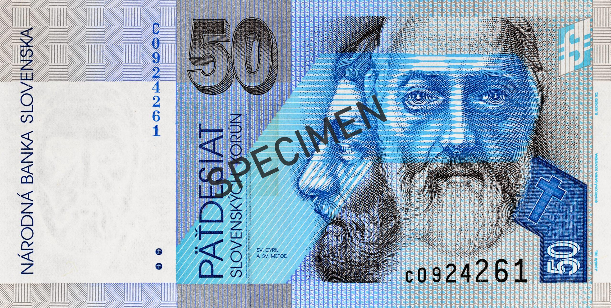

## Table of Contents

## What is the Slovak Koruna (SKK)?

The Slovak Koruna, or SKK, was the official currency of Slovakia before it switched to the Euro. It was used from 1993 until 2008. The word "koruna" means "crown" in Slovak. The Slovak Koruna replaced the Czechoslovak Koruna when Czechoslovakia split into the Czech Republic and Slovakia.

The Slovak Koruna was divided into 100 haliers. Coins came in different sizes, like 10, 20, and 50 haliers, and 1, 2, 5, and 10 korunas. Banknotes were printed in values such as 20, 50, 100, 200, 500, and 1000 korunas. In 2009, Slovakia joined the Eurozone and the Euro replaced the Slovak Koruna. Now, the Euro is the money used in Slovakia.

## When was the Slovak Koruna introduced?

The Slovak Koruna was introduced on February 8, 1993. This was when Czechoslovakia split into two countries: the Czech Republic and Slovakia. Before the split, both countries used the Czechoslovak Koruna. After the split, Slovakia needed its own money, so the Slovak Koruna was created.

The Slovak Koruna was used until 2008. It was divided into 100 smaller units called haliers. People used coins and banknotes for their daily purchases. In 2009, Slovakia joined the Eurozone, and the Euro became the official currency instead of the Slovak Koruna.

## What was the reason for introducing the Slovak Koruna?

The Slovak Koruna was introduced because Czechoslovakia split into two countries: the Czech Republic and Slovakia. Before the split, both countries used the same money called the Czechoslovak Koruna. When the countries separated, they needed their own currencies. So, on February 8, 1993, Slovakia started using the Slovak Koruna.

The Slovak Koruna helped Slovakia have its own money system. It was used until 2008 and was divided into 100 haliers. People used Slovak Koruna coins and banknotes for buying things every day. In 2009, Slovakia joined the Eurozone and switched to using the Euro instead of the Slovak Koruna.

## What were the denominations of the Slovak Koruna?

The Slovak Koruna came in different sizes of coins and banknotes. The coins were worth 10, 20, and 50 haliers, and 1, 2, 5, and 10 korunas. Haliers were the smaller units of the Slovak Koruna, like cents are to dollars.

The banknotes were bigger and came in values of 20, 50, 100, 200, 500, and 1000 korunas. People used these notes and coins to buy things every day until Slovakia switched to the Euro in 2009.

## How did the Slovak Koruna's value change over time?

The Slovak Koruna's value changed a lot over the years it was used. When it first started in 1993, the Slovak Koruna was not very strong. It went through many ups and downs because of things like Slovakia's economy, how much other countries wanted to trade with Slovakia, and the overall money situation in the world. Sometimes, the Slovak Koruna got weaker, and other times it got a bit stronger, but it was always changing.

Over time, the Slovak Koruna became more stable. By the early 2000s, Slovakia's economy was doing better, and the Slovak Koruna started to get stronger. This was because Slovakia was working to join the European Union and the Eurozone. In 2008, when Slovakia decided to switch to the Euro, the Slovak Koruna was worth about 30.126 SKK to 1 Euro. This rate was used to change all the Slovak Koruna money into Euros when Slovakia joined the Eurozone in 2009.

## What was the exchange rate of the Slovak Koruna to major currencies like the USD and EUR?

The exchange rate of the Slovak Koruna (SKK) to the US Dollar (USD) and the Euro (EUR) changed a lot over time. When the Slovak Koruna was first introduced in 1993, it was not very strong. For example, in the early years, 1 USD could buy around 30 to 40 SKK. This rate changed a lot because Slovakia's economy was still growing and adjusting after the split from Czechoslovakia.

By the early 2000s, the Slovak Koruna started to become more stable and a bit stronger. When Slovakia joined the European Union in 2004, the exchange rate to the Euro was around 40 SKK to 1 EUR. By the time Slovakia switched to the Euro in 2009, the fixed exchange rate was set at 30.126 SKK to 1 EUR. Around that time, 1 USD was worth about 20 to 25 SKK. These rates show how the Slovak Koruna's value changed over the years until it was replaced by the Euro.

## What were the key economic events that affected the Slovak Koruna?

The Slovak Koruna went through many changes because of important economic events. When Slovakia became its own country in 1993, the Slovak Koruna was new and not very strong. During the 1990s, Slovakia's economy was still growing, and the Slovak Koruna's value changed a lot. Sometimes it got weaker, especially when there were problems in the economy or when people were not sure about Slovakia's future. One big event was in 1998 when Slovakia had a big economic crisis. This made the Slovak Koruna lose value quickly because people were worried about the economy.

By the early 2000s, things started to get better. Slovakia worked hard to join the European Union, and this made the Slovak Koruna more stable and a bit stronger. In 2004, Slovakia joined the EU, which was a big step. The Slovak Koruna's value became more predictable, and it got closer to the Euro. By 2008, when Slovakia decided to switch to the Euro, the exchange rate was set at 30.126 SKK to 1 EUR. This change was smooth because Slovakia's economy had become more stable over the years, thanks to these important economic events.

## When and why did Slovakia decide to adopt the Euro?

Slovakia decided to adopt the Euro on January 1, 2009. The main reason for this was to join the Eurozone, which is a group of countries that use the Euro as their money. By using the Euro, Slovakia wanted to make it easier to trade with other countries in the Eurozone. It also wanted to make its economy more stable and be part of a bigger group of countries working together.

Slovakia worked hard to meet the rules needed to join the Eurozone. It had to keep its economy stable, control inflation, and make sure its money was strong enough. By 2008, Slovakia was ready, and the exchange rate was set at 30.126 Slovak Korunas to 1 Euro. This change helped Slovakia's economy grow and made it easier for people to do business with other countries in Europe.

## What was the process of transitioning from the Slovak Koruna to the Euro?

The transition from the Slovak Koruna to the Euro started in 2008 when Slovakia decided to join the Eurozone. The government set the exchange rate at 30.126 Slovak Korunas to 1 Euro. This meant that all the money in Slovakia would be changed to Euros at this rate. Banks and shops started preparing for the switch by updating their systems and training their staff. People were told about the change through TV, radio, and newspapers so they would know what to do.

On January 1, 2009, the Euro officially became Slovakia's money. For a short time, both the Slovak Koruna and the Euro were used together to help people get used to the new money. During this time, people could still use their Slovak Korunas, but they had to change them to Euros soon. After a few weeks, the Slovak Koruna was no longer accepted, and everyone had to use Euros. The change was smooth because Slovakia planned well and made sure everyone knew what was happening.

## How did the transition to the Euro impact the Slovak economy?

When Slovakia switched to the Euro in 2009, it helped the country's economy in many ways. Using the Euro made it easier for Slovakia to trade with other countries in the Eurozone. This meant that businesses in Slovakia could buy and sell things more easily with countries like Germany and France. The Euro also made Slovakia's money more stable. Before the Euro, the Slovak Koruna's value changed a lot, but the Euro helped keep prices more steady. This made people feel more confident about the economy and encouraged more investment in Slovakia.

However, the transition to the Euro also had some challenges. Some people worried that prices would go up because of the change. This is called "Euro inflation," and it did happen a bit in Slovakia. Some businesses took advantage of the switch to raise their prices. Also, Slovakia lost control over its own money policies because the European Central Bank now makes decisions about the Euro. Despite these challenges, overall, the switch to the Euro helped Slovakia's economy grow and become more connected with the rest of Europe.

## What are some collectible or notable Slovak Koruna banknotes and coins?

Some Slovak Koruna banknotes and coins are very special and collectors like them a lot. One famous banknote is the 1000 Slovak Koruna note from 1993. It has a picture of Prince Pribina, who was an important leader in Slovakia's history. Another interesting banknote is the 200 Slovak Koruna note from 1996, which shows a picture of the famous Slovak poet Michal Chrástek. These notes are special because they show important people from Slovakia's past.

There are also some notable coins that collectors like. The 100 Slovak Koruna coin from 1993 is very rare and it shows the Bratislava Castle on one side. Another interesting coin is the 20 Slovak Koruna coin from 1993, which has a picture of the Slovak National Uprising Memorial in Banská Bystrica. These coins are not just money; they tell stories about Slovakia's history and culture, which is why collectors find them so interesting.

## What are the current uses or values of the Slovak Koruna after its discontinuation?

After Slovakia switched to the Euro in 2009, the Slovak Koruna is no longer used as money. You can't use it to buy things anymore because it's not official money. But, some people still keep Slovak Koruna coins and banknotes as souvenirs or to remember the old days. They might put them in special collections or display them at home.

For collectors, some Slovak Koruna coins and banknotes can be valuable. Collectors like them because they show pictures of important people and places from Slovakia's history. The value of these old coins and notes depends on how rare they are and what condition they're in. Some collectors might pay more for a special 1000 Slovak Koruna note or a rare coin from 1993. But for most people, the Slovak Koruna is just a memory of the past.

## References & Further Reading

[1]: Fidrmuc, J., & Horváth, J. (1999). ["Stability of Monetary Unions: Lessons from the Break-up of Czechoslovakia."](https://www.econstor.eu/bitstream/10419/39553/1/30391856X.pdf) Journal of Comparative Economics, 27(4), 753-781.

[2]: Hurn, S., & Fomby, T. B. (2001). ["Specialization, Trade, and Exchange Rate Volatility in Transition Economies."](https://www.sciencedirect.com/science/article/pii/S0148296323005155) Macroeconomic Dynamics, 5(1), 183-195.

[3]: Tomšík, V. (2007). ["The Effects of Financial Integration on Emerging Market Economies: The Case of Slovakia."](https://www.sciencedirect.com/science/article/pii/S1057521924000322) European Central Bank, Working Paper No. 827.

[4]: Šuster, M., & Káčer, M. (2009). ["Slovakia's Successful Resistance to the Global Financial Crisis."](https://www.oecd-ilibrary.org/economics/oecd-economic-surveys-slovak-republic-2009/slovakias-successful-resistance-to-the-global-financial-crisis_eco_surveys-svk-2009-en) OECD Economic Surveys: Slovak Republic.

[5]: Lane, P. R. (2004). ["Slovakia and the Eurozone: Experiences and Prospects."](https://journalse.com/pliki/pw/18-2015_riedel.pdf) in Economic and Monetary Integration and the Euro: The 'Life' of the Euro after its First Five Years. Edward Elgar Publishing.