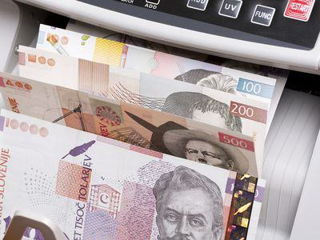

The Slovenian Tolar, serving as Slovenia's official currency from 1991 until 2006, marks a significant chapter in the country's economic history. This article covers the trajectory of the Tolar and its eventual replacement by the Euro, highlighting the currency's influence on Slovenia's economic landscape. A discussion follows on the role of algorithmic trading in contemporary Slovenian financial markets.

By examining the characteristics of the Tolar and its transition to the Euro, we gain insight into Slovenia's evolving financial practices within the framework of the European Union's economic system. This transition not only speaks to a change in currency but also reflects Slovenia's adaptation to global economic standards and integration processes.

The introduction of the Tolar occurred during a critical period when Slovenia asserted its independence from the former Yugoslavia, commencing a new phase of national identity. As Slovenia embraced globalization, the Tolar's replacement with the Euro symbolizes a significant shift towards economic and political cohesion with Europe.

In parallel to this historical transition, Slovenia's financial markets have seen the advent of algorithmic trading. These modern trading practices are revolutionizing how investments and trades are conducted, aligning Slovenia with global financial trends. The story of the Slovenian Tolar and the rise of algorithmic trading encapsulates Slovenia's journey of financial innovation and resilience in an interconnected world.

## Table of Contents

## The History of the Slovenian Tolar

The Slovenian Tolar was introduced in October 1991, a significant moment marking Slovenia's declaration of independence from Yugoslavia. This transition represented more than just a monetary change; it symbolized the establishment of Slovenia's economic sovereignty and new national identity. The name "Tolar" is derived from the Thaler, a historic coin that had widespread use in Central Europe and influenced the naming of the dollar.

Upon its introduction, the Tolar replaced the Yugoslav Dinar at par, a strategic move to facilitate an orderly transition and reflect confidence in the new national currency. This also helped distinguish Slovenia from the economic hurdles faced by the remaining Yugoslav territories, emphasizing its intention to cultivate a distinct economic path.

By 2004, Slovenia had taken a substantial step by pegging the Tolar to the Euro. This was done as part of the European Exchange Rate Mechanism (ERM II), a preparatory stage before adopting the Euro. Participating in the ERM II required Slovenia to maintain the Tolar's exchange rate within a specified fluctuation band against the Euro. This move was aimed at stabilizing the currency and preparing the nation for Eurozone membership, ensuring that Slovenia met the Maastricht criteria which include exchange rate stability, low inflation, and fiscal discipline.

The transition from the Tolar to the Euro, which was completed in 2007, was a pivotal economic alteration that underscored Slovenia’s commitment to deeper integration into the European Union and its monetary stability. This transition was undertaken with a fixed conversion rate of 239.64 Tolars to 1 Euro, a conversion that played a role in easing trade barriers, reducing exchange rate risk, and aligning Slovenia more closely with its European trading partners.

## Transition from the Tolar to the Euro

The transition from the Slovenian Tolar to the Euro is a critical chapter in Slovenia's economic history. Slovenia adopted the Euro on January 1, 2007, marking a pivotal step in its post-independence financial strategy. This change made Slovenia the first among the new EU member states from the 2004 enlargement to join the Eurozone. Slovenia's transition to the Eurozone was not only an economic but also a political achievement, reflecting its integration into the broader European Union framework.

The process leading to Slovenia's Euro adoption was meticulously planned, beginning with the participation in the Exchange Rate Mechanism II (ERM II) in June 2004. The ERM II aimed to stabilize the exchange rates between national currencies and the Euro, a key requirement for any country aspiring to join the Eurozone. During this phase, the Slovenian Tolar was pegged to the Euro with a specific fluctuation margin, allowing the currency to trade within a narrow band.

In July 2006, Slovenia confirmed the conversion rate of 239.64 Tolars to 1 Euro. This fixed exchange rate was crucial for ensuring a smooth transition, providing clarity and stability for businesses and consumers alike. The conversion process required extensive coordination across various sectors of the economy, from banking and finance to retail and public services.

The adoption of the Euro brought significant benefits to Slovenia. It enhanced economic stability by eliminating exchange rate risks within the Eurozone, reduced transaction costs for businesses, and facilitated deeper integration with European markets. The currency transition also paved the way for increased foreign investment and economic growth by offering a more stable and predictable economic environment.

Slovenia's successful transition to the Euro serves as a model for other countries planning similar currency integration. It demonstrated that careful planning, adherence to financial criteria, and effective communication with the public are critical components of a successful currency transition. The move also underscored Slovenia's commitment to aligning with EU standards and practices, reinforcing its status as a proactive and adaptable member of the European community.

## Algorithmic Trading in Slovenia's Financial Markets

As Slovenia modernized, [algorithmic trading](/wiki/algorithmic-trading) emerged as a significant component of its financial markets. Algorithmic trading utilizes computer algorithms to automate the trading process, whereby trades are executed at optimal speeds and efficiencies, minimizing human error. This shift towards automated systems has been inspired by trends across global markets, where algorithmic trading has become integral to investment strategies.

The primary advantage of algorithmic trading lies in its ability to process vast amounts of data and execute large volumes of trades with precision and in real-time. Automated trading systems can analyze market conditions, predict price movements, and execute trades based on predefined criteria, faster than manual methods. These systems employ advanced mathematical models and statistical analyses to make informed decisions that maximize return on investment.

In Slovenia, the implementation of algorithmic trading has mirrored the development observed in larger financial markets such as the United States and the European Union. Slovenian financial institutions and independent traders have embraced these systems, leveraging technological advancements to gain a competitive edge. As these systems become more sophisticated, they are increasingly used for complex trading strategies involving derivatives, commodities, and [forex](/wiki/forex-system). 

Investment firms in Slovenia utilize algorithmic trading not only to enhance operational efficiency but also to achieve higher accuracy in trade execution. The algorithms ensure that trading decisions are made free from emotional bias, based solely on quantitative data. This has increased the strategic use of high-frequency trading ([HFT](/wiki/high-frequency-trading-strategies)) and statistical [arbitrage](/wiki/arbitrage) within the Slovenian context.

Despite the benefits, algorithmic trading also poses challenges, such as the risk of systemic failures or market anomalies triggered by malfunctioning algorithms. Regulators in Slovenia are tasked with monitoring these systems to ensure market stability and to prevent practices such as market manipulation or flash crashes.

In conclusion, the adoption and growth of algorithmic trading in Slovenia reflect a broader trend toward financial modernization. The country’s embrace of advanced trading technologies not only aligns it with global financial practices but also positions Slovenia as a competitive player within the international market.

## Conclusion

The history of the Slovenian Tolar encapsulates more than just a transformation in currency; it reflects a dynamic period of economic evolution as Slovenia transitioned from a fragmented Yugoslavian republic to a member of the European Union. The shift from the Tolar to the Euro was emblematic of Slovenia's integration into a broader economic framework, contributing to greater stability and trade facilitation within the Eurozone. This changeover was a crucial step for participating more fully in the interconnected European economy.

However, Slovenia's financial growth story does not stop with the Euro adoption. Presently, algorithmic trading defines the forefront of Slovenia’s financial market modernization. The implementation of automated and algorithmic trading strategies signifies not only efficiency in handling large volumes of trades but also underscores Slovenia's alignment with the global advancements in financial technology. Algorithmic trading systems capitalize on mathematical models and statistical analysis, executing trades at speeds and accuracies beyond human capability, thereby enhancing market [liquidity](/wiki/liquidity-risk-premium) and depth.

By tracing the lineage from national currency changes to cutting-edge trading practices, one gains an understanding of Slovenia's approach to navigating economic challenges with resilience. The narrative from the Tolar to contemporary trading solutions demonstrates adaptability and foresight in harnessing technological advancements to strengthen economic footholds in competitive markets. This evolution illustrates how historical currency decisions shape current and future financial landscapes, reinforcing the importance of adaptability and innovation in maintaining economic vitality.

## References & Further Reading

[1]: Roubini, N., & Mihm, S. (2010). ["Crisis Economics: A Crash Course in the Future of Finance."](https://books.google.com/books/about/Crisis_Economics.html?id=oQoNLVqZzQYC) Penguin Press.

[2]: Hughes Hallett, A. J., & Woolley, J. (2000). ["The Theory of Currency Boards and the Case of Bosnia and Herzegovina."](https://www.amazon.com/Calculus-Single-Multivariable-Deborah-Hughes-Hallett-ebook/dp/B06XX39CTV) In Currency Boards at Two Ends of the Spectrum.

[3]: Borak, S., Härdle, W. K., & Ristic, M. (2009). ["Comparison of the Slovenian Tolar and Euro Exchange Rates via Heterogeneous Panel Cointegration."](http://sfb649.wiwi.hu-berlin.de/papers/pdf/SFB649DP2009-042.pdf) Humboldt University of Berlin.

[4]: Lopez de Prado, M. (2018). ["Advances in Financial Machine Learning."](https://www.amazon.com/Advances-Financial-Machine-Learning-Marcos/dp/1119482089) John Wiley & Sons.

[5]: Chan, E. P. (2009). ["Quantitative Trading: How to Build Your Own Algorithmic Trading Business."](https://github.com/ftvision/quant_trading_echan_book) John Wiley & Sons.

[6]: Taylor, M. P. (1994). ["Exchange Rate Models."](https://www.sciencedirect.com/science/article/pii/0261560694900299) Journal of Economic Surveys, 8(1).

[7]: Zaharia, L., Tanase, S., & Wojtowicz, A. (2019). ["Algorithmic Trading and the Real Exchange Rate in Central and Eastern European Countries."](https://www.sciencedirect.com/science/article/pii/S1474706518303920) Studies in Economics and Finance, 36(3).