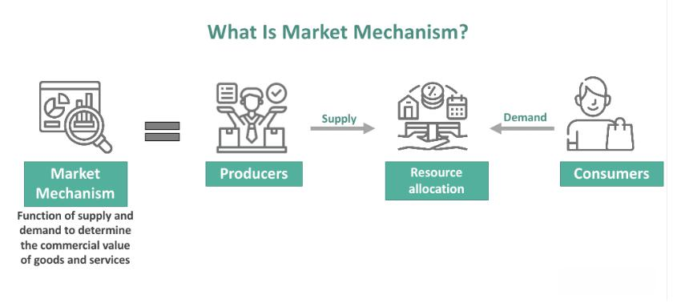

## Table of Contents

## What is a slow market?

A slow market is when there isn't much buying or selling happening. It can happen in places like stores, stock markets, or real estate. When a market is slow, it means fewer people want to buy things, so prices might stay the same or go down. It can be hard for people who want to sell things because they might have to wait longer to find someone who wants to buy.

In a slow market, businesses might have to offer special deals or lower prices to get people to buy. For example, a car dealer might give discounts or free services to sell more cars. People who are thinking about buying might take their time because they know they can get a better deal if they wait. This can make the market even slower because everyone is waiting for the best time to buy or sell.

## How is a slow market different from a fast market?

A slow market and a fast market are opposites. In a slow market, not many people are buying or selling things. This means that stores, stock markets, or houses don't change hands quickly. Prices might stay the same or go down because there aren't many buyers. Sellers might have to wait a long time to find someone who wants to buy what they have. Businesses might offer discounts or special deals to try and sell more.

On the other hand, a fast market is busy and active. Lots of people want to buy things, so prices can go up quickly. Sellers don't have to wait long to find buyers because everyone is in a hurry to get what they want. In a fast market, things like houses or stocks can sell very quickly, sometimes even before they are officially for sale. This can make it hard for buyers because they have to act fast or they might miss out.

## What are the common causes of a slow market?

A slow market can happen for many reasons. One big reason is when people don't have much money to spend. This can happen if lots of people lose their jobs or if the economy is not doing well. When people don't have money, they don't buy as much, and this makes the market slow down. Another reason is when interest rates go up. When it costs more to borrow money, people and businesses might decide to wait before buying big things like houses or cars.

Another cause of a slow market can be when people are worried about the future. If there is a lot of uncertainty, like during a big election or a global crisis, people might hold onto their money instead of spending it. This can make the market slow because fewer people are buying things. Also, if there is too much of something for sale, like too many houses or cars, the market can slow down because sellers have to lower their prices to get rid of what they have.

## How can you identify if you are in a slow market?

You can tell if you're in a slow market by looking at how long it takes for things to sell. If houses, cars, or other big items stay on the market for a long time without being sold, that's a sign of a slow market. Another way to know is by watching the prices. If prices are not going up and are staying the same or going down, it means fewer people are buying, which is what happens in a slow market.

You can also look at how businesses are acting. If stores and companies are offering a lot of discounts and special deals, it's because they want to sell more stuff in a slow market. Talking to people who work in sales or real estate can give you more clues. If they say that it's hard to find buyers and that they have to wait a long time to sell things, then you're likely in a slow market.

## What are the impacts of a slow market on businesses?

A slow market can make it hard for businesses to sell their products or services. When fewer people are buying, businesses might have to lower their prices to get customers to spend money. This can mean less money coming in for the business, which can be a big problem. They might have to cut costs by reducing staff or closing some locations. It can also be tough because businesses might have to wait longer to get paid, which can make it hard to pay for things like rent or supplies.

In a slow market, businesses might also have to change what they do to keep going. They might need to find new ways to reach customers, like using more online ads or offering new products that people want. It can be a time of trying new things and being creative. But it's not easy, and some businesses might not make it through a slow market. They might have to close down if they can't find a way to make enough money.

## What strategies can businesses use to survive in a slow market?

In a slow market, businesses need to be smart about how they spend their money. They should look at their costs and see where they can save money. This might mean closing some stores, letting go of some workers, or finding cheaper ways to do things. It's also important for businesses to talk to their customers and find out what they want. By listening to customers, businesses can change what they sell or how they sell it to meet people's needs better.

Another good strategy is to find new ways to reach customers. Businesses can use the internet more to sell their products or services. They can offer special deals online or use social media to talk to people. It's also a good idea to try new things, like selling different products or starting new services that people might want. By being flexible and trying new ideas, businesses can keep going even when the market is slow.

Lastly, businesses should think about working with other companies. They can team up with other businesses to share costs or reach more customers. For example, a small store might work with a bigger company to sell their products. By working together, businesses can help each other survive in a slow market. It's all about being smart, listening to customers, and trying new things to keep the business going.

## How do slow markets affect different sectors of the economy?

A slow market can affect different parts of the economy in different ways. In the housing market, when fewer people are buying homes, builders and real estate [agents](/wiki/agents) might have to wait longer to sell their properties. This can lead to lower prices and fewer new homes being built. It can also make it hard for people who work in construction because there are fewer jobs. In the car industry, when people are not buying as many cars, car factories might have to slow down or stop making cars. This can lead to fewer jobs and lower prices for cars.

In the retail sector, a slow market means fewer people are coming into stores to buy things. Stores might have to offer big discounts to sell their products, which can mean less money for them. This can also affect the companies that make the products because they sell less, and they might have to make fewer things. In the stock market, when fewer people are buying and selling stocks, the prices can stay the same or go down. This can make people worried about their investments and less likely to put money into the market.

Overall, a slow market can make things tough for many parts of the economy. Businesses in different sectors might have to cut costs, lower prices, or find new ways to sell their products. It can lead to fewer jobs and less money being spent, which can make the slow market even worse. But if businesses can adapt and find new ways to reach customers, they can still survive and even grow during a slow market.

## What are the psychological effects of a slow market on investors and consumers?

A slow market can make investors feel worried and unsure. They might think their money is not safe because prices are not going up. This can make them want to sell their investments quickly, even if it means losing money. They might also decide to wait and not invest at all, hoping for a better time. This waiting can make the market even slower because fewer people are buying and selling.

For consumers, a slow market can make them feel less confident about spending money. They might worry about losing their jobs or not having enough money in the future. This can make them save more and buy less, even if they see good deals. When people are not buying, it can make businesses struggle even more, which can make the slow market last longer. Both investors and consumers can feel stressed and unsure about what to do next in a slow market.

## How do government policies influence slow markets?

Government policies can help make a slow market better or worse. When the economy is slow, the government can lower interest rates to make it cheaper for people to borrow money. This can help people buy things like houses or cars, which can make the market busier. The government can also spend more money on things like building roads or schools, which can create jobs and make people feel more confident about spending money. These actions can help speed up a slow market.

On the other hand, if the government raises taxes or makes it harder to borrow money, it can make a slow market even slower. Higher taxes mean people have less money to spend, and if it's harder to get loans, people might wait to buy big things. The government can also make rules that affect how businesses work, like rules about the environment or workers' rights. If these rules make it more expensive for businesses to operate, they might have to raise prices or cut jobs, which can keep the market slow.

## What historical examples illustrate the effects of slow markets?

One big example of a slow market was the Great Depression in the 1930s. It started in the United States but affected the whole world. People lost their jobs and had no money to spend. This made businesses close down because no one was buying their products. The stock market crashed, and people who had money in stocks lost a lot. The government tried to help by creating jobs and giving people money, but it took a long time for the economy to get better.

Another example was the 2008 financial crisis. It started with problems in the housing market, where too many people had loans they couldn't pay back. Banks lost money, and people stopped buying houses. This made the whole economy slow down. Businesses had to cut jobs, and people were scared to spend money. Governments around the world tried to fix things by lowering interest rates and spending more money on projects to create jobs. It took years for the economy to recover, and some places felt the effects for a long time.

## How can advanced data analytics be used to predict and manage slow markets?

Advanced data analytics can help businesses and economists see when a slow market might happen. By looking at lots of information, like how many people are buying things, how many jobs there are, and how much money people are spending, they can find patterns that show the market might slow down. For example, if fewer people are buying houses and more people are losing their jobs, it might mean a slow market is coming. With this information, businesses can get ready by saving money, changing what they sell, or finding new ways to reach customers.

Once a slow market starts, data analytics can help businesses manage it better. They can use data to see which products or services people still want to buy and focus on those. They can also look at how other businesses are doing and learn from them. For example, if a business sees that offering discounts helps sell more, they might do the same. By keeping a close eye on the data, businesses can make smart choices about what to do next and how to keep going until the market gets better.

## What are the long-term economic implications of prolonged slow market conditions?

When a slow market lasts a long time, it can have big effects on the economy. Businesses might have to close down because they can't sell enough to make money. This means people lose their jobs, and when people don't have jobs, they spend even less money. This can make the slow market last even longer. Also, when businesses struggle, they might not invest in new things like buildings or machines, which can slow down the whole economy. Governments might have to spend more money to help people and businesses, but this can lead to more debt, which can be a problem later.

Over time, a slow market can change how people think about money. They might save more and spend less, even after the market gets better. This can make it hard for the economy to grow fast again. Also, if the slow market goes on for a long time, it can hurt things like schools and hospitals because they don't get as much money. This can make it hard for people to get good education and healthcare, which can affect the future of the economy. It's important for everyone to work together to help the economy get better and start growing again.

## References & Further Reading

[1]: Bergstra, J., Bardenet, R., Bengio, Y., & Kégl, B. (2011). ["Algorithms for Hyper-Parameter Optimization."](https://dl.acm.org/doi/10.5555/2986459.2986743) Advances in Neural Information Processing Systems 24.

[2]: ["Advances in Financial Machine Learning"](https://www.amazon.com/Advances-Financial-Machine-Learning-Marcos/dp/1119482089) by Marcos Lopez de Prado

[3]: ["Evidence-Based Technical Analysis: Applying the Scientific Method and Statistical Inference to Trading Signals"](https://www.amazon.com/Evidence-Based-Technical-Analysis-Scientific-Statistical/dp/0470008741) by David Aronson

[4]: ["Machine Learning for Algorithmic Trading"](https://github.com/stefan-jansen/machine-learning-for-trading) by Stefan Jansen

[5]: ["Quantitative Trading: How to Build Your Own Algorithmic Trading Business"](https://www.amazon.com/Quantitative-Trading-Build-Algorithmic-Business/dp/1119800064) by Ernest P. Chan