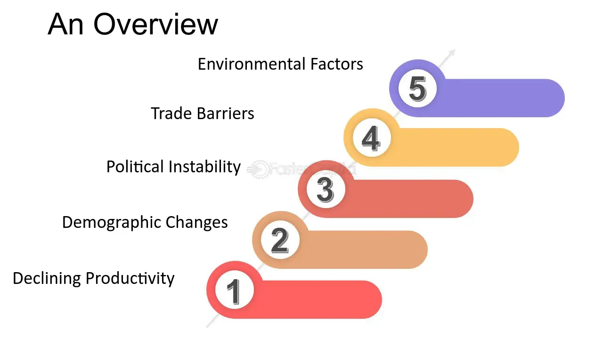

## Table of Contents

## What is a sluggish economy?

A sluggish economy is when the economy of a country is not growing very fast or is growing very slowly. It means that businesses are not making as much money as they could, and people are not buying as many things. When the economy is sluggish, it can be hard for people to find jobs, and the prices of things might not go up very much.

This situation can last for a long time, and it can make people feel worried about their money. Governments and banks might try to help by making it easier for people to borrow money or by spending more on projects to create jobs. But fixing a sluggish economy can be hard and take a lot of time.

## What are the common causes of a sluggish economy?

A sluggish economy can happen for many reasons. One big reason is when people and businesses don't want to spend money. If people are worried about the future, they might save their money instead of buying things. When businesses see that people are not buying, they might not want to make new things or hire more workers. This can slow down the whole economy because less money is moving around.

Another reason for a sluggish economy is when there are problems in other countries that affect the whole world. For example, if a big country's economy is not doing well, it can make it harder for other countries to sell their things to that country. Also, if there are big problems like wars or natural disasters, it can make it hard for businesses to keep working normally. These global issues can make an economy slow down.

Sometimes, a sluggish economy can also come from problems inside a country. If the government is not spending money in the right way or if there are too many rules that make it hard for businesses to work, the economy can slow down. High debts can also make it hard for a country to grow because it has to spend a lot of money just to pay back what it owes. All these things together can make an economy sluggish.

## How is a sluggish economy different from a recession?

A sluggish economy and a recession are both times when the economy is not doing well, but they are a bit different. A sluggish economy is when the economy is growing very slowly or not growing at all. It's like the economy is moving, but it's moving very slowly. People might still have jobs, but it's harder to find new ones, and businesses might not be making as much money as they want. It's not a big crisis, but it's not great either.

A recession, on the other hand, is when the economy is actually shrinking. It's like the economy is going backward. During a recession, a lot of people lose their jobs, and businesses make a lot less money. It's a more serious problem than a sluggish economy. Economists usually say a recession is happening when the economy has been shrinking for at least two quarters in a row. So, while a sluggish economy is slow and not great, a recession is worse and can be really tough for everyone.

## What are the key indicators of a sluggish economy?

Key indicators of a sluggish economy include a slow growth rate in the Gross Domestic Product (GDP). When the GDP is not increasing much or is growing very slowly, it means the economy is not doing well. Another sign is when businesses are not investing much in new projects or equipment. If companies are not spending money to grow, it can show that they are not confident about the future.

Unemployment rates can also be a good indicator. In a sluggish economy, it might be harder for people to find jobs, but the unemployment rate might not go up a lot. Instead, it might just stay the same or increase a little bit. Also, if people are not spending as much money on things like cars or houses, that can be a sign that the economy is slow. When people hold onto their money instead of spending it, it can slow down the whole economy.

Lastly, inflation rates can tell us about a sluggish economy. If prices are not going up very much, it might mean that the economy is not growing. Low inflation can show that businesses are not raising prices because people are not buying enough. All these signs together can help us see if the economy is just moving slowly or if it's in a more serious situation like a recession.

## How does a sluggish economy affect employment rates?

In a sluggish economy, it can be harder for people to find jobs. The economy is not growing fast, so businesses might not need to hire a lot of new workers. They might even decide to not replace workers who leave or retire. This means that while the unemployment rate might not go up a lot, it can stay the same for a long time. People who want to find a new job or change jobs might have a harder time because there are fewer job openings.

Also, in a sluggish economy, people might not feel confident about the future. They might worry about losing their jobs, so they might not quit their current jobs to look for better ones. This can make the employment rate seem stable, but it's because people are staying in their jobs out of fear, not because they are happy with them. Overall, a sluggish economy can make it tough for people to move up in their careers or find new work.

## What impact does a sluggish economy have on consumer spending?

In a sluggish economy, people often spend less money. They might be worried about the future and want to save their money instead of buying things they don't really need. When people see that the economy is not growing fast, they might think it's a good idea to hold onto their money just in case things get worse. This means they might not go out to eat as much, buy new clothes, or even buy big things like cars or houses.

When people spend less, it can make the economy even slower. Businesses see that people are not buying as much, so they might not make as many new products or open new stores. This can lead to fewer jobs and even less money moving around in the economy. So, a sluggish economy can start a cycle where people spend less, businesses do less, and the economy stays slow for a long time.

## How can government policies influence a sluggish economy?

Government policies can help a sluggish economy by making it easier for people to spend money. One way they can do this is by lowering taxes. When people pay less in taxes, they have more money to spend on things they want or need. This can help the economy grow because when people spend more, businesses make more money and might hire more workers. Governments can also give money directly to people, like through stimulus checks, which can also encourage spending.

Another way governments can help is by spending more money themselves. They can start big projects like building new roads or schools, which creates jobs and puts more money into the economy. Governments can also make it easier for businesses to borrow money by lowering interest rates. When businesses can borrow money more cheaply, they might be more willing to invest in new projects or expand, which can help the economy grow faster. These policies can help break the cycle of a sluggish economy and get things moving again.

## What are the long-term effects of a sluggish economy on a country's growth?

A sluggish economy can slow down a country's growth for a long time. When the economy is not growing fast, businesses might not want to invest in new projects or hire more workers. This means that the country might not be able to create new jobs or build new things as quickly as it could. Over time, this can make it hard for the country to keep up with other countries that are growing faster. It can also make people feel less confident about the future, so they might save their money instead of spending it, which keeps the economy slow.

If a sluggish economy lasts for a long time, it can also affect things like education and health care. When the government has less money coming in because the economy is slow, it might not be able to spend as much on schools or hospitals. This can mean that people don't get as good an education or as good health care, which can make it harder for them to get good jobs later on. In the end, a sluggish economy can make it harder for a country to grow and improve over time, and it can take a lot of work to get things moving again.

## How do businesses adapt to operating in a sluggish economy?

In a sluggish economy, businesses often have to be careful with their money. They might not want to spend a lot on new things because they are not sure if people will buy them. So, they might try to save money by not hiring new workers or by not buying new equipment. They might also try to sell things for less money to get people to buy them. This can help them keep making money even when the economy is slow.

Another way businesses adapt is by finding new ways to make money. They might start selling different things that people still want to buy, even in a slow economy. For example, they might sell more basic things that people need, like food or cleaning supplies, instead of luxury items. They might also try to sell their things in new places, like online, to reach more people. By being flexible and trying new things, businesses can keep going even when the economy is not doing well.

## What role do interest rates play in a sluggish economy?

Interest rates are really important in a sluggish economy. They are the cost of borrowing money. When the economy is slow, the government might lower interest rates to make it cheaper for people and businesses to borrow money. If it's cheaper to borrow, people might take out loans to buy things like houses or cars. Businesses might borrow money to start new projects or buy new equipment. This can help the economy grow faster because more money is moving around.

But if interest rates are too low for a long time, it can also cause problems. People might borrow too much money and spend it on things they can't really afford. This can make the economy grow a little faster for a while, but it can also lead to more debt. If people and businesses have a lot of debt, it can make the economy even slower in the future. So, the government has to be careful about how it uses interest rates to help a sluggish economy.

## How can international trade affect a sluggish economy?

International trade can help a sluggish economy by giving businesses more places to sell their things. If a country's economy is slow, businesses might find it hard to sell things at home. But if they can sell to other countries, it can help them make more money. This can keep businesses going and even help them grow. When businesses do well, they might hire more people, which can help the economy get better. So, having good trade with other countries can be really important for a sluggish economy.

On the other hand, international trade can also make a sluggish economy worse. If other countries are not buying as much because their economies are slow too, it can be hard for businesses to sell their things. This can make the economy even slower because businesses are not making as much money. Also, if a country relies a lot on selling things to other countries, and those countries start buying less, it can be a big problem. So, international trade can help or hurt a sluggish economy, depending on what is happening in the rest of the world.

## What strategies can be implemented to recover from a sluggish economy?

To help recover from a sluggish economy, the government can lower taxes. This means people have more money to spend on things they want or need. When people spend more, businesses make more money and might hire more workers. The government can also give money directly to people, like through stimulus checks. This can encourage people to spend money and help the economy grow faster. Another way the government can help is by spending more money on big projects, like building new roads or schools. This creates jobs and puts more money into the economy.

Businesses can also help by finding new ways to make money. They might start selling different things that people still want to buy, even in a slow economy. For example, they might sell more basic things like food or cleaning supplies instead of luxury items. They might also try to sell their things in new places, like online, to reach more people. By being flexible and trying new things, businesses can keep going and help the economy recover. 

Lastly, it's important for a country to keep good trade with other countries. If businesses can sell things to other countries, it can help them make more money. This can keep businesses going and even help them grow. When businesses do well, they might hire more people, which can help the economy get better. But if other countries are not buying as much because their economies are slow too, it can make things harder. So, having good international trade can be really important for recovering from a sluggish economy.

## References & Further Reading

[1]: Bergstra, J., Bardenet, R., Bengio, Y., & Kégl, B. (2011). ["Algorithms for Hyper-Parameter Optimization."](https://dl.acm.org/doi/10.5555/2986459.2986743) Advances in Neural Information Processing Systems 24.

[2]: ["Advances in Financial Machine Learning"](https://www.amazon.com/Advances-Financial-Machine-Learning-Marcos/dp/1119482089) by Marcos Lopez de Prado

[3]: ["Evidence-Based Technical Analysis: Applying the Scientific Method and Statistical Inference to Trading Signals"](https://www.amazon.com/Evidence-Based-Technical-Analysis-Scientific-Statistical/dp/0470008741) by David Aronson

[4]: ["Machine Learning for Algorithmic Trading"](https://github.com/stefan-jansen/machine-learning-for-trading) by Stefan Jansen

[5]: ["Quantitative Trading: How to Build Your Own Algorithmic Trading Business"](https://www.amazon.com/Quantitative-Trading-Build-Algorithmic-Business/dp/1119800064) by Ernest P. Chan