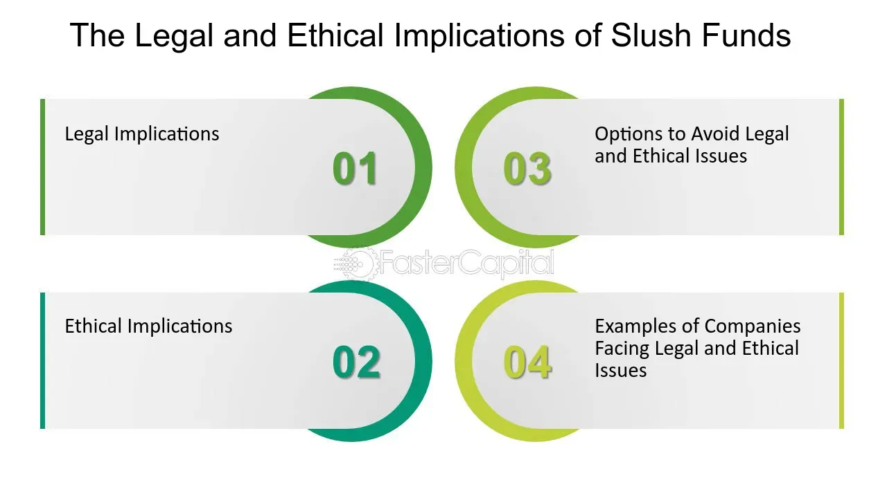

## Table of Contents

## What is a slush fund?

A slush fund is a pool of money that is used for things that are not officially recorded or approved. It is often used in a secretive way, and sometimes for activities that might not be completely honest or legal. People or organizations might use a slush fund to pay for things like bribes, secret projects, or personal expenses that they don't want others to know about.

In politics, a slush fund might be used to help a politician or a political party without the public knowing about it. For example, the money could be used to influence voters or to pay for campaign expenses that are not reported. In businesses, a slush fund might be used to make secret payments to get special favors or to cover up mistakes. Because slush funds are not transparent, they can lead to corruption and mistrust.

## How does a slush fund operate?

A slush fund operates by keeping money separate from the main accounts of a person or organization. This money is often hidden and not reported in official records. People in charge of the slush fund decide how to use the money, usually without telling anyone else. They might use it to pay for things like bribes, secret projects, or personal expenses that they want to keep secret. The money can come from different places, like extra profits, donations, or even illegal activities.

To keep the slush fund secret, those in charge might use fake companies, secret bank accounts, or other ways to hide the money. They might move the money around to different places to make it harder to track. This secrecy helps them avoid getting caught or questioned about how they are spending the money. Because slush funds are not transparent, they can lead to problems like corruption and mistrust within organizations and among the public.

## What are the common sources of money for slush funds?

Slush funds often get money from extra profits that a business makes. If a company earns more money than it expects, the people in charge might put some of that extra money into a slush fund. This way, they can use it for things they don't want others to know about. Another common source is donations. Sometimes, people or groups give money to politicians or organizations, and that money can end up in a slush fund. These donations might be given secretly, so it's hard to trace where the money goes.

Sometimes, slush funds get money from illegal activities. This could be money from crimes like fraud, theft, or selling illegal things. The people running the slush fund might use fake companies or secret bank accounts to hide where the money comes from. They move the money around to different places to make it harder for others to find out about it. This helps them keep the slush fund secret and use the money for whatever they want without getting caught.

## What are the different types of slush funds?

There are different types of slush funds, and one common type is the political slush fund. This is money that politicians or political parties use to help them win elections or influence voters. They might use the money to pay for secret campaign expenses or to give bribes to people who can help them. The money for these funds often comes from donations or extra profits that are not reported to the public.

Another type of slush fund is the corporate slush fund. Companies might use this money to pay for things they want to keep secret, like bribes to get special favors or to cover up mistakes. The money can come from extra profits or even from illegal activities. The people in charge of the company keep the slush fund secret by using fake companies or secret bank accounts to hide the money.

Sometimes, slush funds are used by individuals for personal reasons. These personal slush funds might be used to pay for things like secret trips or luxury items that the person doesn't want others to know about. The money might come from personal savings or from illegal activities. These funds are kept hidden to avoid questions or trouble from family, friends, or the law.

## Can you provide examples of slush funds in different industries?

In politics, slush funds are often used to help politicians win elections. For example, a politician might have a secret fund that they use to pay for campaign ads or to give money to people who can help them get votes. This money might come from rich donors who want to support the politician without the public knowing. A famous example is the Watergate scandal in the 1970s, where money from a slush fund was used to pay for illegal activities to help President Richard Nixon.

In business, companies sometimes use slush funds to pay for things they want to keep secret. For example, a company might have a slush fund to give bribes to government officials to get special favors, like winning a big contract. The money for these funds can come from extra profits that the company makes. A well-known example is the Siemens scandal in the early 2000s, where the German company used a slush fund to pay bribes in many countries to win business deals.

In the entertainment industry, slush funds can be used for personal reasons. For example, a movie star might have a secret fund to pay for luxury trips or expensive gifts that they don't want the public to know about. The money might come from their earnings or from other sources. While not as widely reported, there have been cases where celebrities used slush funds to keep their personal spending hidden from the media and fans.

## What are the legal definitions and regulations surrounding slush funds?

Slush funds are not legal in most places because they are used to hide money and spend it on things that are not allowed. In many countries, there are laws that say people and companies must report all their money and how they spend it. If they don't, they can get in big trouble. For example, in the United States, the Federal Election Commission has rules that say political campaigns must report all their money and spending. If they use a slush fund to hide money, they can be charged with crimes like fraud or corruption.

In business, there are also rules that say companies must be honest about their money. The U.S. Securities and Exchange Commission (SEC) and other similar groups around the world make sure companies follow these rules. If a company uses a slush fund to pay bribes or hide money, they can be fined a lot of money and the people in charge can go to jail. Because slush funds are secret and not allowed, they can lead to big problems like corruption and mistrust in both politics and business.

## How are slush funds detected and investigated?

Slush funds are hard to find because they are secret, but people like investigators and journalists can find them by looking at money trails. They might start by checking a person's or a company's official money records. If they see money going to strange places or being spent in ways that don't make sense, they might think there's a slush fund. They can also talk to people who know about the secret money, like employees or insiders, to get more information. Sometimes, they use special computer programs to follow the money and see where it goes.

Once they think they've found a slush fund, investigators can do more to check if it's true. They might look at bank records, emails, and other documents to see how the money was moved and spent. If they find enough proof, they can go to the police or other groups like the IRS in the U.S. to take action. These groups can then start a legal case against the people who used the slush fund. This can lead to fines, jail time, or other punishments for breaking the law.

## What are the potential legal consequences of using a slush fund?

Using a slush fund can get you into big trouble with the law. If you use a slush fund to hide money or pay for things you shouldn't, you could be charged with crimes like fraud, corruption, or money laundering. These are serious crimes that can lead to big fines and even jail time. For example, if a politician uses a slush fund to pay for secret campaign expenses, they could be charged with breaking election laws and might have to pay a lot of money or go to jail.

In business, using a slush fund to pay bribes or hide money can also lead to serious legal problems. Companies can be fined a lot of money, and the people in charge can go to jail. For instance, if a company uses a slush fund to bribe government officials to win a contract, they could be charged with corruption and face big fines and jail time. The law is strict about slush funds because they can lead to corruption and mistrust, so the punishments are meant to stop people from using them.

## How can organizations prevent the misuse of funds through slush funds?

Organizations can stop slush funds by being open about their money. They should keep clear records of all their money and where it goes. This means making sure everyone knows about the money coming in and going out. They can do this by having regular checks and audits. These checks help find any strange spending or money going to secret places. It's also good to have rules that say everyone must report any funny business with money. This way, if someone sees something wrong, they can tell someone and stop it before it becomes a big problem.

Another way to prevent slush funds is by teaching people about the dangers of hiding money. Organizations can train their workers to know what a slush fund is and why it's bad. They can also set up ways for people to report any secret money without getting in trouble. This can be done through a special person or group that listens to these reports and takes action. By being open, having rules, and teaching people, organizations can make it hard for slush funds to start and keep their money honest and clear.

## What are the ethical implications of maintaining a slush fund?

Maintaining a slush fund is not right because it goes against being honest and open. When people or groups use a slush fund, they are hiding money and using it for things they don't want others to know about. This can lead to bad things like corruption and cheating. If a politician uses a slush fund to pay for secret campaign expenses, they are not being fair to the voters who trust them. In a business, if a company uses a slush fund to pay bribes, they are not playing by the rules and can hurt other companies that are honest.

The ethical problems with slush funds also hurt trust. When people find out about a slush fund, they start to doubt the person or group that used it. This can make people lose faith in leaders or companies. It can also make it hard for people to work together because they don't know if they can trust each other. Being open and honest about money is important for keeping trust and making sure everyone plays fair. So, using a slush fund is not just against the law, it's also wrong because it breaks the trust that is needed for a good society.

## How have laws regarding slush funds evolved over time?

Over time, laws about slush funds have gotten stricter because people have seen how much harm they can do. In the past, it was easier for politicians and businesses to hide money and use it for secret things. But as more scandals came to light, like the Watergate scandal in the 1970s, governments started making new rules to stop slush funds. These rules made it a crime to hide money and use it for bribes or other secret spending. For example, in the United States, the Federal Election Commission was set up to make sure political campaigns were honest about their money.

Today, laws around the world are even tougher on slush funds. Governments have made it clear that hiding money and using it for secret purposes is not allowed. They have set up special groups to watch over money and make sure it's being used the right way. For example, the U.S. Securities and Exchange Commission keeps an eye on businesses to make sure they are not using slush funds. If someone is caught using a slush fund, they can face big fines and even jail time. These strict laws help keep things fair and stop people from cheating with secret money.

## What are the international perspectives and variations in laws concerning slush funds?

Different countries have different laws about slush funds, but most places agree that they are not good. In the United States, laws like the Foreign Corrupt Practices Act make it illegal for companies to use slush funds to bribe people in other countries. The U.S. also has strict rules for political campaigns, making it a crime to hide money and use it for secret things. In Europe, countries like Germany and the UK have their own laws that say hiding money and using it for bribes is wrong. These laws help keep businesses and politicians honest and stop them from using secret money to cheat.

In other parts of the world, like Asia and Latin America, laws about slush funds can be different. Some countries have strict rules, while others might not have as many laws to stop slush funds. For example, in Japan, there have been big scandals about politicians using slush funds, so the government has made new rules to stop it. In Brazil, there have been cases where companies used slush funds to pay bribes, leading to big investigations and new laws to fight corruption. Even though laws can be different, most countries are working to make sure slush funds are not used because they can lead to corruption and hurt trust in leaders and businesses.

## References & Further Reading

[1]: ["Advances in Financial Machine Learning"](https://www.amazon.com/Advances-Financial-Machine-Learning-Marcos/dp/1119482089) by Marcos Lopez de Prado

[2]: ["Quantitative Trading: How to Build Your Own Algorithmic Trading Business"](https://www.amazon.com/Quantitative-Trading-Build-Algorithmic-Business/dp/1119800064) by Ernest P. Chan

[3]: Bergstra, J., Bardenet, R., Bengio, Y., & Kégl, B. (2011). ["Algorithms for Hyper-Parameter Optimization."](https://proceedings.neurips.cc/paper/2011/file/86e8f7ab32cfd12577bc2619bc635690-Paper.pdf) Advances in Neural Information Processing Systems 24.

[4]: ["The Black Box Society: The Secret Algorithms That Control Money and Information"](https://www.jstor.org/stable/j.ctt13x0hch) by Frank Pasquale

[5]: ["Risk Management and Analysis of Hedge Funds: Industry, Strategies, and Performance"](https://www.jstor.org/stable/4480353) by Greg Gregoriou