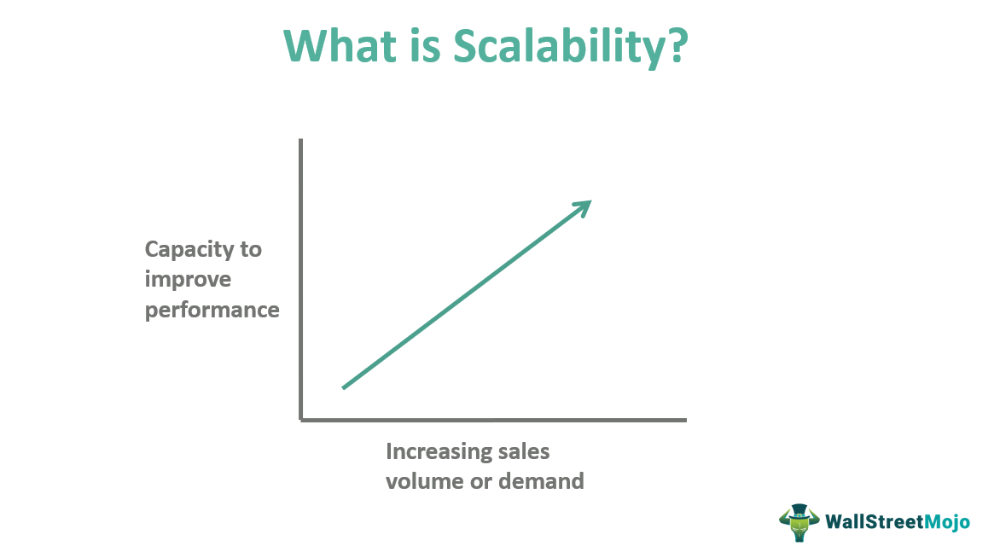

Investing in SLV and employing algorithmic trading strategies have become prominent components of modern financial markets, both offering pathways to substantial profits. SLV, an exchange-traded fund (ETF) backed by silver, provides a convenient way for investors to access the silver market without the complexities of physically owning the metal. Its performance closely aligns with silver prices, allowing investors to leverage market movements for potential gains. Concurrently, algorithmic trading employs computational algorithms to execute trades at speeds unattainable by human traders, providing a strategic edge in capturing market inefficiencies.

However, these investment methods are not without their risks. Understanding these risks and rewards is essential for investors aiming to optimize their portfolios through SLV and algorithmic trading. While the allure of quick profits and diversified exposure might draw investors to these tools, one must also consider the volatility and unpredictability inherent in financial markets. Algorithmic trading, for instance, can amplify risks when market conditions drive algorithmic responses that exacerbate price swings. Similarly, SLV investment is subject to fluctuations in silver prices, influenced by factors ranging from economic indicators to geopolitical tensions.



This article will explore the landscape of SLV investment and algorithmic trading, highlighting the potential financial rewards and the inherent risks involved. Through a comprehensive analysis, we aim to equip investors with the knowledge needed to make informed decisions in these complex financial arenas. By balancing opportunities with the associated challenges, investors can better navigate the intricacies of SLV and algorithmic trading, ultimately enhancing their investment strategies.

## Table of Contents

## Understanding SLV and Its Market

SLV, or the iShares Silver Trust, represents a type of exchange-traded fund (ETF) designed to mirror the price performance of silver. This financial product provides investors with an opportunity to gain exposure to the precious metal without the need for direct possession of physical silver. SLV derives its value from the underlying silver assets it holds, and hence, the performance of this ETF is closely tied to the fluctuations in silver prices. These fluctuations are influenced by a myriad of factors, including economic indicators, industrial demand, and geopolitical events.

Silver, much like gold, serves a dual purpose as both a commodity and a form of investment. Its industrial applications are vast, spanning electronics, solar panels, and various medical devices, making the demand for silver sensitive to industrial activity. This industrial demand can serve as a catalyst for silver prices and, by extension, SLV's market value. In times of robust industrial growth, silver demand may surge, causing upward pressure on prices and providing potential gains for SLV investors.

Economic indicators such as inflation rates, interest rates, and currency exchange rates also play a significant role in shaping the silver market. Silver is often perceived as a safe haven asset, similar to gold. During periods of economic uncertainty or when traditional fiat currencies are perceived as unstable, investors may flock to silver, seeking to hedge against inflation and currency devaluation. This behavior can lead to increased investment flows into SLV, as it offers a liquid and easily accessible avenue for holding silver-related assets.

Geopolitical events are another critical [factor](/wiki/factor-investing) affecting the performance of silver and, consequently, SLV. Political instability, trade tensions, or conflicts can disrupt production and supply chains, thus leading to [volatility](/wiki/volatility-trading-strategies) in silver prices. For instance, if a major silver-producing region encounters political turmoil, the resultant supply constraints could drive up prices, benefiting SLV investors.

Investors often utilize SLV within their portfolios for diversification purposes. As an asset class, silver frequently exhibits different performance patterns compared to equities or bonds, providing a balancing effect during market downturns. This diversification is critical for managing portfolio risk and potentially enhancing returns.

To effectively manage the risks and rewards associated with investing in SLV, a deep understanding of the silver market's dynamics is essential. Investors must remain cognizant of fluctuating supply and demand patterns, economic conditions, and geopolitical developments that could influence silver's price trajectory. Furthermore, keeping abreast of emerging trends in the industrial use of silver can offer additional insights into potential market movements.

## The Financial Rewards of SLV Investment

SLV, an acronym for the iShares Silver Trust [ETF](/wiki/etf-trading-strategies), represents a strategic investment vehicle for gaining exposure to silver without the necessity of owning physical bullion. The financial rewards of investing in SLV are notably apparent, especially during periods of economic instability when precious metals often serve as a hedge against uncertainty.

The intrinsic value of SLV is largely influenced by the demand for silver stemming from its extensive industrial applications. Silver is a crucial component in various industries, such as electronics, solar energy, and medical applications. The metal's conductivity and reflectivity make it indispensable in the manufacturing of electronic components and solar panels. As technological advancements continue to expand these sectors, the demand for silver is poised to grow, potentially driving up its market price and, consequently, the value of SLV. This industrial relevance provides a robust growth opportunity for SLV investors.

SLV also offers a highly accessible avenue for investing in silver, characterized by improved [liquidity](/wiki/liquidity-risk-premium) compared to physical silver investments. Unlike owning physical silver, SLV enables investors to buy and sell shares of the trust on stock exchanges with ease, allowing for quick entry and [exit](/wiki/exit-strategy) from positions. This liquidity is particularly advantageous in fast-moving markets, providing investors with the flexibility to adapt quickly to market changes.

Furthermore, SLV investments can enhance a diversified portfolio's risk-adjusted returns. By integrating silver into a diversified investment strategy, investors can potentially reduce portfolio risk due to silver's historical performance as a non-correlated asset during economic downturns. The potential for substantial returns during periods of financial distress can significantly contribute to the overall performance of a portfolio, serving as a counterbalance to more volatile assets.

To quantitatively assess the potential benefits of SLV in a diversified portfolio, investors can utilize metrics such as the Sharpe Ratio, which measures the average return earned in excess of the risk-free rate per unit of volatility or total risk. By comparing the risk-adjusted returns of portfolios with and without SLV allocations, investors can make informed decisions on the optimal asset mix that aligns with their risk tolerance and investment goals.

In summary, the financial rewards of SLV investment are tied to its industrial demand, high liquidity, and the potential to improve risk-adjusted returns within a diversified portfolio. These characteristics make SLV a compelling option for investors seeking strategic exposure to silver without the complexities of managing physical holdings.

## Common Risks Associated with SLV Investment

SLV, as a silver exchange-traded fund, provides a liquid and accessible means for investors to gain exposure to silver markets. However, it comes with significant risks that must be accounted for. 

One primary risk associated with SLV investment is the inherent market volatility tied to fluctuating silver prices. Silver prices are highly susceptible to changes in economic indicators, geopolitical shifts, industrial demand, and market sentiment. These unpredictable economic events can lead to rapid price swings, impacting the value of SLV significantly. For instance, during periods of economic turmoil, investor sentiment may drive up demand for precious metals as safe-haven assets, leading to increased volatility.

Additionally, SLV does not offer dividend yields, which can be a major downside for income-focused investors who rely on dividend payments for returns. Unlike stocks or other income-generating assets, SLV’s value is solely dependent on the price appreciation of silver. This characteristic may not align with the strategies of investors seeking regular income, rather than capital gains.

Another critical risk is counter-party risk inherent in ETFs such as SLV. These funds are reliant on financial institutions to back their value, which introduces a layer of credit risk. If an institution linked to the SLV fund were to face financial difficulties, it could adversely affect the fund’s trustworthiness and the value investors hold in its shares.

Furthermore, investors should be cautious about SLV's performance history, particularly during economic downturns. Historical performance data suggests that precious metals, including silver, can experience drastic shifts in value during such times. An investment in SLV without a full consideration of past market reactions during downturns could expose investors to unintended financial risks.

Understanding these risks is crucial for investors looking to incorporate SLV into their portfolios. By acknowledging the potential for volatility, the lack of income through dividends, counter-party dependencies, and historical performance variability, investors can formulate better risk management strategies, ensuring that their ventures are as informed as they are strategic.

## How Algorithmic Trading Works

Algorithmic trading, known as algo trading, involves the use of complex algorithms and computer systems to trade financial securities at exceptionally high speeds. The fundamental advantage of this approach is the precision it offers in the execution of trades. This precision not only minimizes transaction costs but also effectively removes the emotional biases that often affect human traders during decision-making.

At its core, algo trading relies on predefined criteria to initiate and execute trades. These criteria can include a variety of input parameters such as price, timing, and [volume](/wiki/volume-trading-strategy). By automating these decisions, algo trading can rapidly exploit even the smallest price discrepancies in the market, a task that would be nearly impossible for human traders to achieve with the same efficiency and consistency.

In contemporary financial markets, algo trading dominates, with estimates suggesting that approximately 80% of global trades are executed using algorithms. This prevalence is due, in part, to the advancements in the technological infrastructure underpinning these trading systems. Understanding this infrastructure is crucial for effectively implementing algo trading strategies.

The technical framework of an [algorithmic trading](/wiki/algorithmic-trading) system typically involves several components:

1. **Data Collection and Analysis**: Real-time market data is collected and analyzed to identify potential trading opportunities. This process often involves the use of machine learning algorithms capable of uncovering patterns and trends in massive datasets.

2. **Trade Signal Generation**: Once a trading opportunity is identified, the system generates a trade signal based on predefined algorithms. These might include strategies based on technical indicators, statistical arbitrage, or market-making principles.

3. **Execution**: The trading signal triggers the execution of a trade. This step is highly optimized to ensure that trades are executed at desired prices and quantities, minimizing market impact.

4. **Post-Trade Analysis and Optimization**: After a trade is completed, the system performs a comprehensive analysis to assess the trade's performance and make necessary adjustments to the trading model.

For example, a simple algorithmic strategy in Python might look like this:

```python
import yfinance as yf
import numpy as np

# Load historical price data for a stock
data = yf.download("AAPL", start="2023-01-01", end="2023-10-01")

# Calculate moving averages
data['SMA_50'] = data['Close'].rolling(window=50).mean()
data['SMA_200'] = data['Close'].rolling(window=200).mean()

# Generate buy/sell signals
data['Signal'] = np.where(data['SMA_50'] > data['SMA_200'], 1, 0)

# Plotting the results
import matplotlib.pyplot as plt
plt.figure(figsize=(14, 7))
plt.plot(data['Close'], label='Close Price')
plt.plot(data['SMA_50'], label='50-Day SMA')
plt.plot(data['SMA_200'], label='200-Day SMA')
plt.scatter(data.index, data['Close'], c=data['Signal'], marker='^', label='Signal')
plt.legend()
plt.show()
```

This script uses a simple moving average crossover strategy, where a buy signal is generated when the 50-day moving average crosses above the 200-day moving average. While this is a basic example, real-world algo trading strategies can be significantly more complex and involve sophisticated statistical models and [artificial intelligence](/wiki/ai-artificial-intelligence).

In summary, the success of algorithmic trading hinges on leveraging powerful computational techniques and robust infrastructure to efficiently execute trades and manage the vast amounts of data generated by the financial markets.

## Financial Rewards of Algorithmic Trading

Algorithmic trading, often referred to as algo trading, has become a pivotal aspect of modern financial markets due to its capability to execute trades at speeds that are inaccessible to human traders. This rapid execution allows traders to capitalize on minor price discrepancies, providing a significant edge over traditional trading methods. Algorithms are designed to analyze market conditions and execute trades instantaneously when certain conditions are met, reducing latency and enhancing profitability.

One of the most notable financial rewards of algorithmic trading is its ability to automate trading strategies. This automation improves efficiency by enabling simultaneous transactions across multiple markets and asset classes. For instance, a trader can use algo trading to [arbitrage](/wiki/arbitrage) between stocks on different exchanges or execute complex strategies that involve various financial instruments without human intervention. The ability to operate around the clock and swiftly adapt to market changes further accentuates this advantage.

Moreover, algorithmic trading minimizes human error, which is often a byproduct of emotional trading decisions. Human traders are susceptible to biases and stress, which can lead to suboptimal decision-making. By employing algorithms, traders can adhere strictly to predefined strategies without being swayed by market emotions, ensuring consistency in trade execution.

For institutional investors, the cost-saving potential of algorithmic trading is another compelling benefit. By optimizing trade execution and reducing transaction costs, institutions can enhance their overall investment returns. Large volumes of trades can be broken into smaller orders and executed systematically over time to avoid market impact and reduce slippage, which is the difference between the expected price of a trade and the actual price.

To illustrate a simple example of algorithmic trading in Python, consider a basic strategy for executing trades based on moving averages:

```python
import numpy as np
import pandas as pd

# Sample market data
data = pd.DataFrame({
    'Price': [100, 101, 102, 101, 103, 104, 105]
})

# Calculate moving averages
data['Short_MA'] = data['Price'].rolling(window=3).mean()
data['Long_MA'] = data['Price'].rolling(window=5).mean()

# Define trading signals
data['Signal'] = np.where(data['Short_MA'] > data['Long_MA'], 1, 0)  # 1 means buy, 0 means sell

# Display the strategy signals
print(data)
```

In this example, the algorithm triggers buy/sell signals based on the crossover of short-term and long-term moving averages. Such strategies can be scaled and adjusted to incorporate more sophisticated indicators and risk management techniques.

In conclusion, algorithmic trading's ability to execute trades swiftly, improve operational efficiency, diminish human error, and reduce costs for large-scale traders underscores its significance. By leveraging technology and sophisticated strategies, traders and institutions can achieve more reliable and optimized financial outcomes.

## Risks Associated with Algorithmic Trading

Algorithmic trading, despite its growing influence in financial markets, presents significant risks that traders and investors must consider. One of the most critical risks associated with algorithmic trading is the potential for system malfunctions or software bugs. These technological glitches can result in erroneous trades, which, due to the high speed and volume of algorithmic transactions, may lead to significant financial losses. For example, a misconfigured algorithm can execute trades based on incorrect market data, magnifying losses before the issue is identified and resolved.

Market volatility is another factor that can exacerbate the risks inherent in algorithmic trading. Algorithms, designed to operate under typical market conditions, may react unpredictably during periods of high volatility. Such scenarios might lead to algorithms contributing to market turbulence rather than stabilizing it, potentially causing a cascade of trades that amplify price movements and lead to further instability.

Regulatory challenges add another layer of complexity to algorithmic trading. Financial markets are subject to various regulations that can vary significantly across jurisdictions. Compliance with these regulations requires substantial resources and investment in technology and legal counsel. Furthermore, traders must be prepared to adapt to continually evolving regulatory landscapes, which may impose restrictions on certain types of trading algorithms or strategies.

Moreover, the initial investment required in technology infrastructure presents a barrier to entry for many individuals and smaller trading firms. Developing or acquiring robust algorithmic trading systems involves significant costs, including high-performance computing hardware, data feeds, and software development. This high upfront investment can be prohibitive for some, particularly in an industry where speed and technology offer competitive advantages.

Finally, ongoing monitoring and constant adjustment of algorithmic trading systems are essential due to the dynamic nature of financial markets. Algorithms must be continuously refined to adapt to changing market conditions, shifts in economic indicators, and evolving trading patterns. This requirement necessitates not only technical expertise but also significant commitments in terms of time and resources. Without diligent oversight, even well-designed algorithms can become obsolete or behave erratically, further increasing the risk of financial loss. 

Thus, while algorithmic trading offers numerous advantages, these potential risks underscore the need for rigorous risk management strategies and continuous system evaluations to minimize exposure to financial hazards.

## SLV and Algorithmic Trading Combined

Algorithmic trading can serve as a powerful tool for optimizing SLV (a silver exchange-traded fund) investments by facilitating rapid reactions to fluctuations in the silver market. By employing algorithms designed to analyze real-time market data, traders can exploit short-term price changes in SLV more efficiently than through manual trading methods. These algorithms can be programmed to identify specific patterns and triggers, allowing them to execute buy or sell orders automatically when certain market conditions are met. For example, an algorithm might be set to purchase SLV shares when the silver price is predicted to rise due to positive economic indicators, thereby capitalizing on potential gains.

The combination of SLV investments with algorithmic trading, however, inherently introduces additional complexity and risks. The success of such a strategy heavily relies on the precision and reliability of the algorithm employed. Incorrect programming or a lack of adaptability to changing market conditions may result in missed opportunities or significant financial losses. The algorithms must be robust and capable of handling unexpected market events without causing detrimental trading decisions.

Furthermore, risk management plays a crucial role in deploying algorithmic trading systems for SLV investments. Investors must establish comprehensive risk management strategies to safeguard against potential losses. This involves setting strict stop-loss and take-profit levels within the algorithms to mitigate against adverse price movements. Additionally, maintaining a diversified portfolio and continuously monitoring the performance of the trading algorithms can help reduce exposure to any single point of failure.

Implementing these strategies often necessitates substantial investment in technological infrastructure and expertise, which can be a barrier for individual investors or smaller firms. Nonetheless, for those who can effectively navigate the complexities, merging SLV investments with algorithmic trading can unlock enhanced profitability and operational efficiency within financial markets.

## Conclusion

Investing in SLV and utilizing algorithmic trading can present significant financial opportunities. However, they also come with inherent risks that must be recognized and thoroughly understood by investors. SLV investments allow exposure to the silver market without the need for physical ownership, providing a convenient method for hedging against inflation and diversifying portfolios. Nonetheless, investors face market volatility, counter-party risks, and the absence of dividends, making it essential to assess these factors carefully.

Similarly, algorithmic trading offers advantages such as enhanced speed, precision, and the elimination of emotional biases in trading. Yet, it is not without risks, including potential system malfunctions, regulatory challenges, and the necessity for substantial technological investments. Successful algorithmic trading requires constant monitoring and adaptation to market conditions.

Combining SLV investments with algorithmic trading strategies can optimize returns by exploiting market movements effectively. However, this combination adds layers of complexity and necessitates strong risk management strategies. Investors venturing into these integrated strategies must ensure diligent oversight to navigate the complexities and dynamic nature of financial markets.

Conclusively, while lucrative opportunities exist within SLV investments and algorithmic trading, achieving success demands a careful balance of risks and rewards. Investors must build a comprehensive understanding of these financial instruments and implement robust strategies to make well-informed decisions. This balance is crucial for sustainable success in dynamic and often unpredictable trading environments.

## References & Further Reading

[1]: Bergstra, J., Bardenet, R., Bengio, Y., & Kégl, B. (2011). ["Algorithms for Hyper-Parameter Optimization."](https://dl.acm.org/doi/10.5555/2986459.2986743) Advances in Neural Information Processing Systems 24.

[2]: ["Advances in Financial Machine Learning"](https://www.amazon.com/Advances-Financial-Machine-Learning-Marcos/dp/1119482089) by Marcos Lopez de Prado

[3]: ["Evidence-Based Technical Analysis: Applying the Scientific Method and Statistical Inference to Trading Signals"](https://www.amazon.com/Evidence-Based-Technical-Analysis-Scientific-Statistical/dp/0470008741) by David Aronson

[4]: ["Machine Learning for Algorithmic Trading"](https://github.com/stefan-jansen/machine-learning-for-trading) by Stefan Jansen

[5]: ["Quantitative Trading: How to Build Your Own Algorithmic Trading Business"](https://www.amazon.com/Quantitative-Trading-Build-Algorithmic-Business/dp/1119800064) by Ernest P. Chan