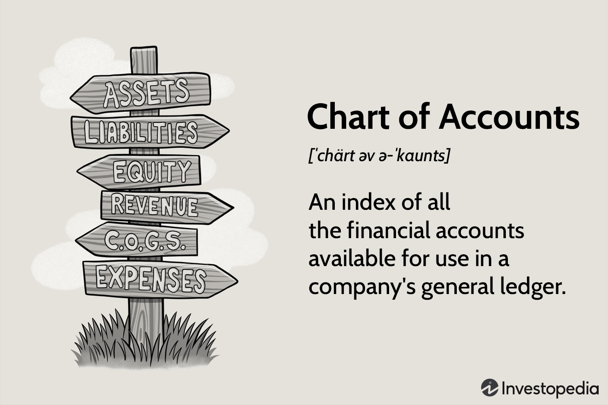

In algorithmic trading, starting with a small account presents numerous challenges that require strategic planning and execution, but success is within reach. This article will explore the intricacies of trading with a limited capital base and how algorithmic strategies can be employed effectively to navigate these challenges. By focusing on the fundamentals of small account trading and the application of effective tactics, we aim to cover essential aspects vital for success.

Managing a small account necessitates a strong understanding of risk management. Since the available capital is limited, each trading decision carries considerable weight, and therefore, a calculated approach to handling the risk is indispensable. Equally significant is the virtue of patience, as achieving long-term growth often involves a gradual process rather than quick wins.



Through careful planning and disciplined execution, traders can achieve substantial progress even with modest initial investments. This requires adopting strategies that maximize potential returns while minimizing risk exposure. Throughout this article, the emphasis will be placed on practical techniques and insights that can help traders on their path to growing their small accounts effectively through algorithmic trading.

## Table of Contents

## Understanding Small Account Trading

A small trading account's definition can vary significantly depending on the financial market in question. In forex trading, for example, an account with $10,000 is often considered small. This is mainly because forex trading involves substantial volumes and the need for sufficient capital to handle potential volatility. In contrast, in the stock market, a "small account" might be considerably larger due to higher price per unit compared to forex currencies. 

Trading with a small account necessitates the strategic use of leverage. Leverage allows traders to control larger positions than the actual capital in their account would permit. For instance, a 50:1 leverage ratio enables a trader with $10,000 to control a position up to $500,000. This amplification of buying power can lead to increased profitability but also heightens the risk of significant losses if market movements go against the trader's positions. Consequently, strategic risk management becomes paramount. Implementing prudent risk management techniques, such as setting stop-loss orders and adhering to a predefined risk-reward ratio, can help protect against adverse market swings.

Undercapitalization represents a significant challenge for small account traders. Limited capital can constrain a trader's ability to enter a diverse array of trades, potentially increasing exposure to unnecessary risks or forcing allegiance to a single strategy that may not always perform optimally. However, this challenge can be mitigated with a well-formulated approach and effective trading strategies that capitalize on low-risk opportunities. Diversifying trade strategies, even with limited funds, can help spread risk and increase overall resilience.

An understanding of market-specific regulations and requirements is also crucial for small account traders. In the United States, for example, the Pattern Day Trading (PDT) rule mandates that traders maintain a minimum equity of $25,000 in their accounts to engage in [day trading](/wiki/day-trading-spy) on margin accounts. This rule was designed to ensure that traders engaging in frequent buying and selling have adequate capital to withstand necessary market movements without incurring excessive risk. Such regulations emphasize the importance of recognition and adherence to jurisdictional and market-specific requirements, which can significantly impact trading strategy decisions.

Overall, while trading with a small account presents challenges, particularly with undercapitalization and risk management, a well-informed trader can navigate these challenges through strategic leverage use and familiarity with market regulations.

## Pros and Cons of Small Account Trading

In the context of small account trading, there are distinct advantages and drawbacks that are important to consider. Trading with a small account allows individuals to develop trading skills with a limited risk of loss, which can be invaluable for those who are new to [algorithmic trading](/wiki/algorithmic-trading). The reduced capital investment means that any potential financial setbacks are kept within a more manageable scope. Additionally, traders can maintain tighter control over emotional decision-making due to the smaller stakes involved. This setup can naturally instill a disciplined approach to trading, as the consequences of rash decisions are minimalized.

A significant advantage also lies in the ability to leverage broker facilities, which may allow traders to control larger positions than their actual account balance would otherwise permit. This access to leverage can provide an opportunity to amplify returns without committing a larger portion of personal funds upfront. It is important, however, to approach this tool with caution, as leverage can also magnify losses.

The small size of trades commonly associated with small account trading serves to minimize the impact of market fluctuations. Since the proportion of capital risked on each trade is typically small, even considerable market movements may only cause minimal damage to the account balance. This can be ideal for traders looking to learn and adapt without facing catastrophic losses.

However, there are notable disadvantages to trading with a small account. One principal downside is the difficulty in achieving substantial profits. The limited capital makes it challenging for traders to accumulate significant gains unless they employ high-leverage tactics, which come with heightened risk. Furthermore, the continual use of such leverage can become a temptation, potentially leading traders to over-leverage positions and increase the likelihood of substantial loss.

Trading with limited funds can exert emotional stress on traders, which can result in poor trading decisions. When the room for financial maneuver is restricted, traders may experience heightened anxiety, especially in volatile markets. This stress can sometimes lead to impulsive actions such as deviating from a trading plan or prematurely closing positions, thereby disrupting the consistency needed for long-term success. 

Overall, small account trading serves as a practical entry point for aspiring algo traders to hone their skills and develop a robust trading strategy with relatively limited risk exposure. Careful consideration of leverage and emotional management is essential to navigate the inherent challenges and avoid common pitfalls.

## Effective Strategies for Small Accounts

In algorithmic trading, small accounts can benefit significantly from well-defined and tested strategies. Notably, techniques such as the Opening Range Breakout and the NR7 trading strategy prove useful. These strategies offer a structured approach and can be adapted to fit the constraints and opportunities presented by smaller accounts.

The Opening Range Breakout strategy involves capturing the price movement that occurs after the market opens within a defined period, typically the first 30 minutes to an hour. Traders look for the [breakout](/wiki/breakout-trading) above or below this initial range as an entry signal. This strategy can be particularly effective for small accounts when combined with risk management techniques that limit potential losses.

On the other hand, the NR7 (Narrowest Range 7) strategy focuses on identifying the day's range as the smallest of the previous seven days. This condition is often a precursor to significant price movement, giving traders a chance to enter a position anticipating a breakout. It is essential not to over-leverage, as small accounts require careful risk allocation.

Key to employing these strategies effectively is ensuring that they have a low-risk setup with an attractive risk-reward ratio. A favorable risk-reward ratio means the potential profit on a trade should outweigh the potential loss. For instance, a 3:1 risk-reward ratio implies that for every dollar risked, the potential reward should be three dollars. 

Employing multiple strategies can further enhance trading performance and reduce periods of inactivity. For a diversified approach, a trader could combine the Opening Range Breakout and NR7 strategies with [momentum](/wiki/momentum) or mean reversion strategies, depending on market conditions. This diversification can help stabilize returns and better manage risk in volatile trading environments.

Backtesting is crucial in evaluating the effectiveness of these strategies over extensive periods. By simulating a strategy's past performance using historical data, traders can identify potential pitfalls and strengths. For Python users, libraries such as `pandas`, `numpy`, and `[backtrader](/wiki/backtrader)` offer comprehensive support for conducting backtests. Here's a basic example of how one might set up a backtest using Python:

```python
import backtrader as bt

class Strategy(bt.Strategy):
    def __init__(self):
        self.range_high = bt.indicators.Highest(self.data.high, period=240)
        self.range_low = bt.indicators.Lowest(self.data.low, period=240)

    def next(self):
        if not self.position:
            if self.data.close[0] > self.range_high[0]:
                self.buy()
            elif self.data.close[0] < self.range_low[0]:
                self.sell()

cerebro = bt.Cerebro()
cerebro.addstrategy(Strategy)
data = bt.feeds.YahooFinanceData(dataname='AAPL', fromdate=pd.Timestamp('2022-01-01'), todate=pd.Timestamp('2023-01-01'))
cerebro.adddata(data)
cerebro.run()
```

This Python script sets up a simple strategy that reacts to breakouts from the highest and lowest price levels over an assumed initial period. Although this is a rudimentary example, further customization and sophistication are necessary for implementing a reliable trading strategy.

Through careful strategy selection, effective risk management, and comprehensive [backtesting](/wiki/backtesting), small trading accounts can potentially achieve growth while minimizing exposure to excessive risks.

## Leveraging and Risk Management

Leverage, in the context of trading, serves as a double-edged sword. While it can amplify potential returns, it simultaneously raises the stakes by increasing potential losses. This dual nature makes risk management a critical component of trading, especially for those operating with small accounts. Efficient risk management involves several key practices, with position sizing and stop-loss utilization at the forefront.

Position sizing is a technique used to determine how much capital to allocate to a specific trade, minimizing risk and maximizing the potential for profit. The core idea is to establish trade sizes that are consistent with a trader's risk tolerance, the [volatility](/wiki/volatility-trading-strategies) of the asset, and the overall size of the trading account. For instance, it is common practice to risk only a small percentage of one's account—typically 1% to 2%—on any single trade. This approach helps prevent significant losses that could jeopardize the account.

The implementation of stop-loss orders is another crucial strategy for managing risk. A stop-loss order is a predetermined price level at which a trade will be exited to mitigate further losses. By setting a stop-loss order, traders can define their maximum loss in advance, allowing them to manage risk systematically rather than emotionally reacting to market conditions.

Understanding the appropriate level of leverage is also essential for small account traders. Leverage is expressed as a multiple of the trading account, with common levels ranging from 2x to 100x, depending on the asset class and broker. For small accounts, conservative leverage, such as 2x, is often recommended to maintain account safety while still allowing for capital growth. If a trader uses 2x leverage, for example, a $1,000 position can be controlled with just $500, effectively halving the amount of capital at immediate risk in the transaction.

Consider a scenario where a trader has a $10,000 account and decides to risk 1% per trade. In this case, the maximum loss per trade should be $100. If the trader uses 2x leverage, they can take on a $200 position while still adhering to their risk management rules. This strategy balances the potential for profit with the preservation of capital.

The Python pseudocode below illustrates how a basic calculation for position sizing with leverage might look:

```python
account_size = 10000  # Initial account size in USD
risk_per_trade = 0.01  # Risk 1% of the account per trade
leverage = 2  # 2x leverage

max_loss = account_size * risk_per_trade
trade_position_size = max_loss * leverage

print(f"Trade Position Size: ${trade_position_size}")
```

Overall, a measured approach to leveraging and risk management can help small account traders navigate the complexities of the market, enhancing the likelihood of long-term success.

## Growing a Small Trading Account

Growing a small trading account in algorithmic trading necessitates a combination of patience, realistic expectations, and strategic diversification. Patience is essential as the journey to growth is often gradual. Traders must avoid the allure of quick, high-risk trades that can jeopardize the account balance. Instead, maintaining realistic expectations about potential returns helps to establish a sustainable trading plan.

Compounding returns are a potent mechanism that significantly enhances account growth over time. This principle, well-regarded by industry veterans, involves reinvesting profits to generate more earnings from the accumulated balance. Mathematically, compounding can be expressed using the formula:

$$
A = P \left(1 + \frac{r}{n}\right)^{nt}
$$

where $A$ is the amount of money accumulated after $n$ years, including interest. $P$ is the principal amount, $r$ is the annual interest rate, and $t$ is the time period in years. In trading terms, continually reinvesting gains into new trading positions contributes to exponential account growth, as seen over long time horizons.

Diversification plays a pivotal role in achieving stable growth. By varying strategies and asset classes, traders mitigate risks associated with market volatility. Engaging in multiple markets or employing different trading algorithms can cushion against the adverse performance of a single asset or strategy. For instance, using a blend of trend-following and mean-reversion strategies can offset losses in trendless markets.

Moreover, portfolio diversification encourages exposure to different sectors, reducing the impact of sector-specific downturns. Expanding to various asset classes such as equities, [forex](/wiki/forex-system), and commodities, broadens the scope of opportunities and enhances the potential for consistent returns.

In summary, the pathway to growing a small trading account demands discipline and strategic planning. By adhering to the principles of compounding and diversification, traders can steadily increase their account size while minimizing risks, ensuring long-term success in the competitive world of algorithmic trading.

## Conclusion

Small account trading in algo trading requires a meticulous balance of discipline, effective strategies, and robust risk management. The key to success lies in embracing systematic trading approaches that are supported by rigorous backtesting. This ensures that strategies have a proven track record before being deployed in live market conditions, effectively reducing the risk of substantial losses and optimizing the potential for growth.

In systematic trading, algorithms execute trades based on pre-defined criteria without emotional involvement, thus enhancing the consistency and reliability of trading outcomes. Backtesting, an essential part of strategy development, involves running the algorithm through historical data to evaluate how it would have performed in real-world situations. This process helps in fine-tuning the strategy parameters and understanding its strengths and weaknesses.

Moreover, patience and consistency emerge as pivotal characteristics for traders aiming to grow a small account. Since significant growth can rarely be achieved overnight, traders must adopt a long-term perspective, focusing on compounding returns over time. This often involves small, incremental gains rather than one-time large profits.

Successful small account trading also counts on the careful application of leverage. While leverage can amplify returns, it equally magnifies potential losses, necessitating a disciplined approach to risk management. Techniques such as effective position sizing and the use of stop-loss orders become crucial in protecting the trading account from adverse market moves.

In conclusion, small account trading in algorithmic environments can be rewarding if approached with a disciplined mindset, grounded strategies, and a strong emphasis on risk management. By adhering to these principles, traders can gradually build their capital and achieve sustainable growth.

## References & Further Reading

[1]: Bergstra, J., Bardenet, R., Bengio, Y., & Kégl, B. (2011). ["Algorithms for Hyper-Parameter Optimization."](https://proceedings.neurips.cc/paper/2011/file/86e8f7ab32cfd12577bc2619bc635690-Paper.pdf) Advances in Neural Information Processing Systems 24.

[2]: ["Advances in Financial Machine Learning"](https://www.amazon.com/Advances-Financial-Machine-Learning-Marcos/dp/1119482089) by Marcos Lopez de Prado

[3]: ["Evidence-Based Technical Analysis: Applying the Scientific Method and Statistical Inference to Trading Signals"](https://www.amazon.com/Evidence-Based-Technical-Analysis-Scientific-Statistical/dp/0470008741) by David Aronson

[4]: ["Machine Learning for Algorithmic Trading"](https://github.com/stefan-jansen/machine-learning-for-trading) by Stefan Jansen

[5]: ["Quantitative Trading: How to Build Your Own Algorithmic Trading Business"](https://books.google.com/books/about/Quantitative_Trading.html?id=j70yEAAAQBAJ) by Ernest P. Chan