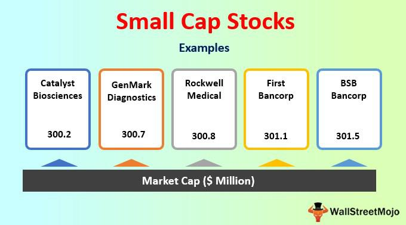

In the fast-evolving world of financial markets, small-cap stocks and algorithmic trading have emerged as two intriguing concepts for investors. Small-cap stocks, typically defined by having a market capitalization between $300 million and $2 billion, present opportunities for potentially high growth. This potential is balanced by increased risks, as these stocks tend to exhibit greater volatility than their large-cap counterparts. Investors are often attracted to small-cap stocks due to their capacity for significant returns as companies undergo early-stage growth. However, this attraction necessitates a well-honed understanding of associated risks, such as lower liquidity and less extensive coverage by financial analysts.

On the other hand, algorithmic trading, or 'algo trading,' involves the use of advanced computational algorithms designed to enhance trading efficiency and precision. These algorithms can execute trades at speeds and volumes beyond human capability, capitalizing on fleeting market inefficiencies. The strategies employed within algorithmic trading—ranging from market-making and arbitrage to trend-following—are highly customizable and can be tailored to exploit specific market conditions.



This article explores the synergy between small-cap stock investing and algorithmic trading, providing insights into the potential benefits and challenges of such an integration. The convergence of small-cap stocks and algorithmic trading presents compelling opportunities for investors seeking to navigate today's dynamic financial markets. By leveraging the unique advantages of both, investors may optimize their trading strategies, aiming to balance risk and reward effectively. This synthesis not only enhances the strategic dimensions of investing but also requires a nuanced understanding of market dynamics to harness its full potential.

## Table of Contents

## Understanding Small-Cap Stocks

Small-cap stocks are defined by their market capitalization, which typically ranges between $300 million and $2 billion. This classification distinguishes small-cap stocks from mid-cap and large-cap stocks, which have larger market capitalizations. A key feature of small-cap stocks is their significant growth potential. This potential stems from the companies' early-stage status, often indicating that they are in the process of expanding their business operations, developing new products, or increasing market share. As these companies grow, their stock values may appreciate significantly, providing substantial returns to investors who invest early.

However, the allure of high returns is accompanied by greater volatility. Small-cap stocks are more susceptible to price swings compared to their larger counterparts. This volatility can be attributed to several factors, including lower trading volumes, limited liquidity, and greater susceptibility to economic and market fluctuations. Small-cap companies also tend to have less established financial histories and fewer financial resources, which can amplify the highs and lows experienced by their stock prices.

Investors are often attracted to small-cap stocks due to their potential for substantial returns, driven by the growth prospects of the underlying companies. These companies are typically at a stage where they are rapidly scaling operations, and successful execution of their business plans can lead to exponential growth. This potential for rapid appreciation is a compelling draw for investors seeking growth opportunities beyond the more stable but less dynamic returns typical of large-cap stocks.

Moreover, small-cap stocks are often less covered by financial analysts compared to their large-cap counterparts. This limited coverage can be advantageous for investors who can conduct thorough independent research, as it allows them to uncover potentially undervalued stocks that have not yet attracted widespread attention. Additionally, the relative agility of small-cap companies enables them to adapt more quickly to market changes and innovate at a faster pace than larger, more bureaucratically structured companies.

In conclusion, while small-cap stocks offer promising growth prospects, they require careful consideration and risk assessment due to their inherent higher [volatility](/wiki/volatility-trading-strategies) and [liquidity](/wiki/liquidity-risk-premium) constraints. Investors who are willing to navigate these challenges may find valuable opportunities in this segment of the financial markets.

## Potential and Risks of Small-Cap Stocks

Small-cap stocks are often seen as attractive investment opportunities due to their potential for substantial growth. Historically, these stocks have been known to outperform large-cap stocks during certain bullish market cycles. This potential stems from their relatively small size, which allows them to grow at a faster pace compared to their larger counterparts. As these companies are often in their early stages, they might be able to seize market opportunities more quickly and effectively, leading to rapid expansion and increased stock valuation.

However, the allure of high returns comes with significant risks. One of the primary concerns for investors is the higher volatility associated with small-cap stocks. This volatility means that while the stocks may see sharp price increases, they are also susceptible to equally steep declines. Their sensitivity to market changes can be attributed to factors such as limited financial resources, exposure to economic fluctuations, and reliance on a narrow product or service line.

Another significant risk is lower liquidity. Small-cap stocks typically experience lower trading volumes, which can make it difficult for investors to enter or [exit](/wiki/exit-strategy) positions without affecting the stock price. In times of market stress, this illiquidity can exacerbate price swings, creating challenges for investors looking to capitalize on or protect against market movements.

Investors interested in small-cap stocks must carefully evaluate their risk tolerance and investment strategy. Balancing potential high returns with the likelihood of increased volatility and liquidity risks requires a strategic approach, often involving diversifying investments across different sectors and maintaining a long-term perspective.

To illustrate these dynamics, consider the following Python snippet for a simplistic simulation of a small-cap portfolio's potential performance and risk profile:

```python
import numpy as np

# Variables
initial_investment = 10000
num_days = 252  # Trading days in a year
mean_return = 0.0005  # Assumed daily return
volatility = 0.02  # High volatility example

# Simulate daily returns and portfolio value
daily_returns = np.random.normal(mean_return, volatility, num_days)
portfolio_value = initial_investment * np.cumprod(1 + daily_returns)

# Print results
print(f"Final portfolio value: ${portfolio_value[-1]:.2f}")
print(f"Annualized volatility: {np.std(daily_returns) * np.sqrt(num_days):.2%}")
```

This script uses a simple Monte Carlo method to simulate the daily returns of a small-cap stock portfolio over a year, assuming a high volatility scenario. It highlights the stochastic nature of returns that can lead to both large gains and losses, underscoring the importance of understanding and managing the risks associated with small-cap investing.

## Algorithmic Trading: An Overview

Algorithmic trading employs computer algorithms to automate the execution of trades, effectively transforming the landscape of modern financial markets. The primary advantages of this approach lie in its ability to optimize trades for speed, accuracy, and cost efficiency. Traditional trading, with its reliance on human decisions, is inevitably hampered by human limitations, such as slower reaction times and potential errors. Algorithms, however, can process vast amounts of market data in real-time and execute trades at speeds and volumes that far surpass human capabilities.

These sophisticated systems are designed to detect and exploit market inefficiencies, which are often fleeting and can occur at any time during trading sessions. For example, if an [arbitrage](/wiki/arbitrage) opportunity arises where a financial instrument is priced differently in two different markets, [algorithmic trading](/wiki/algorithmic-trading) systems can execute simultaneous buy and sell orders across these markets to capture risk-free profits, all within fractions of a second.

Customization of algorithms plays a critical role in aligning with diverse trading strategies. Common strategies that benefit from algorithmic trading include market-making, where algorithms provide liquidity to the market by constantly quoting buy and sell prices; arbitrage, which seeks to exploit price discrepancies across different markets or instruments; and trend-following strategies, which attempt to capture profits by trading in the direction of a market trend.

The efficiency of these algorithms often depends on the underlying code and the quality of data they process. Python, for instance, is widely used for developing trading algorithms due to its robust libraries and ease of integration with data processing tasks. An example of a simple trading algorithm in Python might involve using historical data to predict trends and make trading decisions:

```python
import pandas as pd
import numpy as np

# Load historical stock data
data = pd.read_csv("historical_data.csv")
data['Returns'] = data['Close'].pct_change()

# Simple moving average strategy
data['SMA50'] = data['Close'].rolling(window=50).mean()
data['SMA200'] = data['Close'].rolling(window=200).mean()

# Generate buy/sell signals
data['Signal'] = np.where(data['SMA50'] > data['SMA200'], 1, 0)

# Calculate strategy returns
data['StrategyReturns'] = data['Returns'] * data['Signal'].shift(1)

# Output the strategy's performance
total_returns = data['StrategyReturns'].cumsum()[-1]
print(f"Total strategy returns: {total_returns:.2%}")
```

This example demonstrates a simple moving average crossover strategy, which is a classic trend-following method. Despite its simplicity, integrating it within an algorithmic framework enables traders to execute this strategy at scale and with precision. As algorithms continue to evolve, incorporating more complex data sources and [machine learning](/wiki/machine-learning) models could further enhance their decision-making capabilities, pushing the boundaries of what's possible in financial trading.

## Integrating Small-Cap Stocks with Algorithmic Trading

Combining small-cap stocks with algorithmic trading offers a strategic framework for optimizing investment outcomes while managing inherent risks. This synergy leverages the high volatility and agility characteristic of small-cap stocks, providing potential for substantial returns. Algorithmic trading, known for its precision and speed, enhances the ability to capitalize on rapid price movements prevalent in small-cap markets. 

One of the primary advantages of incorporating algorithmic systems in trading small-cap stocks is their efficiency in executing trades at speeds unachievable by human traders. Algorithms can quickly identify market patterns and execute trades based on pre-established parameters, capturing opportunities arising from short-term volatility. For example, a mean-reversion trading strategy could be employed where algorithms automatically buy small-cap stocks when their price dips below a predefined moving average and sell them once they rise above it. 

Risk management plays a crucial role when blending small-cap stocks with algorithmic trading. The heightened volatility and often lower liquidity of small-cap stocks necessitate robust risk control measures. Algorithms can be programmed to include stop-loss orders, which automatically sell off a stock once its price drops to a certain level, thus limiting potential losses. Moreover, position sizing algorithms can dynamically adjust the investment in each stock based on its volatility and liquidity, ensuring that no single position over-leverages the portfolio.

A sample Python code snippet demonstrates how to automate trade execution using a simple moving average crossover strategy:

```python
def moving_average(prices, window):
    return prices.rolling(window=window).mean()

def trading_signal(short_ma, long_ma):
    buy_signal = (short_ma > long_ma) & (short_ma.shift(1) <= long_ma.shift(1))
    sell_signal = (short_ma < long_ma) & (short_ma.shift(1) >= long_ma.shift(1))
    return buy_signal.astype(int) - sell_signal.astype(int)

# Sample application using hypothetical price data
import pandas as pd

prices = pd.Series([10.5, 10.7, 10.2, 10.8, 11.0, 10.9, 11.3, 11.1])
short_ma = moving_average(prices, window=3)
long_ma = moving_average(prices, window=5)

signals = trading_signal(short_ma, long_ma)
print("Trading Signals: \n", signals)
```

This example demonstrates how algorithms can swiftly respond to price changes, ensuring trades align with predefined strategies. The fusion of small-cap stocks with algorithmic trading not only enhances potential returns but also provides a structured approach to managing risk, underscoring its appeal among savvy investors.

## Choosing the Right Platform for Algorithmic Trading

Selecting the appropriate platform for algorithmic trading is vital to successfully executing trading strategies, particularly in the volatile small-cap markets. Critical considerations in choosing a platform include data access, cost structure, programming flexibility, and technical support.

**Data Access:** A robust algorithmic trading platform must provide access to comprehensive, high-quality data. This encompasses historical and real-time market data required for backtesting and live trading. The quality of data directly impacts the performance of trading algorithms, as algorithms rely on accurate information to make informed decisions. Platforms like QuantConnect and NinjaTrader offer extensive data libraries that support multiple asset classes and historical timeframes.

**Cost Structure:** Cost-effectiveness is a crucial factor, as it influences the overall profitability of trading activities. Platforms differ in their fee structures, which may include commissions, data fees, and subscription costs. Assessing these costs relative to the trading volume and expected returns is essential. Zerodha's Kite Connect and Alpaca Markets are known for offering low-cost or commission-free trading options, making them attractive for cost-sensitive traders.

**Programming Flexibility:** The capability of a platform to support various programming languages and complex algorithms is important for traders who wish to implement bespoke strategies. Platforms that support popular programming languages like Python, C++, or Java offer greater flexibility. For instance, QuantConnect's support for Python allows traders to leverage a rich ecosystem of libraries for machine learning and data analysis, facilitating the development of sophisticated trading strategies.

```python
# Example of a simple moving average crossover strategy in Python using pandas
import pandas as pd

def moving_average_crossover(prices, short_window=40, long_window=100):
    short_ma = prices.rolling(window=short_window, min_periods=1).mean()
    long_ma = prices.rolling(window=long_window, min_periods=1).mean()
    buy_signals = (short_ma > long_ma) & (short_ma.shift(1) <= long_ma.shift(1))
    sell_signals = (short_ma < long_ma) & (short_ma.shift(1) >= long_ma.shift(1))
    return buy_signals, sell_signals
```

**Technical Support:** Reliable technical support is essential to address issues that may arise during trading, such as connectivity problems or software bugs. Platforms that offer dedicated support teams, comprehensive documentation, and active user communities enhance the trading experience by enabling users to resolve issues promptly. Interactive Brokers stands out for its robust customer support and comprehensive user guides.

Leading platforms such as MetaTrader 5, TradeStation, and MultiCharts provide a diverse set of features tailored to different trading requirements, from beginner-friendly interfaces to advanced analytics and order execution capabilities. By carefully evaluating these key factors, traders can select platforms that align with their trading objectives and technical proficiency, thus optimizing their trading performance in small-cap markets.

## Future Trends in Financial Markets Investment

Technological advancements such as [artificial intelligence](/wiki/ai-artificial-intelligence) (AI) and machine learning are poised to significantly shape the future of investment strategies in financial markets. These technologies facilitate unprecedented levels of precision and flexibility in trading algorithms, allowing them to adaptively respond to market trends more effectively than traditional methods.

AI and machine learning enable the analysis of vast datasets to identify patterns and predict future market movements with increased accuracy. For instance, machine learning models can be trained to recognize historical patterns of small-cap stock price movements, thus enabling more informed trading decisions. These models can incorporate complex variables and adapt over time, improving their efficacy as they assimilate new data.

One useful aspect of AI in trading is real-time data processing, which allows algorithms to make rapid decisions in volatile markets. Implementing such a system requires understanding time-series analysis and predictive modeling. A simple Python example of using a machine learning library like scikit-learn for predicting stock prices might involve the following steps:

```python
import numpy as np
from sklearn.model_selection import train_test_split
from sklearn.ensemble import RandomForestRegressor

# Sample data - replace with actual stock price data
X = np.array([[1], [2], [3], [4], [5]])  # Features (e.g., time indices)
y = np.array([10, 22, 28, 34, 45])  # Target values (e.g., stock prices)

# Splitting data into train and test datasets
X_train, X_test, y_train, y_test = train_test_split(X, y, test_size=0.2)

# Initialize and train the model
model = RandomForestRegressor()
model.fit(X_train, y_train)

# Predicting future prices
predictions = model.predict(X_test)
print(predictions)
```

Such algorithms can also employ [reinforcement learning](/wiki/reinforcement-learning), adapting strategies based on achieved results to optimize performance continuously. Furthermore, natural language processing (NLP) can be used to analyze news and social media sentiment, adding another layer of predictive insight.

In addition to these technological advancements, regulatory developments will impact how these tools are applied in practice. Investors must stay informed about changes in regulations, such as those related to data privacy and algorithm transparency, to utilize small-cap stocks and algorithmic trading effectively.

As emerging technologies further intertwine with financial markets, investors who embrace these tools will likely have a competitive edge. The continuous evolution in algorithmic capabilities suggests a future where adaptability and precision are paramount, and understanding these advancements will be crucial for successful investment strategies.

## Conclusion

Small-cap stocks provide enticing prospects for capital appreciation, primarily due to their potential for rapid growth. This potential stems from the companies' positions in earlier growth stages, often making them more agile in responding to market opportunities. However, this agility comes with intrinsic risks, including heightened volatility and lower liquidity compared to large-cap stocks. The susceptibility to significant price swings necessitates a robust risk management strategy for investors.

Algorithmic trading emerges as a strategic tool to address these challenges, offering enhanced trade execution precision and speed. By leveraging algorithms, investors can efficiently navigate the volatility associated with small-cap stocks, optimizing trade decisions and execution. Algorithmic systems can analyze large datasets, identify market inefficiencies, and execute trades with minimal latency, thereby potentially enhancing returns while mitigating risk exposure.

Investors keen on capitalizing on the potential of small-cap stocks must adopt integrated strategies that synergize the strengths of these stocks with algorithmic trading. Such strategies involve using algorithms tailored to handle the unique characteristics of small-cap stocks, considering their volatility and liquidity aspects. Additionally, investors are encouraged to maintain an adaptive approach, continuously refining their algorithms and strategies in response to evolving market conditions and technological advancements. By doing so, they can not only exploit growth opportunities but also effectively manage the risks inherent in small-cap investing.

## References & Further Reading

1. **Fama, E.F., & French, K.R. (1992). "The Cross-Section of Expected Stock Returns."**  
This seminal paper presents the Fama-French three-[factor](/wiki/factor-investing) model, which enhances the Capital Asset Pricing Model (CAPM) by introducing size and value factors. The model's emphasis on small-cap stocks' size factor highlights the importance of market capitalization in understanding stock returns. This work is fundamental for investors analyzing small-cap stock performance relative to market dynamics.

2. **Lopez de Prado, M. (2018). "Advances in Financial Machine Learning."**  
Lopez de Prado explores the intersection of machine learning and finance, providing a comprehensive guide to applying advanced algorithmic techniques in trading. The book details methodologies for developing and implementing machine learning algorithms, particularly beneficial for small-cap stock strategies where traditional models might be inadequate. His discussion on the role of data quality and feature engineering is crucial for exploiting market inefficiencies with algorithmic trading.

3. **Aronson, D. R. (2007). "Evidence-Based Technical Analysis: Applying the Scientific Method and Statistical Inference to Trading Signals."**  
Aronson approaches technical analysis with a rigorous scientific framework, emphasizing statistical validation of trading strategies. His evidence-based methodology is pivotal for traders employing algorithmic systems, particularly in volatile small-cap markets, where empirical validation can mitigate risks associated with speculative trades.

These readings provide a robust foundation for understanding and applying concepts of small-cap stock investing and algorithmic trading, enhancing investors' capacity to navigate complex financial landscapes.