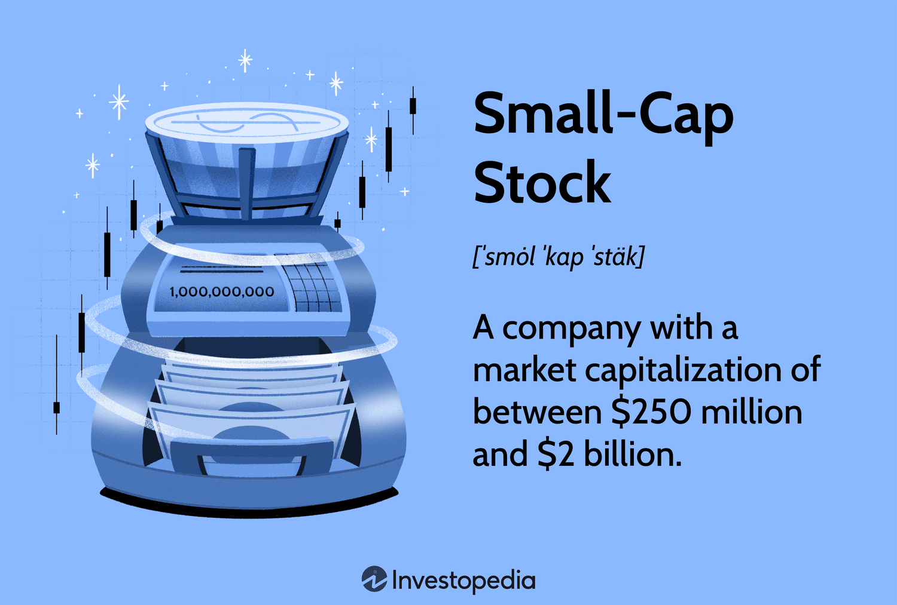

## Table of Contents

## What is small cap investing?

Small cap investing means putting money into companies that are smaller in size. These companies usually have a market value between $300 million and $2 billion. Because they are smaller, they can grow a lot faster than bigger companies. This means they might make more money for investors, but it also means they can be riskier. If the company doesn't do well, the stock price can go down a lot.

People who invest in small caps are often looking for big returns. They know that these companies might not be as well-known or stable as larger ones, but they believe in their potential to grow. Small cap stocks can be found in different industries, like technology or healthcare. Investors need to do a lot of research to find the best small cap stocks because they can be harder to predict than bigger companies.

## How are small cap companies defined?

Small cap companies are defined by their market capitalization, which is the total value of all their shares. In the stock market, a small cap company usually has a market value between $300 million and $2 billion. This makes them smaller than mid-cap and large-cap companies, which have bigger market values.

Because they are smaller, small cap companies often have more room to grow. They might be newer or in industries that are just starting to take off. This can make them exciting for investors who are looking for big returns. But, because they are smaller, they can also be riskier. Their stock prices can go up and down a lot more than those of bigger companies.

Investors need to do a lot of research when looking at small cap companies. They need to understand the company's business, its financial health, and the industry it's in. This can help them decide if the potential rewards are worth the risks. Small cap investing can be a good way to diversify a portfolio, but it's important to be careful and know what you're getting into.

## What are the potential benefits of investing in small cap stocks?

Investing in small cap stocks can offer big rewards. These companies are smaller, so they have more room to grow. If they do well, their stock prices can go up a lot more than those of bigger companies. This means investors might make more money. Small cap stocks can also help spread out risk in a portfolio. By adding them to a mix of other investments, you can balance out the ups and downs of the market.

Another benefit is that small cap companies can be more flexible. They can change and adapt quickly to new opportunities or challenges. This can help them grow faster than larger companies that might be slower to change. Also, small cap stocks can sometimes be overlooked by big investors, so there might be hidden gems that others haven't found yet. This can give smart investors a chance to find great deals before everyone else does.

## What are the risks associated with small cap investing?

Investing in small cap stocks can be risky. Because these companies are smaller, they might not have as much money or resources as bigger companies. This means they could have a harder time staying in business if things go wrong. If the economy takes a downturn, small cap companies might struggle more than larger ones. Their stock prices can go up and down a lot, which means investors could lose money quickly.

Another risk is that small cap companies might not have as much information available about them. Big companies have to share a lot of details about their business, but small companies might not. This makes it harder for investors to know if a small cap stock is a good investment. Without enough information, it's easier to make a bad choice. Also, small cap stocks can be harder to sell quickly if you need to get your money out. This is because fewer people might want to buy them, so there might not be a lot of buyers when you want to sell.

## How can a beginner start investing in small cap stocks?

If you're a beginner and want to start investing in small cap stocks, the first step is to learn as much as you can. Small cap stocks are from smaller companies, so they can be riskier but also have more room to grow. Start by reading [books](/wiki/algo-trading-books), watching videos, or taking online courses about investing. It's also a good idea to understand how the stock market works and what affects stock prices. Once you feel ready, you can open a brokerage account. Many online brokers let you start with a small amount of money, which is great for beginners.

After you have your brokerage account set up, you can start looking for small cap stocks to invest in. You'll want to do a lot of research on the companies you're interested in. Look at their financial reports, read news about them, and see what other investors are saying. It's important to understand the company's business, how it makes money, and what risks it faces. When you find a small cap stock you like, start with a small investment. This way, you can learn from your experience without risking too much money. Remember, investing in small cap stocks can be exciting, but it's also important to be patient and keep learning.

## What are some strategies for successful small cap investing?

One good strategy for successful small cap investing is to do a lot of research. Small cap companies are smaller, so they might not have as much information out there as bigger companies. You need to read their financial reports, look at what other investors are saying, and understand the industry they are in. This can help you find small cap stocks that have a good chance of growing. It's also smart to start with a small amount of money. This way, you can learn from your investments without risking too much.

Another strategy is to diversify your investments. Instead of putting all your money into one small cap stock, spread it out over several different ones. This can help lower your risk because if one stock goes down, the others might still do well. It's also important to be patient. Small cap stocks can take time to grow, so don't expect to get rich quickly. Keep an eye on your investments and be ready to sell if a stock isn't doing well, but also give it time to grow.

Lastly, consider using a strategy called dollar-cost averaging. This means you invest a fixed amount of money at regular times, like every month. This can help you buy more shares when prices are low and fewer when prices are high, which can lower your average cost over time. By following these strategies, you can increase your chances of success when investing in small cap stocks.

## How does small cap investing fit into a diversified investment portfolio?

Small cap investing can be a great way to add variety to your investment portfolio. Because small cap companies are smaller, they can grow a lot faster than bigger companies. This means they might make more money for you, but they can also be riskier. By adding small cap stocks to your mix of investments, you spread out your risk. If the stock market goes down, your small cap stocks might not go down as much as your other investments, or they might even go up. This helps balance out your portfolio and can lead to better overall returns.

To make small cap investing work well in your portfolio, it's important to not put all your money into small cap stocks. Instead, you should have a mix of different types of investments, like big company stocks, bonds, and maybe even some real estate. This way, if one part of your portfolio does badly, the other parts might do better. Small cap stocks can add excitement and potential for big gains, but they should be just one piece of your overall investment plan. By keeping your portfolio balanced, you can enjoy the benefits of small cap investing while managing the risks.

## What are the key financial metrics to look at when evaluating small cap stocks?

When you're looking at small cap stocks, it's important to check out their financial health. One key thing to look at is the company's revenue. This shows how much money the company is making from selling its products or services. If the revenue is growing, that's a good sign. Another important metric is the company's earnings, or profit. This tells you if the company is making more money than it spends. You can also look at the price-to-earnings (P/E) ratio, which compares the stock price to the company's earnings. A lower P/E ratio might mean the stock is a good deal, but you need to compare it to other companies in the same industry.

You should also pay attention to the company's debt. Too much debt can be risky, especially for small companies. Look at the debt-to-equity ratio to see how much debt the company has compared to its equity. A lower ratio is usually better. Another useful metric is the return on equity (ROE), which shows how well the company is using its money to make profits. A higher ROE is good because it means the company is efficient. Lastly, check the company's cash flow. Good cash flow means the company has enough money to pay its bills and invest in growth. By looking at these financial metrics, you can get a better idea of whether a small cap stock is a good investment.

## How do market conditions affect small cap stocks?

Market conditions can have a big impact on small cap stocks. When the economy is doing well, small cap stocks often do better than bigger companies. This is because they can grow faster and take advantage of new opportunities. But when the economy is not doing well, small cap stocks can be hit harder. They might not have as much money saved up to get through tough times, so their stock prices can go down a lot more than those of bigger companies.

Interest rates also play a big role. When interest rates are low, it's easier for small companies to borrow money to grow their business. This can help their stock prices go up. But when interest rates go up, borrowing money becomes more expensive, and small cap stocks might not do as well. Overall, small cap stocks can be more sensitive to changes in the market, so it's important for investors to keep an eye on economic conditions and adjust their investments accordingly.

## What role does sector analysis play in small cap investing?

Sector analysis is important in small cap investing because it helps you understand which industries are doing well and which ones might be struggling. Small cap companies are often in new or growing industries. By looking at the sector, you can see if there are good opportunities for these companies to grow. For example, if the technology sector is booming, small cap tech companies might have a lot of potential. On the other hand, if a sector is not doing well, it might be riskier to invest in small cap stocks in that industry.

When you do sector analysis, you also learn about trends that can affect small cap stocks. For instance, if there's a new law that helps the renewable energy sector, small cap companies in that field might benefit a lot. By understanding these trends, you can pick small cap stocks that are more likely to succeed. Sector analysis helps you make smarter choices and find the best small cap investments for your portfolio.

## How can an investor use technical analysis in small cap investing?

Technical analysis can help investors in small cap investing by looking at stock price charts and other data to find patterns. This can show when a small cap stock might be a good time to buy or sell. For example, if a stock's price is going up and it breaks through a certain level, that might be a sign that it will keep going up. Investors can use tools like moving averages, which smooth out price changes over time, to see if a stock is trending up or down. This can help them make better decisions about when to buy or sell their small cap stocks.

Another way to use technical analysis is by looking at trading [volume](/wiki/volume-trading-strategy). If a small cap stock has a lot of people buying and selling it, that can mean it's getting more attention and might be a good investment. Also, technical indicators like the Relative Strength Index (RSI) can show if a stock is overbought or oversold. If the RSI is high, it might be time to sell because the stock could go down soon. If it's low, it might be a good time to buy because the stock could go up. By using these tools, investors can get a better idea of what might happen with their small cap stocks and make smarter choices.

## What are advanced techniques for managing a small cap investment portfolio?

One advanced technique for managing a small cap investment portfolio is to use a strategy called rebalancing. This means checking your portfolio regularly and making changes to keep it balanced. Small cap stocks can go up and down a lot, so they might become a bigger or smaller part of your portfolio over time. By rebalancing, you sell some stocks that have gone up a lot and buy more of the ones that have gone down. This helps you keep your risk under control and can lead to better returns over time. Another technique is to use stop-loss orders. These are orders to sell a stock if it goes down to a certain price. This can help you limit your losses if a small cap stock suddenly drops a lot.

Another advanced technique is to use sector rotation. This means moving your money between different industries based on how the economy is doing. For example, if the economy is growing, you might put more money into small cap stocks in industries like technology or consumer goods. But if the economy is slowing down, you might shift your money to more stable industries like utilities or healthcare. By doing this, you can take advantage of the best opportunities in the market and protect your portfolio from downturns. It's also important to keep learning and staying up to date with market news and trends. This can help you make better decisions and find new small cap stocks to invest in.

## References & Further Reading

1. **Fama, E.F., & French, K.R. (1992). "The Cross-Section of Expected Stock Returns."**  
This seminal paper presents the Fama-French three-[factor](/wiki/factor-investing) model, which enhances the Capital Asset Pricing Model (CAPM) by introducing size and value factors. The model's emphasis on small-cap stocks' size factor highlights the importance of market capitalization in understanding stock returns. This work is fundamental for investors analyzing small-cap stock performance relative to market dynamics.

2. **Lopez de Prado, M. (2018). "Advances in Financial Machine Learning."**  
Lopez de Prado explores the intersection of [machine learning](/wiki/machine-learning) and finance, providing a comprehensive guide to applying advanced algorithmic techniques in trading. The book details methodologies for developing and implementing machine learning algorithms, particularly beneficial for small-cap stock strategies where traditional models might be inadequate. His discussion on the role of data quality and feature engineering is crucial for exploiting market inefficiencies with [algorithmic trading](/wiki/algorithmic-trading).

3. **Aronson, D. R. (2007). "Evidence-Based Technical Analysis: Applying the Scientific Method and Statistical Inference to Trading Signals."**  
Aronson approaches technical analysis with a rigorous scientific framework, emphasizing statistical validation of trading strategies. His evidence-based methodology is pivotal for traders employing algorithmic systems, particularly in volatile small-cap markets, where empirical validation can mitigate risks associated with speculative trades.

These readings provide a robust foundation for understanding and applying concepts of small-cap stock investing and algorithmic trading, enhancing investors' capacity to navigate complex financial landscapes.

