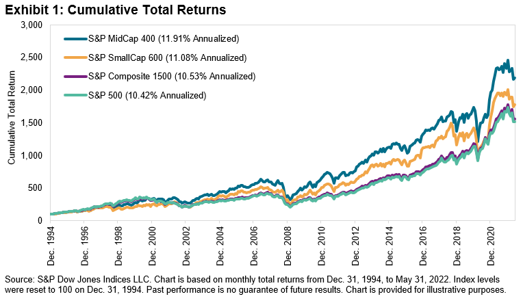

## Table of Contents

## What are small-cap stocks?

Small-cap stocks are shares of companies that have a relatively small market value, usually between $300 million and $2 billion. These companies are often younger and have more potential for growth compared to larger, more established companies. Because they are smaller, they might not be as well-known to the public and can be riskier investments.

Investing in small-cap stocks can be exciting because they have the potential to grow a lot. If a small company does well, its stock price can go up quickly. However, because they are smaller, they can also be more affected by economic changes and might not have as much money to weather tough times. This makes them riskier but can also lead to bigger rewards if you choose the right ones.

## What are large-cap stocks?

Large-cap stocks are shares of big companies that have a market value of $10 billion or more. These companies are usually well-known and have been around for a long time. Because they are big, they are often seen as safer investments. They might not grow as fast as smaller companies, but they are more stable and less likely to lose a lot of value quickly.

Investing in large-cap stocks can be a good choice if you want to keep your money safe while still making some profit. These companies often pay dividends, which means they give some of their profits back to shareholders. This can be a nice way to earn money without selling your stocks. However, because they are already big, their stock prices might not go up as quickly as those of smaller companies.

## How are market caps calculated?

Market cap, short for market capitalization, is how much a company is worth on the stock market. You find it by taking the total number of a company's shares and multiplying that by the current price of one share. So, if a company has 1 million shares and each share costs $50, the market cap would be $50 million.

This number can change every day because stock prices go up and down. When people talk about a company's size, they often use market cap to compare it to other companies. It's a quick way to see if a company is small, medium, or large. Small-cap companies are usually worth less than $2 billion, mid-cap companies are between $2 billion and $10 billion, and large-cap companies are over $10 billion.

## What are the typical characteristics of small-cap companies?

Small-cap companies are usually younger and smaller in size compared to big companies. They often have a market value between $300 million and $2 billion. Because they are smaller, they might not be as well-known and can be found in industries that are growing or changing quickly. These companies often have more room to grow because they are still figuring out their place in the market.

Investing in small-cap companies can be exciting but also risky. Since they are smaller, they might not have as much money to handle tough times, like a bad economy. This means their stock prices can go up and down a lot. But if a small-cap company does well, its stock price can grow a lot faster than a big company's. So, while they can be riskier, they also have the potential for bigger rewards if you pick the right ones.

## What are the typical characteristics of large-cap companies?

Large-cap companies are big and well-known businesses with a market value of $10 billion or more. They have been around for a long time and are usually leaders in their industries. Because they are so big, they are seen as safer investments. They have a lot of money and resources, which helps them handle tough times better than smaller companies.

Investing in large-cap companies can be a good choice if you want to keep your money safe while still making some profit. These companies often pay dividends, which means they give some of their profits back to shareholders. This can be a nice way to earn money without selling your stocks. However, because they are already big, their stock prices might not go up as quickly as those of smaller companies.

## What are the potential benefits of investing in small-cap stocks?

Investing in small-cap stocks can be exciting because they have a lot of room to grow. These companies are often younger and smaller, so if they do well, their stock prices can go up a lot faster than big companies. This means you could make more money if you pick the right small-cap stocks. They are usually found in industries that are growing or changing quickly, which can lead to big opportunities.

However, small-cap stocks can also be riskier. Because these companies are smaller, they might not have as much money to handle tough times, like a bad economy. This means their stock prices can go up and down a lot. But if you are willing to take on more risk, the potential rewards can be much bigger than with safer, larger companies.

## What are the potential benefits of investing in large-cap stocks?

Investing in large-cap stocks can be a good choice if you want to keep your money safe while still making some profit. These companies are big and well-known, with a market value of $10 billion or more. Because they are so big, they are seen as safer investments. They have a lot of money and resources, which helps them handle tough times better than smaller companies. This means their stock prices are usually more stable and less likely to lose a lot of value quickly.

Another benefit of large-cap stocks is that they often pay dividends. This means they give some of their profits back to shareholders, which can be a nice way to earn money without selling your stocks. While large-cap companies might not grow as fast as smaller ones, their stability and the potential for dividend income make them attractive for people who want a more predictable return on their investment.

## What are the risks associated with small-cap stocks?

Small-cap stocks can be risky because the companies are smaller and often younger. They might not have as much money to handle tough times, like a bad economy or unexpected problems. This means their stock prices can go up and down a lot more than big companies. If things go wrong, a small-cap company could lose a lot of value quickly, which can be scary for investors.

Another risk is that small-cap companies are often not as well-known or followed by analysts. This can make it harder to find good information about them. Because they are smaller, they might also have less power in their industry and can be pushed around by bigger companies. So, while there's a chance for big rewards, the risks are higher, and you need to be ready for the ups and downs.

## What are the risks associated with large-cap stocks?

Large-cap stocks are usually safer than small-cap stocks, but they still have risks. One risk is that big companies might not grow as fast as smaller ones. If the economy is doing well, a large-cap company might not see its stock price go up as much as a small company that is growing quickly. This means you might miss out on bigger gains if you only invest in large-cap stocks.

Another risk is that even big companies can have problems. They might make bad decisions, face tough competition, or have issues with their products or services. If something goes wrong, their stock price can still go down, even if it's not as likely to drop as much as a small-cap stock. So, while large-cap stocks are seen as safer, they are not completely risk-free.

## How do small-cap and large-cap stocks perform during different economic cycles?

Small-cap stocks often do well when the economy is growing. They can grow faster than big companies because they are smaller and have more room to expand. But when the economy is not doing well, small-cap stocks can be hit hard. They might not have enough money to handle tough times, so their stock prices can drop a lot. This makes them riskier during bad economic cycles.

Large-cap stocks are usually more stable during different economic cycles. They have a lot of money and resources, so they can handle tough times better than small companies. Their stock prices might not go up as much during good times, but they also don't drop as much during bad times. This makes them a safer choice if you want to keep your money safe during different economic cycles.

## What strategies can be used to diversify a portfolio with both small-cap and large-cap stocks?

One way to diversify your portfolio with both small-cap and large-cap stocks is to decide how much risk you want to take. Small-cap stocks can be risky but have the chance for big rewards, so you might want to put a smaller part of your money in them. Large-cap stocks are safer and can help keep your money stable, so you might want to put more of your money in them. A common strategy is to have a bigger part of your portfolio in large-cap stocks and a smaller part in small-cap stocks. This way, you can still try to grow your money with small-caps while keeping it safe with large-caps.

Another strategy is to spread your money across different industries. Both small-cap and large-cap companies can be in many different types of businesses, like technology, health care, or energy. By picking stocks from different industries, you can lower the risk that one bad thing happening in one industry will hurt your whole portfolio. For example, you might pick a few small-cap tech companies, a few large-cap health care companies, and some large-cap energy companies. This way, if the tech industry has a bad year, your health care and energy stocks might still do well.

## How can an investor use small-cap and large-cap stocks to achieve long-term financial goals?

An investor can use small-cap and large-cap stocks to achieve long-term financial goals by balancing growth and stability in their portfolio. Small-cap stocks can offer big growth opportunities because they are smaller and often in fast-growing industries. If you pick the right ones, they can increase a lot in value over time. But they are also riskier, so you might want to put a smaller part of your money in them. This way, you can aim for big gains while still being careful with your money.

On the other hand, large-cap stocks can help keep your money safe and provide steady growth. These big companies are usually more stable and less likely to lose a lot of value quickly. They also often pay dividends, which means you can get some money back from your investment without selling your stocks. By putting a bigger part of your money in large-cap stocks, you can protect your money while still growing it over time. A good strategy is to have a mix of both, so you can enjoy the growth potential of small-caps and the safety of large-caps to reach your long-term financial goals.

## References & Further Reading

[1]: ["Common Stocks and Uncommon Profits and Other Writings"](https://www.amazon.com/Common-Stocks-Uncommon-Profits-Writings/dp/0471445509) by Philip A. Fisher

[2]: ["The Little Book of Common Sense Investing: The Only Way to Guarantee Your Fair Share of Stock Market Returns"](https://www.amazon.com/Little-Book-Common-Sense-Investing/dp/1119404509) by John C. Bogle

[3]: ["Algorithmic Trading: Winning Strategies and Their Rationale"](https://www.amazon.com/Algorithmic-Trading-Winning-Strategies-Rationale-ebook/dp/B00CY5HC0U) by Ernie Chan

[4]: ["Market Microstructure in Practice"](https://www.amazon.com/Market-Microstructure-Practice-Charles-Albert-Lehalle/dp/9813231122) by Charles-Albert Lehalle and Sophie Laruelle

[5]: ["Capital Ideas: The Improbable Origins of Modern Wall Street"](https://www.amazon.com/Capital-Ideas-Improbable-Origins-Modern/dp/0471731749) by Peter L. Bernstein

[6]: ["The Intelligent Investor: The Definitive Book on Value Investing"](https://www.amazon.com/Intelligent-Investor-Third-Definitive-Investing/dp/0063423537) by Benjamin Graham