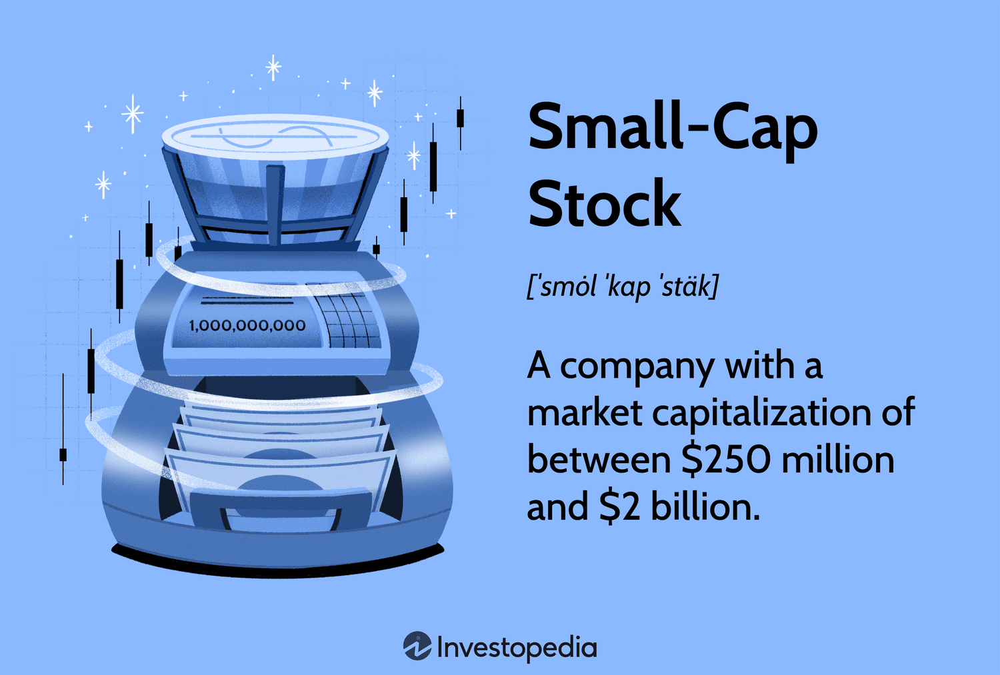

## Table of Contents

## What are small-cap stocks?

Small-cap stocks are shares of companies that have a relatively small market value, usually between $300 million and $2 billion. These companies are often younger and have more room to grow compared to bigger companies. Because they are smaller, they might not be as well-known as large companies, and their stocks can be riskier to invest in.

Investing in small-cap stocks can be exciting because they have the potential to grow a lot. If a small company does well, its stock price can go up quickly. However, because they are smaller, they can also be more affected by economic changes or problems within the company. This means that while you might make more money, you could also lose more if things don't go well.

## How are small-cap stocks defined in terms of market capitalization?

Small-cap stocks are shares in companies that have a market value, or market capitalization, between $300 million and $2 billion. Market capitalization is figured out by multiplying the total number of a company's shares by the current price of one share. This range helps investors know which companies are considered small in the stock market.

These companies are usually smaller and might be newer than big companies. Because they are smaller, they can grow a lot if they do well. But, they can also be riskier because they might not have as much money or be as stable as bigger companies. So, while small-cap stocks can offer big rewards, they also come with more risk.

## What are the potential benefits of investing in small-cap stocks?

Investing in small-cap stocks can offer big rewards. These companies are often smaller and newer, which means they have a lot of room to grow. If a small company does well, its stock price can go up quickly. This means that if you invest in a small-cap stock at the right time, you could see your investment grow a lot more than if you invested in a bigger, more established company.

However, small-cap stocks also come with more risk. Because these companies are smaller, they might not have as much money or be as stable as bigger companies. They can be more affected by economic changes or problems within the company. This means that while you might make more money, you could also lose more if things don't go well. So, it's important to think carefully about the risks and rewards before investing in small-cap stocks.

## What are the risks associated with small-cap stock investments?

Investing in small-cap stocks can be risky. These companies are smaller and often newer, so they might not have as much money or be as stable as bigger companies. This means they can be more affected by economic changes or problems within the company. If something goes wrong, like the company not making enough money or facing competition, the stock price can drop a lot.

Another risk is that small-cap stocks can be harder to sell quickly. They might not be traded as often as bigger stocks, so if you need to sell your shares, it might take longer or you might not get as good a price. This is called lower liquidity, and it can make it harder to get your money out when you need it.

Overall, while small-cap stocks can offer big rewards if the company does well, they also come with more risk. It's important to think carefully about these risks and maybe not put all your money into small-cap stocks. Spreading your investments across different types of stocks can help manage the risk.

## How do small-cap stocks typically perform compared to large-cap stocks?

Small-cap stocks can grow a lot more than large-cap stocks. They are shares in smaller companies that have more room to grow. If a small company does well, its stock price can go up quickly. This means that if you invest in a small-cap stock at the right time, you could see your investment grow a lot more than if you invested in a bigger, more established company. Over time, small-cap stocks have often given investors bigger returns than large-cap stocks.

But, small-cap stocks are also riskier. They can be more affected by economic changes or problems within the company. If something goes wrong, like the company not making enough money or facing competition, the stock price can drop a lot. Also, small-cap stocks can be harder to sell quickly. They might not be traded as often as bigger stocks, so if you need to sell your shares, it might take longer or you might not get as good a price. This means that while small-cap stocks can offer big rewards, they also come with more risk than large-cap stocks.

## What sectors are most common among small-cap companies?

Small-cap companies are often found in sectors like technology, healthcare, and consumer goods. These are areas where new companies are starting up all the time. In technology, small companies might be working on new software or gadgets. In healthcare, they could be developing new medicines or medical devices. And in consumer goods, small companies might be making new products that people want to buy.

These sectors are popular for small-cap companies because they offer a lot of room for growth. A small tech company could come up with a new app that becomes very popular, or a healthcare company could discover a new treatment that changes how doctors treat patients. However, because these sectors are always changing, small companies in them can also be risky. If their new product or idea doesn't work out, it can be hard for them to keep going.

## How can an investor identify promising small-cap stocks?

To find good small-cap stocks, an investor should look at the company's financial health. This means checking if the company is making money and not spending too much. You can do this by looking at things like the company's profits, how much debt it has, and how fast it's growing. Another important thing is to see if the company has a good plan for the future. If they have new products or ways to make more money, that can be a sign of a promising small-cap stock.

It's also helpful to pay attention to what other people think about the company. Reading reports from experts or listening to what other investors say can give you more information. Sometimes, small companies are not well-known, so finding out what people in the industry think can help you decide if the stock is worth buying. Remember, investing in small-cap stocks can be risky, so it's good to spread your money across different stocks to lower the risk.

## What role do small-cap stocks play in a diversified investment portfolio?

Small-cap stocks can be a good part of a diversified investment portfolio. They can help grow your money faster than bigger stocks because small companies have more room to grow. If a small company does well, its stock price can go up quickly. This means that if you invest in a small-cap stock at the right time, you could see your investment grow a lot more than if you invested in a bigger, more established company.

However, small-cap stocks are also riskier. They can be more affected by economic changes or problems within the company. If something goes wrong, like the company not making enough money or facing competition, the stock price can drop a lot. So, while small-cap stocks can offer big rewards, they also come with more risk than large-cap stocks. By including small-cap stocks in your portfolio, you can balance the risk and potential reward, making your overall investments stronger.

## What are some strategies for investing in small-cap stocks?

One good way to invest in small-cap stocks is to do a lot of research. Look at the company's financial health by checking if it's making money and not spending too much. You can do this by looking at the company's profits, how much debt it has, and how fast it's growing. It's also important to see if the company has a good plan for the future. If they have new products or ways to make more money, that can be a sign of a promising small-cap stock. Reading reports from experts or listening to what other investors say can give you more information. Sometimes, small companies are not well-known, so finding out what people in the industry think can help you decide if the stock is worth buying.

Another strategy is to spread your money across different small-cap stocks. This is called diversification, and it can help lower the risk. If one small-cap stock doesn't do well, you won't lose all your money because you have other stocks that might do better. You can also look at small-cap mutual funds or exchange-traded funds (ETFs). These funds invest in many small-cap stocks, so you get a mix of different companies without having to pick them all yourself. This can be a good way to get the potential rewards of small-cap stocks without as much risk.

It's also smart to think about how much risk you're okay with. Small-cap stocks can be very up and down, so you need to be ready for that. If you're not comfortable with a lot of risk, you might want to put less money into small-cap stocks and more into bigger, more stable companies. But if you're okay with taking more risk for the chance of bigger rewards, then small-cap stocks might be a good fit for your portfolio.

## How does liquidity affect investing in small-cap stocks?

Liquidity is how easy it is to buy or sell something without changing its price too much. When it comes to small-cap stocks, they usually have less liquidity than bigger stocks. This means that if you want to sell your small-cap stocks, it might take longer to find someone to buy them. Also, you might not get as good a price as you hoped because there are fewer people trading these stocks. This can be a problem if you need your money quickly or if the stock price goes down a lot.

Because of this lower liquidity, investing in small-cap stocks can be riskier. If the market changes suddenly, it can be harder to get out of your investment without losing money. But, if you are okay with holding onto your investment for a longer time, this might not be a big problem. You just need to think about how long you can wait before you need to use the money you've invested.

## What are the tax implications of trading small-cap stocks?

When you trade small-cap stocks, you need to think about taxes. If you make money by selling your stocks for more than you paid for them, you have to pay capital gains tax. There are two types of capital gains: short-term and long-term. Short-term capital gains are when you sell your stocks within a year of buying them. These are taxed at your regular income tax rate, which can be high. Long-term capital gains are when you hold your stocks for more than a year before selling them. These are usually taxed at a lower rate, which can save you money.

Another thing to think about is if you get dividends from your small-cap stocks. Dividends are payments companies sometimes give to their shareholders. You have to pay taxes on these dividends too. The tax rate on dividends can be different depending on how much money you make and what kind of dividends they are. It's a good idea to talk to a tax professional to understand how all these taxes work and how they might affect your investment decisions.

## How have small-cap stocks historically performed during different economic cycles?

Small-cap stocks have gone up and down a lot during different times in the economy. When the economy is doing well and growing, small-cap stocks often do better than bigger stocks. This is because small companies can grow faster and make more money when things are good. But when the economy is not doing well, like during a recession, small-cap stocks can lose more value than bigger stocks. This is because small companies might not have as much money saved up to handle tough times, so their stock prices can drop a lot.

During times when the economy is recovering from a recession, small-cap stocks can start to do really well again. This is because they can grow quickly as the economy gets better. But they can also be very up and down during these times. So, while small-cap stocks can give you big rewards if you invest at the right time, they can also be riskier than bigger stocks because they are more affected by what's happening in the economy.

## References & Further Reading

[1]: Fama, E.F., & French, K.R. (1992). ["The Cross-Section of Expected Stock Returns."](https://onlinelibrary.wiley.com/doi/full/10.1111/j.1540-6261.1992.tb04398.x) The Journal of Finance, 47(2), 427–465.

[2]: Hendershott, T., & Riordan, R. (2013). ["Algorithmic Trading and the Market for Liquidity."](https://papers.ssrn.com/sol3/papers.cfm?abstract_id=2001912) Journal of Financial and Quantitative Analysis, 48(4), 1001-1024.

[3]: ["Investments: Analysis and Management"](https://books.google.com/books/about/Investments.html?id=ad7BDwAAQBAJ) by Charles Parker Jones

[4]: Lopez de Prado, M. (2018). ["Advances in Financial Machine Learning."](https://www.amazon.com/Advances-Financial-Machine-Learning-Marcos/dp/1119482089) Wiley.

[5]: Aronson, D. R. (2007). ["Evidence-Based Technical Analysis: Applying the Scientific Method and Statistical Inference to Trading Signals."](https://www.amazon.com/Evidence-Based-Technical-Analysis-Scientific-Statistical/dp/0470008741) Wiley.

[6]: Jansen, S. (2020). ["Machine Learning for Algorithmic Trading: Predictive Models to Extract Signals from Market and Alternative Data for Systematic Trading Strategies with Python."](https://www.amazon.com/Machine-Learning-Algorithmic-Trading-alternative/dp/1839217715) Packt Publishing.

[7]: Chan, E. (2009). ["Quantitative Trading: How to Build Your Own Algorithmic Trading Business."](https://github.com/ftvision/quant_trading_echan_book) Wiley.