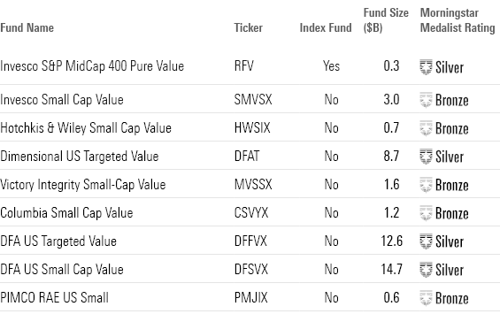

## Table of Contents

## What is a small-cap value index fund?

A small-cap value index fund is a type of investment fund that focuses on small companies that are considered undervalued. These companies have a smaller market value, which means they are not as big as well-known companies like Apple or Microsoft. The fund tracks an index, which is a list of these small companies, and aims to match its performance. By investing in a small-cap value index fund, you are betting that these smaller, undervalued companies will grow and become more valuable over time.

These funds are popular among investors who want to diversify their portfolios and potentially earn higher returns. Because small companies can grow quickly, they might offer more growth potential than larger companies. However, they also come with more risk because smaller companies can be more affected by economic changes. By choosing a small-cap value index fund, you spread your investment across many small companies, which can help reduce the risk compared to investing in just one or a few small companies.

## How do small-cap value index funds differ from other types of funds?

Small-cap value index funds focus on small companies that are seen as undervalued. These companies have a smaller market value than big companies like Apple or Microsoft. The fund follows an index, which is a list of these small companies, and tries to do as well as the index. This kind of fund is good for people who want to spread their money across many small companies and hope these companies will grow and become more valuable. But, because these are small companies, they can be riskier because they might be more affected by changes in the economy.

Other types of funds can focus on different things. For example, large-cap funds invest in bigger, well-known companies. Growth funds aim to invest in companies that are expected to grow quickly, while value funds look for companies that are thought to be priced lower than they should be. Index funds, in general, try to match the performance of a specific index, like the S&P 500, which includes a mix of big and small companies. So, small-cap value index funds are unique because they combine the focus on small companies and undervalued stocks, which can be a good choice for investors looking for potential high growth with a specific type of risk.

## What are the benefits of investing in small-cap value index funds?

Investing in small-cap value index funds can offer good chances for your money to grow. These funds focus on small companies that are seen as undervalued, meaning they might be priced lower than they should be. If these companies do well and become more valuable, your investment could go up a lot. Since the fund includes many small companies, you spread your money across them, which can help you avoid losing too much if one company does badly.

Another benefit is that these funds can help you diversify your investments. By putting your money in small-cap value index funds, you are not just investing in big, well-known companies. This can be a smart way to balance your investment portfolio. However, remember that investing in small companies can be riskier because they can be more affected by changes in the economy. But, if you are okay with a bit more risk, small-cap value index funds can be a good way to possibly earn more over time.

## What are the risks associated with small-cap value index funds?

Small-cap value index funds can be riskier than other types of funds. This is because they invest in small companies, which can be more affected by changes in the economy. If the economy goes down, these small companies might have a harder time staying in business, which could mean your investment loses value.

Another risk is that these funds focus on companies that are seen as undervalued. This means the fund is betting that these companies will become more valuable over time. But, if the market doesn't agree with this bet, the value of the fund could go down. It's important to understand that while there is a chance for high growth, there's also a chance that the companies might not do as well as hoped.

Lastly, small-cap value index funds can be less liquid than funds that invest in bigger companies. This means it might be harder to buy or sell shares of the fund quickly. If a lot of people want to sell their shares at the same time, the price of the fund could drop more than expected. So, it's good to think about these risks before deciding to invest in small-cap value index funds.

## How can someone start investing in small-cap value index funds in the United States?

To start investing in small-cap value index funds in the United States, you first need to open an investment account. You can do this through a brokerage firm or an online investment platform. Some popular options include Vanguard, Fidelity, and Charles Schwab. Once you have your account set up, you'll need to add money to it. You can usually do this by linking your bank account and transferring funds.

After your account is funded, you can search for small-cap value index funds. These funds often have names that include terms like "small-cap," "value," and "index." Once you find a fund you like, you can place an order to buy shares. It's a good idea to start with a small amount if you're new to investing, so you can learn how it works without risking too much money. Remember to keep an eye on your investments and think about how they fit into your overall financial goals.

## What are some of the top small-cap value index funds available in the U.S. market?

Some of the top small-cap value index funds available in the U.S. market include the Vanguard Small-Cap Value Index Fund (VSIAX) and the iShares S&P Small-Cap 600 Value [ETF](/wiki/etf-trading-strategies) (IJS). The Vanguard Small-Cap Value Index Fund tracks the CRSP US Small Cap Value Index, which focuses on small companies that are seen as undervalued. This fund is known for its low expense ratio, which means you pay less in fees, and it's a good choice for long-term investors looking to grow their money over time.

Another popular option is the iShares S&P Small-Cap 600 Value ETF, which follows the S&P SmallCap 600 Value Index. This ETF also focuses on small companies that are considered undervalued and offers a way to invest in a broad range of these companies. It's a bit different from the Vanguard fund because it's an ETF, which means you can buy and sell shares throughout the trading day, like stocks. Both of these funds can be good choices if you're looking to invest in small-cap value stocks and want to spread your money across many small companies.

## How do fees and expenses impact the returns of small-cap value index funds?

Fees and expenses can make a big difference in how much money you make from small-cap value index funds. These costs are taken out of your investment, so the more you pay in fees, the less money you have left to grow. For example, if a fund has a high expense ratio, which is the yearly cost of owning the fund, it can eat into your returns over time. Even small differences in fees can add up over many years, making it important to look for funds with lower expense ratios.

Let's say you invest in a small-cap value index fund with a high fee compared to another one with a low fee. Over time, the fund with the lower fee will likely give you more money because you're keeping more of your investment working for you. This is why it's a good idea to check the fees before you choose a fund. Funds like the Vanguard Small-Cap Value Index Fund are popular because they have low fees, which can help you keep more of your returns.

## What is the historical performance of small-cap value index funds compared to other investment options?

Small-cap value index funds have often done well over the long term, but they can be up and down more than other types of investments. Over many years, these funds have sometimes beaten bigger, well-known companies in terms of growth. This is because small companies can grow quickly if they do well. But, they can also lose value faster if things go wrong. For example, from 1975 to 2020, small-cap value stocks in the U.S. had an average yearly return of about 14%, which is higher than the S&P 500's average return of around 11% over the same time. This shows that over long periods, small-cap value funds can offer good chances for growth, but they come with more risk.

When you compare small-cap value index funds to other options like large-cap funds or bond funds, you see different patterns. Large-cap funds, which invest in bigger companies, tend to be more stable but might not grow as fast as small-cap funds. Bond funds, which focus on loans to governments or companies, are usually safer but offer lower returns. Over shorter times, like a few years, small-cap value funds can do better or worse than these other options. But, over many years, they often provide higher returns, even though they can be riskier. So, if you're okay with taking on more risk for the chance of higher growth, small-cap value index funds could be a good choice for part of your investment plan.

## How does market capitalization and value investing criteria affect the selection of stocks in small-cap value index funds?

Market capitalization, or market cap, is how much a company is worth based on its stock price and the number of its shares. In small-cap value index funds, the focus is on small companies, which means companies with a market cap usually between $300 million and $2 billion. These funds pick stocks from this range because small companies can grow a lot if they do well. The idea is to find small companies that are not as well-known but have good potential for growth.

Value investing criteria are used to find companies that are thought to be priced lower than they should be. This means looking at things like the price-to-earnings ratio, which compares a company's stock price to its earnings, or the price-to-book ratio, which compares the stock price to the company's net assets. Small-cap value index funds look for small companies that have these low ratios, suggesting they might be undervalued. By focusing on these criteria, the fund aims to buy stocks that could become more valuable as the market recognizes their true worth.

## What are the tax implications of investing in small-cap value index funds?

Investing in small-cap value index funds can have tax implications that you should know about. When you own these funds, you might have to pay taxes on any money you make from them. If the fund makes money by selling stocks at a higher price than it bought them, it could pass those profits to you as capital gains. These gains are usually taxed, and the rate depends on how long you held the investment. If you held it for more than a year, you might pay a lower tax rate than if you held it for less than a year.

Another thing to think about is dividends. If the companies in the fund pay out dividends, the fund might give some of that money to you. Dividends can be taxed too, but the tax rate can be different from the rate on capital gains. It's a good idea to talk to a tax advisor to understand how these taxes might affect your investment and to see if there are ways to lower what you owe.

## How do economic cycles influence the performance of small-cap value index funds?

Economic cycles can have a big impact on how small-cap value index funds do. When the economy is doing well and growing, small companies often do better because they can grow quickly. This means small-cap value index funds might go up a lot during these good times. But, when the economy is not doing well, like during a recession, small companies can have a harder time. They might not have as much money saved up to handle tough times, so their stock prices can drop more than bigger companies. This can make small-cap value index funds lose value during bad economic times.

Because of this, it's important to think about where we are in the economic cycle when you're looking at small-cap value index funds. If you think the economy is going to get better, these funds might be a good choice because they could grow a lot. But, if you think the economy might get worse, you might want to be careful because these funds can be riskier. Keeping an eye on the economy can help you decide when it might be a good time to invest more in small-cap value index funds or when to be more careful.

## What advanced strategies can be used to optimize a portfolio that includes small-cap value index funds?

One advanced strategy to optimize a portfolio with small-cap value index funds is to use dollar-cost averaging. This means you invest a fixed amount of money into the fund at regular times, like every month. By doing this, you buy more shares when the price is low and fewer when it's high, which can help you get a better average price over time. Another part of this strategy is to rebalance your portfolio. This means you check your investments every so often and adjust them to keep the right mix of small-cap value funds and other investments. If small-cap value funds have grown a lot, you might sell some to buy other types of investments to keep your portfolio balanced.

Another strategy is to use tax-efficient investing. Since small-cap value index funds can generate capital gains and dividends, it's smart to think about how to lower your taxes. One way to do this is by holding these funds in tax-advantaged accounts like an IRA or a 401(k). This can help you keep more of your returns because you won't have to pay taxes on the gains and dividends right away. Also, you can use tax-loss harvesting, which means selling investments that have lost value to offset gains from other investments. This can help lower your tax bill and make your portfolio more efficient.

Lastly, consider using asset allocation to manage risk and growth. You can mix small-cap value index funds with other types of investments, like large-cap stocks, bonds, or international funds. This helps spread out your risk because different types of investments can do well at different times. By adjusting how much you invest in each type based on your goals and how much risk you're okay with, you can make your portfolio work better for you. Keeping an eye on economic cycles and adjusting your investments accordingly can also help you take advantage of good times and protect your money during bad times.

## What is the conclusion?

Small-cap value funds, U.S. index funds, and [algorithmic trading](/wiki/algorithmic-trading) each bring unique advantages to the investment landscape. These elements, when integrated judiciously, form a progressive approach that synthesizes conventional stock market strategies with cutting-edge technology. Small-cap value funds appeal to investors seeking high growth potential through lesser-known, undervalued companies. U.S. index funds offer stability and market-wide exposure at a reduced cost, appealing to risk-averse investors.

Algorithmic trading introduces efficiency and precision, minimizing emotional trading errors and allowing for real-time adjustments in response to market shifts. By leveraging these strategies, investors can build diversified portfolios that optimally balance risk and reward dynamics. Portfolio optimization aims at finding the best investment return for a specific risk level, often modeled by the mean-variance optimization approach, where the objective is to maximize the expected return $(E[R])$ for a given level of risk $(σ)$: 

$$
\text{Maximize} \quad E[R] - \lambda \cdot \sigma^2
$$

Here, $\lambda$ is the risk aversion parameter reflecting investor's willingness to take on risk.

Before committing to investment strategies involving small-cap value funds, U.S. index funds, or algorithmic trading, investors should evaluate their financial goals and consider their risk tolerance and preferred balance between growth and stability. This introspection is essential because each investment type carries distinct risk-reward profiles.

As the financial markets continue to evolve, being well-informed and adaptable is crucial for successful investing. Regularly reviewing investment strategies and staying abreast of technological and economic changes can help investors make sound decisions. By doing so, investors can position themselves to not only meet their financial objectives but also capitalize on the dynamic nature of the investment world.

## References & Further Reading

[1]: Bogle, J. C. (2003). ["Common Sense on Mutual Funds: New Imperatives for the Intelligent Investor"](https://www.amazon.com/Common-Sense-Mutual-Funds-Imperatives/dp/0471392286). Wiley.

[2]: French, K. R., & Fama, E. F. (1992). ["The Cross-Section of Expected Stock Returns."](https://onlinelibrary.wiley.com/doi/full/10.1111/j.1540-6261.1992.tb04398.x) The Journal of Finance, 47(2), 427-465.

[3]: Lopez de Prado, M. (2018). ["Advances in Financial Machine Learning."](https://www.amazon.com/Advances-Financial-Machine-Learning-Marcos/dp/1119482089) Wiley.

[4]: Chan, E. P. (2009). ["Quantitative Trading: How to Build Your Own Algorithmic Trading Business."](https://github.com/ftvision/quant_trading_echan_book) Wiley.

[5]: Jansen, S. (2020). ["Machine Learning for Algorithmic Trading."](https://github.com/stefan-jansen/machine-learning-for-trading) Packt Publishing.