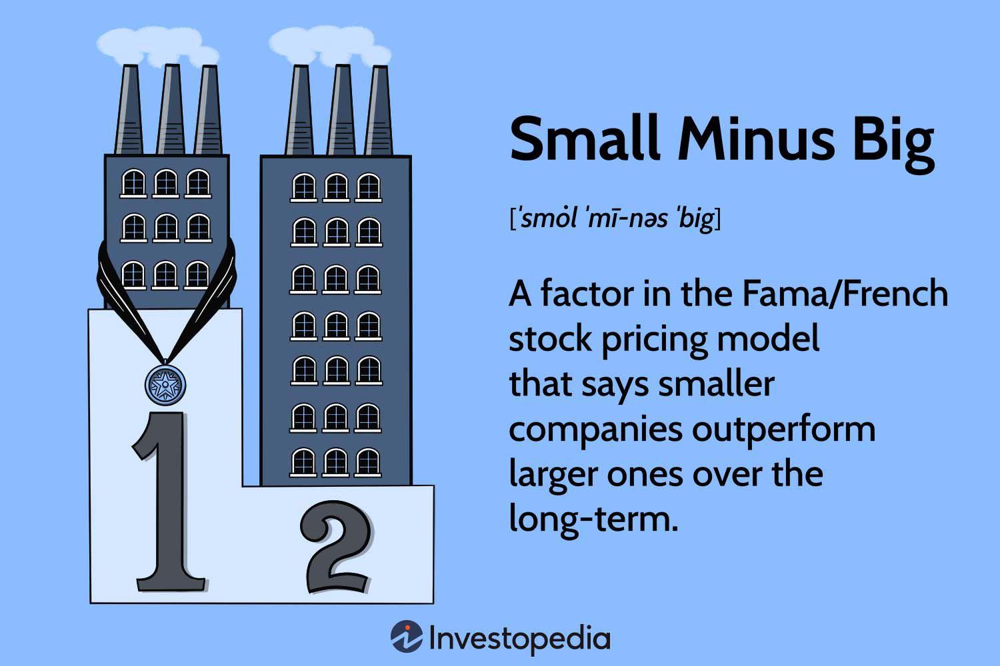

## Table of Contents

## What is the Fama-French model?

The Fama-French model is a way to understand how stocks perform in the market. It was created by Eugene Fama and Kenneth French. This model says that a stock's return depends on three main things: the overall market, the size of the company, and the company's value. The model helps investors see why some stocks do better than others. It's different from older models because it adds the size and value factors, which were not considered before.

The first factor in the Fama-French model is the market. This means that if the whole market goes up, most stocks will go up too. The second factor is the size of the company. Smaller companies often have higher returns than bigger ones. The third factor is the company's value. Companies that are seen as good value, often because their stock price is low compared to their earnings, tend to do better. By looking at these three things, the Fama-French model helps investors make smarter choices about which stocks to buy.

## What does 'Small Minus Big' (SMB) represent in the Fama-French model?

In the Fama-French model, 'Small Minus Big' or SMB represents the difference in returns between small companies and big companies. It's one of the three factors used in the model to explain why some stocks perform better than others. The idea is that, over time, smaller companies tend to have higher returns than larger ones. This is why the model includes SMB as a factor.

SMB is calculated by taking the average return of a group of small company stocks and subtracting the average return of a group of big company stocks. If the result is positive, it means that small companies did better than big companies during that period. If it's negative, it means big companies did better. By including SMB, the Fama-French model helps investors understand how the size of a company can affect its stock's performance.

## How is SMB calculated in the Fama-French model?

In the Fama-French model, SMB stands for 'Small Minus Big.' It's a way to see how small companies do compared to big companies. To calculate SMB, you first need to split all the companies into two groups: small and big. Small companies are usually those with lower total market value, while big companies have a higher total market value. Then, you find the average return of all the small company stocks and the average return of all the big company stocks.

Next, you subtract the average return of the big company stocks from the average return of the small company stocks. This gives you the SMB value. If SMB is a positive number, it means small companies did better than big companies during that time. If it's a negative number, it means big companies did better. By looking at SMB, investors can see if the size of a company makes a difference in how well its stock does.

## Why is SMB important in understanding stock returns?

SMB, or Small Minus Big, is important because it helps investors see if smaller companies do better than bigger ones in the stock market. In the Fama-French model, SMB is one of the three factors that explain why some stocks perform better than others. By looking at SMB, investors can understand how the size of a company affects its stock's performance. This is useful because it shows that smaller companies often have higher returns, even though they might be riskier.

Understanding SMB can help investors make smarter choices about which stocks to buy. If SMB is positive, it means small companies are doing better than big ones, so investors might want to focus on small company stocks. On the other hand, if SMB is negative, big companies are doing better, and investors might want to look at those instead. By considering SMB, investors can better predict how different stocks might perform in the future based on company size.

## What are the differences between small-cap and large-cap stocks in the context of SMB?

Small-cap and large-cap stocks are different in a few important ways when we talk about SMB, which stands for Small Minus Big. Small-cap stocks are from smaller companies, usually with a lower total market value. These companies are often newer or in industries that are growing fast. Because they are smaller, they can grow a lot more than big companies, but they can also be riskier. In the Fama-French model, small-cap stocks are the ones that make up the 'Small' part of SMB. If small-cap stocks do better than large-cap stocks, SMB will be positive, showing that smaller companies are doing well.

Large-cap stocks, on the other hand, come from bigger companies with a higher total market value. These companies are usually more stable and have been around for a long time. They might not grow as fast as small companies, but they are often seen as safer investments. In the Fama-French model, large-cap stocks make up the 'Big' part of SMB. If large-cap stocks do better than small-cap stocks, SMB will be negative, showing that bigger companies are doing well. By looking at SMB, investors can see how the size of a company affects its stock's performance and make better choices about which stocks to buy.

## Can you explain how SMB affects portfolio construction?

SMB, which stands for Small Minus Big, can help investors decide how to build their portfolios. If SMB is positive, it means small companies are doing better than big ones. This might make investors want to add more small-cap stocks to their portfolios. They think these smaller companies could grow a lot and make them more money. But, small companies can also be riskier, so investors need to be careful and think about how much risk they want to take.

On the other hand, if SMB is negative, it means big companies are doing better than small ones. This might make investors want to put more money into large-cap stocks. Big companies are often more stable and might be safer to invest in. By looking at SMB, investors can adjust their portfolios to have more small-cap or large-cap stocks, depending on what's doing better. This helps them try to get the best returns while managing their risk.

## What are some empirical findings related to SMB in different markets?

Studies have shown that SMB can be different in various markets around the world. In the U.S., research by Fama and French found that small companies often do better than big ones over time. This means that SMB is usually positive in the U.S. market. However, the difference in returns between small and big companies can change a lot depending on the time period and economic conditions. For example, during times of economic growth, small companies might do even better because they can grow quickly. But during tough times, like a recession, big companies might do better because they are more stable.

In other countries, the results can be different. In some emerging markets, like those in Asia or Latin America, the SMB effect can be even stronger than in the U.S. This might be because small companies in these markets have more room to grow. But in some developed markets in Europe, the SMB effect might be weaker or even negative at times. This could be because big companies in these markets are very stable and have strong global operations. Overall, while SMB can help explain stock returns, it's important to look at each market's unique conditions and not just rely on what happens in the U.S.

## How does SMB interact with other factors in the Fama-French model, such as HML (High Minus Low)?

In the Fama-French model, SMB (Small Minus Big) and HML (High Minus Low) work together to explain why stocks perform the way they do. SMB looks at the difference between small and big companies, while HML looks at the difference between companies that are seen as good value (high book-to-market ratio) and those that are not (low book-to-market ratio). When you use both factors together, you can see how a stock's performance is affected by both the size of the company and its value. For example, a small company that is also seen as a good value might do even better than a big company that is seen as a good value.

These two factors can sometimes work together or against each other. If SMB is positive and HML is also positive, it means small companies and good value companies are doing well. This might make investors want to buy stocks from small companies that are also seen as good value. But if SMB is negative and HML is positive, it means big companies are doing better than small ones, but good value companies are still doing well. In this case, investors might look for big companies that are seen as good value. By looking at both SMB and HML, investors can get a better picture of what's happening in the market and make smarter choices about which stocks to buy.

## What are the criticisms or limitations of using SMB as a factor in asset pricing models?

Some people think that using SMB in asset pricing models has problems. One big issue is that the SMB effect can change a lot over time. It might work well in some years but not in others. This makes it hard for investors to rely on SMB to make money. Also, SMB might not work the same way in all countries. What works in the U.S. might not work in other places. This means that investors need to be careful about using SMB in different markets.

Another problem is that small companies can be riskier than big ones. When SMB is positive, it might just be because small companies are taking more risks, not because they are better investments. This makes it hard to know if SMB is really helping investors make smart choices or if it's just showing them riskier stocks. Plus, some researchers think that other things, like how easy it is to buy and sell a stock, might affect SMB too. So, while SMB can be useful, it's not perfect and investors need to think about these limitations when using it.

## How has the performance of SMB varied over different economic cycles?

The performance of SMB, or Small Minus Big, changes a lot during different times in the economy. When the economy is growing and doing well, small companies often do better than big ones. This is because small companies can grow a lot faster during good times. They can take advantage of new opportunities and make more money. So, during these times, SMB is usually positive, meaning small companies are beating big companies.

But when the economy is not doing well, like during a recession, SMB can be negative. Big companies are often more stable and can handle tough times better than small ones. Small companies might struggle more because they don't have as much money saved up or as many resources. So, during bad economic times, big companies might do better, making SMB negative. This shows that the performance of SMB depends a lot on what's happening in the economy.

## What are the implications of SMB for investment strategies and risk management?

SMB, or Small Minus Big, can help investors decide what to do with their money. If SMB is positive, it means small companies are doing better than big ones. This might make investors want to buy more stocks from small companies. They think these small companies could grow a lot and make them more money. But, small companies can also be riskier. So, investors need to think about how much risk they want to take. They might decide to put some money in small companies but keep most of it in safer, big company stocks to balance things out.

When SMB is negative, it means big companies are doing better than small ones. This might make investors want to put more money into big company stocks. Big companies are often more stable and might be safer to invest in. By looking at SMB, investors can change their investment strategies to focus on either small or big companies, depending on what's doing better. This helps them try to get the best returns while also managing their risk. For example, during good economic times, they might add more small company stocks to their portfolio, but during tough times, they might stick with big company stocks to stay safer.

## How can advanced statistical techniques be used to refine the SMB factor in the Fama-French model?

Advanced statistical techniques can help make the SMB factor in the Fama-French model better. One way is by using something called regression analysis. This helps find how much the size of a company really affects its stock's performance. By looking at lots of data over a long time, regression can show if SMB is still important or if other things are affecting stock returns too. Another way is through machine learning. This can look at huge amounts of data and find patterns that might be hard for people to see. Machine learning can help make SMB more accurate by figuring out which small companies will do better than big ones.

These techniques can also help deal with some problems of SMB. For example, they can see how SMB changes over time and in different places. This is important because what works in one country might not work in another. By using advanced stats, investors can get a clearer picture of when and where SMB is useful. This can help them make smarter choices about which stocks to buy. Overall, these methods can make the Fama-French model better at explaining why some stocks do better than others, and help investors manage their money more wisely.

## What is the Fama-French Three-Factor Model and how does it work?

The Fama-French Three-Factor Model, created by Eugene Fama and Kenneth French, builds upon the foundational Capital Asset Pricing Model (CAPM) by introducing two additional factors to better explain stock returns. Whereas CAPM considers returns as a function of a single market risk factor, the Fama-French model incorporates size and value factors, providing a more robust framework for analyzing returns.

1. **SMB (Small Minus Big)**: This factor embodies the size effect, suggesting that, historically, smaller firms—characterized by lower market capitalization—tend to outperform larger, more established corporations. The SMB factor is calculated by taking the difference between the returns of small-cap portfolios and large-cap portfolios.

   Mathematically, SMB can be represented as:
$$
   \text{SMB} = \left( \frac{1}{3}(S_L + S_M + S_H) \right) - \left( \frac{1}{3}(B_L + B_M + B_H) \right)

$$
   where $S_L$, $S_M$, and $S_H$ are the returns of small-cap stocks with low, medium, and high book-to-market ratios, respectively, and $B_L$, $B_M$, and $B_H$ are the corresponding returns for large-cap stocks.

2. **HML (High Minus Low)**: This captures the value factor, which indicates that stocks with high book-to-market ratios (value stocks) typically surpass the returns of those with low book-to-market ratios (growth stocks). The HML factor is computed by subtracting the returns of low book-to-market portfolios from high book-to-market portfolios.

   The formula for HML is:
$$
   \text{HML} = \left( \frac{1}{2}(S_H + B_H) \right) - \left( \frac{1}{2}(S_L + B_L) \right)

$$
   where $S_H$ and $B_H$ represent the returns of small and large-cap stocks with high book-to-market ratios, respectively, while $S_L$ and $B_L$ pertain to similar stocks with low book-to-market ratios.

3. **Market Risk Factor**: This mirrors the role of the traditional market risk in CAPM, focusing on the sensitivity of a stock's returns to overall market movements.

Overall, the Fama-French Three-Factor Model is mathematically expressed as:
$$
R_i - R_f = \alpha + \beta_1 (\text{Market return} - R_f) + \beta_2 \times \text{SMB} + \beta_3 \times \text{HML} + \epsilon
$$
where $R_i$ is the return of the portfolio, $R_f$ is the risk-free rate, and $\alpha$, $\beta_1$, $\beta_2$, and $\beta_3$ are coefficients estimated through regression.

By integrating these factors, the Fama-French model provides traders and analysts with a more comprehensive approach to understanding stock returns, offering insights that are crucial for developing effective trading strategies. Through its enhanced explanatory power, this model aids in capturing the dimensions of risk and return that simplistic models might overlook, thus serving as a potent tool in the financial landscape.

## What is the Case Study about Using the Fama-French Three-Factor Model?

This case study employs the Fama-French Three-Factor Model to evaluate its efficacy using historical data from AT&T. The focus is on comparing model-driven strategies with traditional buy-and-hold approaches, emphasizing the SMB (Small Minus Big) and HML (High Minus Low) factors. By utilizing these factors, the study aims to demonstrate how the model can enhance trading decisions through data-driven insights.

The Fama-French model posits that the SMB factor captures the size effect, while the HML factor accounts for the value effect in stock returns. To compare these strategies effectively, we employ risk-adjusted metrics, such as the Sharpe Ratio, which provides a measure of return per unit of risk. The Sharpe Ratio is calculated as follows:

$$
\text{Sharpe Ratio} = \frac{R_p - R_f}{\sigma_p}
$$

where $R_p$ is the portfolio return, $R_f$ is the risk-free rate, and $\sigma_p$ is the standard deviation of the portfolio's excess return.

The analysis involved backtesting AT&T's historical performance using the Fama-French model. We constructed a portfolio based on the SMB and HML factors and compared its returns against a traditional buy-and-hold strategy on AT&T stock. Our Python script utilized libraries such as pandas for data manipulation, NumPy for numerical operations, and statsmodels for regression analysis. Here’s a simplified version of the workflow:

```python
import pandas as pd
import numpy as np
import statsmodels.api as sm

# Load AT&T historical data
att_data = pd.read_csv('att_data.csv')

# Calculate factors
att_data['excess_return'] = att_data['return'] - att_data['risk_free_rate']
factors = pd.read_csv('fama_french_factors.csv')
merged_data = pd.merge(att_data, factors, on='date')

# Regression model to calculate factor loadings
X = merged_data[['market_return', 'SMB', 'HML']]
y = merged_data['excess_return']
X = sm.add_constant(X)
model = sm.OLS(y, X).fit()

# Evaluate performance
model_predictions = model.predict(X)
sharpe_ratio = (np.mean(model_predictions) / np.std(model_predictions))

print("Sharpe Ratio using Fama-French Model: ", sharpe_ratio)
```

The results indicated that the model-driven strategy, utilizing SMB and HML factors, provided superior risk-adjusted returns compared to the buy-and-hold strategy. This supports the premise that the Fama-French model can effectively identify market inefficiencies and improve portfolio performance.

Overall, the study highlights the practical benefits of incorporating the Fama-French Model into algorithmic trading strategies. By aligning investment decisions with historical trends discerningly, significant improvements in portfolio management can be realized, thus underscoring the model's applicability in real-world scenarios.

## References & Further Reading

- Fama, E. F., & French, K. R. (1993). "Common risk factors in the returns on stocks and bonds." Journal of Financial Economics. This seminal paper introduces the Fama-French Three-Factor Model, highlighting the size and value factors in addition to market risk. It provides a foundation for understanding how these factors influence stock returns, forming a cornerstone for modern asset pricing models.

- Carhart, M. M. (1997). "On Persistence in Mutual Fund Performance." The Journal of Finance. Carhart extends the Fama-French model by introducing a momentum factor, creating a Four-Factor Model to evaluate mutual fund performance. This study is crucial for grasping the nuances of incorporating various risk factors into investment strategies.

- Jegadeesh, N., & Titman, S. (1993). "Returns to Buying Winners and Selling Losers: Implications for Stock Market Efficiency." The Journal of Finance. This paper is pivotal in understanding the concept of momentum in stock returns, providing insights into the behavior of investing in past winners and shorting past losers, which can be pivotal for algorithmic strategy development.

- Python for Finance: Mastering Data-Driven Finance by Yves Hilpisch. This book offers practical guidance on using Python for financial analytics, including data manipulation, statistical modeling, and backtesting strategies. It is an invaluable resource for traders seeking to implement quantitative finance approaches in Python.

- Quantitative Value: A Practitioner's Guide to Automating Intelligent Investment and Eliminating Behavioral Errors by Wesley R. Gray and Tobias E. Carlisle. This guide focuses on quantitative value investing techniques, emphasizing the role of automation and systematization in eliminating human biases. The book is essential for those interested in quantifying investment strategies while dealing with behavioral finance issues.

