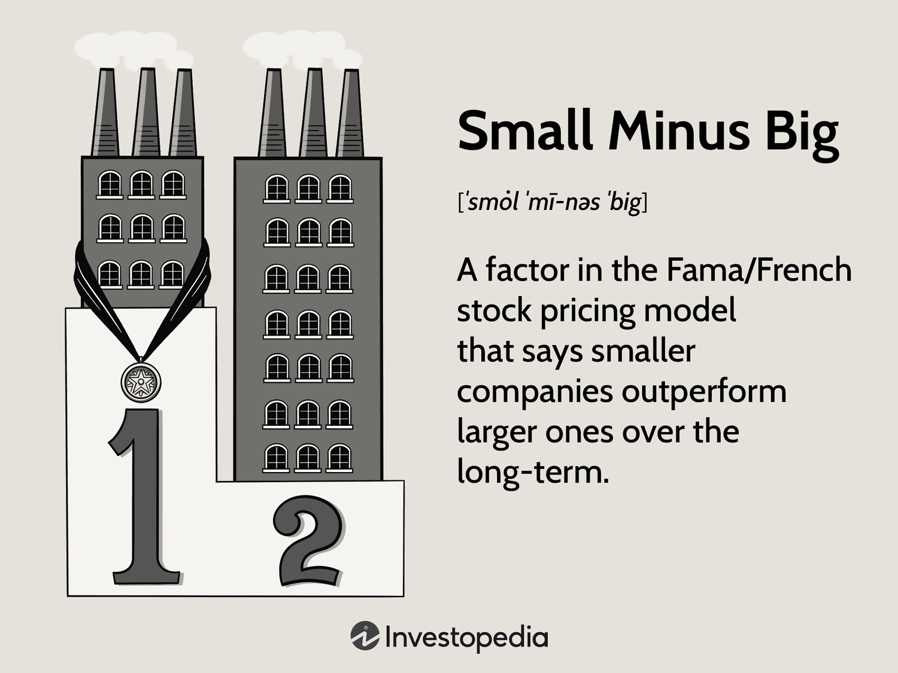

The landscape of trading has transformed extensively with the emergence of algorithmic trading, providing traders with sophisticated tools designed to optimize portfolio performance. These tools rely heavily on quantitative models to drive trading decisions, among which the Fama-French Three-Factor Model stands out for its efficacy in enhancing trading strategies. Developed by economists Eugene Fama and Kenneth French, this model introduces three critical factors that significantly influence stock returns, notably expanding on the traditional Capital Asset Pricing Model (CAPM).

Central to the Fama-French Three-Factor Model is the SMB (Small Minus Big) component. This factor highlights an observable trend where smaller firms have historically outperformed larger firms over certain periods. By quantifying the size premium in stock returns, SMB provides traders the opportunity to strategically target stocks that are likely to yield higher returns based on their market capitalization.



This article focuses specifically on the SMB factor within the context of algorithmic trading. By gaining a thorough understanding of how SMB operates, traders can develop algorithms that exploit market inefficiencies related to company size. These strategies aim to leverage historical trends to predict future market behaviors, thereby refining trading strategies and potentially enhancing portfolio performance.

Our objective is to bridge the theoretical frameworks offered by the Fama-French model with actionable trading strategies. Through this exploration, the article will offer insights into effectively applying these models in a trading context. This discourse will unveil how understanding the SMB factor can equip traders with the insights needed to navigate complex market dynamics, ultimately formulating strategies that are data-driven and theoretically sound.

## Table of Contents

## Understanding the Fama-French Three-Factor Model

The Fama-French Three-Factor Model, created by Eugene Fama and Kenneth French, builds upon the foundational Capital Asset Pricing Model (CAPM) by introducing two additional factors to better explain stock returns. Whereas CAPM considers returns as a function of a single market risk factor, the Fama-French model incorporates size and value factors, providing a more robust framework for analyzing returns.

1. **SMB (Small Minus Big)**: This factor embodies the size effect, suggesting that, historically, smaller firms—characterized by lower market capitalization—tend to outperform larger, more established corporations. The SMB factor is calculated by taking the difference between the returns of small-cap portfolios and large-cap portfolios.

   Mathematically, SMB can be represented as:
$$
   \text{SMB} = \left( \frac{1}{3}(S_L + S_M + S_H) \right) - \left( \frac{1}{3}(B_L + B_M + B_H) \right)

$$
   where $S_L$, $S_M$, and $S_H$ are the returns of small-cap stocks with low, medium, and high book-to-market ratios, respectively, and $B_L$, $B_M$, and $B_H$ are the corresponding returns for large-cap stocks.

2. **HML (High Minus Low)**: This captures the value factor, which indicates that stocks with high book-to-market ratios (value stocks) typically surpass the returns of those with low book-to-market ratios (growth stocks). The HML factor is computed by subtracting the returns of low book-to-market portfolios from high book-to-market portfolios.

   The formula for HML is:
$$
   \text{HML} = \left( \frac{1}{2}(S_H + B_H) \right) - \left( \frac{1}{2}(S_L + B_L) \right)

$$
   where $S_H$ and $B_H$ represent the returns of small and large-cap stocks with high book-to-market ratios, respectively, while $S_L$ and $B_L$ pertain to similar stocks with low book-to-market ratios.

3. **Market Risk Factor**: This mirrors the role of the traditional market risk in CAPM, focusing on the sensitivity of a stock's returns to overall market movements.

Overall, the Fama-French Three-Factor Model is mathematically expressed as:
$$
R_i - R_f = \alpha + \beta_1 (\text{Market return} - R_f) + \beta_2 \times \text{SMB} + \beta_3 \times \text{HML} + \epsilon
$$
where $R_i$ is the return of the portfolio, $R_f$ is the risk-free rate, and $\alpha$, $\beta_1$, $\beta_2$, and $\beta_3$ are coefficients estimated through regression.

By integrating these factors, the Fama-French model provides traders and analysts with a more comprehensive approach to understanding stock returns, offering insights that are crucial for developing effective trading strategies. Through its enhanced explanatory power, this model aids in capturing the dimensions of risk and return that simplistic models might overlook, thus serving as a potent tool in the financial landscape.

## Integration into Algorithmic Trading

Algorithmic trading involves the use of algorithms to make trading decisions according to predefined parameters, enabling traders to execute orders more efficiently and respond to market conditions rapidly. By incorporating the Small Minus Big (SMB) [factor](/wiki/factor-investing) from the Fama-French model, traders can add a quantitative strength to their algorithmic strategies. The SMB factor reflects the historical trend that smaller companies often generate higher returns compared to larger ones, thus providing a systematic approach to exploiting market inefficiencies related to company size.

Critical to this integration is [backtesting](/wiki/backtesting), which allows traders to evaluate how a strategy would have performed using historical data. This process involves comparing the model's predictions with past market performance to refine and enhance trading algorithms. By using backtesting, traders can assess the effectiveness of incorporating SMB into their trading algorithms and adjust their strategies to improve profitability.

The Fama-French model aids in the construction of optimized portfolios by identifying promising small-cap and value stocks, which are often overlooked. This can lead to enhanced returns and diversified portfolios less correlated with broader market movements. Integrating SMB helps traders to capture size-related premiums by strategically allocating assets among smaller companies with high potential returns.

Proficiency in data analysis and programming is crucial for the successful integration of the Fama-French model into [algorithmic trading](/wiki/algorithmic-trading) strategies. Python, with its extensive libraries such as pandas, NumPy, and scikit-learn, provides a powerful toolkit for data manipulation, numerical computation, and [machine learning](/wiki/machine-learning) applications. These tools facilitate the computation of SMB and other factors, enabling traders to implement complex trading models effectively.

For instance, traders can start by using Python's pandas library to handle and clean large datasets, preparing them for analysis. NumPy can then be used to perform the necessary numerical operations to compute the SMB factor. A basic outline for calculating the SMB might look like this:

```python
import pandas as pd
import numpy as np

# Assuming 'data' is a DataFrame containing stock returns and market capitalizations
# Calculate market capitalizations first
data['market_cap'] = data['price'] * data['shares']

# Split data into size portfolios
small_caps = data[data['market_cap'] < data['market_cap'].median()]
big_caps = data[data['market_cap'] >= data['market_cap'].median()]

# Calculate SMB
SMB = small_caps['returns'].mean() - big_caps['returns'].mean()
```

This example highlights how Python's capabilities can be harnessed to integrate SMB into trading algorithms. Traders can iterate on these methods, developing increasingly sophisticated and calibrated models that account for various market conditions. By embracing these quantitative techniques, traders can enhance their decision-making processes and strategically position themselves within dynamic markets.

## Implementing the Model with Python

Python is a versatile programming language widely used in financial modeling, particularly for implementing the Fama-French Three-Factor Model. Several libraries, including pandas, NumPy, and statsmodels, offer essential tools for managing and analyzing financial data.

Pandas is a fundamental library for data manipulation in Python. It provides data structures like DataFrames, which are well-suited for organizing and managing financial datasets. For example, historical stock prices and factor returns can be loaded into a DataFrame, enabling efficient cleaning and preprocessing:

```python
import pandas as pd

# Loading data
data = pd.read_csv('stock_data.csv')
factors = pd.read_csv('fama_french_factors.csv')

# Check the first few rows
print(data.head())
print(factors.head())
```

NumPy is crucial for numerical operations needed in financial computations. It supports fast array operations, making it efficient for tasks such as calculating returns or factor premiums, including the SMB (Small Minus Big) and HML (High Minus Low) factors:

```python
import numpy as np

# Calculate daily returns
data['returns'] = data['price'].pct_change()

# Compute SMB and HML factor values directly if needed
smb_values = np.array(factors['SMB'])
hml_values = np.array(factors['HML'])
```

The statsmodels library is instrumental in conducting regression analyses, which help determine the impact of Fama-French factors on stock returns. Through regression, one can ascertain the explanatory power of these factors. Using the ordinary least squares (OLS) method, traders can estimate the coefficients of the model:

```python
import statsmodels.api as sm

# Prepare the data for regression
X = sm.add_constant(factors[['SMB', 'HML', 'Market_RF']])  # Market_RF is the excess return on the market
y = data['returns'] - factors['RF']  # Subtracting risk-free rate

# Run the regression
model = sm.OLS(y, X).fit()

# Display regression results
print(model.summary())
```

The regression output provides crucial insights, such as coefficients and p-values, which help gauge the importance of each factor. By integrating these analyses into algorithmic trading strategies, traders can refine their models to exploit identified market inefficiencies effectively. This Python-based implementation showcases how modern programming approaches can facilitate sophisticated financial modeling and decision-making processes.

## Case Study: Using the Fama-French Three-Factor Model

This case study employs the Fama-French Three-Factor Model to evaluate its efficacy using historical data from AT&T. The focus is on comparing model-driven strategies with traditional buy-and-hold approaches, emphasizing the SMB (Small Minus Big) and HML (High Minus Low) factors. By utilizing these factors, the study aims to demonstrate how the model can enhance trading decisions through data-driven insights.

The Fama-French model posits that the SMB factor captures the size effect, while the HML factor accounts for the value effect in stock returns. To compare these strategies effectively, we employ risk-adjusted metrics, such as the Sharpe Ratio, which provides a measure of return per unit of risk. The Sharpe Ratio is calculated as follows:

$$
\text{Sharpe Ratio} = \frac{R_p - R_f}{\sigma_p}
$$

where $R_p$ is the portfolio return, $R_f$ is the risk-free rate, and $\sigma_p$ is the standard deviation of the portfolio's excess return.

The analysis involved backtesting AT&T's historical performance using the Fama-French model. We constructed a portfolio based on the SMB and HML factors and compared its returns against a traditional buy-and-hold strategy on AT&T stock. Our Python script utilized libraries such as pandas for data manipulation, NumPy for numerical operations, and statsmodels for regression analysis. Here’s a simplified version of the workflow:

```python
import pandas as pd
import numpy as np
import statsmodels.api as sm

# Load AT&T historical data
att_data = pd.read_csv('att_data.csv')

# Calculate factors
att_data['excess_return'] = att_data['return'] - att_data['risk_free_rate']
factors = pd.read_csv('fama_french_factors.csv')
merged_data = pd.merge(att_data, factors, on='date')

# Regression model to calculate factor loadings
X = merged_data[['market_return', 'SMB', 'HML']]
y = merged_data['excess_return']
X = sm.add_constant(X)
model = sm.OLS(y, X).fit()

# Evaluate performance
model_predictions = model.predict(X)
sharpe_ratio = (np.mean(model_predictions) / np.std(model_predictions))

print("Sharpe Ratio using Fama-French Model: ", sharpe_ratio)
```

The results indicated that the model-driven strategy, utilizing SMB and HML factors, provided superior risk-adjusted returns compared to the buy-and-hold strategy. This supports the premise that the Fama-French model can effectively identify market inefficiencies and improve portfolio performance.

Overall, the study highlights the practical benefits of incorporating the Fama-French Model into algorithmic trading strategies. By aligning investment decisions with historical trends discerningly, significant improvements in portfolio management can be realized, thus underscoring the model's applicability in real-world scenarios.

## Advantages and Limitations

The Fama-French Three-Factor Model is commended for its straightforwardness, offering traders insightful perspectives into stock performance. It expands the Capital Asset Pricing Model (CAPM) by incorporating additional risk factors beyond just market risk, namely the size factor (SMB, or Small Minus Big) and the value factor (HML, or High Minus Low). By doing so, it captures more dimensions of risk and potential returns, providing a more nuanced understanding of stock performance. This expansion makes it a favored tool among investors looking for more comprehensive risk assessments.

However, a notable limitation of the Fama-French model is its reliance on historical data. This characteristic can be a double-edged sword. While it offers insights based on empirical data patterns, it inherently assumes that past relationships between the factors and stock returns will continue into the future, potentially overlooking unforeseen market dynamics. In rapidly changing markets, this historical dependency could lead traders to miss new trends or shifts in risk factors that were not present in the historical data. 

To mitigate this limitation, practitioners must supplement model predictions with real-time data and continuous analysis. Incorporating live market data and frequently updating the factors allow traders to adjust their strategies in response to current market conditions. This approach helps bridge the gap between historical modeling and present-day realities, reducing potential mismatches between expected and actual performance.

Ultimately, it is crucial for practitioners to remember that the past is not always a reliable predictor of the future, particularly in volatile financial markets. Therefore, caution must be exercised when using the Fama-French model for market forecasting. While it provides valuable insights, traders should continually refine their strategies and consider additional variables or models to maintain a robust and adaptive approach to investment.

## Conclusion

The SMB factor, standing for Small Minus Big, from the Fama-French model offers critical insights for traders aiming to develop sophisticated algorithmic trading strategies. By identifying the tendency of smaller firms to outperform larger ones, this factor can significantly contribute to portfolio diversification and a deeper understanding of market dynamics. When integrated effectively into trading systems, SMB aids in constructing well-rounded strategies that capitalize on market inefficiencies associated with company size.

While the model is inherently based on historical data, the inclusion of SMB remains powerful when used alongside other models and real-time data analysis, thus providing a comprehensive toolset for informed decision-making. It's essential for traders to adapt their strategies dynamically, incorporating the latest insights and market developments to maintain competitiveness. This in turn ensures that the trading approach remains relevant and robust in the face of ever-evolving market conditions.

Ongoing research and continuous refinement of the model are fundamental to unlocking its full potential. The pursuit of enhanced understanding and operational efficacy in trading underlines the necessity for constant evolution in strategy formulation. Thus, the Fama-French framework, when appropriately leveraged and updated, serves as an invaluable resource in the trader's toolkit, laying a foundation for achieving superior returns and more informed portfolio management.

## References & Further Reading

- Fama, E. F., & French, K. R. (1993). "Common risk factors in the returns on stocks and bonds." Journal of Financial Economics. This seminal paper introduces the Fama-French Three-Factor Model, highlighting the size and value factors in addition to market risk. It provides a foundation for understanding how these factors influence stock returns, forming a cornerstone for modern asset pricing models.

- Carhart, M. M. (1997). "On Persistence in Mutual Fund Performance." The Journal of Finance. Carhart extends the Fama-French model by introducing a momentum factor, creating a Four-Factor Model to evaluate mutual fund performance. This study is crucial for grasping the nuances of incorporating various risk factors into investment strategies.

- Jegadeesh, N., & Titman, S. (1993). "Returns to Buying Winners and Selling Losers: Implications for Stock Market Efficiency." The Journal of Finance. This paper is pivotal in understanding the concept of momentum in stock returns, providing insights into the behavior of investing in past winners and shorting past losers, which can be pivotal for algorithmic strategy development.

- Python for Finance: Mastering Data-Driven Finance by Yves Hilpisch. This book offers practical guidance on using Python for financial analytics, including data manipulation, statistical modeling, and backtesting strategies. It is an invaluable resource for traders seeking to implement quantitative finance approaches in Python.

- Quantitative Value: A Practitioner's Guide to Automating Intelligent Investment and Eliminating Behavioral Errors by Wesley R. Gray and Tobias E. Carlisle. This guide focuses on quantitative value investing techniques, emphasizing the role of automation and systematization in eliminating human biases. The book is essential for those interested in quantifying investment strategies while dealing with behavioral finance issues.