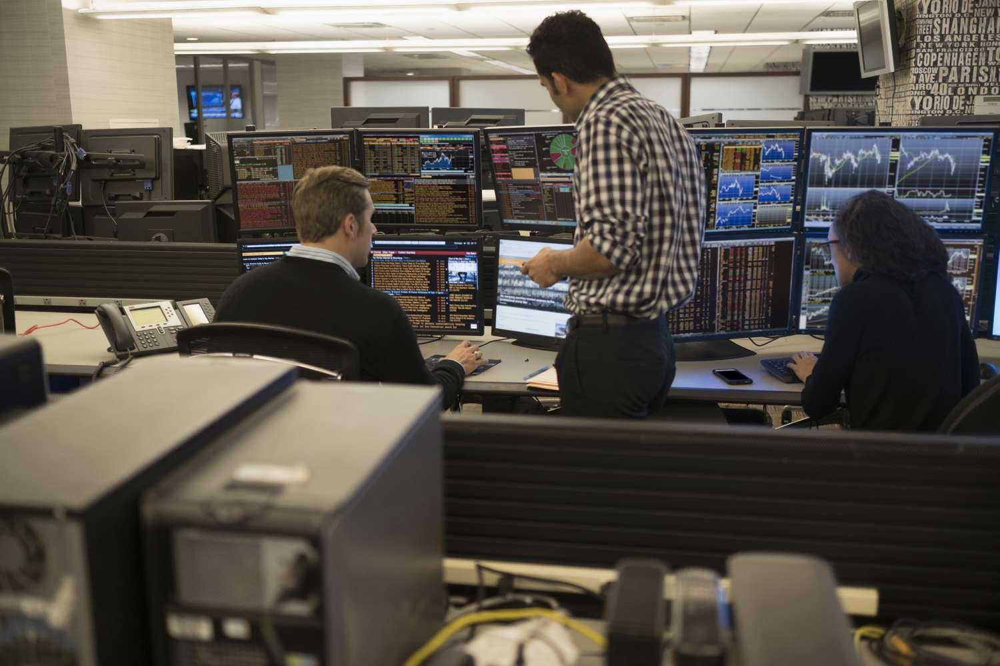

## Table of Contents

## What is a Small Order Execution System (SOES)?

A Small Order Execution System (SOES) is a computer system that helps small investors buy and sell stocks quickly. It was created to make trading easier for people who don't trade large amounts of stocks. SOES allows these small investors to get their orders filled faster than if they used a regular broker. This system was especially popular in the 1990s when day trading became more common.

SOES works by matching buy and sell orders automatically. When a small investor places an order, the system looks for the best available price from other investors or market makers. This means that small orders can be executed almost instantly, which is a big advantage for traders who want to take advantage of quick changes in the market. However, SOES is not used as much today because of new technology and trading platforms that offer similar services.

## How does a Small Order Execution System work?

A Small Order Execution System, or SOES, is a computer system that helps small investors buy and sell stocks quickly. It works by automatically matching buy and sell orders. When a small investor wants to buy or sell a stock, they enter their order into the SOES. The system then looks for the best available price from other investors or market makers who are willing to trade at that price. This means that small orders can be filled almost instantly, which is great for traders who want to act fast in the market.

SOES was especially useful in the 1990s when [day trading](/wiki/day-trading-spy) became popular. It gave small investors a way to compete with bigger traders by getting their orders filled quickly. However, SOES is not used as much today because new technology and trading platforms offer similar services. These modern platforms have made it easier for everyone to trade stocks quickly, so the need for a special system like SOES has decreased.

## What are the benefits of using a Small Order Execution System for individual investors?

Using a Small Order Execution System, or SOES, can be really helpful for individual investors. One big benefit is that it lets them buy and sell stocks very quickly. When the market is moving fast, being able to get your order filled right away can make a big difference. This is especially good for day traders who need to act fast to make money from small changes in stock prices.

Another advantage is that SOES helps level the playing field for small investors. Usually, big traders and brokers have an edge because they can move large amounts of money and get their orders filled faster. But with SOES, small investors can get their orders filled just as quickly, which means they have a better chance of getting good prices for their stocks. This makes trading more fair and gives everyone a better shot at making money in the stock market.

## Can you explain the historical context and origin of SOES?

The Small Order Execution System, or SOES, was created in the late 1980s by the National Association of Securities Dealers (NASD), which is now known as FINRA. The main reason for making SOES was to help small investors. Before SOES, big traders and brokers had a big advantage because they could move lots of money and get their orders filled faster. SOES was designed to give small investors a better chance by letting them buy and sell stocks quickly and easily.

SOES became really popular in the 1990s, especially among day traders. Day traders buy and sell stocks in the same day to make money from small changes in stock prices. SOES helped them because it let them get their orders filled almost instantly. But as time went on, new technology and trading platforms started to offer similar services. These new platforms made it easy for everyone to trade stocks quickly, so the need for SOES went down. By the early 2000s, SOES was used less and less, but it played an important role in making trading more fair for small investors.

## What types of securities can be traded using a Small Order Execution System?

A Small Order Execution System, or SOES, mainly deals with stocks. These are shares in companies that people can buy and sell. SOES was designed to help small investors trade these stocks quickly and easily. It was especially useful for stocks listed on the NASDAQ, which is a big electronic stock market.

Besides stocks, SOES can also handle other types of securities that are traded on the NASDAQ. This includes things like exchange-traded funds (ETFs), which are like baskets of stocks that you can buy and sell like a single stock. However, the main focus of SOES was always on individual company stocks, helping small investors get a fair chance in the market.

## How does SOES differ from traditional trading methods?

SOES, or Small Order Execution System, is different from traditional trading methods because it helps small investors buy and sell stocks quickly and easily. In traditional trading, big traders and brokers often have an advantage because they can move large amounts of money and get their orders filled faster. But with SOES, small investors can get their orders filled almost instantly, which levels the playing field. This means that small investors have a better chance of getting good prices for their stocks, something that was harder to do with traditional methods.

Another big difference is how SOES works automatically. In traditional trading, you might need to call a broker or use a slower system to place your order. With SOES, the system matches buy and sell orders automatically, so there's no need to wait for a broker to do it for you. This automation makes trading faster and more efficient for small investors, which was a big change from the slower, more manual process of traditional trading.

## What are the limitations or risks associated with using a Small Order Execution System?

Using a Small Order Execution System, or SOES, can have some limitations and risks. One big risk is that SOES only works for small orders. If you want to buy or sell a lot of stocks, you can't use SOES. This means that if you're a bigger investor, you need to use a different system. Also, because SOES fills orders so quickly, it can sometimes cause prices to move a lot in a short time. This can be good if the price moves in your favor, but it can also be bad if the price goes against you.

Another limitation is that SOES might not always get you the best price. It matches your order with the best available price at that moment, but that price might not be the best one out there. If you're not careful, you could end up buying or selling at a price that's not as good as you could get with a different method. Plus, because SOES is automatic, you don't have a broker to help you make decisions. This means you need to be really sure about your trades because there's no one to give you advice or help you if something goes wrong.

## How has the role of SOES evolved with the advent of electronic trading platforms?

The Small Order Execution System, or SOES, was really important when it first came out. It helped small investors trade stocks quickly and easily. But when electronic trading platforms started to become popular, the role of SOES changed a lot. These new platforms could do everything SOES could do, but they could also handle bigger orders and offer more features. So, people started using these new platforms instead of SOES.

Today, SOES is not used as much because electronic trading platforms have taken over. These platforms are faster and can do more things than SOES ever could. They let people trade all sorts of securities, not just stocks, and they work for both small and big investors. Even though SOES helped small investors in the past, it's not as important now because the new technology has made trading easier and more fair for everyone.

## What are some strategies that traders use specifically with SOES?

Traders who use the Small Order Execution System, or SOES, often use a strategy called "SOES Bandits." This strategy involves quickly buying and selling stocks to make money from small price changes. They look for stocks that are moving a lot and use SOES to get their orders filled fast. Because SOES is so quick, these traders can take advantage of price differences between what buyers are willing to pay and what sellers are asking for.

Another strategy is "[momentum](/wiki/momentum) trading." Traders watch for stocks that are going up or down quickly and use SOES to jump in and out of these trades. They buy when the price is going up and sell when it starts to go down, hoping to make money from the movement. SOES helps them do this fast, which is important because momentum trading is all about timing.

## How do regulatory bodies oversee the use of Small Order Execution Systems?

Regulatory bodies like the Financial Industry Regulatory Authority (FINRA) keep an eye on how Small Order Execution Systems (SOES) are used. They make rules to make sure that everyone is trading fairly and that small investors are not being taken advantage of. FINRA checks to see if the system is working right and if people are using it the way they should. They also look at how brokers and traders behave to make sure they are not doing anything wrong.

When problems come up, FINRA can step in and do things like fines or punishments to people who break the rules. They also keep updating their rules to match new technology and ways of trading. This helps keep the market safe and fair for everyone, even as things change over time.

## What impact has SOES had on market liquidity and volatility?

SOES, or Small Order Execution System, has helped make the market more liquid. Liquidity means how easy it is to buy and sell stocks. Because SOES lets small investors trade quickly, more people can buy and sell stocks without waiting. This means there are more buyers and sellers in the market all the time, which makes it easier for everyone to trade. When there are more people trading, it's easier to find someone to buy or sell your stocks, so the market becomes more liquid.

SOES can also make the market more volatile. Volatility means how much prices go up and down. Because SOES fills orders so fast, prices can change a lot in a short time. Traders who use SOES can quickly buy and sell stocks, which can cause prices to move quickly. This quick movement can make the market more exciting but also more risky, because prices can go up or down a lot in a short time.

## Can you discuss any notable case studies or examples where SOES played a significant role in trading?

One famous example of SOES in action is the story of the "SOES Bandits." These were traders in the 1990s who used SOES to make quick profits. They would watch for stocks that were moving a lot and use SOES to buy and sell them fast. By doing this, they could take advantage of small price differences and make money. Their quick trades helped show how SOES could make the market more exciting but also more risky because prices could change a lot in a short time.

Another example is how SOES helped level the playing field for small investors. Before SOES, big traders had a big advantage because they could move a lot of money and get their orders filled faster. But with SOES, small investors could trade just as quickly. This meant they had a better chance of getting good prices for their stocks. Even though SOES is not used as much today, it played an important role in making the stock market more fair for everyone.

## References & Further Reading

[1]: [Wikipedia Small-order execution system overview](https://en.wikipedia.org/wiki/Small-order_execution_system)

[2]: [Investopedia Small Order Execution System definition and history](https://www.investopedia.com/terms/s/soes.asp)

[3]: [Financial Industry Regulatory Authority SOES rules and notices](https://www.finra.org/sites/default/files/NoticeDocument/p004112.pdf)

[4]: [Government Accountability Office Securities Market Operations report](https://www.govinfo.gov/content/pkg/GAOREPORTS-GGD-98-194/html/GAOREPORTS-GGD-98-194.htm)

[5]: [Scott Paterson Dark Pools book reference](https://en.wikipedia.org/wiki/Dark_Pools)

[6]: [Nasdaq Launch of SuperSOES article](https://www.computerworld.com/article/2582041/nasdaq-launches---revised-order-system.html)