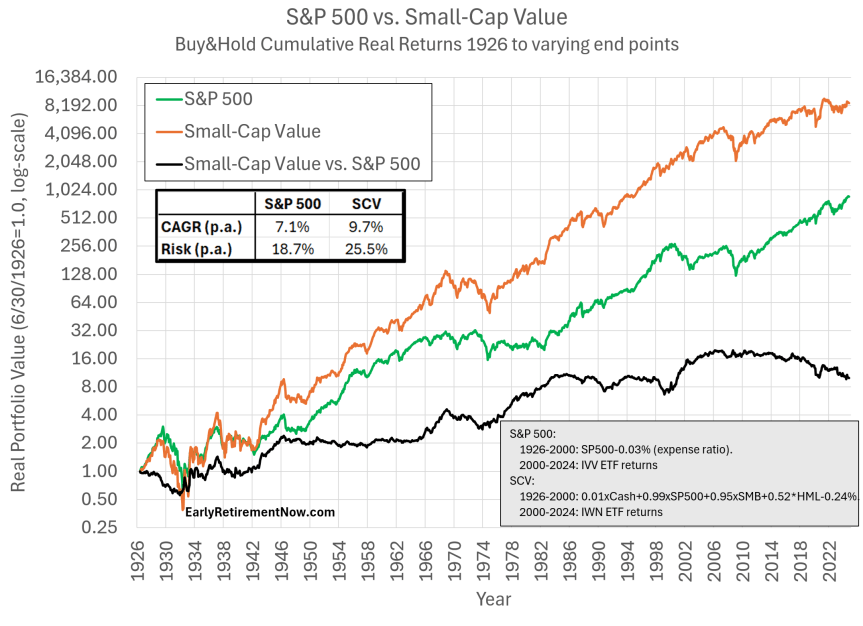

The financial markets have undergone profound changes with technological advancements significantly shaping the investment landscape. These advancements have introduced new avenues such as small-value stocks and algorithmic trading, presenting investors with a complex but opportunity-rich environment. The emergence of small-value stocks highlights a shift towards diversifying investment options. These stocks, characterized by their relatively low market capitalization and perceived undervaluation, capture investor interest due to their potential for substantial growth despite lesser coverage and recognition.

Algorithmic trading has revolutionized trade execution by leveraging advanced computational techniques and real-time data analysis to make swift, data-driven trading decisions. This shift not only increases trading efficiency but also offers a strategic advantage in the fast-paced financial markets. The ability to predefine decision-making algorithms means trades can be executed with speed and precision beyond what is achievable with manual trading.



This article focuses on the convergence of financial markets, stock investment, small-value stocks, and algorithmic trading. By examining the distinct and intertwined aspects of these components, we can uncover unique investment strategies that harness their respective strengths. Understanding this intersection is essential for navigating the intricate and dynamic nature of today's financial markets, equipping investors with the insights needed to balance potential rewards against inherent risks.

## Table of Contents

## Understanding Small-Value Stocks

Small-value stocks are typically equities of small-cap companies that are viewed as undervalued based on their financial fundamentals. These stocks present an intriguing opportunity for investors, particularly in the context of the Fama and French three-factor model, which incorporates the size (small vs. big) and value (high book-to-market vs. low book-to-market) factors. This model posits that small-cap and value stocks tend to yield higher returns, thus offering significant growth potential ([Fama & French, 1992](https://doi.org/10.1111/j.1540-6261.1992.tb04398.x)).

The undervaluation of small-value stocks often results from a lack of market attention or mispricing by analysts, making them less visible relative to larger, more prominent companies. This reduced coverage can work to the advantage of astute investors who are able to identify undervalued stocks that have been overlooked by the broader market. The agility of these companies enables them to respond quickly to market opportunities and challenges, often leading to dynamic growth trajectories that may not be available to larger companies with more cumbersome organizational structures.

However, understanding the unique characteristics and potential risks of small-value stocks is imperative for investors considering them for inclusion in their portfolios. The concept of being "undervalued" is inherently subjective, where misjudgments may lead to incorrect assumptions about a company's true worth or future performance. Factors such as limited historical data, less information transparency, and higher sensitivity to economic downturns can make these investments volatile. Moreover, due to their smaller size, these companies may have less access to capital markets and are generally more affected by operational risks.

Investors need to perform rigorous due diligence when evaluating small-value stocks. Financial ratios like the price-to-earnings (P/E) ratio, price-to-book (P/B) ratio, and return on equity (ROE) can provide insights into how a company is valued relative to its earnings, book value, and shareholder equity, respectively. Additionally, investors should consider broader market conditions, sector-specific dynamics, and management capabilities to develop a holistic understanding of potential risks and rewards associated with these investments.

In conclusion, while small-value stocks offer the prospect of substantial returns, they require a comprehensive understanding and cautious approach. By recognizing their distinctive traits and associated risks, investors can strategically incorporate these stocks into diversified investment portfolios to capitalize on their potential advantages.

## Potential and Risks of Small-Value Stocks

Investing in small-value stocks offers significant potential for high returns, primarily due to these companies often operating in underexplored market segments. Small-cap stocks, which are generally categorized by a market capitalization between $300 million and $2 billion, fall into the small-value category when they are judged as undervalued based on their fundamentals. This undervaluation is typically assessed using price-to-earnings (P/E) ratios, price-to-book (P/B) ratios, or other financial metrics relative to industry benchmarks. The potential for substantial returns arises from the market's eventual recognition of their intrinsic value, which can lead to appreciable stock price increases. 

However, this high growth potential is accompanied by elevated risks. The inherent [volatility](/wiki/volatility-trading-strategies) of small-value stocks is typically greater than that of larger, established companies. The lack of diversification often seen in small companies increases the impact of adverse events, such as economic downturns or unfavorable industry developments. Moreover, smaller companies might struggle with access to capital, making them more vulnerable to cash flow issues, which could lead to failure.

Investors must apply careful analysis and a strategic approach when considering investments in small-value stocks. This involves conducting comprehensive due diligence to assess the financial health of the company, including an evaluation of debt levels, revenue growth, and industry conditions. Additionally, investors might consider the application of quantitative models to determine the risk-reward profile of these stocks accurately. For example, risk can be quantified using metrics such as beta (β), which measures a stock's volatility compared to the market.

Python can be useful in analyzing small-value stocks, particularly for creating financial models or simulating stock performance under different scenarios. Using libraries such as pandas for data handling and NumPy for numerical calculations, investors can efficiently process financial data and make informed decisions. An example of a Python code snippet to calculate the beta of a stock is as follows:

```python
import pandas as pd
import numpy as np

def calculate_beta(stock_returns, market_returns):
    covariance_matrix = np.cov(stock_returns, market_returns)
    beta = covariance_matrix[0, 1] / covariance_matrix[1, 1]
    return beta

# Assuming stock_returns and market_returns are pandas Series of percentage returns
stock_returns = pd.Series(...)
market_returns = pd.Series(...)

beta = calculate_beta(stock_returns, market_returns)
print(f"Beta: {beta}")
```

In summary, while small-value stocks present enticing growth opportunities, they come with significant risks. A judicious combination of thorough analysis, strategic investment decisions, and adept application of analytical tools can mitigate these risks and enhance the potential for success.

 to Algorithmic Trading

Algorithmic trading, commonly referred to as 'algo trading,' has significantly altered the landscape of financial market transactions over the past few decades. By employing computer algorithms to execute trades, this methodology allows rapid and efficient transaction processing that surpasses human capabilities. At its core, [algorithmic trading](/wiki/algorithmic-trading) involves automating the trading process with algorithms programmed to follow a set of predefined rules. These can include criteria such as timing, price, or quantity, which determine the initiation and execution of trades.

The automation provided by algorithmic trading enables trades to be processed at speeds and frequencies impossible for human traders. For instance, High-Frequency Trading ([HFT](/wiki/high-frequency-trading-strategies)), a subset of algorithmic trading, leverages ultra-fast speeds to capitalize on minute price fluctuations across markets, often executing thousands of trades per second. The systemic analysis conducted through algorithms involves parsing significant volumes of market data to identify trading opportunities quickly and accurately.

Algorithms play a fundamental role within this trading paradigm. These sophisticated programs can analyze real-time data and historical trends to spot advantageous entry and [exit](/wiki/exit-strategy) points, thereby enhancing the decision-making process. For example, a simple moving average crossover strategy might be used where an algorithm buys an asset when a short-term moving average surpasses a long-term moving average and sells when the opposite occurs.

```python
# Example of a simple algorithmic strategy in Python
def moving_average_crossover(data, short_window, long_window):
    signals = pd.DataFrame(index=data.index)
    signals['signal'] = 0.0

    # Create short and long simple moving averages
    signals['short_mavg'] = data['price'].rolling(window=short_window, min_periods=1, center=False).mean()
    signals['long_mavg'] = data['price'].rolling(window=long_window, min_periods=1, center=False).mean()

    # Create signals based on moving averages
    signals['signal'][short_window:] = np.where(signals['short_mavg'][short_window:] 
                                                > signals['long_mavg'][short_window:], 1.0, 0.0)

    # Generate trading orders
    signals['positions'] = signals['signal'].diff()

    return signals
```

The importance of algorithmic trading in modern financial markets cannot be overstated. It provides traders with significant leverage by enabling precise execution and optimizing trading outcomes through efficient data processing. The integration of complex models and [machine learning](/wiki/machine-learning) in some of these algorithms allows continuous adaptation and improvement, ensuring that they remain effective in rapidly changing market conditions.

Despite its advantages, algorithmic trading poses challenges and necessitates robust systems and risk management practices. As algorithms operate at high speeds, even minor errors in code or strategy can lead to substantial financial losses if unchecked. Therefore, rigorous testing and continuous monitoring are crucial components of any successful algorithmic trading strategy.

In sum, algorithmic trading stands as a cornerstone of modern financial markets, offering enhanced trading precision, execution speed, and the capacity to process large data volumes. As financial technology continues to evolve, the role of algorithmic trading is expected to become increasingly prominent, driving forward the efficiency and dynamism of global markets.

## Integrating Small-Value Stocks with Algo Trading

Combining small-value stock investments with algorithmic trading optimizes both decision-making and execution processes by enhancing the analysis of market data and adaptiveness to market changes. Small-value stocks, often characterized by their agility and potential for outsized returns, can greatly benefit from the speed and precision of algorithmic trading systems. These algorithms leverage data-driven insights to identify undervalued opportunities with high growth potential, ensuring timely and accurate trades.

Algorithmic strategies for small-value stocks can be tailored to capitalize on inefficiencies and patterns that may not be apparent through manual trading. For example, strategies can use historical price data and relevant market indicators to predict stock movements. Consider the following simple Python example using a moving average crossover strategy applied to small-value stocks:

```python
import pandas as pd

# Load stock data
data = pd.read_csv('small_value_stock_data.csv')
data['Short_MA'] = data['Close'].rolling(window=20).mean()
data['Long_MA'] = data['Close'].rolling(window=50).mean()

# Generate trading signals
def generate_signals(data):
    signals = pd.DataFrame(index=data.index)
    signals['Signal'] = 0.0
    signals['Short_MA'] = data['Short_MA']
    signals['Long_MA'] = data['Long_MA']

    signals['Signal'][20:] = np.where(signals['Short_MA'][20:] > signals['Long_MA'][20:], 1.0, 0.0)
    signals['Positions'] = signals['Signal'].diff()
    return signals

signals = generate_signals(data)
```

In this example, a short-term moving average (20 days) and a long-term moving average (50 days) are calculated. Signals for buying or selling are generated when the short-term moving average crosses above or below the long-term moving average. This approach is rudimentary but can be expanded with additional data inputs and more sophisticated decision rules.

Investors utilizing algorithmic trading with small-value stocks must ensure the robustness of their algorithms to handle the specific behaviors and characteristics of these stocks, such as higher volatility and limited [liquidity](/wiki/liquidity-risk-premium). Effective algorithms must account for these nuances when implementing trading decisions. Additionally, it's crucial to periodically reassess and update strategies in response to market dynamics to maintain their effectiveness.

The integration of algorithmic trading with small-value stock investing offers significant advantages in optimizing trading processes and maximizing potential returns. By leveraging technology to process large volumes of data and execute trades swiftly, investors can more effectively exploit the opportunities presented by small-value stocks.

## Choosing the Right Platform for Algorithmic Trading

Selecting the right platform for algorithmic trading is a critical step in executing successful trading strategies. These platforms serve as the backbone for implementing algorithmic trades, offering diverse tools and features that cater to various trading needs. Several factors should be carefully considered when choosing a platform.

First, data access is a paramount consideration. Access to high-quality, real-time, and historical market data is essential for [backtesting](/wiki/backtesting) and executing trades effectively. Platforms that offer robust data feeds, including depth of market and tick-level data, provide a significant advantage to traders. 

Cost structure is another important [factor](/wiki/factor-investing). This includes not only the direct costs of using the platform but also any associated fees such as data subscription costs and transaction fees. Traders should evaluate whether these costs align with their trading [volume](/wiki/volume-trading-strategy) and expected returns. 

Technical support is crucial, especially for traders new to algorithmic trading or using complex strategies. Platforms that provide comprehensive technical support, including documentation, community forums, and direct support lines, can offer valuable assistance and ensure minimal disruption during trading activities.

Programming flexibility is also vital, as it determines the ease with which traders can implement and modify their trading algorithms. A platform that supports multiple programming languages, such as Python or C++, and offers extensive libraries and APIs can enable traders to develop more sophisticated and custom strategies.

Several key platforms stand out in the field of algorithmic trading. MetaTrader, for example, is known for its user-friendly interface and extensive community support, making it suitable for both beginners and experienced traders. Its MQL programming language allows for the development of custom indicators and scripts.

QuantConnect offers cloud-based algorithmic trading with access to a vast array of data sources and advanced backtesting capabilities. The platform supports a variety of programming languages, including Python and C#, allowing for greater flexibility in strategy development.

[Interactive Brokers](/wiki/interactive-brokers-api) provides a robust environment for both institutional and retail traders, offering a wide range of assets and markets to trade. Its Trader Workstation (TWS) includes an API that supports various programming languages, offering flexibility for custom trading solutions. 

Understanding the capabilities of each platform helps traders enhance their trading outcomes by choosing the best tool that aligns with their strategic goals and technical requirements. This discernment is crucial for capitalizing on market opportunities efficiently and effectively.

## Future Trends in Financial Markets Investment

As financial markets advance, small-value stocks and algorithmic trading are poised to play increasingly instrumental roles. Given the rapid evolution of technology, particularly in AI and big data analytics, these elements are crucial to modern investment strategies.

Technological advancements have fostered significant enhancements in trading precision and adaptability. AI-driven models and big data analytics enable more sophisticated analysis of market trends, revealing intricate patterns that were previously undetectable with conventional methods. Algorithms can now process vast quantities of data and execute trades based on real-time insights, thus minimizing human error and optimizing trading opportunities. For instance, machine learning techniques can be employed to refine predictive models for small-value stock performance, ensuring that trades are executed with a higher degree of accuracy.

Investors stand to benefit significantly from staying informed about these technological trends to capitalize on emerging opportunities. The integration of AI with algorithmic trading systems can improve decision-making by providing a comprehensive analysis of market conditions and potential stock movements. This informed approach is vital for investors seeking to outmaneuver competitors and achieve superior returns.

Continuous learning and adaptability form the cornerstone of maintaining a competitive edge in perpetually shifting financial markets. As technology redefines market dynamics, investors must proactively embrace lifelong learning to stay ahead of the curve. This includes staying updated on the latest developments in AI technologies and understanding their implications for investment. Furthermore, it involves a willingness to adapt current strategies to incorporate new insights and tools, ensuring that they align with the latest advancements.

Overall, the future of financial markets investment promises a symbiotic relationship between technology and strategy, with small-value stocks and algorithmic trading at the forefront. By leveraging these technological trends, investors can not only safeguard but also enhance their portfolios in an increasingly complex and competitive environment.

## Conclusion

Small-value stocks and algorithmic trading represent exciting opportunities in financial market investment, each with its potential for substantial rewards accompanied by notable risks. Understanding and strategically integrating these components can significantly enhance an investor's portfolio growth, balancing high returns with the necessary caution against inherent uncertainties.

Investors who grasp the intricacies of small-value stocks—those perceived as undervalued relative to their fundamentals—can capitalize on growth opportunities often overlooked by the broader market. These stocks, characterized by their agility and reduced analyst coverage, demand a keen sense of market dynamics and thoughtful consideration of their unique risks, such as heightened volatility and the potential for business failure. Careful selection and monitoring of these stocks can provide an edge in tapping into untapped market segments.

Algorithmic trading, on the other hand, has revolutionized trade execution through speed and precision. By utilizing predefined rules and sophisticated data analysis, algorithms facilitate trading decisions and execution processes that surpass human capabilities, offering a strategic advantage in handling the fast-paced and complex requirements of modern trading environments.

For investors to navigate these dynamic financial landscapes successfully, it is imperative to continuously refine their knowledge and strategies. This means staying informed about the latest technological advancements and market trends, ensuring that emerging opportunities can be leveraged effectively. The integration of [artificial intelligence](/wiki/ai-artificial-intelligence) and big data analytics promises even greater precision and adaptability in future trading practices, positioning investors who are proactive and well-informed for long-term success.

Embracing new technologies and maintaining a keen understanding of market insights are critical actions for securing a competitive advantage. Investors who adopt these approaches and remain flexible in their strategies will likely reap the benefits of enhanced portfolio growth and sustained investment success in the ever-evolving financial markets.

## References & Further Reading

- Fama, E.F. & French, K.R. (1992). 'The Cross-Section of Expected Stock Returns'. The Journal of Finance. This seminal paper introduces the Fama-French three-factor model, which expands on the Capital Asset Pricing Model (CAPM) by including size and value factors alongside the market risk factor. This model has been influential in understanding the performance of small-value stocks.

- Hendershott, T. & Riordan, R. (2013). 'Algorithmic Trading and the Market for Liquidity'. Journal of Financial and Quantitative Analysis. This study analyzes how algorithmic trading affects the liquidity of financial markets, emphasizing the role of high-frequency trading in improving market efficiency and reducing transaction costs.

- Jones, C. P. 'Investments: Analysis and Management'. This comprehensive textbook covers fundamental concepts of investment analysis, including valuation, risk assessment, and portfolio management, providing a solid foundation for understanding diverse investment strategies in financial markets.

- Lopez de Prado, M. (2018). 'Advances in Financial Machine Learning'. This book explores the application of machine learning techniques to finance, presenting innovative methods to improve trading strategies and manage investment risks, including algorithmic trading.

- Aronson, D. R. (2007). 'Evidence-Based Technical Analysis: Applying the Scientific Method to Trading Signals'. This book emphasizes the application of scientific methods to technical analysis in trading, providing a framework for evaluating the effectiveness of various trading strategies.

