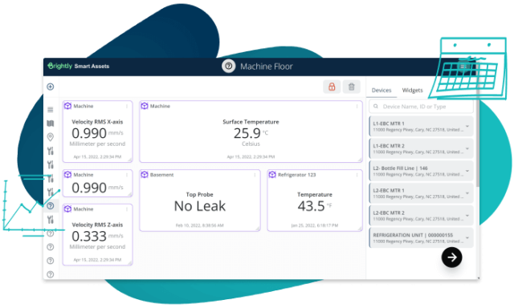

## Table of Contents

## What are smart assets?

Smart assets are items or pieces of property that use technology to make them easier to track and manage. They often have special tags or chips that can send information about where they are and how they are being used. This technology helps businesses and people keep better records and make smarter decisions about their assets.

For example, a company might use smart assets to keep track of their vehicles. Each vehicle could have a device that sends its location and fuel level to a computer. This way, the company can see where their vehicles are at all times and make sure they are being used efficiently. Smart assets can be used in many different fields, like healthcare, manufacturing, and logistics, to improve how things are managed and used.

## How do smart assets differ from traditional assets?

Smart assets and traditional assets are different in how they are managed and tracked. Traditional assets are things like buildings, machinery, or vehicles that you own and use. You keep track of them with paper records or simple computer files. You might not know exactly where they are or how they are being used all the time.

Smart assets, on the other hand, use technology to make them easier to manage. They have special tags or chips that send information about their location and usage. This means you can always know where your smart assets are and how they are being used. This helps you make better decisions and use your assets more efficiently.

## What technologies are used to create smart assets?

Smart assets use different technologies to make them work. One common technology is the Internet of Things (IoT). IoT devices are small computers that can connect to the internet and send information. For example, a smart asset might have an IoT sensor that tells you where it is and how it's being used. Another technology used is Radio Frequency Identification (RFID). RFID tags are small chips that can be read by a special scanner. They help you keep track of your assets without having to see them directly.

Another important technology for smart assets is blockchain. Blockchain is a way to keep records that is very safe and hard to change. It can be used to make sure that the information about your smart assets is always correct and can't be tampered with. For example, if you own a smart asset, blockchain can help prove that it's really yours. Together, these technologies make smart assets more useful and easier to manage than traditional assets.

## What are the basic functionalities of smart assets?

Smart assets have some basic functions that make them useful. One main function is tracking. Smart assets can tell you where they are at any time. This is done with special tags or chips that send their location to a computer. This helps you know where your things are, even if they are far away. Another function is monitoring how the asset is being used. The smart asset can send information about how often it is used, how well it is working, and if it needs any repairs. This helps you take better care of your things and use them more efficiently.

Another important function of smart assets is data collection and analysis. Smart assets can gather a lot of information about themselves and their environment. This data can be used to make smart decisions. For example, if a smart asset is a vehicle, it can tell you how much fuel it uses and how it is driven. This information can help you save money and make the vehicle last longer. Overall, the basic functions of smart assets help you manage your things better and make smarter choices.

## How can smart assets be used in different industries?

Smart assets can be used in many different industries to make things work better. In the healthcare industry, smart assets can help keep track of medical equipment. For example, hospitals can use smart tags on their machines to know where they are and if they need to be fixed. This helps doctors and nurses find what they need quickly and make sure the equipment is always ready to use. In manufacturing, smart assets can help keep track of tools and machines on the factory floor. This way, workers can find what they need easily, and the company can make sure everything is working well and being used the right way.

In the logistics industry, smart assets are very useful for keeping track of shipments. Companies can put smart tags on their trucks and packages to know where everything is at all times. This helps them plan their routes better and make sure deliveries are on time. In the energy sector, smart assets can be used to monitor power plants and pipelines. They can send information about how much energy is being used and if there are any problems. This helps the energy company keep everything running smoothly and fix issues before they get worse.

## What are the benefits of using smart assets for businesses?

Smart assets help businesses save time and money. They can track where things are and how they are used. This means businesses can find their tools and machines quickly, without wasting time looking for them. Smart assets also tell businesses when something needs to be fixed or replaced. This helps them avoid big problems and keep everything working well. By using smart assets, businesses can use their things more efficiently and spend less money on repairs and replacements.

Another benefit of smart assets is that they help businesses make better decisions. Smart assets collect a lot of information about how they are used and what is happening around them. Businesses can use this information to see what is working well and what needs to be changed. For example, a company can see which machines are used the most and plan to buy more of those. Smart assets also help businesses plan better because they know where everything is and can predict when things might go wrong. This makes the business run smoother and helps it grow.

## What are the potential risks and challenges associated with smart assets?

Smart assets can have some risks and challenges. One big risk is security. Since smart assets use technology to send information, they can be hacked. If someone hacks into a smart asset, they could steal important information or even control the asset. This could be very bad for a business. Another challenge is the cost. Smart assets can be expensive to set up and maintain. Businesses need to buy the special tags and chips, and they might need to hire people to manage the technology. This can be a lot of money, especially for small businesses.

Another challenge is privacy. Smart assets collect a lot of information about where they are and how they are used. This information can be very personal, especially if the smart asset is something like a car or a medical device. If this information gets into the wrong hands, it could be used in bad ways. Also, there can be technical problems. Sometimes the technology might not work right, and the smart asset might not send the right information. This can make it hard for businesses to trust the information they get from their smart assets.

## How do smart contracts integrate with smart assets?

Smart contracts and smart assets work together to make things easier and safer. A smart contract is like a computer program that automatically does what it is supposed to do when certain things happen. For example, if you own a smart asset like a car, a smart contract can automatically pay for its maintenance when it needs it. This happens without anyone having to do anything extra. Smart contracts use blockchain technology, which is very safe and hard to change. This means that when a smart contract does something with a smart asset, you can trust that it is done correctly and fairly.

When smart assets and smart contracts are used together, they can make managing things much easier. For example, if you rent out a smart asset like a piece of equipment, a smart contract can automatically handle the payments and make sure the equipment is returned on time. If the equipment is not returned, the smart contract can lock it or even charge extra fees. This makes everything run smoothly and helps prevent problems. By using smart contracts with smart assets, businesses can save time and money, and make sure everything is done the right way.

## What is the role of blockchain in managing smart assets?

Blockchain plays a big role in managing smart assets. It is like a special computer system that keeps records in a very safe way. When you use blockchain with smart assets, it helps make sure that the information about your assets is always correct and can't be changed by someone who shouldn't. For example, if you own a smart asset like a car, blockchain can keep a record of who owns it and make sure that record is safe. This helps prevent fraud and makes it easier to prove that the asset is really yours.

Blockchain also helps smart assets work better with smart contracts. Smart contracts are like automatic agreements that do things when certain conditions are met. When you use blockchain, these smart contracts can work with your smart assets to do things like pay for maintenance or handle rental agreements automatically. This makes everything run smoothly and helps businesses save time and money. By using blockchain, smart assets become more trustworthy and easier to manage.

## How can smart assets enhance supply chain management?

Smart assets can make supply chain management much better. They help businesses keep track of their products from the time they are made until they reach the customer. Smart assets use special tags or chips to send information about where they are and how they are being used. This means businesses can always know where their products are, even if they are moving around the world. This helps them plan better and make sure everything gets to where it needs to go on time. If there is a problem, like a delay or a broken product, smart assets can quickly tell the business so they can fix it right away.

Another way smart assets help with supply chain management is by making things more efficient. They collect a lot of information about how products are used and moved. Businesses can use this information to see where they can save time and money. For example, if a certain route is always slow, they can find a faster way. Smart assets also help businesses use their resources better. They can see which products are popular and make sure they always have enough of those in stock. By using smart assets, businesses can make their supply chains run smoother and be more reliable.

## What advanced features can be implemented in smart assets?

Smart assets can have advanced features that make them even more useful. One advanced feature is predictive maintenance. This means the smart asset can tell you when it might break or need fixing before it actually happens. It does this by collecting data about how it is used and looking for patterns that show something might go wrong. This helps businesses save money because they can fix things before they break and cause bigger problems. Another advanced feature is real-time analytics. This means the smart asset can send information about itself right away, so businesses can make quick decisions based on what is happening at that moment. For example, if a smart asset in a factory starts to work slower, the business can see this right away and fix it before it affects the whole production line.

Another advanced feature of smart assets is integration with other systems. Smart assets can work with other computer systems to make everything run smoother. For example, a smart asset in a warehouse can work with the inventory system to make sure the right products are always in stock. This helps businesses keep track of everything and make sure they are using their resources the best way possible. Smart assets can also have features like remote control and automation. This means businesses can control their smart assets from far away or set them to do things automatically. For example, a smart asset like a delivery truck can be set to drive to certain places at certain times without anyone having to tell it what to do. These advanced features make smart assets very powerful tools for businesses.

## What future developments are expected in the field of smart assets?

In the future, smart assets are expected to become even smarter and more connected. They will use more advanced technology like [artificial intelligence](/wiki/ai-artificial-intelligence) (AI) to make decisions on their own. For example, a smart asset like a machine in a factory could learn from its own data and figure out the best way to work without anyone telling it what to do. Smart assets will also be able to talk to each other better. This means that different smart assets in a business can work together to make everything run smoother. For instance, a smart truck and a smart warehouse could share information to make sure deliveries are always on time.

Another big change coming for smart assets is better security. As smart assets become more important, keeping them safe from hackers will be very important. New ways to protect smart assets, like better encryption and more secure blockchain systems, will be developed. This will make sure that the information smart assets send is always safe and can't be stolen or changed. Also, smart assets will become more common in everyday life. People might use smart assets in their homes, like smart fridges that order food when they run out, or smart cars that can drive themselves. These changes will make smart assets a big part of how we live and work.

## References & Further Reading

[1]: Narayanan, A., Bonneau, J., Felten, E., Miller, A., & Goldfeder, S. (2016). ["Bitcoin and Cryptocurrency Technologies: A Comprehensive Introduction."](https://press.princeton.edu/books/hardcover/9780691171692/bitcoin-and-cryptocurrency-technologies) Princeton University Press.

[2]: Nakamoto, S. (2008). ["Bitcoin: A Peer-to-Peer Electronic Cash System."](https://nakamotoinstitute.org/library/bitcoin/)

[3]: Wood, G. (2014). ["Ethereum: A Secure Decentralised Generalised Transaction Ledger."](https://ethereum.github.io/yellowpaper/paper.pdf) Ethereum Yellow Paper.

[4]: Tapscott, D., & Tapscott, A. (2016). ["Blockchain Revolution: How the Technology Behind Bitcoin Is Changing Money, Business, and the World."](https://archive.org/details/blockchainrevolu0000taps) Penguin Random House.

[5]: Antonopoulos, A. M. (2017). ["Mastering Bitcoin: Unlocking Digital Cryptocurrencies."](https://books.google.com/books/about/Mastering_Bitcoin.html?id=IXmrBQAAQBAJ) O'Reilly Media.

[6]: Vigna, P., & Casey, M. J. (2015). ["The Age of Cryptocurrency: How Bitcoin and Digital Money Are Challenging the Global Economic Order."](https://archive.org/details/ageofcryptocurre0000vign) St. Martin's Press.

[7]: Cormen, T. H., Leiserson, C. E., Rivest, R. L., & Stein, C. (2009). ["Introduction to Algorithms."](https://drive.google.com/file/d/0B3RHrbxFb7PfYjk4ZG01Z3lrbnc/view) MIT Press.

[8]: Szabo, N. (1997). ["The Idea of Smart Contracts."](https://nakamotoinstitute.org/library/the-idea-of-smart-contracts/)

[9]: Gandal, N., & Halaburda, H. (2016). ["Can We Rely on Cryptocurrencies like Bitcoin?"](https://www.semanticscholar.org/paper/Competition-in-the-Cryptocurrency-Market-Halaburda-Gandal/bc9289eeabeb04437b5d9e469db132f28bb010ad) Proceedings of the 15th Annual Workshop on the Economics of Information Security.