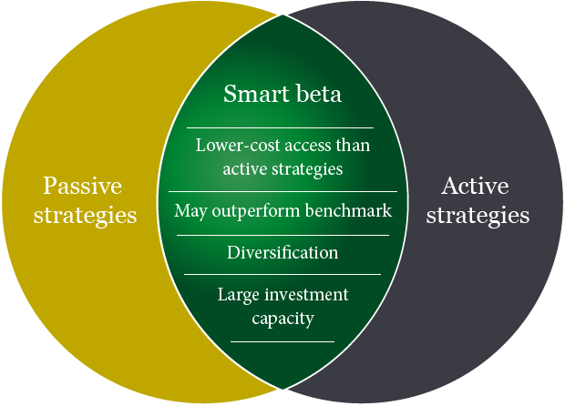

## Table of Contents

## What are Smart Beta ETFs?

Smart Beta ETFs are a type of exchange-traded fund that tries to give investors better returns than traditional index funds. They do this by using special rules, or factors, to pick and weigh the stocks in the fund. These factors can be things like a company's size, how much it's expected to grow, or how much it pays in dividends. Unlike regular index funds that just follow a market index, Smart Beta ETFs aim to beat the market by focusing on these specific factors.

These ETFs are popular because they offer a middle ground between active and passive investing. Active investing is when a manager picks stocks trying to beat the market, and passive investing is when you just follow an index. Smart Beta ETFs are passive because they follow rules, but they're also active because they use those special factors to try to do better than the market. This makes them an attractive choice for investors who want to possibly get higher returns without paying the high fees that often come with active management.

## How do Smart Beta ETFs differ from traditional ETFs?

Smart Beta ETFs and traditional ETFs both track indexes, but they do it in different ways. Traditional ETFs usually follow well-known indexes like the S&P 500. They try to match the performance of these indexes by holding the same stocks in the same amounts as the index. This is called passive investing because the ETF just copies the index without trying to beat it.

Smart Beta ETFs, on the other hand, use special rules or factors to pick and weigh the stocks in their portfolio. These factors could be things like a company's size, how much it's expected to grow, or how much it pays in dividends. By focusing on these factors, Smart Beta ETFs aim to do better than the market. This makes them a bit like active investing, where someone tries to pick stocks to beat the market, but they still follow rules, so they're also passive.

In simple terms, traditional ETFs are like following a recipe exactly as it's written, while Smart Beta ETFs are like tweaking the recipe to make the dish taste even better. Both types of ETFs can be good choices, but they offer different ways to invest your money.

## What are the common strategies used in Smart Beta ETFs?

Smart Beta ETFs use different strategies to pick and weigh stocks in their portfolios. One common strategy is called "value," where the [ETF](/wiki/etf-trading-strategies) looks for stocks that seem cheap compared to what they're really worth. Another strategy is "growth," where the ETF picks stocks of companies that are expected to grow a lot in the future. There's also "[momentum](/wiki/momentum)," which means the ETF buys stocks that have been going up in price recently, hoping they'll keep going up.

Another strategy is "low [volatility](/wiki/volatility-trading-strategies)," where the ETF picks stocks that don't move up and down as much as others, aiming for a smoother ride for investors. "Dividend" strategies focus on companies that pay out a lot of money to their shareholders, which can be good for people looking for regular income. "Quality" strategies look for companies that are financially strong and well-managed.

These strategies help Smart Beta ETFs try to do better than the overall market. By focusing on these specific factors, the ETFs aim to give investors a better chance at higher returns or less risk, depending on what they're looking for.

## What are the benefits of investing in Smart Beta ETFs?

Investing in Smart Beta ETFs can give you a chance to do better than the overall market. These ETFs use special rules to pick stocks that might grow more than others. For example, they might choose companies that are good value, expected to grow a lot, or pay high dividends. This can help you earn more money over time compared to just following a regular index like the S&P 500.

Another benefit is that Smart Beta ETFs can help you manage risk better. Some of these ETFs focus on stocks that don't move up and down as much, which can make your investments smoother and less stressful. Plus, Smart Beta ETFs usually cost less than having someone actively pick stocks for you, so you can save on fees while still trying to beat the market. This makes them a good choice if you want to aim for higher returns without paying a lot in costs.

## What are the potential risks associated with Smart Beta ETFs?

Smart Beta ETFs try to do better than the overall market, but they can be riskier than regular ETFs. Because they focus on certain types of stocks, like those that are expected to grow a lot or pay high dividends, they might not do as well if those kinds of stocks fall out of favor. For example, if everyone suddenly decides they don't want to buy [growth stocks](/wiki/growth-stocks) anymore, a Smart Beta ETF that focuses on growth could lose a lot of value.

Another risk is that Smart Beta ETFs can be more complex. They use special rules to pick stocks, which can be hard to understand. If you don't fully get how the ETF works, you might be surprised by how it performs. Also, while Smart Beta ETFs are usually cheaper than having someone pick stocks for you, they can still cost more than the simplest index funds. So, you need to think about whether the possible extra returns are worth the extra cost and complexity.

## How can Smart Beta ETFs enhance portfolio diversification?

Smart Beta ETFs can help make your investments more varied by focusing on different kinds of stocks. Instead of just buying a regular index fund that holds a little bit of everything, Smart Beta ETFs can pick stocks based on things like how much they're expected to grow, how much they pay in dividends, or how stable they are. This means you can spread your money across different types of companies, which can help lower your risk. If one type of stock doesn't do well, the others might still be okay, keeping your portfolio balanced.

For example, if you already have a lot of money in big, well-known companies, you could add a Smart Beta ETF that focuses on smaller companies or ones that are growing fast. This way, you're not putting all your eggs in one basket. Smart Beta ETFs let you mix and match different strategies to fit your goals and how much risk you're willing to take. By using them, you can build a more varied and potentially more rewarding investment plan.

## What are some examples of popular Smart Beta ETFs?

Some popular Smart Beta ETFs include the iShares Edge MSCI USA Value Factor ETF (VLUE) and the Vanguard Dividend Appreciation ETF (VIG). The iShares Edge MSCI USA Value Factor ETF focuses on stocks that are considered good value, meaning they might be cheaper than they should be based on their earnings or other measures. This ETF tries to beat the market by [picking](/wiki/asset-class-picking) these value stocks. On the other hand, the Vanguard Dividend Appreciation ETF looks for companies that have a history of increasing their dividends over time. This can be a good choice for people who want regular income from their investments.

Another example is the Invesco S&P 500 Low Volatility ETF (SPLV), which picks stocks from the S&P 500 that don't move up and down as much as others. This can help make your investments smoother and less risky. The Schwab U.S. Large-Cap Growth ETF (SCHG) is another popular Smart Beta ETF that focuses on large companies expected to grow a lot. By investing in these ETFs, you can use different strategies to try to do better than the overall market while also spreading your money across different types of stocks.

## How do you evaluate the performance of a Smart Beta ETF?

To evaluate the performance of a Smart Beta ETF, you need to look at how well it does compared to a regular index like the S&P 500. You can check its returns over different time periods, like one year, three years, or five years. It's important to see if the ETF is doing better than the market, which is what Smart Beta ETFs aim to do. You should also look at the ETF's risk, which you can measure with something called standard deviation. This tells you how much the ETF's value goes up and down. A lower standard deviation means the ETF is less risky, while a higher one means it's more risky.

Another thing to consider is the fees you pay to own the ETF. Smart Beta ETFs usually cost a bit more than regular index funds, so you need to see if the extra cost is worth it. If the ETF does much better than the market, the higher fees might be okay. But if it's only a little better or the same, you might be better off with a cheaper index fund. You can also look at other measures like the ETF's tracking error, which shows how closely it follows its strategy, and its beta, which tells you how sensitive it is to market movements. By looking at all these things, you can decide if a Smart Beta ETF is a good choice for your investments.

## What factors should be considered when selecting a Smart Beta ETF?

When choosing a Smart Beta ETF, you should first think about what you want to achieve with your investments. Are you looking for higher returns, less risk, or regular income? Different Smart Beta ETFs focus on different things, like growth, value, or dividends. So, pick an ETF that matches your goals. For example, if you want to grow your money fast, you might choose an ETF that focuses on growth stocks. But if you want a steady income, a dividend-focused ETF might be better.

Next, consider the costs and risks. Smart Beta ETFs often cost a bit more than regular index funds, so check the expense ratio to see how much you'll pay each year. Also, think about how much risk you're okay with. Look at the ETF's past performance and how much its value has gone up and down. This can give you an idea of what to expect. Make sure the ETF's strategy is something you understand and believe in, because that will help you stick with it over time.

## How do Smart Beta ETFs fit into different investment strategies?

Smart Beta ETFs can fit into different investment strategies depending on what you want to achieve. If you're looking to grow your money over the long term, you might choose a Smart Beta ETF that focuses on growth stocks. These ETFs pick companies that are expected to grow a lot, which can help your investments increase in value. On the other hand, if you want to lower the ups and downs of your portfolio, you could pick a Smart Beta ETF that focuses on low volatility. These ETFs choose stocks that don't move as much as others, which can make your investments smoother and less risky.

If your goal is to get regular income from your investments, a Smart Beta ETF that focuses on dividends could be a good choice. These ETFs pick companies that pay out a lot of money to their shareholders, which can give you a steady stream of income. Smart Beta ETFs can also be used to spread your money across different types of stocks, helping you build a more varied and balanced portfolio. By choosing the right Smart Beta ETF, you can tailor your investments to fit your goals and how much risk you're willing to take.

## What are the tax implications of investing in Smart Beta ETFs?

When you invest in Smart Beta ETFs, you need to think about taxes. Like other ETFs, Smart Beta ETFs can create capital gains when you sell them for more than you paid. These gains are taxed, and the rate depends on how long you held the ETF. If you held it for more than a year, you'll pay long-term capital gains tax, which is usually lower. But if you held it for a year or less, you'll pay short-term capital gains tax, which is the same as your regular income tax rate.

Smart Beta ETFs can also give you dividends, which are taxed too. The tax rate on dividends depends on whether they're qualified or not. Qualified dividends are taxed at the lower long-term capital gains rate, while non-qualified dividends are taxed at your regular income tax rate. It's a good idea to talk to a tax advisor to understand how Smart Beta ETFs will affect your taxes and to plan your investments wisely.

## How have Smart Beta ETFs evolved over time and what trends are expected in the future?

Smart Beta ETFs have changed a lot since they first came out. They started as a way to mix the best parts of active and passive investing. At first, they mostly focused on simple things like value and growth. But over time, they got more complex. Now, there are Smart Beta ETFs that use all sorts of strategies, like looking at how much a company pays in dividends, how stable its stock price is, or even how well it treats the environment. This growth shows that investors want more ways to try to do better than the market.

In the future, we can expect Smart Beta ETFs to keep getting more varied and complex. More ETFs might focus on things like how a company affects the environment or how it treats its workers. Technology will also play a bigger role, with ETFs using data and computer programs to make smarter choices about which stocks to pick. As more people learn about Smart Beta ETFs, they will probably become even more popular. But it's important for investors to keep learning and understanding these ETFs, so they can pick the ones that fit their goals and how much risk they're okay with.

## References & Further Reading

[1]: Arnott, R. D., Hsu, J., & Moore, P. (2005). ["Fundamental Indexation."](https://papers.ssrn.com/sol3/papers.cfm?abstract_id=604842) Financial Analysts Journal.

[2]: ["Advances in Financial Machine Learning"](https://www.amazon.com/Advances-Financial-Machine-Learning-Marcos/dp/1119482089) by Marcos Lopez de Prado.

[3]: ["The Intelligent ETF Investor: How to Build and Manage a Winning, Long-Term Portfolio"](https://www.fidelity.com/learning-center/trading-investing/how-to-build-etf-portfolio) by Janet Brown.

[4]: ["Quantitative Trading: How to Build Your Own Algorithmic Trading Business"](https://www.amazon.com/Quantitative-Trading-Build-Algorithmic-Business/dp/1119800064) by Ernest P. Chan.

[5]: Ang, A. (2014). ["Asset Management: A Systematic Approach to Factor Investing"](https://academic.oup.com/book/3342) by Andrew Ang.

[6]: ["Evidence-Based Technical Analysis: Applying the Scientific Method and Statistical Inference to Trading Signals"](https://www.amazon.com/Evidence-Based-Technical-Analysis-Scientific-Statistical/dp/0470008741) by David Aronson.

[7]: Fama, E. F., & French, K. R. (1993). ["Common Risk Factors in the Returns on Stocks and Bonds."](https://www.sciencedirect.com/science/article/pii/0304405X93900235) Journal of Financial Economics.