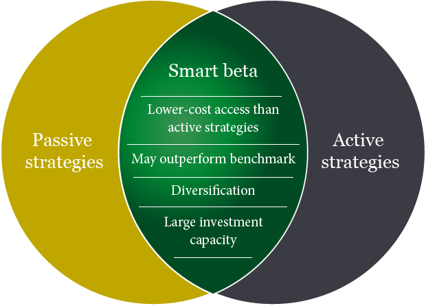

## Table of Contents

## What are smart beta strategies?

Smart beta strategies are a way to invest in the stock market that tries to do better than just picking stocks randomly or following a simple index like the S&P 500. Instead of just buying a little bit of every stock in an index, smart beta strategies use special rules to pick stocks. These rules might look at things like how big a company is, how much it pays in dividends, or how fast it's growing. The idea is to use these rules to build a portfolio that can give you better returns or less risk than a regular index fund.

There are many different smart beta strategies, and each one can focus on different things. For example, some strategies might focus on value investing, where they pick stocks that seem cheap compared to what the company is worth. Other strategies might focus on momentum, picking stocks that have been going up in price recently. No matter which strategy you choose, the goal is always the same: to do better than just following the market. But remember, smart beta strategies can be more complicated and might not always work as well as hoped, so it's important to understand them before you invest.

## How do smart beta strategies differ from traditional market cap-weighted indexes?

Smart beta strategies and traditional market cap-weighted indexes are different ways to invest in the stock market. A market cap-weighted index, like the S&P 500, is made up of stocks where the biggest companies have the most influence. So, if a company is worth a lot of money, it will make up a bigger part of the index. This means that the performance of the index depends a lot on how these big companies do.

Smart beta strategies, on the other hand, use special rules to pick stocks. These rules can be about things like how much a company pays in dividends, how fast it's growing, or how cheap its stock seems compared to what the company is worth. Instead of just following the market, smart beta tries to do better by focusing on these specific factors. This can lead to a portfolio that might give you better returns or less risk than a regular index fund, but it can also be more complicated and might not always work as well as hoped.

## What are the main types of smart beta strategies?

Smart beta strategies come in different types, and each type focuses on different things to try to do better than the market. One common type is value investing, where the strategy picks stocks that seem cheap compared to what the company is worth. Another type is [momentum](/wiki/momentum) investing, which picks stocks that have been going up in price recently. There's also dividend investing, where the focus is on companies that pay high dividends to their shareholders.

Another type of smart beta strategy is low [volatility](/wiki/volatility-trading-strategies) investing, where the goal is to pick stocks that don't go up and down in price as much as others. This can help make your investment less risky. Quality investing is another strategy, where the focus is on companies that are financially strong and well-managed. Finally, there's multi-[factor](/wiki/factor-investing) investing, which combines several of these strategies to try to get the best of all worlds.

Each of these smart beta strategies has its own way of [picking](/wiki/asset-class-picking) stocks, and they all aim to do better than just following the market. But they can be more complicated than regular index funds, and they might not always work as well as hoped. It's important to understand what each strategy is trying to do before you decide to invest in it.

## Can you explain how a value-based smart beta strategy works?

A value-based smart beta strategy works by picking stocks that seem like a good deal. It looks at things like the price of a stock compared to how much money the company makes or what it's worth. If a stock seems cheap compared to these measures, the strategy will buy more of it. The idea is that these stocks are undervalued by the market and will eventually go up in price as people realize how good they are.

This strategy is different from just buying a little bit of every stock in an index like the S&P 500. Instead of letting the biggest companies have the most influence, a value-based smart beta strategy focuses on finding bargains. By doing this, it tries to get better returns than just following the market. But it's not a sure thing, and sometimes these undervalued stocks might stay undervalued for a long time, or they might not be as good as they seem.

## What is a momentum-based smart beta strategy and how is it implemented?

A momentum-based smart beta strategy is about picking stocks that have been going up in price recently. The idea is that stocks that have been doing well will keep doing well for a while. So, this strategy buys more of the stocks that are going up and sells the ones that are going down. It's like trying to ride a wave in the stock market, hoping to catch the stocks that are on their way up.

To implement a momentum-based smart beta strategy, you look at how stocks have been doing over the last few months or a year. You then pick the ones that have gone up the most and put more money into them. You might also sell the stocks that have gone down. This way, your portfolio is always focused on the stocks that are doing the best at the moment. But remember, this strategy can be risky because if the trend changes, the stocks you picked might start going down instead of up.

## How does a low volatility smart beta strategy aim to reduce risk?

A low volatility smart beta strategy aims to reduce risk by picking stocks that don't go up and down in price as much as others. The idea is that if you invest in stocks that are less likely to have big swings in price, your whole investment will be less risky. This strategy looks at how much a stock's price changes over time and chooses the ones that are more stable. By focusing on these less volatile stocks, the strategy tries to give you a smoother ride in the stock market.

Even though this strategy can help reduce risk, it doesn't mean your investment won't lose value. It just means the ups and downs might be smaller than with other stocks. This can be good if you want to keep your money safe and don't like big changes in your investment's value. But remember, stocks that don't move much might also not grow as fast as others, so you might miss out on bigger gains.

## What are the potential benefits of using smart beta strategies in an investment portfolio?

Smart beta strategies can help you do better than just following the market. They use special rules to pick stocks, like looking for ones that are a good deal or ones that have been going up in price. This can lead to higher returns than you might get from a regular index fund. For example, if you use a value-based strategy, you might find stocks that are undervalued and could go up a lot when the market realizes how good they are. Or, if you use a momentum strategy, you might catch stocks that keep going up and make more money that way.

Another benefit of smart beta strategies is that they can help you manage risk better. For instance, a low volatility strategy picks stocks that don't go up and down as much, which can make your whole investment less risky. This can be good if you want to keep your money safe and don't like big changes in your investment's value. Even though these strategies can be more complicated than regular index funds, they give you a way to try to do better than the market while also managing risk in a way that fits your goals.

## What are the common criticisms or drawbacks of smart beta strategies?

Smart beta strategies can be more complicated than regular index funds, which can be a problem for some people. They use special rules to pick stocks, and understanding these rules can be hard. If you don't understand what the strategy is doing, you might not know if it's a good fit for you. Also, these strategies can cost more than regular index funds because they need more work to manage. So, you might end up paying more in fees, which can eat into your returns.

Another issue with smart beta strategies is that they don't always work as well as hoped. Just because a strategy looks at things like how cheap a stock is or how fast it's been going up doesn't mean it will always do better than the market. Sometimes, the stocks picked by these strategies might not do well, and you could end up with lower returns than if you had just followed the market. This means you need to be careful and understand that there's no guarantee these strategies will give you better results.

## How can smart beta strategies be combined with other investment approaches?

Smart beta strategies can be mixed with other ways of investing to make a better overall plan. For example, you might use a smart beta strategy that focuses on value investing to find good deals, but also put some money into a regular index fund to keep things balanced. This way, you can try to get the best of both worlds: the chance for higher returns from smart beta and the safety of a broad market index. You could also use smart beta to focus on different things, like low volatility for less risk and momentum for growth, and then mix these with other investments like bonds or real estate to spread out your risk even more.

Another way to combine smart beta strategies with other approaches is to use them as part of a bigger plan that includes active management. Active managers pick stocks based on their own research and ideas, and you could use smart beta to add a different kind of thinking to your portfolio. For example, you might have an active manager who focuses on tech stocks, but also use a smart beta strategy that looks at value or dividends to find other good investments. This way, you're not putting all your eggs in one basket, and you're using different methods to try to do better than the market.

## What role do factor investing and smart beta strategies play in modern portfolio construction?

Factor investing and smart beta strategies are important tools in modern portfolio construction. They help investors pick stocks based on certain characteristics, or factors, like how cheap a stock is, how fast it's growing, or how much it pays in dividends. By focusing on these factors, investors can try to do better than just following the market. For example, a value-based smart beta strategy might find stocks that are undervalued and could go up a lot when the market realizes how good they are. This way, investors can aim for higher returns while also managing risk in a way that fits their goals.

In today's investment world, factor investing and smart beta strategies are often used alongside other approaches to make a well-rounded portfolio. For instance, an investor might use a smart beta strategy that looks at low volatility to reduce risk, while also putting money into a regular index fund for broad market exposure. This mix can help balance the chance for higher returns with the safety of a diversified investment. Additionally, these strategies can be combined with active management, where a manager picks stocks based on their own research. By using smart beta to add different kinds of thinking to the portfolio, investors can spread out their risk and try to do better than the market in different ways.

## How do you evaluate the performance of a smart beta strategy?

To evaluate the performance of a smart beta strategy, you need to look at how well it does compared to a regular index fund or the overall market. You can do this by checking the returns over time. If the smart beta strategy gives you higher returns than the market, it's doing a good job. But you also need to think about the risk. A smart beta strategy might give you higher returns, but if it's also a lot riskier, it might not be worth it. So, you should look at things like how much the returns go up and down, and how much risk you're taking on.

Another way to evaluate a smart beta strategy is to compare it to other smart beta strategies. Different strategies focus on different things, like value, momentum, or low volatility. By comparing them, you can see which one works best for you. You should also think about the costs. Smart beta strategies can be more expensive than regular index funds because they need more work to manage. So, you need to make sure the extra returns you get are worth the extra cost. In the end, the best way to evaluate a smart beta strategy is to see if it helps you reach your investment goals while keeping the risk and costs in mind.

## What advanced techniques can be used to optimize smart beta strategies for better outcomes?

To make smart beta strategies work better, you can use something called multi-factor investing. This means you don't just focus on one thing, like how cheap a stock is or how fast it's been going up. Instead, you look at a bunch of different things at the same time. For example, you might pick stocks that are a good deal and also pay high dividends. By mixing different factors, you can try to get the best of all worlds and maybe do even better than if you just used one factor.

Another way to make smart beta strategies better is by using something called risk parity. This means you try to spread out the risk evenly across all the stocks in your portfolio. Instead of putting a lot of money into just a few stocks, you make sure each stock has about the same amount of risk. This can help make your whole investment less risky and might give you smoother returns over time. By using these advanced techniques, you can try to make your smart beta strategy work better and help you reach your investment goals.

## References & Further Reading

Ang, A. (2014). "Asset Management: A Systematic Approach to Factor Investing". Oxford University Press. This book offers a comprehensive insight into factor investing, providing theoretical foundations alongside practical applications, highlighting the role of various factors in portfolio management strategies.

Blitz, D., & van Vliet, P. (2007). "The Volatility Effect: Lower Risk without Lower Return". Journal of Portfolio Management. This paper explores the volatility effect in equity markets, demonstrating how lower-risk stocks can generate returns comparable to higher-risk stocks, challenging traditional risk-return assumptions.

Arnott, R. D., Hsu, J. C., & Moore, P. (2005). "Fundamental Indexation". Financial Analysts Journal. This article introduces the concept of fundamental indexation, arguing for an alternative to market-cap-weighted indices by emphasizing economic size and fundamentals, offering insights relevant to smart beta strategy implementation.

