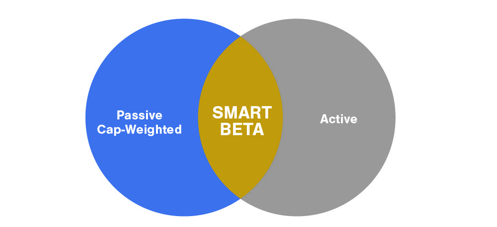

Smart beta strategies have rapidly gained attention in the investment world due to their innovative combination of passive and active management styles. By capitalizing on specific market factors, these strategies aim to enhance portfolio performance while maintaining cost-efficiency. They differ from traditional investment approaches by focusing on capturing market inefficiencies or factor exposures such as momentum, value, or liquidity rather than solely relying on market-capitalization indices.

In recent years, smart beta strategies have increasingly been implemented through algorithmic trading. Algorithms facilitate efficient, high-speed execution based on pre-defined criteria, allowing investors to optimize their portfolios quickly and accurately. The use of algorithmic trading in smart beta strategies not only minimizes transaction costs but also enables rapid responses to market fluctuations, ensuring that desired factor exposures are maintained.



This article explores the intricacies of smart beta strategies within the context of algorithmic trading. It provides an overview of their methodologies, benefits, risks, and potential future developments. Through an in-depth analysis, the article aims to shed light on how smart beta strategies, supported by technology and data analytics, continue to evolve and influence modern investment practices.

## Table of Contents

## What is Smart Beta?

Smart beta represents an innovative approach within the investment landscape that merges the strategic aspects of both passive and active management to enhance portfolio performance. Unlike traditional passive investment strategies that replicate market indices based solely on market capitalization, smart beta strategies aim to exceed these returns by focusing on specific market inefficiencies or factor exposures. Such factors typically include momentum, quality, and liquidity among others. 

The terminology 'smart beta' itself underscores a data-driven approach, whereby investment decisions are informed by quantifiable market data and systematic rules rather than subjective judgment or discretionary choices. This approach allows investors to capitalize on persistent anomalies or factor premiums that are not captured by conventional market-cap weighted indices. 

In this framework, traditional passive investment is defined by the aim to mirror a representative market index, such as the S&P 500, which assigns weights to components according to market capitalization. This may lead to an over-concentration in larger stocks and a neglect of smaller constituents that possess strong fundamentals or growth potential. By contrast, smart beta introduces an element of active decision-making. This is achieved by selecting components based on pre-determined criteria that attempt to capture the aforementioned factors that drive returns. 

Smart beta strategies redefine investment index methodologies and provide an alternative that combines the broad market exposure typical of passive strategies with the potential for outperformance often pursued through active strategies. This blend aims to deliver a more diversified risk exposure and potentially enhanced risk-adjusted returns, without significantly increasing costs or complexity. This strategic fusion of investment philosophies highlights the growing relevance and appeal of smart beta strategies in modern portfolio management.

## Understanding Smart Beta Strategies

Smart beta strategies represent an evolution in investment index methodologies, positioning themselves as an alternative to traditional market-capitalization weightings. Unlike traditional indices that allocate investments based on a company's market capitalization, smart beta strategies aim to capture specific market inefficiencies by emphasizing certain factors over others. 

Key factors targeted by smart beta strategies include value, [momentum](/wiki/momentum), quality, [liquidity](/wiki/liquidity-risk-premium), and [volatility](/wiki/volatility-trading-strategies). Each [factor](/wiki/factor-investing) is designed to exploit different dimensions of stock performance and risk:

1. **Value**: This factor targets stocks that are undervalued relative to their intrinsic worth, often measured by ratios such as price-to-earnings or price-to-book. The goal is to invest in stocks with strong fundamentals that are priced below their intrinsic value.

2. **Momentum**: Momentum strategies aim to capitalize on the continuation of existing market trends. By investing in stocks that have recently exhibited strong performance, these strategies hope to benefit from sustained price movements.

3. **Quality**: This factor focuses on investment in companies with strong financial health, characterized by attributes such as high return on equity, stable earnings, and low financial leverage. Quality stocks are believed to offer more robust returns and lower downside risk over time.

4. **Liquidity**: By targeting stocks with high trading volumes, liquidity-focused strategies ensure ease of entry and exit in positions, reducing transaction costs and market impact.

5. **Volatility**: Strategies focused on volatility often aim to either maximize returns from high-volatility stocks or minimize risk by investing in low-volatility stocks. The latter is based on the premise that lower volatility stocks can provide better risk-adjusted returns.

The appeal of smart beta strategies lies in their transparency and rules-based approach. By adhering to clearly defined criteria, these strategies enhance portfolio diversification and have the potential to improve risk-adjusted returns over time. Unlike actively managed funds that rely on forecasts and market timing, smart beta strategies offer a systematic way to achieve specific investment objectives.

Smart beta's rules-based methodology allows investors to have a clear understanding of how selections are made within a fund, reducing uncertainty and bias. Furthermore, the systematic nature of these strategies facilitates periodic rebalancing, ensuring that the portfolio remains aligned with the targeted factors. However, frequent rebalancing may also incur higher transaction costs, which must be weighed against the expected benefits.

In summary, smart beta strategies provide investors with a structured means of gaining exposure to specific market factors while offering the potential for enhanced returns and risk management through their empirical and systematic frameworks.

## Examples of Smart Beta Funds

Various funds exemplify the practical application of smart beta strategies, aiming to outperform traditional market-capitalization indices by focusing on specific factors or themes. One notable example is the Vanguard Value Index Fund [ETF](/wiki/etf-trading-strategies), which targets undervalued stocks. By employing a systematic approach to identify securities trading below their intrinsic value, this fund seeks to capitalize on the value factor, which historically tends to outperform in the long term.

The iShares Russell 1000 Growth ETF provides another illustration of smart beta strategies, focusing on [growth stocks](/wiki/growth-stocks). It selects shares with strong potential for future earnings growth, thereby leveraging the growth factor. This factor-oriented selection process aims to capture companies with superior growth prospects, contributing to potential enhanced returns over generic market indices.

These funds showcase the diversity of factor-based approaches within smart beta strategies. By targeting specific attributes such as value or growth, they aim to achieve superior risk-adjusted returns. Factor-based investing involves systematically using criteria such as dividend yield, momentum, or financial health metrics to select or weight securities. This strategy allows for greater control over portfolio construction and risk exposure, offering alternatives to traditional index-based investing. As a result, smart beta funds are an attractive option for investors seeking to harness specific market inefficiencies within a structured, rules-based framework.

## Smart Beta and Algorithmic Trading

Algorithmic trading significantly enhances the implementation of smart beta strategies by enabling rapid processing and analysis of large datasets. These algorithms, grounded in detailed quantitative models, facilitate precise execution by following a predetermined set of rules. The integration of [algorithmic trading](/wiki/algorithmic-trading) allows for optimized buying and selling decisions, which are crucial in capitalizing on the factor exposures targeted by smart beta strategies.

One of the primary advantages offered by algorithmic trading in smart beta strategies is the minimization of transaction costs. By executing trades at optimal times and with high speed, algorithms reduce the impact of market fluctuations. This reduction in transaction costs is exemplified by the use of techniques such as optimal execution algorithms, which are designed to minimize slippage and trading impact. A basic example of such an algorithm can be represented in Python as follows:

```python
import numpy as np

def optimal_execution(price_series, trade_size, total_shares):
    """
    Optimize trade execution to minimize cost.

    :param price_series: array-like, list of historical prices
    :param trade_size: int, number of shares to deal per trade
    :param total_shares: int, total number of shares to execute
    :return: float, total execution cost
    """
    n_trades = total_shares // trade_size
    execution_cost = 0.0

    for i in range(n_trades):
        trade_price = price_series[i * trade_size: (i + 1) * trade_size]
        execution_cost += np.mean(trade_price) * trade_size

    return execution_cost

# Example usage
price_data = np.random.normal(loc=50, scale=5, size=1000)  # Simulated price series
total_trade_cost = optimal_execution(price_data, trade_size=10, total_shares=1000)
print(f"Total Execution Cost: {total_trade_cost}")
```

Algorithmic trading also facilitates quick portfolio adjustments, allowing investors to swiftly react to changing market conditions. This adaptability ensures that smart beta strategies maintain their intended factor exposures. For instance, when the market exhibits increased volatility, an algorithm can rebalance the portfolio to preserve the targeted volatility factor by adjusting weight allocations.

Data-driven algorithms empower investors to maintain desired factor exposures by utilizing techniques such as [machine learning](/wiki/machine-learning). These methods can analyze patterns and predictive signals from historical data to optimize factor-based investment decisions. A simple implementation could involve using a machine learning model like linear regression for forecast-based rebalancing decisions.

By uniting the systematic benefits of algorithmic trading with the strategic insights of smart beta, investors leverage a powerful toolset for enhancing portfolio performance. This integration of technology not only refines execution efficiency but also strengthens the ability to achieve superior risk-adjusted returns in evolving financial markets.

## Challenges and Considerations

Implementing smart beta strategies requires a comprehensive understanding of investment factors and their influence on portfolio performance. Central to this approach is the recognition that frequent rebalancing is necessary to maintain the desired factor exposures. However, this frequency can significantly increase transaction costs, posing a challenge to the strategy's cost-effectiveness. The transaction costs incurred during rebalancing can erode the potential returns that smart beta strategies aim to achieve, thus necessitating careful cost-benefit analysis. 

Moreover, investors must exercise discernment in the selection and timing of factors. Factors like value, momentum, and volatility each play distinct roles in shaping portfolio outcomes, but their performance is not guaranteed across different market conditions. Historical data is often utilized to guide factor selection; however, past performance is not always a reliable indicator of future results, as market dynamics evolve over time. This unpredictability underscores the importance of adaptability in smart beta strategies, where investors must continuously assess factor validity and adjust portfolios accordingly.

Additionally, the increased complexity of smart beta strategies compared to traditional index investing requires investors to possess a higher level of expertise. Understanding the intricate interplay of chosen factors and their market interactions is crucial to optimizing the strategy's effectiveness. This complexity is compounded by the need for robust analytical tools and data processing capabilities, particularly when large datasets are analyzed for real-time factor adjustments. 

To mitigate these challenges, investors often utilize advanced technologies, such as algorithmic trading, which enhances the implementation of smart beta strategies. However, reliance on these technologies also requires rigorous oversight and verification to ensure that algorithm-driven decisions align with investment objectives and risk profiles.

In summary, while smart beta strategies offer the potential for enhanced returns and diversification, they present challenges that necessitate careful management. Investors must balance frequent rebalancing with cost considerations, exercise careful factor analysis, and adapt to changing market conditions to leverage the full benefits of these sophisticated investment approaches.

## Conclusion and Future Trends

Smart beta strategies represent an innovative fusion of passive and active management techniques, offering the potential for enhanced portfolio returns and risk mitigation. By focusing on specific factors, such as value, momentum, and quality, these strategies align investment portfolios to capitalize on identified market inefficiencies. The careful selection and weighting of these factors allow investors to craft portfolios that aim for improved risk-adjusted returns compared to traditional market-capitalization indices.

The future of smart beta is closely intertwined with the advancements in [artificial intelligence](/wiki/ai-artificial-intelligence) (AI) and data analytics. These technological innovations are poised to refine smart beta strategies further, allowing for more sophisticated factor analysis and strategy customization. AI can enhance data processing capabilities, enabling investors to better analyze vast datasets and uncover nuanced patterns that inform investment decisions. For example, machine learning algorithms can identify emerging trends and anomalies in factor performance, allowing for real-time strategy adjustments.

In addition, an increasing emphasis on environmental, social, and governance ([ESG](/wiki/esg-investing)) criteria is likely to integrate with smart beta strategies. As investors demand more responsible and sustainable investment options, the inclusion of ESG factors provides an opportunity to align investment practices with personal values without sacrificing performance. By incorporating ESG criteria into smart beta methodologies, investors can achieve a more balanced approach, addressing both financial and ethical considerations.

Despite these advantages, smart beta strategies are not without challenges. The dynamic nature of financial markets demands continuous analysis and adaptation to ensure strategies remain effective. Investors must exercise caution in factor selection and consider the temporal dynamics of factor performance, as well as the broader market environment. Frequent rebalancing, required to maintain desired factor exposures, may incur additional transaction costs, potentially affecting overall profitability.

In conclusion, smart beta strategies continue to evolve, driven by technological advancements and changing investor preferences. While they offer the promise of superior portfolio performance and risk management, they necessitate careful evaluation and ongoing management to navigate the complexities of contemporary financial markets effectively. As these strategies mature, they are expected to play an increasingly vital role in diversified investment portfolios.

## References & Further Reading

Ang, A. (2014). "Asset Management: A Systematic Approach to Factor Investing". Oxford University Press. This book offers a comprehensive insight into factor investing, providing theoretical foundations alongside practical applications, highlighting the role of various factors in portfolio management strategies.

Blitz, D., & van Vliet, P. (2007). "The Volatility Effect: Lower Risk without Lower Return". Journal of Portfolio Management. This paper explores the volatility effect in equity markets, demonstrating how lower-risk stocks can generate returns comparable to higher-risk stocks, challenging traditional risk-return assumptions.

Arnott, R. D., Hsu, J. C., & Moore, P. (2005). "Fundamental Indexation". Financial Analysts Journal. This article introduces the concept of fundamental indexation, arguing for an alternative to market-cap-weighted indices by emphasizing economic size and fundamentals, offering insights relevant to smart beta strategy implementation.