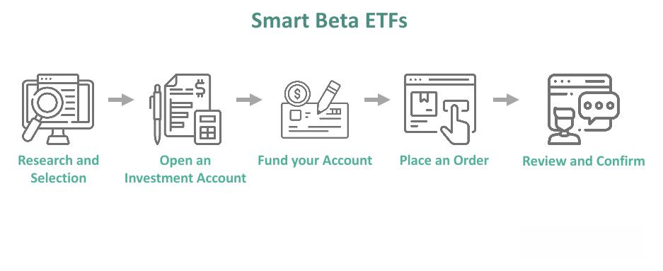

## Table of Contents

## What is Smart Beta?

Smart Beta is a way of investing that tries to do better than just following the market. Instead of just buying a bunch of stocks to match a market index like the S&P 500, Smart Beta uses special rules to pick stocks. These rules might focus on things like a company's size, how much it pays in dividends, or how risky it is. The goal is to get better returns or lower risk than you would with a regular index fund.

Think of Smart Beta as a mix between two common ways to invest: passive and active. Passive investing is when you buy an index fund and hold it, without trying to beat the market. Active investing is when you pick stocks yourself, hoping to do better than the market. Smart Beta takes the best parts of both. It uses clear rules to pick stocks, like passive investing, but it also tries to beat the market, like active investing. This makes it a smart choice for people who want something in between.

## How does Smart Beta differ from traditional market capitalization-weighted indexes?

Smart Beta and traditional market capitalization-weighted indexes are two different ways to invest in the stock market. A traditional market cap-weighted index, like the S&P 500, gives more weight to companies that are worth more money. So, if a company is big and has a high market value, it will have a bigger impact on the index's performance. This means that the index might be heavily influenced by just a few large companies.

Smart Beta, on the other hand, uses different rules to pick stocks, not just their size. It might focus on things like how much a company pays in dividends, how much its stock price moves up and down, or other special factors. By using these rules, Smart Beta tries to do better than a market cap-weighted index. It aims to give investors a chance to get higher returns or lower risk by choosing stocks in a smarter way.

## What are the main types of Smart Beta strategies?

Smart Beta strategies come in different forms, each using its own set of rules to pick stocks. One common type is the "Value" strategy, which focuses on stocks that seem to be priced lower than they should be. These stocks might be a good deal because they have low prices compared to their earnings or book value. Another type is the "Momentum" strategy, which picks stocks that have been doing well lately. The idea is that stocks that have been going up might keep going up for a while.

Another popular Smart Beta strategy is the "Low Volatility" approach, which chooses stocks that don't move up and down as much as others. This can help make a portfolio less risky. There's also the "Quality" strategy, which looks for companies that are doing well financially. These companies might have strong earnings, low debt, or other signs of being healthy. Each of these strategies tries to do better than just following the market by using smart rules to pick stocks.

Lastly, the "Dividend" strategy focuses on companies that pay out a lot of money to their shareholders. These stocks can provide a steady income, which some investors like. The "Equal Weight" strategy gives the same importance to each stock in the index, no matter how big or small the company is. This can help spread out the risk more evenly. All these Smart Beta strategies aim to give investors a better chance at higher returns or lower risk than traditional market cap-weighted indexes.

## What are the benefits of using Smart Beta in an investment portfolio?

Using Smart Beta in an investment portfolio can help you get better returns or lower risk than just following the market. Smart Beta uses special rules to pick stocks, like looking at a company's size, how much it pays in dividends, or how risky it is. This can help you do better than a regular index fund, which just copies the market. For example, if you use a Smart Beta strategy that focuses on value stocks, you might buy stocks that are priced lower than they should be, which could lead to higher returns if those stocks go up in value.

Another benefit of Smart Beta is that it can help you spread out your risk better. Instead of putting a lot of your money into just a few big companies, like a traditional index fund might do, Smart Beta can pick stocks based on other factors. This means your money is spread out more evenly across different types of companies. For example, a Smart Beta strategy that focuses on low [volatility](/wiki/volatility-trading-strategies) might choose stocks that don't move up and down as much, which can make your portfolio less risky. Overall, Smart Beta can be a smart way to invest that helps you balance the chance of higher returns with the need to manage risk.

## Can you explain how Smart Beta strategies aim to outperform the market?

Smart Beta strategies aim to outperform the market by using special rules to pick stocks, instead of just copying the market like a regular index fund. These rules can focus on things like a company's size, how much it pays in dividends, or how risky it is. For example, a Smart Beta strategy might look for value stocks, which are stocks that seem to be priced lower than they should be. If these stocks go up in value, the Smart Beta strategy could do better than the market. Another example is a [momentum](/wiki/momentum) strategy, which picks stocks that have been doing well lately. The idea is that stocks that have been going up might keep going up for a while, helping the Smart Beta strategy beat the market.

Smart Beta strategies also try to manage risk better than traditional market cap-weighted indexes. Instead of putting a lot of money into just a few big companies, Smart Beta can spread the money out more evenly across different types of companies. For example, a low volatility strategy picks stocks that don't move up and down as much, which can make the portfolio less risky. By choosing stocks based on these special rules, Smart Beta aims to give investors a better chance at higher returns or lower risk than just following the market. This makes Smart Beta a smart choice for people who want to do better than the market while also managing their risk.

## What are the potential risks associated with Smart Beta investing?

Smart Beta investing tries to do better than the market, but it comes with some risks. One big risk is that the special rules used to pick stocks might not work as well as expected. For example, if a Smart Beta strategy focuses on value stocks, those stocks might stay low or even go down in value instead of going up. This could mean the Smart Beta strategy does worse than the market, not better. Another risk is that Smart Beta strategies can be more complicated than regular index funds, which can make them harder to understand and manage.

Another risk is that Smart Beta strategies can be more expensive than traditional index funds. Because they use special rules to pick stocks, they might have higher fees. These higher costs can eat into the returns, making it harder for the Smart Beta strategy to beat the market. Also, because Smart Beta strategies often focus on certain types of stocks, like low volatility or high dividend stocks, they might not be as spread out as a regular index fund. This means they could be more affected by problems in certain parts of the market, which could lead to bigger losses if those parts do badly.

## How do you select the right Smart Beta strategy for your investment goals?

Picking the right Smart Beta strategy depends on what you want from your investments. If you're looking for higher returns, you might choose a strategy that focuses on value or momentum stocks. Value stocks are those that seem cheap compared to what they're worth, and momentum stocks are those that have been going up lately. These strategies aim to beat the market by [picking](/wiki/asset-class-picking) stocks that might do better than average. On the other hand, if you want to keep your risk low, you might go for a low volatility strategy. This strategy picks stocks that don't move up and down as much, which can help keep your portfolio steady.

You also need to think about how long you plan to keep your money invested. If you're saving for something far in the future, like retirement, you might be okay with a bit more risk and choose a strategy that aims for higher returns. But if you need your money sooner, you might want to pick a strategy that's less risky. It's also important to look at the fees of different Smart Beta strategies. Some can be more expensive than others, and higher fees can eat into your returns. So, think about your goals, how long you'll be investing, and the costs before you pick a Smart Beta strategy.

## What are some common performance metrics used to evaluate Smart Beta funds?

When people want to see how well a Smart Beta fund is doing, they look at some common performance metrics. One of these is the "excess return," which is how much more or less the fund made compared to a regular market index like the S&P 500. If a Smart Beta fund has a higher excess return, it means it did better than the market. Another important metric is the "Sharpe ratio," which measures how much return you get for the risk you take. A higher Sharpe ratio means the fund did a good job of giving you more return without taking on too much risk.

Another metric people use is "tracking error," which shows how much the Smart Beta fund's performance differs from the market index it's trying to beat. A lower tracking error means the fund's performance is more like the market's, while a higher tracking error means it's more different. People also look at "alpha," which is a measure of how much the fund manager's choices helped the fund do better than the market. A positive alpha means the fund did better than expected, thanks to the manager's smart choices. These metrics help investors see if a Smart Beta fund is doing what it's supposed to do: beat the market while managing risk.

## How have Smart Beta strategies performed historically compared to traditional indexes?

Smart Beta strategies have had mixed results when compared to traditional indexes over time. Some Smart Beta strategies, like those focusing on value or momentum, have done better than the market in certain periods. For example, during times when the market is doing well and certain stocks are hot, a momentum strategy might beat the S&P 500. On the other hand, value strategies can do well when the market thinks some stocks are underpriced and they start to go up. However, these strategies don't always win. There are times when they do worse than the market, especially if the special rules they use to pick stocks don't work out as planned.

Overall, Smart Beta strategies can be a good choice for investors who want to try to do better than the market, but they come with more risk and sometimes higher costs. Traditional indexes, like the S&P 500, are simpler and usually cheaper to invest in. They give you a broad look at the market and can be a safe bet over the long term. But because Smart Beta strategies use different rules to pick stocks, they can offer a chance for higher returns or lower risk, depending on the strategy you choose. It's important to look at how these strategies have done in the past, but remember that past results don't guarantee future success.

## What role does factor investing play in Smart Beta strategies?

Factor investing is a big part of Smart Beta strategies. It means picking stocks based on certain things, called factors, that can help a portfolio do better than just following the market. These factors can be things like how big a company is, how much it pays in dividends, or how risky it is. Smart Beta uses these factors to choose stocks in a smart way, instead of just copying the market. For example, if a Smart Beta strategy focuses on the value [factor](/wiki/factor-investing), it will pick stocks that seem to be priced lower than they should be. This can help the portfolio do better if those stocks go up in value.

Smart Beta strategies use factor investing to try to beat the market while also managing risk. By focusing on different factors, like low volatility or high dividends, Smart Beta can spread out the risk in a portfolio. This means the portfolio might not go up and down as much as the market. Factor investing helps Smart Beta strategies give investors a better chance at higher returns or lower risk than traditional market cap-weighted indexes. It's all about using these special factors to make smarter choices about which stocks to buy.

## How can Smart Beta be integrated with other investment strategies like active management?

Smart Beta can be mixed with active management to make a better investment plan. Active management is when someone picks stocks and tries to do better than the market. Smart Beta uses special rules to pick stocks, like looking at a company's size or how much it pays in dividends. By using both, you can get the best of both worlds. The Smart Beta part can help spread out your risk and maybe give you higher returns by following clear rules. The active management part can let a skilled manager make smart choices that might beat the market even more.

For example, you might use a Smart Beta strategy that focuses on value stocks to form the base of your portfolio. This can help you buy stocks that are priced lower than they should be. Then, you can let an active manager pick some other stocks that they think will do really well. This way, the Smart Beta part keeps your portfolio balanced and following clear rules, while the active management part lets you try to do even better. By mixing Smart Beta with active management, you can aim for higher returns while also managing your risk in a smart way.

## What are the latest trends and innovations in the Smart Beta space?

In the Smart Beta world, one big trend is using more data and technology to make smarter choices about which stocks to pick. People are using things like [artificial intelligence](/wiki/ai-artificial-intelligence) and [machine learning](/wiki/machine-learning) to find new factors that can help a portfolio do better. These new tools can look at a lot of information quickly and find patterns that might be hard for people to see. This can help Smart Beta strategies do even better than before by picking stocks in a smarter way.

Another trend is mixing different Smart Beta strategies together to make a better overall plan. Instead of just using one strategy, like focusing on value stocks or low volatility stocks, investors are using several strategies at the same time. This can help spread out the risk and maybe give higher returns. It's like having a team of different players, each doing their own thing, but all working together to win the game. By mixing these strategies, investors can aim for a more balanced and successful portfolio.

## What is the Role of Smart Beta in Algorithmic Trading?

Smart Beta strategies have gained traction in the world of [algorithmic trading](/wiki/algorithmic-trading) due to their potential to enhance decision-making processes, streamline trading operations, and optimize portfolio outcomes. These strategies, which blend elements of passive and active investing, aim to outperform traditional market-cap-weighted indices by leveraging specific investment factors.

### Automating Smart Beta Strategies

The automation of Smart Beta strategies involves the systematic application of factor-based rules within trading algorithms. This process enables traders to build portfolios that dynamically adjust to changing market conditions while mitigating human biases. By embedding predefined rules and criteria, algorithms can capture Smart Beta factors such as value, momentum, or volatility, thereby allowing for more responsive and adaptive trading decisions.

For instance, consider a trading algorithm designed to leverage the momentum factor. The algorithm could automatically adjust portfolio holdings based on momentum indicators, such as moving averages. The formula might look like this:

$$
\text{Signal} = \text{MA}_{\text{short-term}} - \text{MA}_{\text{long-term}}
$$

where $\text{MA}_{\text{short-term}}$ and $\text{MA}_{\text{long-term}}$ represent short and long-term moving averages. A positive signal suggests buying, while a negative one suggests selling, which the algorithm can execute instantly.

### Integrating Smart Beta Factors in Trading Algorithms

Integrating Smart Beta factors into trading algorithms often involves a multi-factor approach, combining various factors to construct diversified portfolios. This method can mitigate risks associated with individual factor performance and enhance overall returns. 

For example, an algorithm can integrate the size and value factors by selecting stocks with attractive valuations within smaller market capitalizations. The selection could be based on metrics such as low price-to-[earning](/wiki/earning-announcement)s ratios for value and a robust earnings growth outlook for size. Python's programming capabilities can facilitate this integration, utilizing libraries like Pandas for data manipulation and NumPy for numerical calculations.

```python
import pandas as pd
# Sample pseudo-code to filter stocks
stocks_data = pd.DataFrame({
    'Company': ['A', 'B', 'C'],
    'PE_Ratio': [10, 25, 14],
    'Market_Cap': [500e6, 1.5e9, 600e6]
})

# Define conditions for value and size factors
value_condition = stocks_data['PE_Ratio'] < 15
size_condition = stocks_data['Market_Cap'] < 1e9

# Selecting stocks based on the integration of Smart Beta factors
selected_stocks = stocks_data[value_condition & size_condition]
```

### Impact on Trading Efficiency and Portfolio Diversification

The incorporation of Smart Beta strategies can significantly enhance trading efficiency by reducing the need for continual manual intervention and allowing for timely execution based on rule-driven parameters. By automating decision-making processes, trades are executed with precision and speed, potentially leading to improved market entries and [exit](/wiki/exit-strategy)s and lower transaction costs.

Moreover, Smart Beta strategies contribute to portfolio diversification by enhancing exposure to multiple return sources beyond the traditional market cap. This exposure can lead to more resilient portfolios capable of withstanding varying market cycles. The diverse factors employed in Smart Beta strategies, such as low volatility and quality, protect against macroeconomic shifts, thereby reducing the overall risk profile of the portfolio.

By automating Smart Beta strategies and efficiently integrating their factors, algorithmic trading platforms stand to benefit from improved decision-making capabilities and increased resilience, ultimately leading to superior risk-adjusted returns for investors.

## References & Further Reading

[1]: ["Advances in Financial Machine Learning"](https://www.amazon.com/Advances-Financial-Machine-Learning-Marcos/dp/1119482089) by Marcos Lopez de Prado

[2]: ["Quantitative Investing: Strategies to Exploit Stock Market Anomalies for All Investors"](https://www.amazon.com/Quantitative-Investing-Strategies-anomalies-investors/dp/0857193007) by Fred Piard