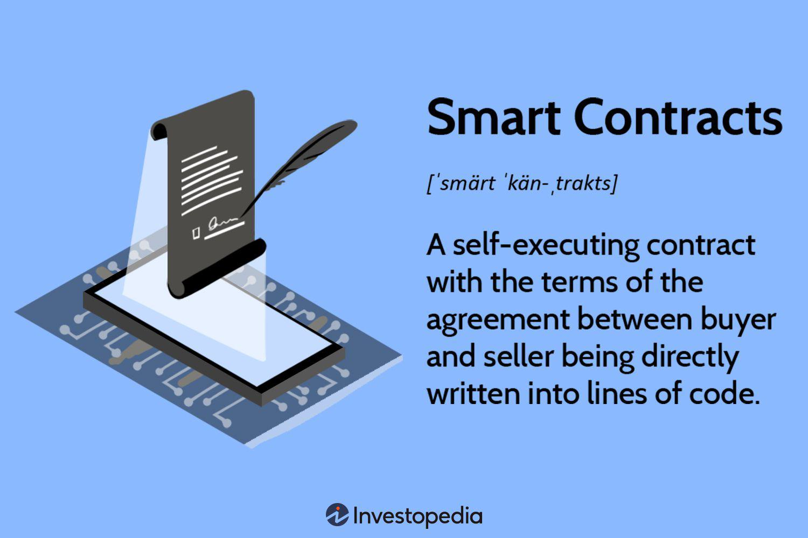

The integration of blockchain technology with smart contracts has catalyzed a significant transformation in cryptocurrency and algorithmic trading. By enhancing the technological infrastructure of financial systems, these innovations support a more secure and efficient trading environment. Blockchain serves as a decentralized ledger, providing transparency and security, while smart contracts introduce automated execution of agreements without needing intermediaries. This automation is instrumental in achieving swift and accurate transactions, helping to eliminate traditional bottlenecks and enhancing trust among trading parties.

Smart contracts, essentially self-executing computer protocols on a blockchain, enable the automatic fulfillment of contractual agreements once predetermined conditions are satisfied. This breakthrough allows for smooth operations with minimal human intervention, thus reducing the potential for error and bias in trading activities. As a result, participants benefit from increased transaction speed and accuracy, which are critical factors in algorithmic trading where rapid market responses are essential.



The rise of decentralized finance (DeFi) platforms has further intensified the role of smart contracts, offering avenues for innovation in secure and transparent financial transactions. DeFi leverages blockchain to operate without central control, democratizing access to financial products and eliminating traditional barriers. Through smart contracts, DeFi platforms facilitate complex financial transactions such as lending, borrowing, and trading with greater efficiency and reduced counterparty risk.

Understanding these foundational components underscores their potential to drive efficiency and innovation within financial markets. As blockchain technology and smart contracts continue to evolve, their combined potential promises transformative impacts on the global trading landscape, setting the stage for a new era in financial market dynamics where rapid, reliable, and autonomous transactions become the standard.

## Table of Contents

## Understanding Blockchain and Smart Contracts

Blockchain technology serves as the backbone of decentralized networks, functioning as an immutable ledger that underpins transparency and security in transactions. This distributed ledger technology (DLT) ensures that all participants in the network have access to an identical copy of the record, thus promoting trust and accountability.

Smart contracts are a significant complement to the blockchain ecosystem. These are self-executing digital agreements with the terms of the contract directly written into code, stored on the blockchain, and automatically triggered when pre-defined conditions are met. This feature eliminates the need for intermediaries, as the contracts autonomously verify and enforce transactions. A simple analogy can be drawn with a vending machine: once you insert the correct amount of money, the machine automatically dispenses the selected product. Similarly, smart contracts execute predefined actions when the specified conditions are satisfied.

The primary advantages of smart contracts lie in their autonomy, transparency, and security. The absence of intermediaries leads to efficiency in execution, reducing both time and cost. Because the contracts are stored on a blockchain, they are invariant and transparent, ensuring that the process is accessible for verification but resistant to unauthorized alterations. This functionality significantly bolsters the confidence of the involved parties by assuring that the terms of the agreement will be invariably executed as stipulated.

The execution of smart contracts is precise and minimizes the chance of manual errors, as the automation guarantees accuracy and consistency. For instance, in a financial trading context, smart contracts could automate the sale of an asset when its price reaches a predetermined threshold. Below is a basic Python representation of how a smart contract condition might be structured for automatic execution in such a scenario:

```python
class SmartContract:
    def __init__(self, target_price, current_price):
        self.target_price = target_price
        self.current_price = current_price

    def check_and_execute(self):
        if self.current_price >= self.target_price:
            self.execute_trade()

    def execute_trade(self):
        print("Trade executed: Asset sold at target price.")

# Usage
contract = SmartContract(target_price=100, current_price=105)
contract.check_and_execute()
```

In this example, the `SmartContract` class defines a scenario where an asset is sold once the current price meets or exceeds the target price, illustrating the automatic execution feature of smart contracts. The technology's potential extends beyond simple transactions, fostering innovations and improvements in various sectors by optimizing processes, enhancing security, and ensuring trust.

## History and Development of Smart Contracts

Smart contracts, a foundational concept of modern blockchain ecosystems, trace their origins back to 1994 when cryptographer Nick Szabo first proposed them. Szabo envisioned a digital agreement that would self-execute when specific conditions were fulfilled, aiming to enhance the efficiency and security of electronic transactions. His concept was driven by the notion of reducing reliance on traditional legal frameworks and intermediaries, thereby lowering transaction costs and increasing the reliability of agreements.

Szabo's vision extended to the handling of synthetic assets like derivatives and bonds via smart contracts. He hypothesized that these self-executing agreements could automate complex financial transactions, ensuring precision and trust without the need for human intervention. Although the computational infrastructure necessary to implement such contracts was limited at the time, Szabo's theoretical groundwork laid the path for future technological advancements.

The practical realization of smart contracts emerged with the advent of blockchain technology, particularly through platforms like Ethereum, launched in 2015. Ethereum's blockchain introduced a decentralized environment conducive to running code—smart contracts—in a secure and deterministic manner. Smart contracts on Ethereum are written in programming languages like Solidity, enabling developers to deploy complex algorithms that manage assets, enforce regulations, and execute transactions autonomously.

The evolution from theoretical constructs to real-world applications represents a significant milestone in financial technology. Ethereum's architecture, leveraging a global network of nodes, ensures that smart contracts are tamper-proof and immutable once deployed. This technological breakthrough has revolutionized financial transactions, providing a robust alternative to conventional modes of operation, and has spurred further innovations in decentralized finance (DeFi) and beyond.

In summary, Nick Szabo's pioneering idea has metamorphosed into a dynamic technological tool that powers various blockchain applications today. As the blockchain ecosystem continues to grow, smart contracts remain at the forefront, transforming the way individuals and institutions engage in financial transactions globally.

## Applications of Smart Contracts in Cryptocurrency Trading

Smart contracts significantly enhance the functionality and efficiency of [cryptocurrency](/wiki/cryptocurrency) trading, particularly within decentralized platforms. These contracts offer a robust mechanism for executing trades without the need for centralized intermediaries, ensuring faster transaction processing and heightened security. 

In decentralized exchanges (DEXs), smart contracts are pivotal. They facilitate automatic trade execution by encoding the trading logic directly onto the blockchain, thus eliminating the need for a central authority. This approach enhances trust between trading parties, as the rules embedded in the smart contracts are transparent and immutable once deployed. As a result, users can trade directly with one another, reducing fees and improving transaction speeds.

Additionally, smart contracts support a wide array of financial operations. For instance, they enable token swaps, which involve exchanging one cryptocurrency token for another directly on the blockchain. This process is streamlined by smart contracts, ensuring that the exchange occurs only if predetermined conditions are satisfied, thus minimizing risks.

Moreover, smart contracts are crucial in executing more complex automated trading strategies such as [arbitrage](/wiki/arbitrage) and yield farming. Arbitrage involves exploiting price differences of the same asset in different markets, and yield farming involves leveraging decentralized finance (DeFi) protocols to earn returns through lending or providing [liquidity](/wiki/liquidity-risk-premium). Both strategies rely on smart contracts to execute transactions swiftly and automatically, capturing opportunities that might be lost with manual intervention.

A key advantage of employing smart contracts in cryptocurrency trading is the reduction of counterparty risk. Since the execution of trades is governed by predefined rules within the code of the contract, parties can trade without needing to trust each other. This [factor](/wiki/factor-investing) not only increases transparency but also enhances the security of transactions, offering verifiable and tamper-proof records on the blockchain.

Overall, smart contracts revolutionize cryptocurrency trading by providing a framework for secure, efficient, and transparent financial transactions. Their integration into decentralized trading platforms underscores their transformative potential in optimizing trading processes and mitigating associated risks.

## Pros and Cons of Smart Contracts

Smart contracts are fundamentally driven by their ability to enhance efficiency and accuracy in executing transactions. By removing the necessity for intermediaries such as brokers or financial institutions, they streamline processes, reducing both time and costs involved. This is primarily achieved by automating transactions, where conditions coded into the contract execute predefined actions without human intervention. Such automation reduces the likelihood of manual errors, further enhancing accuracy and reliability.

Moreover, the use of blockchain technology ensures that records are immutable and transparent. Once a transaction is recorded on the blockchain, it cannot be altered, providing a permanent, tamper-proof audit trail. This immutability aspect not only aids in accuracy and transparency but also fortifies trust between parties involved in a transaction.

However, the immutability of blockchain can also be a double-edged sword. If a smart contract contains code errors, these errors become permanently embedded, leading to potential financial loss or unintended outcomes. The reliance on programmers to write precise and error-free code heightens the necessity for meticulousness and expertise in smart contract development. Trust must also be placed in the code's accuracy, as any flaws could trigger incorrect executions.

To mitigate these risks, thorough pre-deployment audits and testing are essential. Ensuring that smart contracts are free from bugs and security loopholes requires robust validation mechanisms. Several techniques, such as formal verification, can be employed to mathematically prove the correctness of a program relative to a certain formal specification. Conducting regular audits and employing external code reviewers can further ensure comprehensive scrutiny and fortify contract security.

In conclusion, while smart contracts bring significant efficiency and accuracy benefits, their deployment involves navigating potential pitfalls inherent in their immutability and reliance on precise programming. Adequate measures and best practices in development and testing are crucial to harness their full potential while safeguarding against vulnerabilities.

## Impact on Algorithmic Trading

Smart contracts significantly impact [algorithmic trading](/wiki/algorithmic-trading) by introducing an enhanced level of automation that uses pre-defined strategies based on real-time market data. These contracts operate on the principle of executing instructions automatically when specific criteria are satisfied, thus improving the precision and efficiency of algorithmic trading. This system allows for reduced latency in response to market fluctuations, as orders are executed without human intervention.

Algorithmic trading systems rely heavily on speed and accuracy. Smart contracts contribute to these needs by ensuring trades are automatically conducted when predetermined conditions are met, thereby increasing the speed at which trades can be executed in response to market dynamics. This not only aids in capitalizing on fleeting trading opportunities but also reduces the risk of human error, as decisions are made and executed automatically.

The integration of [artificial intelligence](/wiki/ai-artificial-intelligence) (AI) and emerging technologies further amplifies the benefits derived from smart contracts in trading algorithms. AI can process vast amounts of information to predict market trends better and adapt trading strategies accordingly. By combining AI with smart contracts, traders can leverage data analytics to refine and optimize their trading algorithms continuously.

For instance, a Python-based algorithm leveraging both AI and smart contracts might look something like this:

```python
import requests
import json

# Sample function to check a trading condition
def check_trading_condition():
    # Hypothetical API call to fetch market data
    response = requests.get("https://api.example.com/marketdata")
    data = response.json()

    # Assess market condition based on fetched data
    if data['price'] > predefined_threshold:
        return True
    return False

# Smart contract execution
def execute_trade():
    if check_trading_condition():
        # Execute the trade by interacting with smart contract
        transaction_payload = {'action': 'execute_trade'}
        # Simulate sending transaction to blockchain via a smart contract
        response = requests.post("https://api.example.com/execute", json=transaction_payload)
        return response.json()

# Trigger trade execution
result = execute_trade()
print(result)
```

In this example, real-time data is fetched and analyzed. When certain conditions are met, a trade is executed automatically through a smart contract. This illustrates how smart contracts, combined with algorithmic systems, can streamline trading processes and respond swiftly to changing market conditions.

Ultimately, the synergy between smart contracts and algorithmic trading paves the way for more adaptive and intelligent trading systems. As these technologies evolve, they promise to bring further refinements in trade execution and strategy optimization, leading to a more agile and responsive trading environment.

## Case Studies and Real-World Implementations

Examining real-world implementations of blockchain technology in financial markets reveals notable advancements in transaction speed, cost efficiency, and trust. One prominent example is the adoption of smart contracts for automated settlements, which has drastically improved processing times and reduced operational costs for several companies.

A landmark case is that of the Australian Securities Exchange (ASX), which has explored the use of blockchain technology to replace its existing clearing and settlement system. The implementation aimed to streamline operations, resulting in faster transaction processing and increased system reliability. By utilizing smart contracts, ASX could automate the settlement process, reducing the need for human intervention and the potential for errors, thereby enhancing overall efficiency and trust in the system.

Another example is the integration of blockchain in trade finance by companies like HSBC and IBM, which have employed smart contracts to facilitate cross-border transactions. These contracts execute predefined conditions automatically, ensuring that all parties fulfill their obligations without the need for intermediaries. HSBC's use of blockchain has notably reduced the time needed to complete transactions, cutting down a typical multi-day process to just a few hours. This efficiency gain is attributed to the real-time updating capabilities and the transparency offered by blockchain, which reduces manual verification and associated costs.

In the realm of digital finance, decentralized exchanges (DEXs) have leveraged blockchain technology to support smart contract-driven trading platforms. For instance, platforms like Uniswap and SushiSwap utilize automated market-making mechanisms to allow for peer-to-peer trading without a central authority. These smart contracts enable the automatic matching and execution of trades, significantly reducing associated costs and eliminating counterparty risks. The transparency and security provided by blockchain further strengthen users' trust in these systems, promoting higher adoption rates and liquidity.

These implementations underscore the transformative potential of blockchain technology in both traditional and digital finance ecosystems. The ability of blockchain to enhance efficiency, reduce costs, and build trust through immutable and transparent records highlights its role as a significant enabler of innovation in financial markets. As these technologies continue to evolve, they are expected to unlock further improvements and facilitate the integration of blockchain solutions across a broader spectrum of financial services.

## Future Trends and Developments

The continued evolution of blockchain technology is set to profoundly impact financial markets by introducing more sophisticated functionalities in smart contracts and their seamless integration with traditional finance. This development aims to improve efficiency, transparency, and security in financial operations. As blockchain platforms mature, they are expected to support increasingly complex financial transactions, such as derivatives trading and cross-border payments, enabling traditional financial institutions to adopt these technologies extensively.

Regulatory landscapes are also projected to evolve to accommodate the burgeoning field of decentralized technologies. Existing regulatory frameworks are often inadequate for addressing the unique challenges and opportunities presented by blockchain. Therefore, policymakers worldwide are considering new regulations that balance innovation with consumer protection, potentially fostering a more conducive environment for blockchain innovation. This could see enhanced legal clarity and standards, encouraging traditional financial institutions to incorporate blockchain into their operations.

Emerging technologies, such as quantum computing, may further influence the capabilities of blockchain-based trading algorithms. Quantum computing could theoretically solve complex problems exponentially faster than classical computers, which might impact cryptographic security—a foundational element of blockchain. Consequently, new cryptographic techniques may be developed to preemptively strengthen blockchain systems against potential quantum attacks. Moreover, quantum computing could optimize algorithmic trading strategies by efficiently analyzing large datasets and executing trades at unprecedented speeds, creating more adaptive and intelligent trading algorithms.

In summary, the future development of blockchain technology promises to transform traditional finance through sophisticated smart contract capabilities, a favorable regulatory environment, and the integration of emerging technologies like quantum computing. These advancements have the potential to redefine the efficiency and security of global financial systems.

## Conclusion

Blockchain, smart contracts, and cryptocurrency trading form a synergy with the capacity to reshape financial markets significantly. This combination's inherent efficiency, transparency, and security offer a paradigm shift towards more automated and reliable trading environments. The automation potential of smart contracts streamlines operations by executing transactions without the need for intermediaries, leading to faster, more cost-effective processes. Moreover, the transparency of blockchain technology ensures that all transactions are recorded on an immutable ledger, reducing fraud and increasing trust among market participants.

As these technologies mature, their adoption is expected to broaden, further integrating blockchain and smart contracts into the financial ecosystem. This progression will likely foster innovative trading solutions that blend traditional finance practices with decentralized technology benefits. Smart contracts, particularly, provide an opportunity for algorithmic trading strategies to evolve, enabling real-time decisions based on market data, thus minimizing human errors and maximizing response speed to market fluctuations.

Looking ahead, the continuous improvement and integration of blockchain technologies in financial markets suggest a future where decentralized systems dominate, supporting a more dynamic and inclusive economic infrastructure. The adaptability of blockchain and smart contracts to various applications underscores their potential to lead future innovations in financial markets, presenting a transformative impact on how trading and transactions are conducted.

## References & Further Reading

[1]: Szabo, N. (1997). ["The Idea of Smart Contracts."](https://nakamotoinstitute.org/library/the-idea-of-smart-contracts/) 

[2]: Antonopoulos, A. M., & Wood, G. (2018). ["Mastering Ethereum: Building Smart Contracts and DApps."](https://www.amazon.com/Mastering-Ethereum-Building-Smart-Contracts/dp/1491971940) O'Reilly Media.

[3]: Buterin, V. (2014). ["Ethereum White Paper."](https://ethereum.org/content/whitepaper/whitepaper-pdf/Ethereum_Whitepaper_-_Buterin_2014.pdf)

[4]: Mougayar, W. (2016). ["The Business Blockchain: Promise, Practice, and Application of the Next Internet Technology."](https://books.google.com/books/about/The_Business_Blockchain.html?id=CEsPDAAAQBAJ) Wiley.

[5]: Swan, M. (2015). ["Blockchain: Blueprint for a New Economy."](https://dl.acm.org/doi/book/10.5555/3006358) O'Reilly Media.

[6]: Tapscott, D., & Tapscott, A. (2016). ["Blockchain Revolution: How the Technology Behind Bitcoin Is Changing Money, Business, and the World."](https://dl.acm.org/doi/10.5555/3051781) Penguin.

[7]: Wright, A., & De Filippi, P. (2015). ["Decentralized Blockchain Technology and the Rise of Lex Cryptographia."](https://papers.ssrn.com/sol3/papers.cfm?abstract_id=2580664)

[8]: Narayanan, A., Bonneau, J., Felten, E., Miller, A., & Goldfeder, S. (2016). ["Bitcoin and Cryptocurrency Technologies."](https://press.princeton.edu/books/hardcover/9780691171692/bitcoin-and-cryptocurrency-technologies) Princeton University Press.