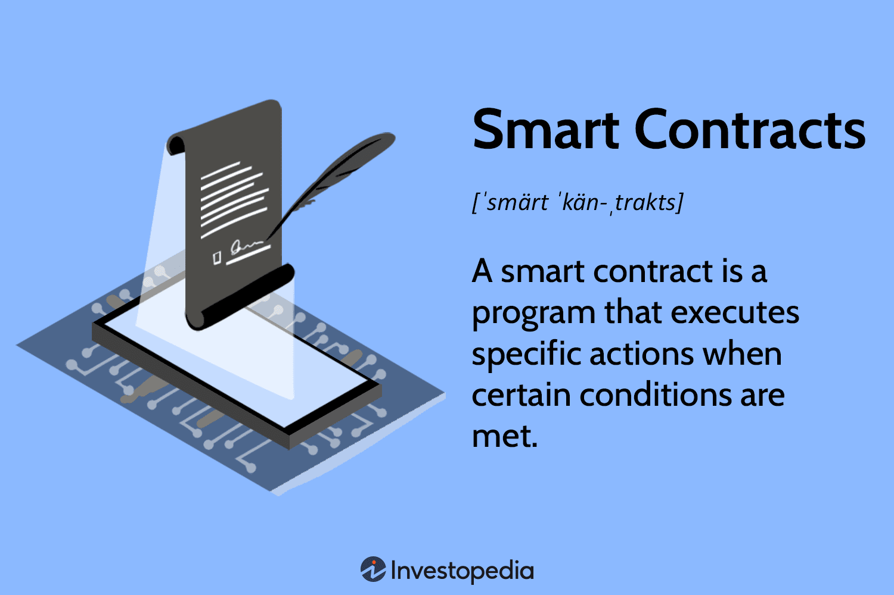

## Table of Contents

## What is a smart contract?

A smart contract is like a digital agreement that automatically carries out the terms of a contract between people or organizations. It uses computer code to make sure that everything happens as agreed, without needing a middleman like a bank or lawyer. For example, if you and a friend make a bet on a sports game, a smart contract can hold the money and automatically pay out to the winner based on the game's result.

These contracts run on blockchain technology, which is a secure way to record and store information. Because the code is on a blockchain, it's very hard to change or cheat the system. This makes smart contracts useful for things like buying and selling things online, managing money, or even voting in elections. They help make transactions faster, cheaper, and more trustworthy.

## How do smart contracts work on a blockchain?

Smart contracts work on a blockchain by using special computer code that runs automatically when certain conditions are met. Imagine a vending machine: you put in money, press a button, and get a snack. A smart contract is similar. It's like a set of rules written in code that lives on the blockchain. When someone sends a transaction that meets these rules, the smart contract does what it's programmed to do, like transferring money or recording information.

The blockchain is important because it's like a public notebook that everyone can see but no one can easily change. Every time a smart contract does something, it's written down in this notebook for everyone to check. This makes the system very secure and trustworthy. Because the blockchain is spread across many computers, it's hard for anyone to cheat or change the smart contract's rules. This way, people can trust that the smart contract will do exactly what it's supposed to do, without needing a middleman to make sure everything is fair.

## What are the benefits of using smart contracts?

Smart contracts have many benefits. One big benefit is that they save time and money. Because smart contracts automatically do what they're supposed to do, you don't need to wait for a bank or a lawyer to handle things. This makes things faster and cheaper. For example, if you're buying a house, a smart contract can handle the payment and ownership transfer without any extra fees or long waits.

Another benefit is that smart contracts are very safe and trustworthy. They run on a blockchain, which is like a big, secure notebook that everyone can see but no one can easily change. This means that once a smart contract is set up, it's very hard for anyone to cheat or mess with it. This makes people feel more confident that their agreements will be followed exactly as planned.

## What programming languages are commonly used to write smart contracts?

Smart contracts are usually written in special programming languages that work well with blockchains. One of the most common languages is Solidity, which is used on the Ethereum blockchain. Solidity is popular because it's easy to understand and use, and it has lots of tools and support for developers. Another language is Chaincode, which is used on Hyperledger Fabric. Chaincode is good for businesses because it lets them set up private blockchains for their own use.

There are also other languages like Vyper, which is simpler than Solidity and aims to be more secure, and Rust, which is used for writing smart contracts on the Polkadot and Solana blockchains. Rust is known for being fast and safe, which makes it a good choice for complex smart contracts. Each of these languages has its own strengths and is chosen based on what the smart contract needs to do and which blockchain it will run on.

## Can you explain the concept of decentralization in relation to smart contracts?

Decentralization means that instead of one person or group being in charge, many different people or computers work together to make decisions. When it comes to smart contracts, this is important because it makes them more fair and safe. Smart contracts run on blockchains, which are decentralized networks. This means that the code of the smart contract is stored on many different computers all over the world, not just one. Because of this, no single person or company can control or change the smart contract. It makes it harder for anyone to cheat or mess with the system.

This decentralization is a big reason why people trust smart contracts. Since the rules are set in code and spread across many computers, everyone can see what's happening and check that the smart contract is doing what it's supposed to do. This is different from traditional contracts, where you might need to trust a bank or a lawyer to make sure everything is fair. With smart contracts, the trust comes from the technology itself, not from a middleman. This can make transactions and agreements more reliable and transparent.

## What are some common use cases for smart contracts?

Smart contracts can be used in many different ways. One common use is in finance, where they help with things like loans and payments. For example, if you want to borrow money, a smart contract can automatically check if you meet the loan conditions and then release the money to you. It can also set up payments so that you pay back the loan on time, without needing a bank to manage everything.

Another use is in supply chain management. Companies can use smart contracts to track goods from the factory to the store. The smart contract can automatically update the status of the goods as they move, making sure everyone knows where things are and if they arrive on time. This helps businesses work more smoothly and trust each other more.

Smart contracts are also used in real estate to make buying and selling property easier. Instead of going through a long process with lawyers and banks, a smart contract can handle the payment and transfer of ownership all at once. This makes the whole process faster and cheaper, and it's easier for everyone to trust that the deal will go through as planned.

## How do smart contracts enhance security and trust in transactions?

Smart contracts make transactions more secure and trustworthy by running on a blockchain, which is a very safe and open system. A blockchain is like a big notebook that everyone can see but no one can easily change. When a smart contract does something, like moving money or recording information, it gets written down in this notebook for everyone to check. This means that once a smart contract is set up, it's very hard for anyone to cheat or mess with it. Because the rules are in code and spread across many computers, it's almost impossible for one person to change things without everyone knowing.

This setup also helps build trust because people don't need to rely on a middleman like a bank or a lawyer to make sure everything is fair. With smart contracts, the trust comes from the technology itself. Everyone can see what's happening and check that the smart contract is doing what it's supposed to do. This makes transactions more reliable and transparent. People feel more confident that their agreements will be followed exactly as planned, without any surprises or hidden fees.

## What are the potential risks and challenges associated with smart contracts?

Smart contracts have some risks and challenges that people need to be aware of. One big risk is that if the code of a smart contract has a mistake or a bug, it can cause big problems. Since smart contracts run automatically, a small error can lead to money being lost or agreements not working as planned. It's hard to fix these mistakes once the smart contract is on the blockchain because it's very hard to change anything on a blockchain. This means that people need to be very careful when writing and checking the code before using it.

Another challenge is that smart contracts depend a lot on the information they get from the outside world. This information, called "oracles," can sometimes be wrong or late. If a smart contract uses bad information, it might do the wrong thing. Also, not everyone understands how smart contracts work, which can lead to confusion or misuse. People need to learn more about them and be careful when using them, especially with important things like money or property.

## How can one deploy a smart contract on a blockchain?

To deploy a smart contract on a blockchain, you first need to write the smart contract code using a programming language like Solidity for Ethereum. Once the code is written, you need to test it thoroughly to make sure it works correctly and doesn't have any bugs. After testing, you'll need to compile the code, which turns it into a format that the blockchain can understand. Then, you use a special tool called a "wallet" or a "development environment" to send the compiled code to the blockchain. This process usually involves paying a small fee in cryptocurrency, called "gas" on Ethereum, to cover the cost of adding your smart contract to the blockchain.

Once you send the smart contract to the blockchain, it gets checked by the network of computers that run the blockchain. If everything is okay, the smart contract is added to the blockchain and becomes active. From that point on, anyone can interact with the smart contract by sending transactions to it, as long as they follow the rules set in the code. It's important to keep in mind that once a smart contract is deployed, it's very hard to change it, so you need to be sure it's correct before you deploy it.

## What is the difference between a smart contract and a traditional contract?

A smart contract is like a digital agreement that uses computer code to automatically carry out the terms of the contract. It runs on a blockchain, which is a secure and public system that everyone can see but no one can easily change. This means that once a smart contract is set up, it does what it's supposed to do without needing a middleman like a bank or a lawyer. For example, if you and a friend make a bet, a smart contract can hold the money and pay out to the winner based on the result, all by itself.

A traditional contract is a written or spoken agreement between people or organizations. It usually needs someone like a lawyer or a judge to make sure everyone follows the rules. Traditional contracts can take a long time to set up and can be more expensive because you might need to pay for lawyers or other services. They also rely on trust between the people involved and the people who enforce the contract. Smart contracts, on the other hand, use technology to make things faster, cheaper, and more trustworthy because the rules are in code and can't be easily changed.

## How do smart contracts handle disputes and what mechanisms are in place for enforcement?

Smart contracts handle disputes differently than traditional contracts because they rely on code to carry out the terms of the agreement. If a dispute arises, the smart contract will do what it's programmed to do based on the conditions set in the code. This means that if both parties agreed to the rules beforehand, the smart contract will automatically enforce those rules without needing a third party like a judge or arbitrator. However, if there's a problem with the code or if the dispute is about something the smart contract can't handle, the parties might need to go to court or use other ways to solve the problem.

The enforcement of smart contracts comes from the blockchain technology they run on. Because the blockchain is a secure and public system, once a smart contract is deployed, it's very hard for anyone to change it or stop it from working. This makes the smart contract's rules very reliable. If someone tries to break the rules, the smart contract will still do what it's supposed to do. However, if a smart contract has a bug or if it's not set up correctly, it might not work as planned, which could lead to enforcement issues. In these cases, people might need to use traditional legal systems to fix the problem.

## What are the future trends and developments expected in the field of smart contracts on blockchain?

The future of smart contracts on blockchain looks very exciting. One big trend is that more and more businesses and industries will start using smart contracts to make their work easier and more secure. For example, banks might use smart contracts to handle loans and payments without needing as many people to check everything. Also, new kinds of blockchains are being made that can handle more smart contracts at the same time and make them work faster. This means that smart contracts could be used for even more things, like managing big supply chains or running whole businesses.

Another important development is that people are working on making smart contracts safer and easier to use. Right now, if there's a mistake in the code, it can cause big problems. So, experts are creating new tools to check the code better and fix any mistakes before the smart contract is used. They're also making it easier for people who aren't experts in coding to create and use smart contracts. This could mean that in the future, more people will be able to use smart contracts for everyday things, like renting a house or buying things online, making everything faster and more trustworthy.

## References & Further Reading

[1]: Szabo, N. (1997). ["The Idea of Smart Contracts."](https://nakamotoinstitute.org/library/the-idea-of-smart-contracts/) 

[2]: Antonopoulos, A. M., & Wood, G. (2018). ["Mastering Ethereum: Building Smart Contracts and DApps."](https://www.amazon.com/Mastering-Ethereum-Building-Smart-Contracts/dp/1491971940) O'Reilly Media.

[3]: Buterin, V. (2014). ["Ethereum White Paper."](https://ethereum.org/content/whitepaper/whitepaper-pdf/Ethereum_Whitepaper_-_Buterin_2014.pdf)

[4]: Mougayar, W. (2016). ["The Business Blockchain: Promise, Practice, and Application of the Next Internet Technology."](https://books.google.com/books/about/The_Business_Blockchain.html?id=CEsPDAAAQBAJ) Wiley.

[5]: Swan, M. (2015). ["Blockchain: Blueprint for a New Economy."](https://dl.acm.org/doi/book/10.5555/3006358) O'Reilly Media.

[6]: Tapscott, D., & Tapscott, A. (2016). ["Blockchain Revolution: How the Technology Behind Bitcoin Is Changing Money, Business, and the World."](https://dl.acm.org/doi/10.5555/3051781) Penguin.

[7]: Wright, A., & De Filippi, P. (2015). ["Decentralized Blockchain Technology and the Rise of Lex Cryptographia."](https://papers.ssrn.com/sol3/papers.cfm?abstract_id=2580664)

[8]: Narayanan, A., Bonneau, J., Felten, E., Miller, A., & Goldfeder, S. (2016). ["Bitcoin and Cryptocurrency Technologies."](https://press.princeton.edu/books/hardcover/9780691171692/bitcoin-and-cryptocurrency-technologies) Princeton University Press.