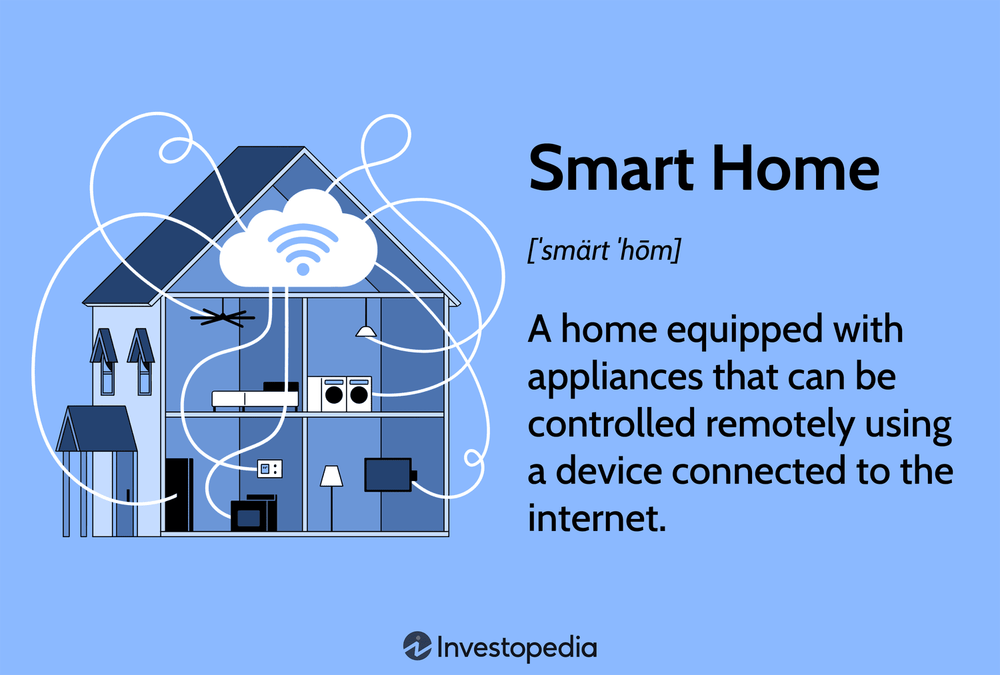

Home automation refers to the use of technology to control and manage various household systems and devices remotely or autonomously. This often involves integrating electronic devices and appliances through a network, enabling centralized management and operation. Smart homes are an extension of home automation, incorporating interconnected devices and systems such as lighting, heating, security systems, and entertainment units, all of which can be controlled through a smartphone or a central control unit. These technologies offer enhanced convenience, energy efficiency, and security.

Algorithmic trading, on the other hand, pertains to the use of computer algorithms to automatically execute a large volume of trades in financial markets. These algorithms apply mathematical models to decide the timing, price, and quantity of trades, enabling traders to capitalize on small price discrepancies with high frequency and speed. This method of trading has evolved significantly with advancements in computing power and financial technologies, allowing for more sophisticated strategies and greater market efficiency.

The integration of smart home technologies with algorithmic trading is an emerging trend that highlights the convergence of domestic convenience with financial precision. As smart home technologies become more prevalent, their potential uses extend beyond domestic tasks to support and enhance algorithmic trading activities. For instance, smart devices may provide real-time updates on market conditions, integrate data analytics for informed decision-making, and ensure seamless operational control from any location. The synergy between smart home systems and algorithmic trading tools could enhance trading efficiency, improve risk management, and bolster overall trading performance.

This growing trend of integrating home automation within advanced financial technologies reflects the broader movement towards interconnected technological ecosystems. As the boundaries between personal and professional technology applications blur, there is increased interest in the possibilities presented by such integration. This trend is powered by the rapid advancement and adoption of technologies like artificial intelligence (AI), the Internet of Things (IoT), and machine learning, which underpin both smart home ecosystems and sophisticated trading platforms.

This article will explore the benefits and challenges posed by this integration, taking a comprehensive look at how these technological advances can coalesce to support both daily living and complex financial operations. With a focus on performance enhancement and operational efficiency, alongside the risks and considerations unique to this integration, a balanced view of the potential impact on lifestyle and financial markets will be provided.

## Table of Contents

## Understanding Smart Home Technologies

Smart home technologies have ushered in a new era of convenience, security, and efficiency. These advancements collectively form the backbone of what we know as home automation. Home automation involves the integration of various electronic devices and systems within a household, managing them remotely through interconnected networks. This is made possible by the burgeoning field of the Internet of Things (IoT), where everyday devices are embedded with sensors, software, and network connectivity.

Smart home devices and technologies vary widely in their applications and functionality. Common examples include smart thermostats, security cameras, lighting systems, voice-activated assistants, and smart appliances such as refrigerators and washing machines. The primary appeal of these technologies lies in their ability to be controlled remotely, often through smartphone applications or voice commands, providing unprecedented levels of convenience to homeowners.

The benefits of home automation extend beyond convenience. Security is notably enhanced through intelligent surveillance systems that offer real-time monitoring and alerts. Smart locks and access control systems can manage entry to the home, while automated lighting and window treatments can simulate occupancy, deterring potential intruders. Moreover, these devices can lead to energy savings through efficient resource management, such as optimizing heating and cooling schedules according to user behavior and preferences.

A smart home ecosystem revolves around several key components that ensure seamless operation. These components include a central hub or controller that acts as the brain of the system, IoT-enabled devices that perform specific functions, sensors that gather data from the environment, and interfaces that allow user interaction. The central hub is often connected to a cloud-based service that facilitates data storage and processing, enabling complex functionalities.

The role of IoT in home automation cannot be overstated. IoT facilitates communication between the various components of a smart home, creating a network that allows devices to operate autonomously or under user-defined parameters. For instance, a smart thermostat can adjust the home temperature based on inputs from weather forecasts, motion sensors, and user schedules, all made possible through interconnected IoT devices and data streams.

Intelligent systems and data-driven functionalities are integral to the evolution of smart homes. These systems leverage [artificial intelligence](/wiki/ai-artificial-intelligence) and [machine learning](/wiki/machine-learning) algorithms to analyze patterns in data collected from smart devices, enabling predictive and adaptive features. For example, a smart lighting system can learn a household's daily routine and automatically adjust lighting based on anticipated needs, providing both comfort and energy efficiency.

In conclusion, smart home technologies represent a significant advancement in how we interact with our living environments, offering a blend of convenience, security, and efficiency. As these technologies continue to evolve, the potential for further integration with other fields, such as finance and [algorithmic trading](/wiki/algorithmic-trading), promises even more sophisticated applications and benefits.

## Examining Algorithmic Trading

Algorithmic trading, often referred to as algo trading, involves the use of computer algorithms to automatically execute trading orders in financial markets at high speed and frequency. These algorithms are designed to follow a defined set of instructions that can include timing, price, quantity, or any mathematical model, thereby minimizing manual intervention in trading activities. The evolution of algorithmic trading dates back to the 1970s with the emergence of electronic exchanges and has since advanced significantly with technological developments in computing power, data analysis, and connectivity.

Popular algorithms and trading strategies used in this domain include:

1. **Trend-Following Strategies**: These are based on moving averages and other technical indicators to capitalize on upward or downward market trends. One common example is the Moving Average Crossover strategy, where buy or sell signals are generated when a short-term moving average crosses a long-term moving average.

2. **Arbitrage Opportunities**: Algorithms detect price discrepancies of the same financial instrument on different markets or exchanges, executing trades to exploit the imbalance and generate profit.

3. **Market Making**: This involves placing simultaneous buy and sell limit orders to earn the spread between the bid and ask price. The aim is to provide liquidity to the market while profiting from the difference.

4. **Mean Reversion**: This strategy is grounded on the assumption that asset prices will revert to their historical mean. Algorithms identify deviations from this mean and execute trades that will benefit when prices return to average levels.

Technological tools and systems in algorithmic trading encompass a wide range of sophisticated software and hardware infrastructures. These include direct market access (DMA) for high-speed execution, data feed providers for real-time market data, and algorithmic trading platforms that offer back-testing and simulation environments to refine strategies before deploying them in actual markets. Moreover, advancements in artificial intelligence and machine learning enable traders to develop self-learning algorithms that adapt to changing market conditions.

Automation in trading strategies is used by traders to optimize decision-making processes, ensuring orders are executed swiftly and systematically without the latency of human input. Automation allows handling of complex strategies involving multiple asset classes and markets simultaneously, improving efficiency and accuracy. For instance, the use of automated trading rules can ensure that a trader's emotional biases do not affect trading decisions, thereby increasing adherence to predefined strategies.

The potential financial benefits of algorithmic trading are considerable. By leveraging speed and precision, traders can achieve optimal entry and [exit](/wiki/exit-strategy) points, capturing favorable market conditions more effectively than manual trading. Additionally, algorithmic trading can provide [liquidity](/wiki/liquidity-risk-premium) to markets and reduce transaction costs through efficient order execution.

However, the risks associated with algorithmic trading are also significant. These include the possibility of exacerbated market [volatility](/wiki/volatility-trading-strategies) due to automated trading activities and the risk of algorithmic errors or malfunctioning that could lead to substantial financial losses. Furthermore, regulatory challenges and compliance risks arise as financial markets seek to ensure fair trading practices and prevent market manipulation through algorithmic strategies.

In summary, algorithmic trading represents a dynamic intersection of technology and finance, offering both substantial opportunities and challenges. As computational and data processing capabilities continue to advance, the scope and application of algorithmic trading are expected to expand further, necessitating careful consideration of the associated risks and benefits.

## Pros of Integrating Smart Home Automation with Algo Trading

Integrating smart home automation with algorithmic trading presents several potential benefits, enhancing efficiency and effectiveness in the trading process. 

One notable advantage is the enhancement of trading efficiency through smart notifications. Smart home devices can deliver real-time alerts about market changes directly to the trader's preferred location, such as a home office or living room. These notifications can be customized based on specific trading strategies or market conditions, ensuring that traders never miss critical information necessary for making timely decisions.

In terms of risk management, integrating smart technologies with algo trading can significantly improve analysis and the ability to access real-time data. Intelligent systems can analyze vast amounts of market data instantaneously, identifying patterns and anomalies that may present risks. This allows traders to make informed decisions based on current market dynamics rather than relying solely on historical data. Enhanced real-time data analytics provide an environment conducive to adaptive strategies that can mitigate potential risks.

The ability to enable seamless operational control from anywhere is another key benefit. With smart home technology, traders can monitor and manage trading activities remotely. This constant connectivity ensures that traders can execute trades and adjust strategies without being physically present, offering a form of flexibility that is particularly useful in volatile markets where time is of the essence.

Energy efficiency and cost savings are also notable advantages. Smart systems can optimize energy usage within the home, potentially lowering operational costs associated with running multiple screens, servers, and other trading equipment. Cost savings generated from these efficiencies can then be reinvested into trading activities or used to fund further technological enhancements.

Finally, there is a considerable boost in trading performance through the integration of data analytics and machine learning. Advanced algorithms can process large datasets more efficiently, providing deeper insights into market trends and price movements. Machine learning models can predict future market conditions with increasing accuracy as they learn from new data over time. This predictive capability can be a powerful tool in developing and refining trading strategies, leading to improved returns.

Overall, the integration of smart home technologies with algorithmic trading offers significant potential to enhance trading operations, optimize resource use, and improve financial outcomes through advanced analytics and machine learning tools.

## Cons of Integrating Smart Home Automation with Algo Trading

Integrating smart home automation with algorithmic trading presents several challenges, primarily due to the technological and cyber risks inherent in both fields. Security concerns arise as smart devices, which often form the backbone of a home automation ecosystem, are susceptible to hacking and unauthorized access. These devices can act as entry points for cybercriminals to infiltrate networks, potentially compromising sensitive financial data and trading operations. The vulnerability of IoT devices makes it crucial for users to implement robust security protocols and regular updates to mitigate these risks.

The complexity of systems in smart home automation and algorithmic trading can lead to significant technical challenges. Integrating disparate technologies requires a deep understanding of both domains, as well as expertise in programming and system configuration. Misconfigurations or software bugs can result in operational disruptions, data inaccuracies, or even financial losses. Therefore, the integration demands continuous monitoring and maintenance to ensure seamless functionality.

Over-reliance on automation and technology poses additional risks. While automated systems can enhance efficiency and decision-making, they are not infallible. Automated trading systems, if not properly calibrated, can execute trades based on erroneous data or flawed algorithms, leading to unanticipated market actions and potential financial setbacks. It is essential for users to maintain a level of human oversight and regularly review the performance and logic of automated systems to avoid catastrophic outcomes.

Privacy issues are inherent with the integration of smart home devices, as these systems often collect vast amounts of personal data to function effectively. The aggregation and analysis of this data can inadvertently expose sensitive information, raising concerns over data ownership, consent, and exploitation. Users must navigate these privacy concerns by adopting transparent data usage policies and employing encryption and secure data storage methods.

Finally, the costs associated with implementing and maintaining an integrated smart home and algorithmic trading system can be significant. Initial setup expenses, regular software updates, and hardware replacements contribute to ongoing financial commitments. Balancing these costs with the anticipated benefits requires a strategic approach and careful financial planning to ensure that the investment achieves the desired returns without burdening the user financially.

## Future Trends and Innovations

The intersection of smart home technologies and algorithmic trading is poised to benefit significantly from a range of future advancements. As artificial intelligence (AI) and machine learning continue to evolve, both sectors are expected to gain enhanced analytical capabilities. In algorithmic trading, machine learning models can be leveraged to identify patterns and forecast market trends with greater accuracy. Smart homes, increasingly integrated with AI, could offer more personalized and efficient energy management and environmental controls, directly impacting operational costs for users engaged in trading activities from their homes.

The advent of 5G technology and faster internet speeds will play a crucial role in this integration. The low latency and high bandwidth of 5G networks will enable prompt data transmission between smart home systems and trading platforms. This connectivity fosters real-time updates and insights, essential for executing trades based on up-to-the-minute market conditions. Smart home devices could seamlessly manage routine data flows and notifications, allowing traders to focus on high-level strategic planning without physical presence.

Emerging technologies such as blockchain and advanced data analytics could further integrate home automation with trading systems. Blockchain can provide secure transaction records, enhancing trust and reducing risks associated with digital trading. Moreover, utilizing advanced analytics can facilitate sophisticated decision-making processes, allowing homes equipped with intelligent systems to support complex trading algorithms autonomously.

Regulatory considerations will inevitably shape the future landscape of smart home and trading technologies. As these sectors become more entwined, regulatory bodies may develop new guidelines to ensure security, privacy, and fair trading practices. This could include measures related to data protection, ethical AI deployment, and the safeguarding of algorithmic processes. Navigating this evolving regulatory environment will be crucial for stakeholders to harness the full potential of smart home and trading technology integration effectively. 

These trends indicate a future where the seamless integration of smart home technologies with algorithmic trading becomes increasingly sophisticated, with enhanced capabilities driven by technological advancements and evolving regulations.

## Conclusion

The integration of smart home technologies with algorithmic trading presents a compelling set of benefits and challenges, each contributing to its transformative potential. On the benefits side, the fusion enhances trading efficiency through the delivery of smart notifications, which keep traders informed of market changes in real-time. This can improve decision-making, particularly when combined with intelligent analysis tools capable of digesting and reacting to large datasets swiftly. Such capabilities enable more refined risk management strategies and operational control, making it possible to execute trades from virtually anywhere.

Moreover, the collaboration between home automation and algorithmic trading facilitates energy efficiency and cost savings. By utilizing data analytics and machine learning, trading performance can be significantly optimized. The insights garnered from these technologies not only streamline trading operations but also redefine the way financial activities are conducted within the comfort of one’s smart home.

However, these advancements do not come without challenges. Security is a paramount concern, as the increasing connectivity between devices introduces vulnerabilities that could potentially be exploited. The complexity of integrating multiple systems can also pose technical hurdles, and an over-reliance on automation might lead to unforeseen risks. Privacy issues with data collection and usage are another critical area of concern, requiring stringent measures to protect user information.

To maximize the advantages of smart home and algorithmic trading integration, informed decision-making and comprehensive risk management practices are essential. This calls for a commitment to ongoing exploration and adoption of technological innovations, ensuring that both sectors continue to evolve in tandem with user needs and market dynamics.

The potential impact of integrating smart home technologies with financial markets is profound, as it could redefine contemporary lifestyles and trading paradigms. As more individuals adopt these technologies, the financial ecosystem is likely to become more responsive and adaptive to personal and market shifts. Ultimately, the challenge lies in maintaining a balance between embracing technological advancements and safeguarding personal and financial security. By doing so, users can fully leverage the benefits while mitigating associated risks, fostering a safe and efficient environment for both living and trading.

## References & Further Reading

[1]: Bergstra, J., Bardenet, R., Bengio, Y., & Kégl, B. (2011). ["Algorithms for Hyper-Parameter Optimization."](https://papers.nips.cc/paper/4443-algorithms-for-hyper-parameter-optimization) Advances in Neural Information Processing Systems 24.

[2]: ["Advances in Financial Machine Learning"](https://www.amazon.com/Advances-Financial-Machine-Learning-Marcos/dp/1119482089) by Marcos Lopez de Prado

[3]: ["Evidence-Based Technical Analysis: Applying the Scientific Method and Statistical Inference to Trading Signals"](https://www.amazon.com/Evidence-Based-Technical-Analysis-Scientific-Statistical/dp/0470008741) by David Aronson

[4]: ["Machine Learning for Algorithmic Trading"](https://github.com/PacktPublishing/Machine-Learning-for-Algorithmic-Trading-Second-Edition) by Stefan Jansen

[5]: ["Quantitative Trading: How to Build Your Own Algorithmic Trading Business"](https://www.amazon.com/Quantitative-Trading-Build-Algorithmic-Business/dp/0470284889) by Ernest P. Chan