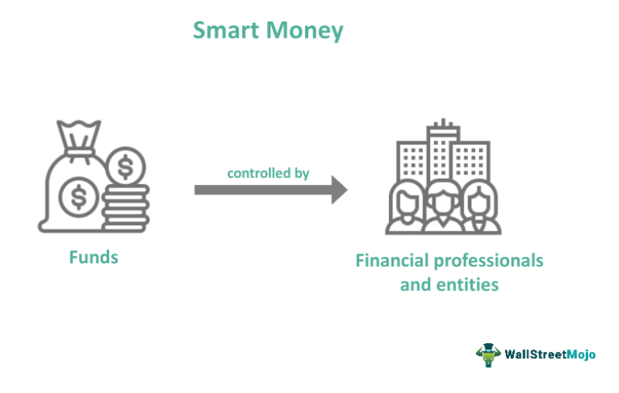

The modern financial landscape is increasingly influenced by the intersection of algorithms and smart money. The application of these sophisticated methods is transforming trading in ways that were once unimaginable. As technology continues to advance, the ability to analyze large datasets and execute trades with high precision has enabled investors to refine their strategies significantly.

Algorithmic trading, also known as algo trading, involves the use of computer algorithms to automate investment decisions and trade execution. This approach leverages computational power and speed to analyze market data, identify patterns, and execute trades based on pre-defined criteria. It reduces human intervention and emotions, resulting in more consistent and efficient trading outcomes.

Smart money, on the other hand, refers to the capital controlled by institutional investors, market experts, and high-net-worth individuals who possess a deep understanding of financial markets. These entities have the resources and expertise to make strategic investment decisions that often influence market trends. By aligning the analytical strength of algorithms with the insightful decision-making capabilities of smart money, investors can enhance their ability to respond swiftly to market dynamics.

The synergy between smart money and algorithmic trading is increasingly reshaping how investment strategies are developed and implemented. This collaboration enables investors to improve efficiency and accuracy in trading, leading to better-informed decisions in today's fast-paced markets. As we explore these concepts, it becomes evident that their combined potential can redefine traditional investment approaches, allowing for more targeted and effective strategies.

Understanding the key aspects and benefits of smart money and algorithmic trading provides investors with a competitive edge, offering opportunities for optimized returns in an ever-evolving financial environment. Additionally, the integration of these strategies is setting the stage for future innovations in the field, driven by technology and data analytics. With these advancements, investors can navigate the complexities of modern finance with greater confidence and adaptability.

## Table of Contents

## What is Smart Money in Investing?

Smart money in investing refers to capital managed by experienced market participants, such as institutional investors, financial experts, and large entities. These investors are typically characterized by their deep understanding of financial markets and access to extensive research and resources, which confer an advantage over average retail investors. The term "smart money" is used to signify the informed and strategic nature of these investors' decisions, often leading to significant market movements when they make large-scale transactions.

Institutional investors, such as mutual funds, pension funds, and insurance companies, are prominent examples of smart money. They possess the ability to influence market trends through their substantial financial power. For instance, when an institutional investor decides to buy or sell a considerable quantity of stocks or securities, it can result in noticeable fluctuations in stock prices and market sentiment. This is due to the substantial [volume](/wiki/volume-trading-strategy) of their trading activities and the informed nature of their investment strategies.

Hedge funds are another key component of smart money. Known for their aggressive and diverse investment strategies, hedge funds leverage their expertise to exploit market inefficiencies and achieve high returns. Their ability to deploy sophisticated financial models and algorithms further solidifies their position as smart money in financial markets.

High-net-worth individuals also contribute to the concept of smart money. With significant capital at their disposal, these investors often have access to exclusive investment opportunities and advisory services, allowing them to make well-informed decisions. Their investment actions can serve as a barometer for market trends, as other investors may follow their lead, amplifying the impact of their trades.

In summary, smart money is distinguished by its scale, access to information, and strategic approach to investing. It influences market dynamics through significant trades, and its movements are closely monitored by other market participants seeking to align their strategies with those of informed and resource-rich investors.

## Algo Trading: A Brief Overview

Algorithmic trading, often termed algo trading, entails the use of automated systems to execute trade orders based on predefined criteria, thereby capitalizing on the computational speed and precision of algorithms. This method operates through sophisticated mathematical models and computer programs that enable the trader to automatically buy or sell securities. Its popularity spans both institutional and retail sectors, lauded for its ability to enhance efficiency and curtail human emotion, which often impairs decision-making in trading scenarios.

The efficiency of [algorithmic trading](/wiki/algorithmic-trading) is underscored by its deployment across various strategies. High-frequency trading ([HFT](/wiki/high-frequency-trading-strategies)) stands as one of the most well-known strategies, characterized by executing a high number of orders at incredibly fast speeds to capture minor price differentials. Another prevalent strategy is [arbitrage](/wiki/arbitrage), a practice where traders attempt to profit from price discrepancies of a single asset across different markets. Additionally, trend-following systems play a crucial role, enabling traders to identify and capitalize on movements in the market's direction over time. These strategies illustrate the diverse applications of algo trading and its versatility in responding to different market conditions.

Technological advancements and developments in mathematical modeling have significantly bolstered the efficacy and ubiquity of algorithmic trading. Innovations in areas like [machine learning](/wiki/machine-learning) and [artificial intelligence](/wiki/ai-artificial-intelligence) are continually refined to enhance the predictive accuracy of trading algorithms. Moreover, the vast computational power available today allows for the processing and analysis of large datasets that can influence and inform better trading decisions.

The growth of algorithmic trading has notably impacted the volume and dynamics of contemporary financial markets. It has fueled an increase in competition among market participants by enabling faster and more efficient trading practices. Simultaneously, it contributes to enhanced [liquidity](/wiki/liquidity-risk-premium), as algorithmic strategies generally involve high transaction volumes. This increased liquidity can benefit the market by narrowing bid-ask spreads and improving price discovery processes.

In summary, algorithmic trading represents a fundamental shift toward more data-driven, automated trading activities. It leverages the advanced computational capabilities of today's technology to refine investment practices, reshaping the landscape of modern financial markets.

## The Synergy between Smart Money and Algo Trading

Smart money and algorithmic trading have become increasingly interconnected in the financial industry as institutional investors look to manage large portfolios more effectively. By integrating sophisticated algorithms into their investment strategies, these investors can capitalize on multiple market opportunities promptly and efficiently.

Institutional investors, often considered smart money due to their market expertise, leverage data-driven algorithms to uncover opportunities that might go unnoticed using traditional methods. Algorithms can process vast amounts of market data, analyze historical trends, and adapt to real-time changes, offering a comprehensive view of market dynamics. This capability allows smart money investors to anticipate and act on market movements with a precision that surpasses conventional approaches.

One of the primary benefits of algorithmic trading for these investors is the ability to execute large transactions discreetly and strategically. By fragmenting orders into smaller, algorithmically-timed trades, investors can mitigate market impact and secure better pricing. This process, known as "order slicing," optimizes the execution of significant trades by hiding the investor's true intentions from the market, reducing slippage and maintaining a degree of anonymity that prevents market speculation from affecting price levels.

Additionally, the combination of smart money strategies with algorithmic trading enhances market influence. With algorithms executing trades at high speed and accuracy, institutional investors can adjust their positions rapidly in response to shifts in market conditions. This adaptability is crucial in today’s volatile financial environment, where timely execution can significantly impact investment returns.

The integration of algorithmic trading into smart money strategies exemplifies the broader evolution of investment practices, driven by technological advancements. This fusion not only optimizes the efficiency of trading practices but also reinforces the strategic capabilities of institutional investors. As technology continues to advance, the synergy between smart money and algorithmic trading is anticipated to further transform investment strategies, highlighting the importance of adapting to these innovations for sustained financial success.

## Key Benefits of Investing in Smart Money Algorithmic Trading

Algorithmic trading, a transformative advancement in the financial domain, offers numerous benefits, especially when integrated with smart money strategies. One of the most significant advantages is efficiency. By automating trade execution, algorithmic trading minimizes manual intervention, significantly reducing the time taken to complete transactions and increasing accuracy. Automated systems can rapidly process and execute high-frequency trades that human traders might struggle to handle due to the limitations of speed and precision.

Another critical benefit is the ability to glean data-driven insights. Algorithms are extensively used to analyze vast datasets, identifying patterns and opportunities that would be challenging to discern manually. Through comprehensive analyses of historical and real-time data, these algorithms can provide investors with actionable insights, enhancing decision-making processes. Such capabilities are essential in competitive financial markets where timely and informed decisions can lead to substantial gains.

Risk management is inherently improved through algorithmic trading. Algorithms can be programmed with sophisticated risk management rules, allowing for the minimization of potential losses while maximizing returns. This is achieved through predefined criteria that guide decision-making processes, such as stop-loss and take-profit levels, ensuring that trades align with the investor's risk tolerance and financial goals.

Scalability is another substantial advantage offered by algorithmic trading. The automation of trading processes allows for the handling of larger volumes of trades without a proportional increase in resources or operational costs. This scalability ensures that investment strategies remain efficient and manageable as portfolios and market activities expand.

Finally, the market impact of trades can be strategically minimized through algorithmic approaches. By executing small, tactical transactions, algorithmic trades reduce the potential for significant market price disruptions, enabling investors to achieve optimal returns. This aspect is particularly beneficial for institutional investors who need to manage large orders without influencing market prices adversely.

In conclusion, the integration of algorithmic trading with smart money strategies represents a significant advancement in investment practices, providing enhanced efficiency, data-driven insights, improved risk management, scalability, and strategic market impact minimization.

## Challenges and Risks

Algorithmic trading, despite its numerous benefits, presents significant challenges and risks that participants must carefully consider. Market [volatility](/wiki/volatility-trading-strategies) is one of the primary challenges. Algorithms might struggle in rapidly changing market conditions if they are not designed with adaptive mechanisms. This unpredictability can lead to significant financial losses, as algorithms might execute trades based on outdated assumptions or fail to adjust quickly to new market realities.

Technical failures pose another risk [factor](/wiki/factor-investing). System glitches or programming errors can unintentionally trigger trades, resulting in financial losses, market disruptions, or both. These failures highlight the importance of rigorous testing and validation processes in the development of trading algorithms to ensure reliability and accuracy.

Regulatory concerns further complicate algorithmic trading. The accelerated pace of algo-driven transactions has caught the attention of regulatory bodies worldwide, striving to ensure market fairness and stability. Regulations may change swiftly, and traders must remain compliant to avoid penalties or legal issues.

The complexity of algorithms also necessitates enhanced oversight. As algorithms grow in sophistication, understanding how they make trading decisions becomes increasingly challenging. This complexity requires continuous monitoring and a clear comprehension of the underlying logic driving these systems to prevent unforeseen outcomes and maintain effective control.

Security risks are inherent in digital trading systems, making them vulnerable to cyber attacks. The safeguarding of trading platforms is critical to protect sensitive financial data and prevent malicious entities from exploiting system vulnerabilities. Robust security measures, such as encryption, intrusion detection systems, and regular security audits, are essential to mitigate these risks.

Overall, while algorithmic trading offers advantages in terms of efficiency and data-driven decision-making, it is important for traders to be aware of these challenges and actively work to mitigate associated risks. This requires a comprehensive understanding of both the technological and regulatory aspects of algorithmic trading, ensuring that systems are designed, tested, and managed with a high degree of diligence.

## Future Trends in Smart Money and Algo Trading

Advancements in artificial intelligence (AI) and machine learning (ML) are significantly enhancing the capabilities of algorithmic trading systems. These technologies enable models to process and analyze vast amounts of data, identifying complex patterns that were previously difficult to detect. By employing machine learning algorithms, traders can develop predictive models that adapt to new information, optimizing trading strategies in real-time. This adaptability is crucial in dynamic market environments where conditions can shift rapidly.

The increasing use of big data analytics enhances these strategies by providing deeper insights into market trends and consumer behavior. As more data becomes available, algorithms can refine their decision-making processes, improving accuracy and efficiency. For instance, predictive analytics can forecast market movements by integrating diverse data sources such as news sentiment, social media analysis, and economic indicators. This holistic data approach allows for a more nuanced understanding of market dynamics.

As smart money strategies become more sophisticated, there is a growing emphasis on integrating Environmental, Social, and Governance ([ESG](/wiki/esg-investing)) factors into algorithmic trading models. Investors are increasingly considering ESG criteria, influenced by the societal push towards sustainable and responsible investing. Incorporating ESG factors into trading algorithms can enhance decision-making processes, aligning investment strategies with long-term sustainability goals. This integration might involve quantifying ESG metrics and inputting them into trading models to evaluate the potential impact on financial performance.

Collaboration between technology firms and financial institutions is expected to foster innovation and the adoption of cutting-edge algorithmic solutions. By leveraging technological advancements, such partnerships can create more robust and versatile trading platforms. These collaborations can also facilitate the development of tailored solutions that cater to specific market needs, combining financial expertise with technological prowess.

The ongoing evolution of these strategies underscores the transformation of the financial market landscape, driven by technology and data. As algorithmic trading systems continue to evolve, they are likely to become more autonomous, adaptive, and efficient. This transformation is not only reshaping how trades are executed but also offering strategic opportunities for those willing to embrace technological innovation in finance.

## Conclusion

The integration of smart money strategies with algorithmic trading signifies an important developmental stage in today's financial markets. Leveraging advanced technology and comprehensive data analysis allows investors to enhance not only their efficiency but also their decision-making accuracy and potential returns. This new paradigm empowers investors to utilize algorithms for rapid data processing and optimal execution of trades, effectively aiding them in capturing market opportunities with precision.

As the convergence of smart money and algorithmic trading continues to gain [momentum](/wiki/momentum), staying informed and adaptable becomes crucial for investors. The financial landscape is evolving rapidly, driven by technological innovation and the use of machine learning, artificial intelligence, and big data analytics. These advancements are creating more sophisticated approaches to trading and investment strategies, underscoring the need for investors to continuously update their knowledge and skills to remain competitive.

In light of these transformations, the future of investing may predominantly feature sophisticated algorithms in tandem with strategic decisions made by enlightened smart money investors. These technological advancements have proven to enhance market liquidity, reduce transaction costs, and improve the overall market dynamics. Therefore, investors who are open to embracing these changes and integrating them into their investment practices will likely be better positioned to achieve success and sustainability in the complex and ever-changing world of modern finance.

By taking advantage of the synergies between smart money methods and algorithmic trading, market participants can adeptly manage risks, capitalize on emerging trends, and ultimately drive superior investment performance. The ongoing technological evolution presents both challenges and opportunities, making it imperative for investors to be proactive in adapting to this dynamic environment. The future promises a new era of investment possibilities, where those who harness cutting-edge technologies will be at the forefront of financial innovation and success.

## References & Further Reading

[1]: Bergstra, J., Bardenet, R., Bengio, Y., & Kégl, B. (2011). ["Algorithms for Hyper-Parameter Optimization."](https://papers.nips.cc/paper/4443-algorithms-for-hyper-parameter-optimization) Advances in Neural Information Processing Systems 24.

[2]: ["Advances in Financial Machine Learning"](https://www.amazon.com/Advances-Financial-Machine-Learning-Marcos/dp/1119482089) by Marcos Lopez de Prado

[3]: ["Evidence-Based Technical Analysis: Applying the Scientific Method and Statistical Inference to Trading Signals"](https://www.amazon.com/Evidence-Based-Technical-Analysis-Scientific-Statistical/dp/0470008741) by David Aronson

[4]: ["Machine Learning for Algorithmic Trading"](https://github.com/stefan-jansen/machine-learning-for-trading) by Stefan Jansen

[5]: ["Quantitative Trading: How to Build Your Own Algorithmic Trading Business"](https://books.google.com/books/about/Quantitative_Trading.html?id=j70yEAAAQBAJ) by Ernest P. Chan