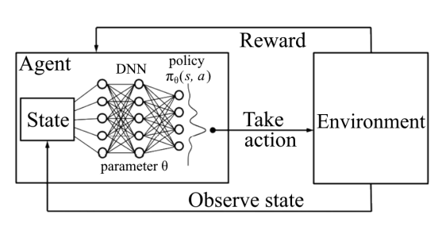

In the rapidly evolving landscape of algorithmic trading, Smart Order Routing (SOR) emerges as a pivotal technique designed to optimize trading efficiency. With the advent of technology and the increasing complexity of market structures, SOR has become indispensable for ensuring high-quality execution. SOR systematically directs trade orders to various trading venues, including exchanges and alternative trading systems, aiming to secure the best execution by considering price, liquidity, and speed.

This article explores the intricacies of SOR, shedding light on its mechanics and its relevance in modern trading environments. As markets become more fragmented, the role of SOR in consolidating and analyzing data from multiple sources becomes crucial. Traders and financial institutions must understand SOR to leverage technology for improved order execution. SOR addresses challenges such as liquidity fragmentation and latency issues that can affect market participants' ability to achieve optimal trade execution. 

Understanding SOR is essential for traders and financial institutions aiming to leverage technology for improved order execution. By methodically guiding trades through the most effective pathways, SOR ensures that traders can capitalize on favorable market conditions, thereby enhancing execution quality and trading efficiency. As we unpack the key concepts and advancements shaping the future of SOR, it becomes evident that this technology not only optimizes current trading practices but also lays a foundation for innovation amid ongoing regulatory and technological changes.

## Table of Contents

## What is Smart Order Routing?

Smart Order Routing (SOR) is a sophisticated algorithmic trading strategy designed to optimize the execution of orders by navigating across various trading venues. The primary objective of SOR is to ensure the best possible trading outcome, achieved by assessing factors such as price, liquidity, and execution speed.

In today's complex and fragmented global markets, liquidity is dispersed over multiple exchanges and alternative trading systems. This fragmentation necessitates the use of advanced mechanisms like SOR to secure the best execution. SOR algorithms are equipped to intelligently assess market conditions and strategically determine the most advantageous venues for order execution. They often achieve this by breaking down substantial orders into smaller segments to minimize market impact and avoid influencing the market price significantly.

The fundamental mechanism by which SOR enhances order routing decisions hinges on its ability to dynamically analyze [order book](/wiki/order-book-trading-strategies) data and adjust to real-time market conditions. At its core, SOR evaluates available market data to choose pathways that optimize outcomes based on predefined criteria such as minimizing costs or maximizing speed. For instance, by calculating the potential market impact and execution probability, SOR algorithms can make informed decisions about whether to send portions of an order to different venues simultaneously or sequentially.

Given the vast landscape of possible trading venues, the intelligent allocation of order flow facilitated by SOR is crucial. It allows investors and traders to navigate complex trading environments efficiently, thereby securing favorable prices and reducing the risk of slippage—where the executed price deviates from the expected price.

In summary, Smart Order Routing is an essential tool in the toolkit of traders and financial institutions, equipped to tackle the challenges posed by modern market structures through its sophisticated decision-making processes, ultimately enhancing the quality of trade executions.

## Key Concepts in Smart Order Routing

Smart Order Routing (SOR) is an essential component of contemporary trading strategies, utilizing sophisticated algorithms to enhance order execution across diverse trading venues. This section examines the key concepts central to SOR, focusing on order types, trading venues, the role of latency, and other critical factors influencing its efficacy.

Order types play a fundamental role in SOR, as they determine how and when trades are executed. Common order types include market orders, limit orders, and stop orders, each catering to different trading strategies and objectives. Market orders aim for immediate execution at the current market price, while limit orders specify the maximum or minimum price at which traders are willing to buy or sell. Stop orders, on the other hand, are activated when a security reaches a certain price level, converting into a market order for execution. SOR systems need to adeptly manage these varying order types to optimize execution according to the trader's desired outcomes.

Trading venues are another pivotal element in SOR systems. These venues include stock exchanges, dark pools, and electronic communication networks (ECNs), each with distinct characteristics related to [liquidity](/wiki/liquidity-risk-premium), fees, and execution speed. SOR algorithms intelligently route orders to these venues, seeking the best combination of price and liquidity. Given the fragmentation of global markets, with liquidity spread across numerous platforms, effectively balancing order flow among multiple venues is critical for achieving optimal order execution.

Latency, the time delay between sending an order and its execution, significantly impacts SOR performance. In high-frequency trading environments, minimizing latency is crucial to capitalize on fleeting market opportunities. Latency can be affected by numerous factors, including network speed, data processing times, and the geographic location of trading servers. Advanced networking technologies and colocated server arrangements are often employed to reduce latency, ensuring SOR systems operate with maximum efficiency.

Regulatory environments also influence SOR operations, with compliance varying across different jurisdictions. Regulations such as the European Union’s Markets in Financial Instruments Directive (MiFID II) or the United States’ Regulation National Market System (Reg NMS) mandate certain standards for transparency and best execution, directly affecting how SOR systems function. These regulations may require detailed reporting on execution quality and mandate access to a broad range of trading venues, necessitating adaptable SOR systems capable of meeting diverse regulatory demands.

Liquidity is a crucial [factor](/wiki/factor-investing) in SOR systems, as it reflects the ease with which an asset can be bought or sold without affecting its price. SOR algorithms are designed to access multiple liquidity sources, enhancing order fill rates by tapping into both exchange-based and off-exchange venues. By broadening the search for liquidity, SOR systems can improve the probability of order completion, particularly in illiquid markets.

Transaction costs, encompassing both explicit costs such as fees and commissions, and implicit costs like slippage, are a vital consideration in SOR implementation. Slippage occurs when there is a difference between the expected price of a trade and the actual price at which it is executed. SOR systems aim to minimize transaction costs by selecting venues that offer competitive pricing and implementing strategies like order fragmentation, where large orders are broken into smaller chunks to reduce market impact and mitigate slippage.

In conclusion, Smart Order Routing integrates various components that influence its operational effectiveness. By managing order types, optimizing venue selection, minimizing latency, adhering to regulatory requirements, and maximizing liquidity while reducing transaction costs, SOR systems enhance the order execution process, providing traders with a robust tool for navigating complex trading environments.

## How Smart Order Routing Works

Smart Order Routing (SOR) systems are integral components of modern trading environments, employing sophisticated algorithms to optimize order execution. The process begins with the receipt of an order, where the SOR system evaluates various market conditions to determine the most favorable execution strategy.

Upon receiving an order, the SOR system conducts an immediate market analysis, assessing factors such as current price levels, liquidity, and the speed of execution at various trading venues. This preliminary analysis is crucial, as it forms the basis for selecting the optimal venue for order execution. The SOR algorithms are designed to adapt to real-time market data, continuously updating their assessments to identify the best available trading opportunities.

A key component in the operation of SOR systems is the ability to execute orders across multiple platforms. This is achieved through a dynamic selection process where the algorithm evaluates different trading venues based on their current market conditions. By leveraging data such as bid-ask spreads, market depth, and historical performance metrics, the system aims to achieve the best execution price and minimize transaction costs.

To further enhance execution efficiency, SOR systems often employ a strategy known as order splitting. This involves dividing larger orders into smaller, more manageable pieces that can be executed incrementally across different venues. This approach reduces market impact, as smaller orders are less likely to influence market prices and can be filled more quickly and quietly than a single large order. The algorithm determines the optimal size and timing for each split order, taking into consideration factors such as market [volatility](/wiki/volatility-trading-strategies) and liquidity availability.

Once the execution of the trade is initiated, the confirmation process plays a vital role in ensuring transparency and compliance. Trading activities must be documented accurately, detailing the execution price, [volume](/wiki/volume-trading-strategy), and venue for each segment of the split order. This comprehensive record-keeping is essential for compliance with regulatory standards and provides traders with the necessary information to verify that the execution aligns with their strategic objectives.

In conclusion, the operation of Smart Order Routing systems involves a complex interplay of real-time market analysis, strategic venue selection, and order-splitting techniques. These processes aim to optimize trade execution, reduce costs, and maintain compliance, ultimately enhancing the efficiency and effectiveness of trading operations in modern financial markets.

## Types of Routing Strategies

Smart Order Routing (SOR) utilizes a variety of strategies to optimize trading outcomes in increasingly complex and fragmented financial markets. These strategies are designed to meet specific trading objectives by considering factors like price, liquidity, and market conditions. Understanding these strategies enables traders to select the most appropriate approach for their trading requirements.

**Best Price Routing** focuses on securing the best available price for a trade by comparing potential prices across multiple trading venues. This strategy is essential in fragmented markets, ensuring that the trade is executed at the most favorable rate available.

**Time-Weighted Average Price (TWAP)** aims to execute orders evenly over a specified period, minimizing market impact and avoiding significant price fluctuations. TWAP is particularly beneficial for large orders, as it breaks the order into smaller, equally distributed trades throughout the set time frame, thereby reducing visibility in the market and price disruption.

**Volume-Weighted Average Price (VWAP)** calculates the average price of a security over a particular time period, weighted by volume. The objective is to execute trades close to this average price, providing a benchmark that traders often use to evaluate performance. VWAP is effective in minimizing market impact for large orders, as it prioritizes execution during periods of high liquidity.

**Liquidity Seeking** strategies prioritize the discovery of high liquidity across various trading venues. This approach is critical in fast-moving markets, where the immediate availability of liquidity can significantly affect trade execution. By targeting venues with optimal liquidity, these strategies seek to maximize order fill rates while minimizing market impact.

Beyond these, cost reduction strategies play a crucial role in minimizing overall transaction costs, which encompass not only trading fees but also the costs related to market impact and slippage. Techniques such as **adaptive algorithms** adjust trading behavior in response to real-time market conditions, seeking an optimal balance between speed and cost-efficiency. Similarly, **dark pool routing** can be used to access liquidity without revealing large orders to the public market, thereby reducing market impact and potential slippage.

The application of these strategies varies across different trading scenarios. For instance, a high-frequency trading firm might prioritize Best Price Routing and liquidity seeking to execute trades with minimal latency and optimal pricing. Meanwhile, an institutional investor managing large portfolios may prefer TWAP or VWAP strategies to maintain anonymity and reduce market disruption.

The strategic implementation of these routing techniques within SOR systems highlights their potential to improve trading efficiency substantially. By tailoring the approach to fit the specific requirements of a trade or a broader trading strategy, traders can effectively mitigate risks and enhance overall execution quality.

## Advantages of Smart Order Routing

Smart Order Routing (SOR) offers multiple advantages that significantly enhance execution quality and trading efficiency. One of the primary benefits is its ability to enhance speed and reduce transaction costs, which are crucial factors in fast-moving financial markets. SOR systems operate by intelligently analyzing market conditions in real-time, allowing them to quickly route orders to the venues offering the best prices and liquidity. This rapid decision-making capability minimizes delays and ensures that trades are executed at optimal prices, thereby reducing slippage—a situation where the final execution price deviates from the expected price.

Moreover, SOR systems play a critical role in ensuring compliance with best execution mandates and regulatory standards. Financial markets are subject to stringent regulations that require traders to seek the best possible execution terms for their clients. By using SOR, traders and financial institutions can demonstrate adherence to these mandates, as the routing algorithms are designed to automatically select the optimal venues based on a comprehensive analysis of multiple factors, including price, liquidity, and execution speed. This compliance is essential for maintaining trust and integrity in the financial markets.

SOR systems also exhibit remarkable flexibility in adapting to real-time market changes. Market conditions can fluctuate rapidly, influenced by factors such as economic reports, political events, and market sentiment. SOR algorithms are engineered to be highly responsive, enabling them to adjust their routing strategies dynamically in response to these changes. This adaptability is vital for traders who need to maintain competitiveness in dynamic trading environments. By continuously analyzing data and recalibrating their parameters, SOR systems ensure that traders can capitalize on fleeting opportunities while minimizing risks associated with market volatility.

In summary, the advantages of Smart Order Routing are manifold, with improvements in execution speed, cost efficiency, regulatory compliance, and adaptability to market changes. These factors collectively make SOR systems indispensable tools for traders seeking to optimize their trading strategies and achieve superior execution outcomes in the modern financial landscape.

## Challenges and Considerations

The development of effective Smart Order Routing (SOR) systems is fraught with several challenges and considerations, primarily centered around technological complexities, latency issues, and the impact of regulatory changes. These systems require sophisticated algorithms capable of processing high volumes of data in real-time to execute trades efficiently and effectively.

Technological complexities in SOR systems largely pertain to the integration of various algorithmic components. These components must be capable of handling diverse and dynamic datasets to make optimal routing decisions. Furthermore, the architecture of SOR systems must be scalable to accommodate the growing number of trading venues and the increasing volume of data processed daily. This scalability is often achieved through advanced computing infrastructures like cloud computing and distributed systems, which offer the computational power necessary to manage these demands.

Latency is another critical issue impacting the performance of SOR systems. In the context of [algorithmic trading](/wiki/algorithmic-trading), latency refers to the time delay between an order being placed and executed. Minimizing latency is crucial since even microseconds of delay can lead to significant financial losses in high-frequency trading environments. To address this, SOR systems often employ low-latency networking technologies, which ensure that data transmission occurs as rapidly as possible. Additionally, these systems may utilize co-location services, which physically position trading servers in close proximity to exchange servers, thereby reducing data travel time.

Regulatory changes also pose significant challenges to SOR systems. Financial regulations, which vary across jurisdictions, impose specific requirements for trade execution and reporting. SOR systems must be adaptable to these evolving regulations to maintain compliance. This adaptability may require frequent updates to the SOR algorithms and infrastructure to accommodate new requirements, such as changes in market transparency or best execution mandates.

The challenge of market impact, particularly for large orders, necessitates sophisticated strategies to mitigate potential negative effects. Large orders can significantly influence market prices, leading to suboptimal execution. SOR systems counteract this by employing order-splitting strategies, breaking large orders into smaller, less conspicuous parts to execute them incrementally over time. This method reduces visibility and minimizes the order's impact on the market, potentially achieving better average prices for trades.

Transparency is a vital consideration for SOR systems, as users need to understand the logic driving routing decisions. The complexity inherent in SOR algorithms can obscure how orders are prioritized and executed. To enhance transparency, SOR providers often document their routing logic and decision-making processes, offering clients clear explanations and assurances regarding execution quality. This transparency is not only critical for client trust but also for regulatory compliance, as financial authorities require clear documentation of trading practices.

Overall, while Smart Order Routing systems offer significant advantages in trading efficiency and execution quality, they must navigate a landscape fraught with technological, regulatory, and operational challenges. Addressing these challenges requires a combination of advanced technology, strategic planning, and transparent communication with stakeholders.

## Technologies Behind Smart Order Routing

Smart Order Routing (SOR) systems are at the forefront of leveraging advanced technologies to enhance trading efficiency. These systems rely heavily on several cutting-edge innovations to optimize order execution across multiple trading venues.

Algorithmic trading engines serve as the backbone of SOR systems. These engines are designed to analyze vast amounts of market data in real-time, executing trades at optimal times to achieve desired outcomes. The integration of these engines with low-latency networks is critical as it ensures that data is transmitted rapidly across various trading platforms, minimizing delays that could impact trade execution. A low-latency environment is paramount in high-frequency trading scenarios where milliseconds can significantly affect financial outcomes.

The utilization of big data analytics in SOR systems allows for the processing and interpretation of large datasets, enabling sophisticated decision-making processes. These analytics tools discern patterns and trends within market data, providing insights that guide the routing decisions of the SOR systems. The combination of these analytics with [machine learning](/wiki/machine-learning) algorithms further enhances SOR's capabilities. Machine learning models can predict market behaviors and adjust strategies dynamically, improving the precision and efficiency of order routing.

Cloud computing provides the necessary scalability for SOR systems, which need to handle enormous volumes of orders and data. By leveraging cloud infrastructure, these systems can rapidly scale resources to accommodate fluctuations in trade volume and market activity, ensuring consistent performance under varying conditions.

Emerging technologies such as [artificial intelligence](/wiki/ai-artificial-intelligence) (AI) and blockchain hold the potential to further revolutionize SOR. AI can enhance SOR systems by automating complex decision-making processes and improving predictive analytics. Blockchain technology offers a secure and transparent framework for order routing, potentially enhancing the integrity and traceability of transactions. The implementation of distributed ledger technologies could streamline processes, reducing costs and increasing trust among market participants.

Together, these technological advancements form the core of modern Smart Order Routing systems, continually pushing the boundaries of trading efficiency and effectiveness.

## Future of Smart Order Routing

Smart Order Routing (SOR) systems are poised for significant evolution due to rapid technological advancements and shifting market dynamics. As algorithmic trading continues to gain complexity, SOR systems are increasingly incorporating cutting-edge technologies like artificial intelligence (AI) and machine learning (ML) to enhance their decision-making capabilities. These technologies enable SOR systems to analyze vast datasets in real-time, improving the precision of order executions. The use of predictive analytics through AI can help traders anticipate market movements and make informed routing decisions, thereby optimizing trade outcomes.

Machine learning algorithms are particularly valuable in adapting to market conditions, continuously learning from historical data to refine trading strategies. This adaptation can significantly reduce transaction costs and improve execution quality. For example, ML models capable of recognizing patterns in liquidity levels and price movements can optimize order routing by predicting the most favorable execution venues.

Blockchain and distributed ledger technology are also promising to transform SOR systems by ensuring secure and transparent order routing processes. By leveraging blockchain, SOR can provide an immutable ledger of transactions, enhancing trust and accountability. This transparency could be beneficial in regulatory compliance, as it simplifies audit trails and ensures adherence to best execution practices.

The regulatory environment is another critical factor influencing the future of SOR. As financial markets become more fragmented, with liquidity spread across numerous trading venues, regulatory bodies might impose stricter best execution requirements. SOR systems will need to adapt by providing detailed reporting and ensuring compliance with evolving rules. This could involve integrating more sophisticated analytics capabilities to monitor and report on execution quality across different jurisdictions.

In the context of increasing market fragmentation, SOR systems must address challenges and opportunities emerging from diverse trading environments. The ability to quickly adapt to new exchanges and alternative trading systems will be crucial in maintaining competitive trading advantages. As such, SOR platforms will likely need to adopt modular and scalable architectures that can easily integrate with various market infrastructures.

In summary, the future of Smart Order Routing is shaped by advancements in AI, ML, and blockchain technologies, alongside evolving regulatory landscapes and market fragmentation. These developments present both challenges and opportunities, necessitating adaptable and sophisticated SOR systems to ensure optimal trade execution in increasingly complex trading environments.

## References & Further Reading

[1]: ["Advances in Financial Machine Learning"](https://www.amazon.com/Advances-Financial-Machine-Learning-Marcos/dp/1119482089) by Marcos Lopez de Prado

[2]: Harris, L. (2003). ["Trading and Exchanges: Market Microstructure for Practitioners"](https://books.google.com/books/about/Trading_and_Exchanges.html?id=xNfnCwAAQBAJ). Oxford University Press.

[3]: Tse, Y., & Hackard, B. (2016). ["Liquidity, Market Structure, and the Speed of Smart Order Processing Systems."](https://www.researchgate.net/publication/315443931_One_size_fits_all_High_frequency_trading_tick_size_changes_and_the_implications_for_exchanges_market_quality_and_market_structure_considerations) Journal of Financial Markets, 22, 1-19.

[4]: Stoikov, S., & Saglam, M. (2009). ["Algorithmic Trading and the Market for Liquidity"](https://people.orie.cornell.edu/sfs33/StoikovSaglam.pdf). Market Microstructure Working Paper Series.

[5]: Hasbrouck, J. (2007). ["Empirical Market Microstructure: The Institutions, Economics, and Econometrics of Securities Trading"](https://academic.oup.com/book/52241). Oxford University Press.

[6]: Budish, E., Cramton, P., & Shim, J. (2015). ["The High-Frequency Trading Arms Race: Frequent Batch Auctions as a Market Design Response."](https://academic.oup.com/qje/article/130/4/1547/1916146) American Economic Review, 105(5), 1971-2000.

[7]: Kissell, R. (2013). ["The Science of Algorithmic Trading and Portfolio Management"](https://storage.sandtears.com/06_Book/The%20Science%20of%20Algorithmic%20Trading%20and%20Portfolio%20Management%2C%20Robert%20Kissell.pdf). Academic Press.