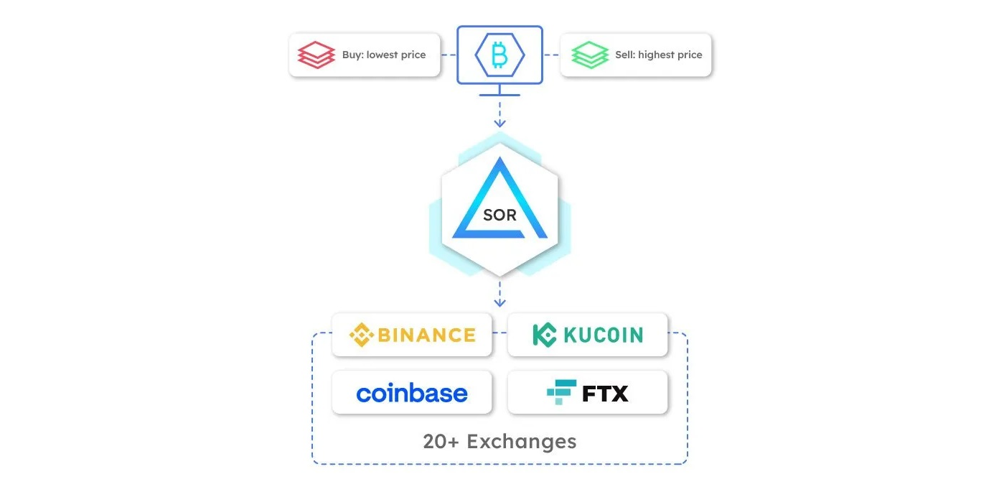

## Table of Contents

## What is Smart Order Routing (SOR)?

Smart Order Routing (SOR) is a system used by brokers to help get the best price for buying or selling stocks. When you want to buy or sell a stock, the SOR looks at different places where the stock is traded, like different stock exchanges or other trading platforms. It then chooses the place that offers the best price and the quickest trade. This helps make sure you get the best deal possible.

SOR is important because it helps make trading more fair and efficient. Without SOR, you might end up buying or selling at a worse price because you only looked at one place. By using SOR, brokers can automatically find the best price across many different places, saving you time and possibly money. This is especially useful in fast-moving markets where prices can change quickly.

## Why is Smart Order Routing important in trading?

Smart Order Routing (SOR) is important in trading because it helps traders get the best price for their stocks. When you want to buy or sell a stock, SOR looks at many different places where the stock is traded. It then picks the place that offers the best price for your trade. This means you don't have to check all these places yourself, which saves you time and effort.

SOR also makes trading fairer and more efficient. Without SOR, you might end up trading at a worse price because you only looked at one place. By using SOR, brokers can automatically find the best price across many different places. This is especially helpful in fast-moving markets where prices can change quickly. So, SOR helps make sure you get a good deal, no matter how fast the market is moving.

## How does Smart Order Routing work?

Smart Order Routing (SOR) works by looking at different places where stocks are traded, like stock exchanges and other trading platforms. When you want to buy or sell a stock, SOR checks the prices at all these places. It then decides where to send your order to get the best price for you. This means SOR is always working to find the best deal by comparing prices across many different trading spots.

SOR is smart because it can do this quickly and automatically. It looks at things like the price, how many stocks are available, and how fast the trade can happen. Once it finds the best place, it sends your order there right away. This helps you get the best price without having to do all the work yourself, making trading easier and more efficient.

## What are the key components of a Smart Order Routing system?

A Smart Order Routing system has a few important parts that help it work well. One key part is the ability to check prices at different places where stocks are traded. This means the system looks at stock exchanges and other trading platforms to see what prices they are offering. Another important part is speed. The system needs to work quickly to find the best price before it changes, which is really helpful in fast-moving markets.

Another key component is the decision-making part of the system. Once it has all the price information, it needs to decide where to send your order to get the best deal. This part looks at things like the price, how many stocks are available, and how fast the trade can happen. The last important part is the connection to all these different trading places. The system needs to be able to send your order to the chosen place quickly and accurately, making sure you get the best price without any delays.

## What are the benefits of using Smart Order Routing?

Using Smart Order Routing (SOR) helps traders get the best price for their stocks. When you want to buy or sell a stock, SOR looks at many different places where the stock is traded. It then picks the place that offers the best price for your trade. This means you don't have to check all these places yourself, which saves you time and effort. By finding the best price, SOR can also help you save money on your trades.

SOR also makes trading fairer and more efficient. Without SOR, you might end up trading at a worse price because you only looked at one place. By using SOR, brokers can automatically find the best price across many different places. This is especially helpful in fast-moving markets where prices can change quickly. So, SOR helps make sure you get a good deal, no matter how fast the market is moving.

## Can Smart Order Routing be used in all types of markets?

Smart Order Routing (SOR) can be used in many types of markets, but it works best in markets where there are lots of different places to trade. For example, SOR is very helpful in stock markets where stocks are traded on different exchanges and other platforms. In these markets, SOR can look at all these places to find the best price for buying or selling stocks.

However, SOR might not be as useful in markets where there is only one place to trade. For example, if a certain type of bond is only traded on one exchange, SOR won't have other places to compare prices. So, while SOR can be used in many markets, it's most beneficial where there are lots of trading options to choose from.

## What are the challenges and limitations of Smart Order Routing?

Smart Order Routing (SOR) faces some challenges and limitations that can make it less effective. One big challenge is the speed of the market. In very fast-moving markets, prices can change quickly, and SOR might not always be able to find the best price before it changes. This can happen if the system is slow or if the market moves too fast for the system to keep up. Another challenge is the cost. SOR systems can be expensive to set up and maintain, which means not all brokers or traders might be able to use them.

Another limitation is that SOR might not work well in all types of markets. If a market only has one place to trade, like some bonds or other financial products, then SOR can't compare prices from different places. This means SOR is most helpful in markets with lots of trading options. Also, SOR systems can be complex, and if something goes wrong, it might be hard to fix quickly, which can affect trading.

## How does Smart Order Routing handle different types of orders?

Smart Order Routing (SOR) can handle different types of orders like market orders, limit orders, and stop orders. A market order is when you want to buy or sell a stock right away at the current price. SOR looks at all the places where the stock is traded and picks the one with the best price for your market order. A limit order is when you set a specific price you want to buy or sell at. SOR will wait until the price reaches your limit and then find the best place to trade at that price. A stop order is when you want to buy or sell a stock once it reaches a certain price. SOR will keep an eye on the price and, when it hits your stop price, it will find the best place to trade.

SOR is smart because it knows how to handle these different types of orders in the best way possible. For market orders, it acts quickly to get the best price right away. For limit orders, it waits patiently until the price is right and then finds the best place to trade. And for stop orders, it watches the market closely and then acts fast when the price hits your stop. This way, no matter what type of order you place, SOR helps you get the best deal by checking all the trading places and making the right choice for you.

## What role does latency play in Smart Order Routing?

Latency is really important in Smart Order Routing because it's all about how fast the system can work. When you want to buy or sell a stock, the Smart Order Routing system needs to look at different places to find the best price. If the system is slow, or has high latency, it might miss out on the best price because the market can change quickly. So, a fast system with low latency helps make sure you get the best deal before the price changes.

In fast-moving markets, low latency is even more important. Imagine you want to buy a stock, and the price is going up fast. If the Smart Order Routing system is slow, by the time it finds the best place to buy, the price might have gone up even more. But if the system is fast, it can quickly find the best price and buy the stock before it gets too expensive. So, keeping latency low helps the system work better and get you a better price.

## How do regulatory requirements affect Smart Order Routing strategies?

Regulatory requirements can change how Smart Order Routing works. Rules set by governments or financial groups can tell brokers what they can and can't do when trading. For example, some rules might say that brokers need to make sure trades are fair and that everyone gets the same chance to buy or sell at the best price. This means the Smart Order Routing system has to follow these rules and might have to change how it picks the best place to trade. If the rules are strict, the system might have to check more places or take longer to make sure it's following the law.

These rules can also affect how fast and efficient Smart Order Routing can be. If the rules make the system slower or more complicated, it might not be able to find the best price as quickly. This can be a problem in fast-moving markets where prices change a lot. But following the rules is important because it helps keep trading fair and safe for everyone. So, even if it makes things a bit harder, Smart Order Routing systems need to work within these rules to make sure they are doing things the right way.

## What advanced algorithms are used in Smart Order Routing?

Smart Order Routing uses advanced algorithms to help find the best price for buying or selling stocks. One type of algorithm is called a decision tree algorithm. This algorithm works by looking at different places where stocks are traded and making choices based on things like price, how many stocks are available, and how fast the trade can happen. It's like following a map to find the best path to take. Another type of algorithm is a genetic algorithm, which tries different ways of routing orders and picks the best one over time, kind of like how living things evolve to be better.

These algorithms also use machine learning to get smarter over time. Machine learning helps the system learn from past trades and get better at finding the best price. For example, the system might see that certain places often have better prices at certain times of the day, and then it can use this information to make better choices in the future. By using these advanced algorithms, Smart Order Routing can quickly and accurately find the best place to trade, helping traders get the best deal possible.

## How can Smart Order Routing be optimized for high-frequency trading?

Smart Order Routing can be optimized for high-frequency trading by making it faster and more accurate. In high-frequency trading, trades happen very quickly, so the Smart Order Routing system needs to work fast to find the best price before it changes. To do this, the system can use special computers that are very fast and can handle lots of information at once. It can also use advanced algorithms that learn from past trades to make better choices about where to send orders. By making the system as fast and smart as possible, it can help high-frequency traders get the best prices in a fast-moving market.

Another way to optimize Smart Order Routing for high-frequency trading is by making sure it can handle lots of orders at the same time. High-frequency traders often send many orders in a short time, so the system needs to be able to keep up. This can be done by using technology that can process many orders quickly and by setting up the system to work with many different trading places at once. By doing this, the Smart Order Routing system can find the best prices for lots of trades without slowing down, which is really important for high-frequency trading.

## What is the concept behind smart order routing?

Smart Order Routing (SOR) aims to identify the optimal trading venue for executing customer orders based on key factors such as price and [liquidity](/wiki/liquidity-risk-premium). This approach is essential for maximizing execution quality and minimizing trading costs in today's fragmented financial markets. 

The SOR process begins with the receipt of incoming orders. These orders are assessed against various market conditions to determine the best routing strategy. The evaluation typically includes analyzing market data pertaining to prices across multiple venues, available liquidity, [order book](/wiki/order-book-trading-strategies) depth, and historical trading patterns.

The decision-making component of SOR relies on predefined strategies, which may include simple cost-minimization tactics or more complex algorithms incorporating real-time data analytics. These algorithms assess potential venues by estimating transaction costs and weighing them against expected market conditions and execution speeds.

Mathematically, the routing decision can involve minimizing a cost function $C(V)$ for a set of trading venues $V$. This cost function could be defined as:

$$
C(V) = \sum_{i=1}^{n} \left( \text{price}_i + \text{transaction\_cost}_i + \text{latency\_penalty}_i \right),
$$

where:
- $\text{price}_i$ represents the price on venue $i$,
- $\text{transaction\_cost}_i$ is the fee associated with executing the trade on venue $i$,
- $\text{latency\_penalty}_i$ accounts for the expected time delay in order execution on venue $i$.

The dynamic and adaptive nature of SOR minimizes execution costs and reduces latency by continuously updating its routing decisions in response to changing market conditions. This capability is particularly crucial in high-frequency trading environments where rapid market shifts necessitate real-time order adjustments.

To illustrate a basic implementation, consider the following Python code that selects a venue with the lowest estimated cost:

```python
def select_best_venue(prices, transaction_costs, latency_penalties):
    best_venue = None
    lowest_cost = float('inf')

    for venue in prices.keys():
        cost = (prices[venue] + transaction_costs[venue] + latency_penalties[venue])

        if cost < lowest_cost:
            lowest_cost = cost
            best_venue = venue

    return best_venue

prices = {'Venue A': 100.5, 'Venue B': 100.0, 'Venue C': 101.2}
transaction_costs = {'Venue A': 0.2, 'Venue B': 0.1, 'Venue C': 0.3}
latency_penalties = {'Venue A': 0.05, 'Venue B': 0.02, 'Venue C': 0.04}

best_venue = select_best_venue(prices, transaction_costs, latency_penalties)
print(f"The best venue is: {best_venue}")
```

This snippet evaluates venues A, B, and C by their combined costs and selects the one with the lowest overall cost, illustrating how SOR algorithms can be applied practically to optimize trading decisions. By employing sophisticated techniques in dynamic market assessment and routing, SOR plays a pivotal role in enhancing trading efficiency and effectiveness.

## References & Further Reading

[1]: Harris, L. (2003). ["Trading and Exchanges: Market Microstructure for Practitioners"](https://www.amazon.com/Trading-Exchanges-Market-Microstructure-Practitioners/dp/0195144708). Oxford University Press.

[2]: O'Hara, M. (1995). ["Market Microstructure Theory"](https://openlibrary.org/books/OL1103097M/Market_microstructure_theory). Blackwell.

[3]: Fabozzi, F. J., Focardi, S. M., & Jonas, C. (2010). ["High-Frequency Trading: A Practical Guide to Algorithmic Strategies and Trading Systems."](https://www.semanticscholar.org/paper/Quantitative-Equity-Investing%3A-Techniques-and-Fabozzi-Focardi/1c49a2a53919f7e65cb96f16691b8ff726fd3cd7) Wiley.

[4]: Johnson, B. (2010). ["Algorithmic Trading & DMA: An Introduction to Direct Access Trading Strategies."](https://archive.org/details/algorithmictradi0000john) 4Myeloma Press.

[5]: Securities and Exchange Commission. (1998). ["Regulation of Exchanges and Alternative Trading Systems"](https://www.federalregister.gov/documents/1998/12/22/98-33299/regulation-of-exchanges-and-alternative-trading-systems). Federal Register.

[6]: Ryll, L., & Seel, V. (2020). ["Algorithmic Trading with Python: Quantitative Methods and Strategy Development"](https://github.com/chrisconlan/algorithmic-trading-with-python). Wiley.

[7]: De Prado, M. L. (2018). ["Advances in Financial Machine Learning"](https://archive.org/download/massimo_motta_competition_policy_theory_and_prabookfi-org/Marcos%20Lopez%20de%20Prado%20-%20Advances%20in%20Financial%20Machine%20Learning-Wiley%20%282018%29.pdf). Wiley.