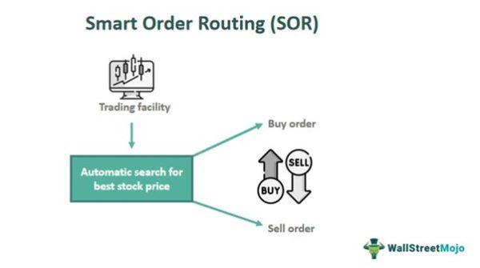

The financial markets have experienced substantial evolution over the decades, prominently influenced by technological advancements. These developments have reshaped how trading is conducted, enabling more efficient, accurate, and speedy transactions. A key component contributing to this evolution is Smart Order Routing (SOR), a sophisticated technological mechanism designed to optimize trade execution across diverse trading venues.

SOR represents a shift from traditional trading methods. It utilizes algorithmic strategies to evaluate multiple factors such as price, liquidity, and timing, assisting traders in achieving the best possible outcomes for their transactions. Unlike conventional trading, where orders might be processed sequentially or manually, SOR allows for simultaneous evaluation across varied exchanges, providing a comprehensive approach to trade execution.

This article will provide insights into the complexities of financial market trading, emphasizing the role of SOR, innovative trading technologies, and algorithmic trading. These elements are not only pivotal in enhancing the trading process but also significantly impact traders' strategies. A thorough understanding of these concepts is essential for both seasoned traders and those new to financial markets. By integrating knowledge of SOR and related technologies, traders can refine their strategies, reduce costs, and improve their overall trading performance.

## Table of Contents

## What is Smart Order Routing?

Smart Order Routing (SOR) is a sophisticated technology designed to optimize the process of executing trade orders by selecting the most suitable trading venue. The core function of SOR is to enhance execution efficiency by evaluating various parameters across multiple exchanges, such as price, liquidity, and execution speed. By consolidating data from a wide range of sources, SOR systems are capable of identifying the best available opportunities to fulfill an order, thereby maximizing the value obtained from each trade.

The operation of SOR involves the use of complex algorithms that can process large amounts of market data in real-time. These algorithms take into consideration factors like the depth of order books, historical price trends, and prevailing market conditions to ascertain the optimal path for order execution. The primary objective is to obtain the most favorable terms possible for clients by achieving better pricing and minimizing the cost of execution. This is especially beneficial in markets where liquidity is fragmented across various venues.

Originally developed for equity markets, SOR has expanded its utility beyond stocks to encompass a broader array of asset classes, including fixed income securities and cryptocurrencies. This expansion reflects the growing need for efficient trade execution mechanisms in assets that experience varying degrees of liquidity and market dynamics. For instance, the fixed income market's traditional lack of transparency and the nascency of [cryptocurrency](/wiki/cryptocurrency) exchanges pose distinct challenges that SOR attempts to mitigate.

One of the distinctive features of SOR is its ability to dynamically adjust to changing market conditions. This adaptability is crucial in volatile environments where swift price changes can affect the overall execution strategy. Continuous advancements in computational power and algorithmic design further enhance SOR's capacity to manage complex trading scenarios. By consistently reassessing available data and recalibrating strategies, SOR ensures that trade execution remains aligned with prevailing market conditions.

The deployment of SOR is largely driven by algorithmic frameworks that dissect market structures to unveil optimal routes for order execution. The algorithms are programmed to consider various objectives, such as minimizing transaction costs, achieving time efficiency, and ensuring compliance with regulatory requirements. This multi-faceted approach allows traders to maintain a competitive edge in an increasingly complex financial landscape.

In summary, Smart Order Routing serves as a vital tool in the modern trading ecosystem, leveraging advanced algorithms and data analysis to streamline trade executions across diverse asset classes. It equips traders with the ability to obtain the best possible execution outcomes, thereby enhancing trading performance and operational efficiency.

## How Smart Order Routing Works

Smart Order Routing (SOR) systems are instrumental in today's financial markets, using real-time data analysis to choose the optimal execution path for trade orders. At the core of this technology is its ability to quickly evaluate and adapt to ever-changing market conditions, ensuring that trades are executed at the best possible price with minimal delay.

SOR systems operate by continuously analyzing key factors such as market conditions, transaction costs, and compliance with regulatory requirements. These factors are essential for deciding how and where to route orders among a plethora of trading venues, each offering different prices and [liquidity](/wiki/liquidity-risk-premium) levels. By employing complex algorithms, SOR systems can swiftly assess available options and determine the most efficient route for each order.

One of the fundamental algorithms used within SOR systems is the Volume-Weighted Average Price (VWAP). VWAP is a trading benchmark that provides the average price a security has traded at throughout the day, based on both [volume](/wiki/volume-trading-strategy) and price. It is calculated using the formula:

$$
\text{VWAP} = \frac{\sum (\text{Price}_i \times \text{Volume}_i)}{\sum \text{Volume}_i}
$$

where $\text{Price}_i$ is the price of the security at each transaction $i$, and $\text{Volume}_i$ is the volume of the transaction. This computation helps in comparing the execution price of an order to the average price throughout the trading session, thus evaluating the efficiency of the order execution.

Another crucial algorithm in SOR systems is the Time-Weighted Average Price (TWAP). TWAP is often used to minimize market impact for larger orders by evenly distributing the execution over a specified time period. Unlike VWAP, TWAP focuses on the passage of time rather than trading volume to achieve a fair price distribution within the time frame.

By employing VWAP and TWAP, SOR systems aim to minimize trading costs and slippage—unplanned changes in trading prices due to inherent market [volatility](/wiki/volatility-trading-strategies). The application of these algorithms helps in making informed decisions about order placement across various trading venues, thereby optimizing execution quality.

In summary, Smart Order Routing systems employ sophisticated algorithms and real-time data analysis to dynamically navigate the complexities of modern trading environments. By focusing on key conditions and cost metrics, SOR systems guide trade orders through the most efficient routes, balancing the need for speed, price, and regulatory compliance.

## The Role of Algo Trading in Financial Markets

Algorithmic trading has fundamentally transformed trade execution within financial markets by harnessing the power of computational algorithms. These algorithms are designed to automate trading strategies based on predefined criteria, thus facilitating rapid and precise trade execution. By minimizing the dependence on human intervention, [algorithmic trading](/wiki/algorithmic-trading) significantly reduces the likelihood of human error. Trading algorithms can process vast amounts of data in real-time, enabling traders to execute large volumes of trades at speeds that outperform traditional manual methods.

A key advantage of algorithmic trading is its ability to optimize trading costs. Traditional trading methods often encounter slippage, which occurs when there is a difference between the expected price of a trade and the actual price at which the trade is executed. Algorithmic systems can reduce slippage by executing trades at the most favorable prices and times, leveraging strategies that minimize market impact. For instance, algorithms can be programmed to execute orders using strategies like the Volume-Weighted Average Price (VWAP) or the Time-Weighted Average Price (TWAP), which are commonly employed to optimize trade execution by distributing orders over time or based on volume.

Algorithmic trading is particularly vital within high-frequency trading ([HFT](/wiki/high-frequency-trading-strategies)) environments. High-frequency trading involves executing a large number of orders at extremely fast speeds, often fractions of a second. The efficiency and speed afforded by algorithmic systems enable traders to capitalize on minute price fluctuations that occur within the market, generating profits from small but frequent trades. The capability to instantaneously react to market events and exploit pricing inefficiencies makes algorithmic trading indispensable for HFT firms.

Moreover, algorithmic frameworks can utilize [machine learning](/wiki/machine-learning) techniques to enhance decision-making processes. By analyzing historical market data, these systems can adapt and refine trading strategies, improving their effectiveness over time. As markets evolve, algorithmic models are updated dynamically, ensuring adaptability to changing market conditions.

Overall, algorithmic trading plays a pivotal role in contemporary financial markets, melding traditional trading strategies with cutting-edge technology to enhance trade execution efficiency and accuracy, while also driving down costs. As trading technology continues to evolve, the integration of advanced algorithms in various trading strategies is expected to further cement algorithmic trading as a cornerstone of modern financial markets.

## Benefits of Smart Order Routing

Smart Order Routing (SOR) offers significant advantages to traders by ensuring that trade executions achieve the best possible price. One of the primary benefits of SOR is its ability to minimize the market impact of large orders. By breaking down substantial orders into smaller ones and executing them across various trading venues, SOR reduces the likelihood of affecting the market price. This approach is particularly beneficial in volatile or fragmented markets where large orders could otherwise skew prices.

Moreover, SOR provides traders with access to multiple liquidity pools. This access is crucial as it increases the probability of finding matching counterparties for trades, thereby enhancing liquidity. A well-designed SOR system can identify and interact with these pools efficiently, ensuring that trades are executed where the best prices are available. This functionality benefits traders by enabling them to tap into a broader range of trading options beyond their primary market, thus optimizing trade outcomes.

In addition to these benefits, traders experience reduced slippage and improved execution quality. Slippage, which occurs when there is a difference between the expected price of a trade and the actual executed price, can significantly impact trading outcomes. By dynamically evaluating venue-specific conditions and routing orders accordingly, SOR minimizes slippage. This optimization is especially advantageous in fragmented markets where price discrepancies may exist across different platforms.

Overall, the implementation of SOR enhances the efficiency and effectiveness of trade executions by leveraging technology to navigate complex market landscapes. This capability ensures that traders maximize their trading strategies' potential while maintaining lower transaction costs and achieving superior execution quality.

## Challenges and Limitations

Smart Order Routing (SOR) is a powerful tool in modern trading that, despite its numerous benefits, is not without its challenges and limitations. One primary challenge SOR encounters is latency sensitivity. In financial markets, even milliseconds can determine the difference between profit and loss. SOR systems must be able to process large amounts of data swiftly and execute trades almost instantaneously. High-frequency trading (HFT) environments are particularly affected by this, as any delay in data transmission or order execution can lead to significant financial impacts. 

Additionally, the accuracy of SOR systems heavily relies on the quality of the data they receive. Poor data quality, whether due to incorrect pricing information, outdated financial feeds, or erroneous market data, can lead to inefficient routing decisions. Ensuring data integrity and maintaining high standards of data management are critical to maximizing the efficacy of SOR systems.

The inherent complexity of implementing SOR also presents significant barriers. Developing and maintaining a robust SOR system requires substantial investment in technology and expertise. This complexity may limit the adoption of SOR to larger financial institutions that have the necessary resources. Smaller firms might find it challenging to justify the costs involved in deploying sophisticated SOR systems, which can include expenses related to hardware, software, and ongoing support.

Moreover, market volatility poses additional limitations to the performance of SOR systems. High volatility can affect market liquidity and the predictability of execution outcomes. When market conditions change rapidly, SOR algorithms must quickly adapt to fluctuations in price and liquidity to avoid costly execution errors. This requires robust risk management mechanisms to be in place, which can mitigate potential losses caused by sudden market shifts.

Overall, while Smart Order Routing is vital for optimizing trading executions, it must continuously evolve to address these challenges. Improvements in data management, technology investment, and risk mitigation strategies will be essential for overcoming these limitations and enhancing the utility of SOR in dynamic financial markets.

## Future Trends in SOR and Trading Technology

The integration of [artificial intelligence](/wiki/ai-artificial-intelligence) (AI) and machine learning (ML) into Smart Order Routing (SOR) systems promises to significantly enhance their efficiency and accuracy through predictive analytics. By leveraging vast datasets and advanced learning algorithms, AI and ML can refine decision-making processes within SOR, allowing for more precise predictions of market movements and better adaptation to emerging trading patterns. This improved predictive capability can optimize the routing of orders, thereby increasing the likelihood of achieving favorable trading outcomes.

Blockchain technology and the proliferation of digital assets present another transformative opportunity for SOR and trading technology. Blockchain offers increased transparency and security by providing immutable and verifiable records of transactions. The decentralized nature of blockchain could alleviate some of the constraints imposed by traditional market structures, enabling more seamless and secure trading experiences. Additionally, the acceptance and integration of digital assets such as cryptocurrencies in trading platforms necessitate advancements in SOR systems to accommodate these new instruments and capitalize on their liquidity.

Regulatory changes are another critical [factor](/wiki/factor-investing) influencing the evolution of SOR. As global financial markets continue to evolve, so too do the regulations governing them. Regulatory bodies are increasingly focusing on ensuring fair and transparent trading practices, which may drive further innovations in SOR technology to maintain compliance. These changes often require SOR systems to adapt rapidly to new compliance standards while continuing to deliver optimal trading performance.

Overall, the confluence of AI, blockchain, and regulatory developments suggests a dynamic future for SOR and trading technology. Companies at the forefront of these innovations will be well-positioned to thrive in an increasingly complex and fast-paced trading environment. Understanding these technological and regulatory trends is crucial for participants seeking to leverage SOR to its fullest potential in the continuously evolving financial markets.

## Conclusion

Smart Order Routing (SOR), driven by advancements in trading technology, has become essential in modern financial markets. As markets have grown more complex and global, the need for efficient and accurate trade execution has intensified. SOR addresses this demand by utilizing sophisticated algorithms to optimize the execution of trading orders, considering multiple variables such as price, liquidity, and market conditions. This ensures that traders achieve the best possible outcomes when executing trades.

The ongoing evolution of trading practices emphasizes the importance of SOR and algorithmic trading. These technologies are poised to remain at the forefront of the industry, primarily due to their ability to enhance transaction efficiency and precision. As regulatory environments and market infrastructures continue to evolve, SOR systems will adapt, leveraging innovations such as artificial intelligence and machine learning to refine predictive analytics and improve decision-making.

Understanding SOR and its interconnected technologies is crucial for traders who wish to effectively navigate the complexities of today's financial landscape. Mastery of these tools can provide a competitive edge, enabling traders to maximize their returns while minimizing risks and costs associated with trade execution. As the financial markets further embrace technology-driven solutions, staying informed and proficient in the use of SOR is essential for successful participation in the markets.

## References & Further Reading

[1]: Kissell, R. (2013). ["The Science of Algorithmic Trading and Portfolio Management."](https://www.sciencedirect.com/book/9780124016897/the-science-of-algorithmic-trading-and-portfolio-management) Academic Press.

[2]: Aldridge, I. (2009). ["High-Frequency Trading: A Practical Guide to Algorithmic Strategies and Trading Systems."](https://www.amazon.com/High-Frequency-Trading-Practical-Algorithmic-Strategies/dp/1118343506) Wiley.

[3]: Hasbrouck, J. (2007). ["Empirical Market Microstructure: The Institutions, Economics, and Econometrics of Securities Trading."](https://searchworks.stanford.edu/view/6759272) Oxford University Press.

[4]: Narang, R. K. (2009). ["Inside the Black Box: A Simple Guide to Quantitative and High-Frequency Trading."](https://www.amazon.com/Inside-Black-Box-Quantitative-Frequency/dp/1118362411) Wiley.

[5]: Gomber, P., Arndt, B., Lutat, M., & Uhle, T. (2011). ["High-Frequency Trading."](https://www.semanticscholar.org/paper/High-Frequency-Trading-Gomber-Arndt/3d0ba8179934e0a45e85a184d1ec526616e2e213) Business & Information Systems Engineering, 3(2), 135-140.