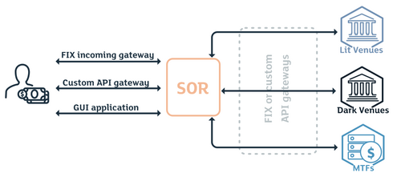

## Table of Contents

## What is Smart Order Routing (SOR) in trading?

Smart Order Routing (SOR) is a system used by traders to get the best possible price when buying or selling stocks. It works by automatically checking different places where stocks are traded, like different stock exchanges or electronic trading platforms, to find the best price available at that moment. This helps traders save money by ensuring they are not overpaying when they buy or underselling when they sell.

SOR is especially useful in markets where the same stock can be traded at different prices on different platforms. For example, if you want to buy a stock, SOR will look at all the places where that stock is available and choose the one with the lowest price. This way, traders can take advantage of the best deals available across various markets without having to manually search for them.

## Why is Smart Order Routing important for traders?

Smart Order Routing is important for traders because it helps them save money and time. When traders want to buy or sell a stock, they want to get the best price possible. SOR automatically looks at different places where stocks are traded and finds the best price for them. This means traders don't have to spend time searching different platforms themselves, which can be a big relief, especially for people who trade a lot.

Also, SOR makes sure that traders are not missing out on better deals. In the stock market, prices can be different at different places at the same time. Without SOR, a trader might buy a stock at a higher price on one exchange when it's actually cheaper on another. By using SOR, traders can be sure they are always getting the best price available, which can make a big difference in their overall profits.

## How does Smart Order Routing work?

Smart Order Routing works by automatically looking at different places where stocks are traded, like stock exchanges or electronic trading platforms. When a trader wants to buy or sell a stock, the SOR system checks all these places to see where the best price is available at that moment. It then sends the trader's order to the place with the best price. This helps the trader get the best deal without having to manually search different platforms.

For example, if a trader wants to buy a certain stock, the SOR system will quickly look at all the places where that stock is being traded. If one exchange is selling the stock for $50 and another is selling it for $49, the SOR will send the buy order to the exchange offering the stock for $49. This way, the trader saves money by buying at the lower price. SOR makes trading easier and more efficient by doing this work automatically.

## What are the key components of a Smart Order Routing system?

A Smart Order Routing system has several important parts that help it work well. One main part is the connection to different trading places like stock exchanges and electronic platforms. This lets the system look at prices from all these places at the same time. Another key part is the software that can quickly compare these prices and decide where to send the order for the best deal. This software needs to be fast and accurate to make sure traders get the best price.

Another important part is the rules or algorithms that the system uses to decide how to route orders. These rules can be set to look for the lowest price, the fastest execution, or other factors that traders care about. The system also needs to be able to handle a lot of orders at the same time without slowing down. This makes sure that even when the market is busy, the system can still find the best prices quickly and efficiently.

## Can you explain the difference between basic and advanced SOR?

Basic Smart Order Routing (SOR) is like a simple tool that looks at different places where you can buy or sell a stock and picks the one with the best price. It's straightforward and focuses mainly on finding the lowest price for buying or the highest price for selling. This type of SOR is good for traders who just want to make sure they're getting a fair deal without worrying about other details.

Advanced SOR goes beyond just finding the best price. It uses more complicated rules to consider things like how fast an order can be completed, how much it will cost to trade, and even the size of the order. This type of SOR can split up a big order into smaller pieces and send them to different places to get the best overall deal. It's more helpful for traders who need to think about many factors when they trade.

## What are the benefits of using Smart Order Routing?

Smart Order Routing helps traders save money by finding the best price for buying or selling stocks. It looks at different places where stocks are traded and picks the one with the best price. This means traders don't have to spend time searching for the best deals themselves. It's like having a helper who always finds the cheapest place to buy something or the best place to sell it.

Using Smart Order Routing also makes trading faster and easier. The system can handle a lot of orders at the same time and still find the best prices quickly. This is really helpful when the market is busy and prices are changing fast. Traders can focus on making good decisions instead of worrying about finding the best price, which can make a big difference in their overall profits.

## What challenges do traders face when implementing SOR?

When traders want to use Smart Order Routing, they might run into some problems. One big challenge is making sure the system can connect to all the different places where stocks are traded. If the system can't see all the prices, it might not find the best deal. Another problem is that the system needs to be really fast. If it takes too long to check all the prices, the best price might be gone by the time the order is sent.

Another challenge is setting up the rules for the SOR system. Traders need to decide what's most important to them, like the lowest price or the fastest trade. Getting these rules right can be tricky and might need a lot of testing. Also, SOR systems can be expensive to set up and keep running, so traders need to think about if it's worth the cost.

## How does SOR impact market liquidity and price discovery?

Smart Order Routing can help make the market more liquid. When traders use SOR, their orders can go to different places where stocks are traded. This means more orders are spread out across different markets, which can make it easier for other traders to buy or sell. When there are more orders, it's easier for everyone to trade, which is what we call liquidity. So, SOR can help make the market more active and easier to trade in.

SOR also helps with finding the right price for stocks, which we call price discovery. Because SOR looks at prices from different places, it can help make sure that the price of a stock is more accurate. When traders can see and use the best prices from all over, it helps the market figure out the true value of a stock. This makes the market more fair and helps everyone get a better deal when they trade.

## What are some common algorithms used in Smart Order Routing?

Smart Order Routing uses different algorithms to decide where to send trading orders. One common algorithm is the "Best Price Algorithm." This one looks at all the places where a stock is traded and picks the one with the best price. It's simple but really helpful for traders who want to save money. Another algorithm is the "Minimum Impact Algorithm," which tries to send orders to places where they won't affect the stock's price too much. This is good for traders who want to buy or sell a lot of stocks without changing the market price.

Another popular algorithm is the "Liquidity Seeking Algorithm." This one looks for places where there are a lot of orders, so it can fill big orders quickly. It's useful for traders who need to trade a lot at once. The "Time-Weighted Average Price (TWAP) Algorithm" spreads out orders over time to get a good average price. This helps traders who want to trade without causing big price changes. All these algorithms help SOR systems work better and meet different trading needs.

## How do regulatory requirements affect Smart Order Routing?

Regulatory requirements can have a big impact on Smart Order Routing. Different countries have rules about how trading should work, and SOR systems need to follow these rules. For example, some places might have laws that say orders must be sent to the best price available, which is something SOR already tries to do. But, these rules can also limit where SOR can send orders or how it can split up big orders. This means that SOR systems have to be designed to follow these rules, which can make them more complicated and harder to use.

Also, regulators might want to see how SOR systems are working to make sure they are fair and not causing problems in the market. This means SOR systems need to keep good records of all their orders and be able to show these records to the regulators if asked. Keeping up with all these rules can be hard for traders, but it's important to make sure that the market stays fair and safe for everyone.

## What are the latest trends in Smart Order Routing technology?

The latest trends in Smart Order Routing technology focus a lot on using [artificial intelligence](/wiki/ai-artificial-intelligence) and [machine learning](/wiki/machine-learning). These smart technologies help SOR systems get even better at finding the best prices. They can learn from past trades and make better decisions over time. This means traders can save more money and get faster trades. Also, these systems can now handle more data and make decisions quicker, which is really important in today's fast-moving markets.

Another big trend is making SOR systems more flexible and customizable. Traders want systems that can be changed to fit their own needs. So, new SOR systems let traders set their own rules and priorities, like focusing on speed or cost. This helps traders get exactly what they need from their SOR system. Also, with more trading happening around the world, SOR systems are getting better at working across different countries and following different rules, making it easier for traders to trade anywhere.

## How can traders evaluate the effectiveness of their SOR system?

Traders can evaluate the effectiveness of their Smart Order Routing system by looking at how much money they are saving. A good SOR system should find the best prices for buying and selling stocks, which means traders should see lower costs when they buy and higher prices when they sell. They can compare the prices they get with the SOR system to the prices they would get without it. If the SOR system is working well, the difference in price should be clear and the savings should add up over time.

Another way to check if an SOR system is effective is by seeing how fast it works. A good system should be able to send orders quickly to the best place, even when the market is busy. Traders can look at how long it takes for their orders to be completed and compare this to what they expect. If the system is fast and reliable, it means it's doing a good job at finding the best prices without delays. This can make a big difference in how much traders can earn.

## How does Smart Order Routing work?

Smart Order Routing (SOR) systems are instrumental in today's financial markets, using real-time data analysis to choose the optimal execution path for trade orders. At the core of this technology is its ability to quickly evaluate and adapt to ever-changing market conditions, ensuring that trades are executed at the best possible price with minimal delay.

SOR systems operate by continuously analyzing key factors such as market conditions, transaction costs, and compliance with regulatory requirements. These factors are essential for deciding how and where to route orders among a plethora of trading venues, each offering different prices and [liquidity](/wiki/liquidity-risk-premium) levels. By employing complex algorithms, SOR systems can swiftly assess available options and determine the most efficient route for each order.

One of the fundamental algorithms used within SOR systems is the Volume-Weighted Average Price (VWAP). VWAP is a trading benchmark that provides the average price a security has traded at throughout the day, based on both [volume](/wiki/volume-trading-strategy) and price. It is calculated using the formula:

$$
\text{VWAP} = \frac{\sum (\text{Price}_i \times \text{Volume}_i)}{\sum \text{Volume}_i}
$$

where $\text{Price}_i$ is the price of the security at each transaction $i$, and $\text{Volume}_i$ is the volume of the transaction. This computation helps in comparing the execution price of an order to the average price throughout the trading session, thus evaluating the efficiency of the order execution.

Another crucial algorithm in SOR systems is the Time-Weighted Average Price (TWAP). TWAP is often used to minimize market impact for larger orders by evenly distributing the execution over a specified time period. Unlike VWAP, TWAP focuses on the passage of time rather than trading volume to achieve a fair price distribution within the time frame.

By employing VWAP and TWAP, SOR systems aim to minimize trading costs and slippage—unplanned changes in trading prices due to inherent market [volatility](/wiki/volatility-trading-strategies). The application of these algorithms helps in making informed decisions about order placement across various trading venues, thereby optimizing execution quality.

In summary, Smart Order Routing systems employ sophisticated algorithms and real-time data analysis to dynamically navigate the complexities of modern trading environments. By focusing on key conditions and cost metrics, SOR systems guide trade orders through the most efficient routes, balancing the need for speed, price, and regulatory compliance.

## References & Further Reading

[1]: Kissell, R. (2013). ["The Science of Algorithmic Trading and Portfolio Management."](https://www.sciencedirect.com/book/9780124016897/the-science-of-algorithmic-trading-and-portfolio-management) Academic Press.

[2]: Aldridge, I. (2009). ["High-Frequency Trading: A Practical Guide to Algorithmic Strategies and Trading Systems."](https://www.amazon.com/High-Frequency-Trading-Practical-Algorithmic-Strategies/dp/1118343506) Wiley.

[3]: Hasbrouck, J. (2007). ["Empirical Market Microstructure: The Institutions, Economics, and Econometrics of Securities Trading."](https://searchworks.stanford.edu/view/6759272) Oxford University Press.

[4]: Narang, R. K. (2009). ["Inside the Black Box: A Simple Guide to Quantitative and High-Frequency Trading."](https://www.amazon.com/Inside-Black-Box-Quantitative-Frequency/dp/1118362411) Wiley.

[5]: Gomber, P., Arndt, B., Lutat, M., & Uhle, T. (2011). ["High-Frequency Trading."](https://www.semanticscholar.org/paper/High-Frequency-Trading-Gomber-Arndt/3d0ba8179934e0a45e85a184d1ec526616e2e213) Business & Information Systems Engineering, 3(2), 135-140.