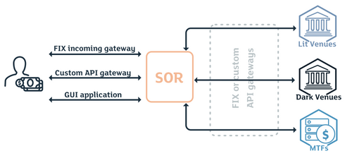

## Table of Contents

## What is smart order routing?

Smart order routing is a system that helps traders and investors buy or sell stocks more efficiently. It works by looking at different places where stocks are traded, like stock exchanges or other trading platforms, to find the best price and the fastest way to complete a trade. This means that instead of just sending an order to one place, smart order routing checks multiple places to make sure you get the best deal possible.

This system is really helpful because it can save money and time for people trading stocks. For example, if you want to buy a stock, smart order routing might find that one exchange has the stock at a lower price than another. It will then route your order to that exchange to get you the best price. This is especially useful for people who trade a lot, as even small savings on each trade can add up over time.

## How does smart order routing work?

Smart order routing works by checking different places where stocks are traded, like stock exchanges or other trading platforms. When you want to buy or sell a stock, the system looks at all these places to see where it can get the best price for you. It does this very quickly, often in just a few seconds. The system then sends your order to the place that offers the best deal. This means you might get a better price than if you just sent your order to one specific exchange.

This process helps make sure that you're getting the best possible price for your trade. It also helps to make trading faster because it can find the quickest way to complete your order. For example, if one exchange is really busy and slow, smart order routing might send your order to a different exchange that can process it faster. This is important because in trading, even small differences in price or speed can make a big difference in how much money you make or lose.

## What are the benefits of using smart order routing?

Smart order routing helps traders and investors get the best price when they buy or sell stocks. It does this by looking at different places where stocks are traded, like stock exchanges, to find the lowest price to buy or the highest price to sell. This means you can save money because you're always getting the best deal available at that moment. It's like shopping around at different stores to find the best price, but smart order routing does it automatically and very quickly.

Another benefit is that smart order routing can make trading faster. If one exchange is slow or busy, the system can send your order to a different exchange that can process it quicker. This is important because in trading, being fast can help you make more money. For example, if you want to buy a stock and the price is going up, getting your order filled quickly means you buy it at a lower price before it goes up even more. So, smart order routing helps you save time and potentially make more money.

## What are the common challenges faced in implementing smart order routing?

One of the main challenges in implementing smart order routing is dealing with the complexity of different trading platforms. Each stock exchange or trading platform has its own rules and ways of working. This means that the smart order routing system has to understand and follow all these different rules to work properly. It's like trying to play different games with different rules all at the same time, which can be very tricky.

Another challenge is keeping the system fast and reliable. Smart order routing needs to check many different places very quickly to find the best price. If it takes too long, the price might change, and you might not get the best deal. Also, the system has to work all the time without breaking down. If it stops working, it can't help you find the best price, which is a big problem for traders who need to make quick decisions.

Lastly, there's the issue of costs. Building and maintaining a smart order routing system can be expensive. You need good technology and smart people to keep it running well. These costs can add up, and not everyone might be able to afford it. But for those who can, the benefits of saving money on trades can make it worth the investment.

## Can you explain the difference between smart order routing and traditional order routing?

Smart order routing and traditional order routing are two different ways of handling stock trades. Traditional order routing is simpler. When you want to buy or sell a stock, your order goes to one specific place, like a stock exchange. If the price there isn't the best, you might end up paying more or getting less money than you could have. It's like going to just one store to buy something without checking if other stores have a better price.

Smart order routing is more advanced. Instead of sending your order to just one place, it checks many different places where stocks are traded. It looks for the best price and the fastest way to complete your trade. This means you're more likely to get a better deal because the system shops around for you. It's like using an app that compares prices at different stores to make sure you get the best deal possible.

## Which financial markets commonly use smart order routing?

Smart order routing is often used in the stock market. This is where people buy and sell shares of companies. When someone wants to buy or sell a stock, smart order routing helps them get the best price by checking different stock exchanges. This means they might save money because the system finds the lowest price to buy or the highest price to sell. The stock market is a big place with lots of trading happening all the time, so smart order routing can make a big difference.

Another place where smart order routing is used is in the foreign exchange market. This is where people trade different currencies. Just like with stocks, smart order routing looks at different places to find the best exchange rate for buying or selling currency. This can be very helpful because even small differences in exchange rates can add up to a lot of money. The foreign exchange market is huge and always moving, so having a system that can quickly find the best deal is important.

## What technologies are typically used to support smart order routing?

Smart order routing relies on advanced computer technology to work well. It uses special software that can quickly check different places where stocks are traded. This software needs to be very fast because it has to look at lots of information in just a few seconds. It also uses algorithms, which are like math recipes, to decide where to send your order to get the best price. These algorithms can be very smart and help make sure you get the best deal possible.

Another important technology is the internet, which helps the smart order routing system connect to different stock exchanges and trading platforms. The internet needs to be fast and reliable so the system can check prices and send orders quickly. Sometimes, special connections called "dedicated lines" are used to make sure the information travels even faster. All these technologies work together to make smart order routing quick and effective, helping traders save money and time.

## How does smart order routing impact market liquidity?

Smart order routing can help make the market more liquid. Liquidity means how easy it is to buy or sell something without changing its price too much. When smart order routing is used, it sends orders to different places to find the best price. This means more people can buy and sell stocks easily, which makes the market more active. When more people are trading, it's easier for everyone to find someone to trade with, which is good for [liquidity](/wiki/liquidity-risk-premium).

However, smart order routing can also have some effects on market liquidity that are not so good. If too many orders are sent to one place because it has the best price, it can make that place very busy. When a place gets too busy, it can slow down, and it might be harder to buy or sell quickly. This can make the market less liquid in those busy spots. So, while smart order routing usually helps with liquidity, it can sometimes make things a bit harder if not managed well.

## What role does smart order routing play in high-frequency trading?

Smart order routing is really important for high-frequency trading. High-frequency trading is when people buy and sell stocks very quickly, often using computers to make trades in just a few seconds. Smart order routing helps these traders by finding the best price for their trades very fast. It checks different places where stocks are traded to see where the best price is at that moment. This means high-frequency traders can make more money because they're always getting the best deal possible.

But smart order routing can also make things a bit tricky for high-frequency trading. Because it sends orders to the busiest places with the best prices, it can make those places even busier. When a place gets too busy, it can slow down, and it might be harder to buy or sell quickly. This can be a problem for high-frequency traders who need to trade very fast. So, while smart order routing helps them get the best prices, it can sometimes make the market a bit harder to navigate.

## How do regulatory requirements affect smart order routing practices?

Regulatory requirements are rules that governments and other organizations make to keep trading fair and safe. These rules can affect how smart order routing works. For example, some rules say that smart order routing systems have to treat all customers the same way. This means the system can't give better deals to some people and worse deals to others. Also, there are rules about how quickly the system has to work and how it should handle orders. If the system doesn't follow these rules, it can get in trouble, so companies have to be very careful.

Another way regulatory requirements affect smart order routing is by making sure the system is open and honest. Rules might say that companies have to tell everyone how their smart order routing system works. This helps people trust the system more because they know it's not hiding anything. Also, some rules might limit where the system can send orders. For example, it might only be allowed to send orders to certain places that follow the same rules. This can make things a bit harder for the system, but it helps keep trading fair for everyone.

## What are the best practices for optimizing smart order routing algorithms?

To make smart order routing algorithms work better, it's important to keep them fast and accurate. This means using strong computers that can check lots of places for the best price very quickly. Also, the algorithms need to be smart about where they send orders. They should look at how busy each place is and how fast it can handle trades. This helps make sure the orders get filled quickly and at the best price. It's also good to keep updating the algorithms with new information so they can keep finding the best deals.

Another important thing is to make sure the algorithms are fair and follow the rules. This means treating all customers the same way and being open about how the system works. Companies should also check their algorithms often to make sure they're working right and not causing problems in the market. By doing these things, smart order routing can help people save money and trade more easily, while also keeping the market fair and safe for everyone.

## Can you discuss any recent advancements or future trends in smart order routing?

Recently, one big advancement in smart order routing is the use of [artificial intelligence](/wiki/ai-artificial-intelligence) (AI) and [machine learning](/wiki/machine-learning). These technologies help the system get smarter over time. They can learn from past trades to find the best places to send orders. This means the system can get better at finding the best prices and making trades faster. Another trend is the use of cloud computing, which lets the system use a lot of computer power from the internet. This can make smart order routing even faster and more reliable.

Looking into the future, smart order routing might become even more important as more people trade stocks online. As technology keeps getting better, we might see systems that can predict market changes before they happen. This could help traders get even better prices. Also, as rules change, smart order routing will need to keep up to make sure it stays fair and safe for everyone. These advancements and trends show that smart order routing is always changing and getting better to help traders save money and time.

## What is Cross-Border Routing?

Cross-border routing in smart order routing (SOR) systems enhances trading flexibility by enabling executions in international markets. This process requires real-time currency conversion, which is crucial for dealing with stocks listed in multiple countries. Accurate foreign exchange ([FX](/wiki/fx-anomaly)) rates play a pivotal role in determining the optimal trading venue when dealing with inter-listed stocks, such as those available in Canada, the USA, and Europe. 

The choice of venue must consider various factors like the stock's liquidity, market access fees, and the FX rate. For instance, an investor looking to trade a stock listed both on the New York Stock Exchange (NYSE) and the Toronto Stock Exchange (TSX) needs to evaluate the USD/CAD exchange rate. If the FX rate presents a more favorable conversion on one side, coupled with better liquidity or lower trading fees, the SOR system will likely route the trade to that venue.

Cross-border routing strategies expand liquidity pools and uncover more trading opportunities by connecting with multiple financial markets globally. This connection helps traders attain better price discovery and execution quality due to the diverse market conditions and currency valuations involved.

To mathematically express this, we can denote the profit from trading in different venues as:

$$
\text{Profit} = (P_1 \times Q - F_1) \times \text{FXR} - (P_2 \times Q - F_2)
$$

where:
- $P_1$ and $P_2$ are the prices in the local currencies of Venue 1 and Venue 2 respectively,
- $Q$ is the quantity of stock,
- $F_1$ and $F_2$ are the fees associated with trading at Venue 1 and Venue 2,
- $\text{FXR}$ is the foreign exchange rate between these venues.

By effectively leveraging FX rates and optimizing routing strategies, traders can enhance the efficiency and profitability of their international trading activities. Additionally, this approach mitigates the risks associated with currency fluctuations and ensures competitive execution amidst diverse global market dynamics.

## References & Further Reading

[1]: Stoll, H. R. (2006). ["Financial Regulation and the Markets for Trading Services."](http://www.eecs.harvard.edu/~cat/cs/crypto-market/papers/mmicrostructure-stoll.pdf) Journal of Applied Corporate Finance, 18(2), 8-20.

[2]: Harris, L. E. (2003). ["Trading and Exchanges: Market Microstructure for Practitioners"](https://academic.oup.com/book/52292). Oxford University Press.

[3]: O'Hara, M. (1995). ["Market Microstructure Theory"](https://www.wiley.com/en-us/Market+Microstructure+Theory-p-9781557864437). Blackwell Publishing.

[4]: Hasbrouck, J. (2007). ["Empirical Market Microstructure: The Institutions, Economics, and Econometrics of Securities Trading"](https://academic.oup.com/book/52241). Oxford University Press.

[5]: Biais, B., Glosten, L., & Spatt, C. (2005). ["Market Microstructure: A Survey of Microfoundations, Empirical Results, and Policy Implications."](https://www.sciencedirect.com/science/article/abs/pii/S1386418104000382) Journal of Financial Markets, 8(2), 217-264.