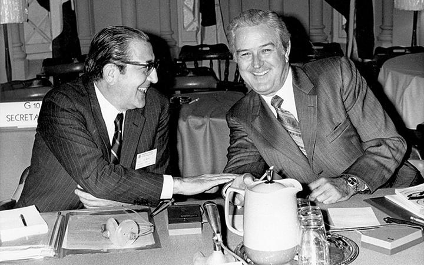

The Smithsonian Agreement represents a pivotal moment in the economic history of international finance. Reached in December 1971, it was a temporary accord among the world's major economies, aiming to stabilize the global financial system by adjusting fixed exchange rates and impacting currency values. This agreement emerged as a critical response to the challenges posed by the Bretton Woods system, which had established a fixed exchange rate regime post-World War II, anchored on the U.S. dollar's convertibility to gold.

Under the pressures of global economic changes, including escalating inflation and the burden of Vietnam War expenditures on the U.S. economy, the Bretton Woods system faced significant strains. The demand for international financial reserves outpaced global gold reserves, leading to President Richard Nixon's decision to suspend the convertibility of the dollar into gold in August 1971, setting the stage for the Smithsonian Agreement. This strategic move represented a notable shift in international monetary policy, laying the foundation for the transformation from fixed to more flexible exchange rates.



The Smithsonian Agreement sought to realign the currencies of the participating countries to address these economic imbalances. It devalued the U.S. dollar against gold, leading to the revaluation of other key currencies, and established fluctuation bands to allow limited currency movements—an initial step towards more flexible exchange rate systems that are prevalent today.

This article aims to explore the background, implementation, and lasting effects of the Smithsonian Agreement. Furthermore, we will examine its enduring relevance in international finance, particularly in the context of algorithmic trading in today's interconnected global economy. Understanding this agreement provides insights into the evolution of exchange rate policies and the sophisticated trading strategies that have since emerged in global financial markets.

## Table of Contents

## Background of the Smithsonian Agreement

The Smithsonian Agreement emerged as a response to the limitations inherent in the Bretton Woods system, which had dictated international monetary policy since the mid-20th century. The Bretton Woods system established a framework where currencies were pegged to the U.S. dollar, itself convertible to gold at a fixed rate of $35 per ounce. However, by the 1960s, this system began to reveal critical weaknesses.

A notable issue was the inadequacy of global gold reserves to satisfy the burgeoning demand for international financial reserves. As global economic activity expanded, the reliance on a finite and static gold supply proved increasingly untenable. Furthermore, the United States faced mounting economic pressures during this period. The financial burdens of the Vietnam War, coupled with domestic inflation, placed significant strain on the U.S. dollar, undermining its role as the world's reserve currency.

The predicament reached a tipping point in August 1971 when President Richard Nixon made the momentous decision to suspend the dollar’s convertibility into gold. This move effectively dismantled the Bretton Woods system's cornerstone and initiated an urgent need for monetary realignment on a global scale. The suspension of convertibility was intended to address the immediate pressures on the dollar and curb the outflow of U.S. gold reserves, but it also triggered widespread instability and uncertainty in international markets.

The Smithsonian Agreement, negotiated in December 1971, represented a concerted effort by leading economies to recalibrate the international monetary system. The agreement intended to restore equilibrium by recalculating the fixed exchange rates that had been thrown into disarray. The significance of the Smithsonian Agreement in the global financial landscape lay in its aim to stabilize currency valuations and avert a full-scale collapse of international monetary cooperation.

While it marked a step towards more flexible exchange rate mechanisms, the agreement also underscores the inherent challenges of maintaining fixed exchange rates amidst evolving economic and political contexts. The Smithsonian Agreement was thus pivotal, not just for its immediate solutions, but as a precursor to the contemporary floating exchange rate systems that characterize international finance today.

## Key Elements of the Smithsonian Agreement

The Smithsonian Agreement, implemented in December 1971, constituted a major realignment within the framework of international finance, primarily affecting exchange rates and currency valuations. One of its fundamental actions was the devaluation of the U.S. dollar by 8.5% relative to gold. Prior to this agreement, the price of gold was fixed at $35 per ounce under the Bretton Woods system. The Smithsonian Agreement adjusted this figure, raising the price to $38 per ounce. This change was significant as it directly impacted the valuation of the dollar and was an acknowledgment of the economic strains that had accumulated.

In addition to altering the value of the dollar, the agreement mandated that participating countries revalue their currencies. This revaluation aimed to restore stability and bolster confidence in the global economy, which had been under significant pressure due to various macroeconomic factors, including mounting debts and inflation. By adjusting currency values according to a new set of fixed rates, the Smithsonian Agreement sought to correct imbalances in international trade and financial flows.

A noteworthy innovation introduced by the Smithsonian Agreement was the concept of currency fluctuation bands. Under this system, it was agreed that currencies could vary by a margin of up to 2.25% above or below the agreed exchange rate with the dollar. This flexibility was a departure from the rigid fixed exchange rates that had characterized the Bretton Woods system. The inclusion of fluctuation bands was a significant step towards more fluid exchange rate systems and foreshadowed the eventual move to floating exchange rates that emerged in the following years.

This transition from a strictly fixed exchange rate regime to one allowing greater flexibility marked a pivotal moment in the evolution of the foreign exchange market. It paved the way for modern [forex](/wiki/forex-system) markets where floating rates are now prevalent. The introduction of fluctuation bands was a recognition of the need for a mechanism to accommodate the natural [volatility](/wiki/volatility-trading-strategies) inherent in global financial markets, allowing economies to better absorb external shocks and align their exchange rates more closely with market realities.

The implications of these elements of the Smithsonian Agreement were profound for international trade and finance policy. By modifying exchange rate mechanisms, the agreement directly influenced trade balances and competitiveness among nations. Furthermore, these changes necessitated adjustments in monetary policy and the approach of central banks towards currency intervention and market stabilization.

Overall, the Smithsonian Agreement played a crucial role in shaping the framework of contemporary international finance. Its introduction of an adjustable exchange rate system laid the groundwork for the dynamic forex markets we see today, where currencies constantly adjust according to supply and demand dynamics, influenced by a myriad of global economic factors.

## Impact on International Finance

The Smithsonian Agreement, although brief in its implementation, had profound implications for international finance. It underscored the difficulties inherent in sustaining fixed exchange rate systems in the face of global economic volatility. By 1973, the system had unraveled, leading to a transition where major world currencies adopted floating exchange rates. This shift marked a fundamental change in how currency valuations were approached globally.

Central banks, during this period, encountered fresh challenges. The obligation to maintain fixed currency valuations was replaced with the daunting task of managing exchange rates in an environment characterized by inflationary pressures and speculative market activities. The traditional methods of intervention in currency markets had to be adapted to account for these new dynamics. Previously, central banks would intervene directly to uphold fixed rates, but the floating system demanded more strategic measures, such as using interest rates as a tool to influence currency value.

The Smithsonian Agreement's brief lifespan signaled the definitive disintegration of the gold standard, which had dominated global finance for much of the 20th century. This dissolution paved the way for fiat currency systems, whereby governments were able to issue currency not backed by physical commodities but rather by the government's declaration of its value. The move towards fiat currencies allowed for more flexible monetary policies, enabling countries to better address economic shocks without the constraints imposed by the gold standard.

The transformation to floating exchange rates initiated a series of long-term implications for international finance. It allowed for more responsive economic policies but also introduced greater exchange rate volatility. Financial markets became increasingly complex, giving rise to sophisticated financial instruments designed to hedge against currency risk. Moreover, the transition facilitated greater international trade and capital flow, as currency values were more aligned with market forces rather than pegged to other currencies or commodities.

In summary, the Smithsonian Agreement highlighted the limitations of fixed exchange rates and set the stage for the global adoption of floating exchange rates and fiat money systems. These changes fostered greater economic flexibility and adaptability, although they also required new regulatory frameworks to manage the increased complexity of financial markets.

## Algorithmic Trading and Exchange Rates

The transition from fixed to floating exchange rates, initiated in part by the Smithsonian Agreement, has had a profound impact on the development of trading strategies, particularly in the forex market. This shift allowed currencies to fluctuate more freely, leading to increased volatility and the emergence of complex market dynamics. In this environment, [algorithmic trading](/wiki/algorithmic-trading) has become indispensable for traders seeking to navigate and profit from currency fluctuations.

Algorithmic trading employs various advanced computational techniques to automate and optimize the trading process. By utilizing algorithms, traders can rapidly analyze vast datasets, identify patterns, and execute trades at speeds far beyond human capacity. This approach is particularly beneficial in the volatile forex market, where small price movements can result in significant opportunities.

One of the principal advantages of algorithmic trading lies in its ability to forecast currency movements. Algorithms can incorporate a wide range of data points, including historical price data, macroeconomic indicators, and even sentiment analysis derived from news and social media. Machine learning models, such as supervised learning algorithms, can be trained to predict future currency values by recognizing patterns within these datasets. Techniques like linear regression, decision trees, and neural networks are often employed for this purpose.

For instance, in Python, a simple linear regression model can be used to predict future exchange rates based on historical data:

```python
from sklearn.model_selection import train_test_split
from sklearn.linear_model import LinearRegression
import pandas as pd

# Load your data
data = pd.read_csv('forex_data.csv')
X = data[['feature1', 'feature2', 'feature3']]  # Features
y = data['exchange_rate']  # Target variable

# Split the dataset into training and testing sets
X_train, X_test, y_train, y_test = train_test_split(X, y, test_size=0.2, random_state=42)

# Create and train the model
model = LinearRegression()
model.fit(X_train, y_train)

# Making predictions
predictions = model.predict(X_test)
```

In addition to predicting trends, algorithmic trading plays an essential role in risk management. Algorithms can dynamically adjust trading strategies in response to real-time market changes, thereby mitigating potential losses. Techniques such as stop-loss orders and dynamic hedging are often integrated into algorithms to protect investments.

The legacy of the Smithsonian Agreement, which established greater flexibility in currency valuation, is evident in the way contemporary financial technology leverages these capabilities. The freedom of exchange rate fluctuation laid the groundwork for sophisticated models that adapt to shifting market conditions.

Moreover, the rise of [artificial intelligence](/wiki/ai-artificial-intelligence) (AI) and [deep learning](/wiki/deep-learning) has further enhanced the effectiveness of algorithmic trading. These advanced models can process unstructured data, react to new information, and improve their accuracy over time. As a result, algorithmic trading systems have become more adept at identifying market inefficiencies and capitalizing on them in real-time.

In summary, the move to floating exchange rates initiated by the Smithsonian Agreement has paved the way for the evolution of algorithmic trading, enriching the toolkit of modern traders. Through the integration of AI and [machine learning](/wiki/machine-learning), these trading systems continue to evolve, adapting to the complexities of today's global financial ecosystem and reflecting the enduring influence of historical financial accords.

## Conclusion

The Smithsonian Agreement, although short-lived, had significant and lasting effects on global finance. Primarily, it acted as a catalyst for the transition from a fixed exchange rate system to floating exchange rates. This transition marked a pivotal shift in how currencies were managed and traded globally, leading to the modern forex market dynamics we observe today. The flexibility afforded by floating rates has allowed currencies to adjust in response to market forces, rather than being tethered to a strict peg, thereby improving economic resilience and adaptability.

The legacy of the Smithsonian Agreement endures in its profound influence on international financial policies and the mechanisms governing exchange rates. By moving away from the gold standard to a fiat currency system, it set a new paradigm for how nations approach monetary policy and international trade. This change laid the groundwork for enhanced economic cooperation and coordination among countries, even as they grapple with new challenges in global finance.

Today's financial landscape, characterized by advanced trading strategies and technologies, can trace its origins back to the changes initiated by the Smithsonian Agreement. Modern trading strategies, particularly algorithmic trading, benefit from the dynamics of floating exchange rates by capitalizing on market movements and inefficiencies. Traders use sophisticated algorithms to forecast currency trends, mitigate risks, and exploit opportunities in a way that was unimaginable under the fixed exchange rate system.

Understanding the Smithsonian Agreement is crucial for comprehending the evolution of international finance and algorithmic trading. Its impact goes beyond historical significance; it provides a contextual framework for analyzing current and future developments in global markets. By recognizing the shifts initiated by this agreement, financial analysts and policymakers can better appreciate the complexities of today's interconnected economic environment and continue to develop strategies that harness the benefits of an ever-evolving financial system.

## References & Further Reading

[1]: ["The Smithsonian Agreement: Currency Devaluation and its Impact on Exchange Rates"](https://en.wikipedia.org/wiki/Smithsonian_Agreement), International Monetary Fund.

[2]: ["The Bretton Woods System: Its Rise and Fall"](https://cepr.org/voxeu/columns/operation-and-demise-bretton-woods-system-1958-1971), History Channel.

[3]: ["Algorithmic Trading and the Future of the Forex Market"](https://www.thelondoneconomic.com/prices-markets/algorithmic-trading-the-future-of-forex-364039/), Investopedia.

[4]: ["Advances in Financial Machine Learning"](https://www.amazon.com/Advances-Financial-Machine-Learning-Marcos/dp/1119482089) by Marcos Lopez de Prado

[5]: ["The Age of the Dollar: The Smithsonian Agreement and the Transformation of the International Monetary System"](https://en.wikipedia.org/wiki/Smithsonian_Agreement), Journal of Economic History.