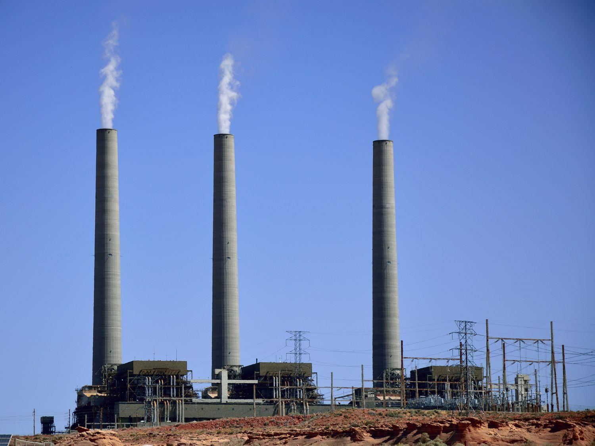

The complex interplay between industrial investment, economic development, and the smokestack industry has profoundly shaped global economies for centuries. These traditional industries, which encompass heavy manufacturing sectors such as steel, automobile, and machinery production, serve as the backbone of economic development. Their historical impact during the phases of industrialization is indisputable, having significantly contributed to the economic advancement of both developed and emerging markets through the creation of essential goods and employment opportunities.

However, today’s economic landscape is increasingly influenced by technological advances, notably algorithmic trading, that are high-speed and data-driven, revolutionizing the way financial markets operate. While these innovations signal a shift towards a more technology-oriented economy, it is essential to understand how these foundational sectors continue to play a critical role in economic stability and growth worldwide.



Algorithmic trading, characterized by complex algorithms that automate trading decisions at speeds and efficiencies unattainable by human traders, reflects a broader technological shift in the financial sector. The implications of such advancements extend beyond finance, influencing investment strategies and resource allocation in traditional industries. By optimizing portfolios and managing risks more effectively, algorithmic trading offers new opportunities for investors to engage with these sectors.

This article aims to explore the significant impact of smokestack industries on economic development and the ways in which investment landscapes are transforming in response to technological innovations like algorithmic trading. Examining the coexistence and interaction of these old and new sectors provides valuable insights into their collective influence on global economic growth.

Through this analysis, investors and policymakers can better navigate the transitions within the global economic framework. By appreciating both the historical significance of smokestack industries and the emerging opportunities within modern financial technologies, they can develop more strategic approaches to fostering sustainable and robust economic development.

## Table of Contents

## Understanding Smokestack Industries

Smokestack industries encompass traditional heavy manufacturing sectors, notably steel, automobile, and machinery production. These industries have been fundamental in the process of industrialization, significantly influencing the economic development of emerging markets. During the Industrial Revolution, smokestack industries drove technological advancements and urbanization, serving as the backbone of many national economies. Their production capabilities enabled mass manufacturing and facilitated infrastructure development, which in turn catalyzed further economic growth.

Despite being categorized under the 'old economy', smokestack industries continue to be crucial within modern economic frameworks. They provide substantial employment opportunities and contribute notably to economic output. For instance, the global steel industry alone employs millions of workers and is integral to the production of various goods essential for contemporary society. Moreover, these industries contribute significantly to Gross Domestic Product (GDP) in numerous countries, particularly those with rich industrial legacies.

However, the operations of smokestack industries are often associated with significant environmental challenges. Emissions from manufacturing processes contribute to air and water pollution, while resource extraction can lead to habitat destruction and biodiversity loss. The carbon footprint of these industries is considerable, making them focal points in discussions about environmental sustainability. Addressing these issues necessitates advancements in sustainability practices, such as adopting cleaner technologies and improving waste management systems.

Efforts to mitigate environmental impacts have led to the implementation of various regulatory and technological solutions. Renewable energy adoption, improved efficiency in material usage, and stricter emission standards are some of the measures being pursued to balance industrial activity with ecological preservation. Encouraging innovation and integrating environmental sustainability into the core operations of smokestack industries can ensure their continued relevance and contribution to economic development while safeguarding the planet for future generations.

## Industrial Investment and Economic Development

Investments in smokestack industries have been pivotal in driving economic growth by supplying essential goods and generating employment opportunities across economies worldwide. These traditional manufacturing sectors, such as steel, automobile, and machinery production, have long been foundational to industrialization processes and the development of both emerging and developed market economies. The capital-intensive nature of these industries requires significant financial investments, which often lead to economies of scale. This means that as production scales up, the average cost per unit of output decreases, thereby increasing profitability and bolstering economic stability at both regional and national levels.

The large-scale operations of smokestack industries not only stimulate regional economies by creating direct and indirect jobs, but they also foster the development of auxiliary industries that contribute to a diversified and robust economic structure. Historically, these industries have enabled infrastructure development, improved trade balances, and served as significant sources of fiscal revenue through taxation.

However, with the global economy shifting towards technology-oriented sectors, questions have arisen regarding the future viability of these traditional industries. The digital revolution, characterized by advancements in automation, data analytics, and [artificial intelligence](/wiki/ai-artificial-intelligence), poses both challenges and opportunities for smokestack industries. To remain relevant in today’s economic landscape, these sectors must adapt by integrating technological innovations and improving sustainable practices.

The transition to more sustainable practices within smokestack industries is driven by increased regulatory pressures and the urgent need to mitigate environmental impacts. Investing in cleaner technologies, such as carbon capture and storage, energy-efficient machinery, and waste reduction processes, can help these industries reduce their ecological footprint while enhancing operational efficiency. Additionally, modernizing infrastructure through the adoption of digital technologies can lead to more resilient production systems and supply chains.

Policymakers and industry leaders are called upon to support this transition by facilitating access to capital and encouraging public-private partnerships that focus on sustainability and innovation. By combining traditional industry strengths with modern technological capabilities, smokestack industries can continue to play a vital role in economic development. Emphasizing sustainable investment strategies and modernizing industrial practices will be critical to ensuring that smokestack industries adapt successfully to the evolving economic environment while maintaining their contributions to global economic growth.

## The Role of Algorithmic Trading

Algorithmic trading, or algo trading, is a transformative approach that seamlessly blends technology and finance, creating fresh opportunities for investment and resource distribution. This method utilizes complex algorithms to execute trades, allowing investors to optimize their portfolios and manage risks with heightened efficiency. The key advantage of [algorithmic trading](/wiki/algorithmic-trading) lies in its ability to process vast amounts of data in real-time, leading to more informed decisions and reduced human error.

Python, a popular programming language in the financial sector, offers tools such as pandas for data manipulation and [backtrader](/wiki/backtrader) for [backtesting](/wiki/backtesting) trading strategies. Here is a simple Python example demonstrating a basic [momentum](/wiki/momentum) trading strategy using historical data:

```python
import pandas as pd
import backtrader as bt

class MomentumStrategy(bt.Strategy):
    params = dict(period=21)

    def __init__(self):
        self.sma = bt.indicators.SimpleMovingAverage(self.data, period=self.params.period)

    def next(self):
        if self.data.close[0] > self.sma[0]:
            self.buy()
        elif self.data.close[0] < self.sma[0]:
            self.sell()

data = bt.feeds.YahooFinanceData(dataname='AAPL', fromdate=pd.Timestamp('2020-01-01'), todate=pd.Timestamp('2021-01-01'))
cerebro = bt.Cerebro()
cerebro.addstrategy(MomentumStrategy)
cerebro.adddata(data)
cerebro.run()
cerebro.plot()
```

The rise of algorithmic trading is indicative of a broader technological evolution within the financial sector, substantially impacting investment strategies, notably in smokestack industries. These traditional industries, categorized within sectors such as Basic Materials and Industrials, are historically cyclical, heavily reliant on broader economic fluctuations. Algorithmic trading offers a sophisticated mechanism for navigating such cyclical trends, providing dynamic risk management and strategic asset allocation.

Furthermore, combining traditional industry insights with algorithmic techniques can uncover new avenues for diversified economic growth. Traditional industry knowledge helps in understanding market fundamentals, while technological advancements like algo trading offer tools to leverage this understanding effectively. It creates a synergy that can transform how investments are approached, particularly within sectors that are sensitive to economic cycles.

In summary, algorithmic trading stands as a pivotal development, not only enhancing the efficiency of financial markets but also shaping the investment landscape across various industries. Its integration within traditional sectors like smokestack industries holds the potential for fostering innovative economic growth strategies, underscoring the significant interplay between technological progress and industrial investment.

## Smokestack Industries in the Investor's Eye

Investors often view smokestack industries—encompassing sectors like Basic Materials, Energy, and Industrials—as cyclical due to their sensitivity to broad economic conditions. These industries are integral to economic foundations, providing stability through their tangible assets and established market positions, which make them attractive for long-term investments. Despite their classification under the 'old economy' label, these sectors continue to offer substantial investment opportunities, especially in times of economic expansion.

Cycles in these industries are heavily influenced by economic expansions and contractions. During periods of economic growth, demand for essential goods and services rises, boosting the performance of smokestack industries. Conversely, economic downturns typically see a contraction in industrial activities, impacting revenues and market valuations. This cyclical nature underscores the importance of strategic timing for investments, as understanding economic indicators can significantly influence returns.

Factor analysis plays a critical role in guiding investment decisions within smokestack industries. Investors can incorporate traditional factors—such as commodity prices, supply and demand dynamics, and geopolitical considerations—alongside modern factors like technological advancements and regulatory changes. This dual approach enables a comprehensive evaluation of potential risks and returns, ensuring investments align with both current market conditions and future trends.

For instance, a Python-based analysis could integrate data on GDP growth, commodity indices, and capital expenditure trends to model potential investment outcomes. By combining historical data with predictive analytics, investors can better navigate the intrinsic cyclicality of these sectors and optimize their portfolios accordingly.

In conclusion, while smokestack industries are inherently linked to economic cycles, their enduring value and resilience offer meaningful investment opportunities. Through thorough analysis and strategic positioning, investors can leverage both traditional strengths and contemporary developments to achieve financial gains in these sectors.

## Challenges and Opportunities in Modern Economic Landscapes

The sustainability challenges posed by smokestack industries are substantial, given their traditional reliance on processes that result in significant environmental pollution. Addressing these challenges requires innovative solutions and concerted regulatory support. Regulatory frameworks can incentivize the adoption of cleaner technologies, driving industries towards emissions reduction and sustainable resource utilization. Governments can play a crucial role by implementing policies that encourage green practices, such as emissions trading schemes and carbon taxes, which not only aim to mitigate environmental impacts but also stimulate technological advancements in the sector.

The continuous shifts in technological trends necessitate adaptation strategies across heavy manufacturing and related sectors. Modern technologies, such as automation and digitalization, offer pathways for enhancing efficiency and reducing environmental footprints. For example, the integration of IoT (Internet of Things) devices can optimize energy consumption in manufacturing processes. Additionally, advanced data analytics can identify inefficiency patterns, enabling manufacturers to streamline operations and reduce waste. Such technologies can also facilitate the transition to circular economies, where waste is minimized, and materials are reused and recycled, thereby conserving resources and reducing environmental impacts.

Balancing the growth of smokestack industries with environmental concerns is crucial for ensuring long-term economic sustainability. Industries must strategically invest in cleaner technologies that align with environmental goals. Initiatives such as corporate sustainability reporting can provide transparency and accountability, encouraging businesses to meet sustainability benchmarks. Achieving this balance also requires collaboration between governments, industries, and communities to ensure that economic development does not come at the expense of environmental degradation.

Opportunities emerge from the integration of technological advancements and sustainable practices in these traditional sectors. By adopting energy-efficient technologies and sustainable practices, smokestack industries can reduce operational costs and increase competitiveness. The development and deployment of green technologies, such as carbon capture and storage (CCS) and renewable energy sources, provide avenues for reducing carbon footprints and promoting sustainable industrial growth. Embracing sustainability not only addresses environmental imperatives but also opens new markets and revenue streams, as consumer demand increasingly favors environmentally responsible products and practices.

In summary, while smokestack industries face significant sustainability challenges, there is a wealth of opportunities for transforming these sectors through technological innovation and regulatory collaboration. By prioritizing sustainable practices and leveraging emerging technologies, industries can achieve economic growth while minimizing environmental impacts, securing their place in the evolving economic landscape.

## Conclusion

The current economic landscape is shaped by the complex interplay between industrial investment, smokestack industries, and modern financial technologies. Smokestack industries, representing the backbone of traditional manufacturing sectors, continue to play a crucial role in economic output and employment. Despite being labeled as components of the "old economy," their value persists as they offer foundational strengths that newer sectors often lack. Concurrently, technological advancements, particularly in financial markets, are restructuring the way investments are conceptualized and executed. Algorithmic trading, for instance, exemplifies the transformative impact of these technologies, offering efficiency and precision in resource allocation.

Recognizing the coexistence and importance of both traditional and evolving sectors can lead to innovative approaches for economic development. The synergy between these sectors not only encourages a balanced economic structure but also fosters resilience against fluctuating market conditions and global economic shifts. Traditional sectors offer stability and long-term viability, while emerging technologies provide pathways for growth and adaptation.

For policymakers and investors, understanding these dynamics is imperative. Strategic investments and the adoption of sustainable practices are central to thriving in an increasingly competitive global economy. The integration of sustainability into industrial practices addresses environmental challenges, ensuring that economic growth does not come at the expense of ecological health. As policymakers and investors aim to optimize economic frameworks, aligning investment strategies with sustainable development goals can enhance profitability and societal welfare.

Economies that successfully understand and leverage the relationships between historical industrial strengths and modern innovations can harness their full potential. This can lead to revitalized industrial practices and financial strategies that are robust and future-oriented. By balancing these elements, economies are better positioned to face challenges, capitalize on opportunities, and achieve sustained economic prosperity.

## References & Further Reading

[1]: Bergstra, J., Bardenet, R., Bengio, Y., & Kégl, B. (2011). ["Algorithms for Hyper-Parameter Optimization."](https://papers.nips.cc/paper/4443-algorithms-for-hyper-parameter-optimization) Advances in Neural Information Processing Systems 24.

[2]: ["Advances in Financial Machine Learning"](https://www.amazon.com/Advances-Financial-Machine-Learning-Marcos/dp/1119482089) by Marcos Lopez de Prado

[3]: ["Evidence-Based Technical Analysis: Applying the Scientific Method and Statistical Inference to Trading Signals"](https://www.amazon.com/Evidence-Based-Technical-Analysis-Scientific-Statistical/dp/0470008741) by David Aronson

[4]: ["Machine Learning for Algorithmic Trading"](https://github.com/stefan-jansen/machine-learning-for-trading) by Stefan Jansen

[5]: ["Quantitative Trading: How to Build Your Own Algorithmic Trading Business"](https://www.amazon.com/Quantitative-Trading-Build-Algorithmic-Business/dp/1119800064) by Ernest P. Chan