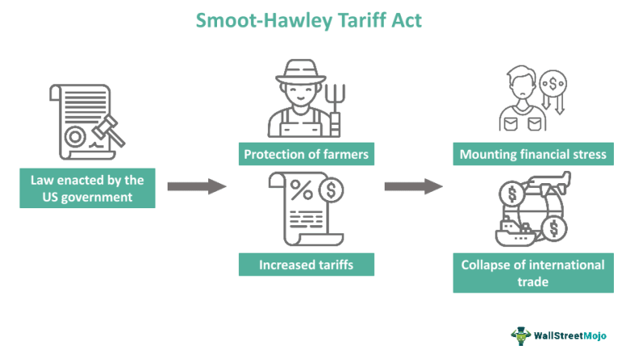

The Smoot-Hawley Tariff Act of 1930 represents a critical juncture in economic history, characterized by its profound effect on global trade dynamics. Introduced in a period marked by economic turmoil, the Act sought to protect American industries through imposing significant tariffs on imported goods. While the primary intent was to safeguard U.S. agricultural interests, its ambit extended to thousands of other products, reshaping trade relationships worldwide. As a consequence, the Act incited retaliatory measures from various countries, leading to a substantial contraction in international trade.

Through examining the historical context, economic impact, and subsequent legacy of the Smoot-Hawley Tariff Act, the complexities of trade protectionism and its broader implications become apparent. Not only did it exacerbate the economic hardships of the Great Depression, but it also underscored the interconnectivity of global markets, highlighting the perils of economic isolationism.

Moreover, the lessons drawn from this period remain pertinent to contemporary economic activities, including algorithmic trading. With markets increasingly driven by data and automated processes, understanding past policy impacts provides vital insights into mitigating risks and enhancing the robustness of trading algorithms against market volatilities. Thus, this historical analysis serves as a foundation for navigating current and future economic challenges.

## Table of Contents

## What is the Smoot-Hawley Tariff Act?

The Smoot-Hawley Tariff Act, officially known as the Tariff Act of 1930, was a piece of legislation enacted by the United States Congress that implemented significant increases in tariffs on more than 20,000 imported goods. This comprehensive tariff schedule was designed to protect American industries during a time of economic hardship, particularly targeting the agricultural sector, which was experiencing severe distress during the late 1920s.

Initiated by and named after Senator Reed Smoot and Representative Willis C. Hawley, the Act aimed to address the economic challenges faced by U.S. farmers who were struggling with declining prices and foreign competition. However, the scope of the Act extended far beyond agricultural products. It imposed steep duties on a wide array of imported items, escalating the average tariff rate on dutiable imports to nearly 60%, one of the highest levels in U.S. history at the time.

The rationale behind the Smoot-Hawley Tariff Act was rooted in protectionism—a belief that shielding domestic producers from foreign competitors would bolster the national economy by stimulating local production and creating jobs. The Act's passage in June 1930 came at a critical juncture, amid mounting economic pressures following the stock market crash of 1929. Policymakers believed that high tariffs would help to stabilize the agricultural market and offer relief to U.S. businesses.

Despite its intentions, the Act garnered substantial controversy and criticism, both domestically and internationally. Critics argued that it set off a trade war, as affected foreign countries retaliated with their own tariffs on American goods, subsequently reducing international trade and exacerbating the economic downturn. The adverse consequences of the Smoot-Hawley Tariff Act offer continuing lessons in the complexities of trade policy and economic strategy.

## Economic Impacts of the Smoot-Hawley Tariff Act

The Smoot-Hawley Tariff Act of 1930 is often cited as a significant [factor](/wiki/factor-investing) contributing to the collapse of international trade during the early 1930s. This Act led to a dramatic increase in tariffs on a wide range of imported goods, which provoked a series of retaliatory tariffs from other countries. The immediate economic consequence of these tit-for-tat trade barriers was a steep decline in global trade flows.

Between 1929 and 1934, international trade plummeted by approximately 66%. This drastic reduction in trade [volume](/wiki/volume-trading-strategy) had severe repercussions for the global economy. By elevating tariffs, the Act aimed to protect domestic industries but inadvertently intensified the economic downturn known as the Great Depression. The contraction in trade not only reduced market access for U.S. products but also caused significant economic disruptions in other countries, many of which were also grappling with economic challenges.

The protectionist environment fostered by the Smoot-Hawley Tariff Act led to widespread criticism. Economists and historians argue that it exacerbated the already fragile economic conditions by disrupting international supply chains and reducing the availability of goods across borders. The subsequent economic isolationism stymied economic recovery efforts worldwide, transforming what might have been a regional economic challenge into a profound global depression.

These economic impacts underscore the critical role of international trade as a driver of economic stability. The lesson from Smoot-Hawley highlights the potential risks associated with protectionist policies that prioritize short-term domestic gains over the long-term benefits of global economic integration.

## Historical Reactions to the Act

Over 1,000 economists petitioned against the Smoot-Hawley Tariff Act before its passage, predicting that such protectionist measures would lead to negative economic consequences. This prediction was grounded in the understanding that raising tariffs would prompt retaliatory actions from trade partners, which would inhibit international trade and potentially exacerbate the already deteriorating economic conditions of the Great Depression. Their concerns reflected historical economic theories that international trade drives growth and prosperity, suggesting that trade barriers could lead to contraction.

One of the primary international reactions to the Smoot-Hawley Tariff was swift retaliation from affected countries. Nations around the world enacted their own tariffs in response, leading to a sharp decline in global trade. For instance, countries like Germany, already facing significant economic challenges due to the post-World War I reparations and economic instability, found themselves further constrained by increased tariffs on their exports. This exacerbated the economic difficulties faced by German industries, which relied on foreign markets for economic revival and currency stabilization.

The backlash to the Smoot-Hawley Tariff was overwhelmingly negative on a global scale. As other countries imposed their tariffs, the global trading environment became increasingly protectionist, driving down the volume of international commerce and further deepening the economic woes of the period. The international community and economists around the world began advocating for policy reversals and more collaborative approaches to international trade. These calls highlighted the need to avoid protectionist policies that could trigger trade wars and undermine the broader global economy.

The eventual outcome of these negative reactions was a gradual shift towards more cooperative and liberal trade policies in the subsequent years. Policymakers recognized the destructive potential of protectionism, which influenced future trade agreements and laid the groundwork for international organizations aimed at promoting free trade and economic cooperation.

## The Path to Recovery and Change

The Smoot-Hawley Tariff Act of 1930 led to widespread economic repercussions, prompting significant policy reversals in the subsequent years. To mitigate the adverse effects of the Act and move towards economic recovery, President Franklin D. Roosevelt's administration implemented the Reciprocal Trade Agreements Act (RTAA) of 1934. This legislation marked a pivotal shift away from protectionist policies by granting the executive branch authority to negotiate tariff reductions on a bilateral basis. The RTAA facilitated reciprocal trade agreements with other nations, promoting the reduction of tariffs through negotiated concessions and laying the groundwork for more robust international trade frameworks.

In the aftermath of the Smoot-Hawley Act, there was a growing realization of the need for cooperative trade policies to foster economic stability. This led to the establishment of the General Agreement on Tariffs and Trade (GATT) in 1947. GATT aimed to create a multilateral framework for trade negotiations and tariff reductions, emphasizing the importance of non-discriminatory trade policies and the regulation of trade barriers.

As global trade dynamics continued to evolve, the GATT's mechanisms were further enhanced with the creation of the World Trade Organization (WTO) in 1995. The WTO expanded upon the principles of GATT by introducing more comprehensive rules and addressing a broader range of trade-related issues, such as intellectual property rights and trade in services.

These developments underscored a fundamental shift towards embracing free trade and open markets, which became instrumental in restoring global economic balance. Cooperative trade policies not only facilitated economic recovery from the devastation of the Great Depression but also established a foundation for sustained economic growth and development in the latter half of the 20th century. By promoting multilateralism and reducing barriers to trade, these policies contributed to the stability of the global economic system, a lesson that continues to be relevant in today's interconnected world.

## Lessons for Modern Economic Strategies

The history of the Smoot-Hawley Tariff Act serves as a compelling illustration of the risks associated with protectionism and economic isolation. This act, by dramatically increasing tariffs on imported goods, aimed to protect domestic industries but inadvertently prompted international retaliation, leading to a decline in global trade and exacerbating the Great Depression. The lessons to be drawn from this historical event extend to modern economic strategies, underlining the necessity for careful consideration in formulating tariff policies and trade negotiations.

The international backlash against the Smoot-Hawley Act illustrates the potential for protectionist policies to negatively affect international relations and economic stability. Countries responded with retaliatory tariffs, further stifling trade and deepening economic woes. For contemporary economic policies, this underscores the importance of fostering cooperative international relations and creating trade environments that encourage mutual growth rather than competitive isolationism. Modern policymakers benefit from understanding these historical consequences, applying this knowledge to ensure policies that support economic cooperation and global market stability.

Moreover, the evolution of global trade practices over the past century offers meaningful insights for current economic activities, including [algorithmic trading](/wiki/algorithmic-trading) and automated market responses. Algorithmic trading involves using computerized systems to execute trading strategies more efficiently and accurately than human traders. These systems thrive in environments characterized by predictable and stable market conditions. The protectionist disruptions observed during the Smoot-Hawley era provide cautionary examples of how sudden policy changes can lead to market [volatility](/wiki/volatility-trading-strategies).

In order to mitigate risks associated with unexpected economic shifts, modern trading algorithms can be programmed to respond dynamically to changing market conditions. Machine learning techniques can be employed to analyze historical data and detect patterns that could signify potential market disruptions stemming from policy shifts. For instance, sentiment analysis algorithms could monitor news sources and government communications to anticipate changes in trade policies, allowing for preemptive adjustments to trading strategies.

By incorporating historical lessons from events like the Smoot-Hawley Tariff Act, trading systems can be enhanced to improve resilience against market shocks. Understanding the interconnectedness of global trade and recognizing the potential for policy-driven market disruptions are crucial for developing economic strategies that prioritize stability and long-term growth. As the global economy continues to evolve, these lessons remain as pertinent as ever, guiding decisions in an increasingly automated and interdependent market landscape.

## Algorithmic Trading in the Context of Economic History

Algorithmic trading relies on leveraging market efficiencies and utilizing data-driven methodologies to make rapid trading decisions, contrasting sharply with the economic disruptions caused by protective measures like tariffs. The Smoot-Hawley Tariff Act of 1930, which significantly raised tariffs on imported goods, exemplifies the unforeseen consequences protectionist policies can have on global trade. Despite being enacted to protect domestic industries, these tariffs led to trade tensions and retaliatory measures, causing a sharp decline in international trade activity. This historical episode highlights essential lessons for modern economic strategies, particularly in the context of algorithmic trading.

Algorithmic trading systems are designed to respond swiftly to market signals, employing strategies that capitalize on price inefficiencies, statistical [arbitrage](/wiki/arbitrage), and high-frequency trading. Such systems rely heavily on macroeconomic indicators, geopolitical stability, and trade policies to predict outcomes and make informed decisions. A historical analysis of events like the Smoot-Hawley Act provides valuable insights into the potential volatility that similar protectionist measures could induce in today’s interconnected global markets.

To enhance the resilience of contemporary trading algorithms against market shocks, incorporating lessons from past economic disruptions is crucial. Algorithmic models can benefit from historical data by integrating scenario analysis and stress testing frameworks. For instance, algorithms could simulate the impacts of sudden tariff changes by [backtesting](/wiki/backtesting) against historical trade data to identify potential vulnerabilities.

Additionally, advancements in [machine learning](/wiki/machine-learning) and [artificial intelligence](/wiki/ai-artificial-intelligence) present opportunities to improve the predictive capabilities of trading algorithms. By training models on historical episodes of economic upheaval, including protectionist phases, these systems can better anticipate and adapt to similar future events. This proactive incorporation of historical lessons ensures that algorithmic trading platforms maintain stability, even amidst significant changes in global trade dynamics.

Ultimately, the history of the Smoot-Hawley Tariff Act serves as a reminder of the intricate relationship between economic policies and market behavior. By learning from such historical examples, algorithmic trading can not only increase its robustness but also contribute to more stable and efficient financial markets.

## Conclusion

The Smoot-Hawley Tariff Act remains a significant example of how economic policies influence global trade. Enacted as a protective measure, its repercussions extended beyond national borders, creating widespread economic strain and fostering a protectionist environment. These outcomes underscore the intricate balance required in economic policy decisions, where well-intentioned measures can lead to unforeseen global repercussions.

Understanding the impacts of the Smoot-Hawley Tariff Act is crucial in addressing modern economic challenges. As today's economies grow increasingly interconnected, trade policies must account for the complex dynamics of international relations and market responses. This understanding is especially pertinent for algorithmic trading, which relies on data-driven strategies that necessitate stability and predictability in global markets. Historical instances, such as the economic fallout from the Smoot-Hawley Act, offer valuable insights into crafting algorithms that can better withstand market shocks and avoid erratic responses to policy changes.

A balanced approach in policy-making and market strategies can help avert the pitfalls experienced during the 1930s. Policymakers today must recognize the lessons from the Smoot-Hawley era, aiming for measures that promote cooperative international trade and economic stability. A collaborative stance in negotiations and trade agreements encourages mutual prosperity, reducing the likelihood of retaliatory measures that would disrupt the global economic order. By learning from past mistakes and leveraging historical insights, both policymakers and market participants can better prepare for and mitigate the risks associated with rapid economic changes and emerging challenges.

## References & Further Reading

[1]: Irwin, D. A. (2011). ["Peddling Protectionism: Smoot-Hawley and the Great Depression."](https://www.jstor.org/stable/j.ctt7svnx) Princeton University Press.

[2]: Eichengreen, B. (1986). ["The Political Economy of the Smoot-Hawley Tariff."](https://www.nber.org/papers/w2001) Research in Economic History, 9, 1-43.

[3]: Navarro, P. (1991). ["Death by a Thousand Cuts: The Fight Over Taxing Inherited Wealth."](https://www.jstor.org/stable/j.ctt7t672) Princeton University Press.

[4]: Milton Friedman & Anna Jacobson Schwartz. (1963). ["A Monetary History of the United States, 1867-1960."](https://www.jstor.org/stable/j.ctt7s1vp) Princeton University Press.

[5]: Meltzer, A. H. (2003). ["A History of the Federal Reserve, Volume 1: 1913-1951."](https://archive.org/details/historyoffederal0001melt) University of Chicago Press. 

[6]: DeLong, J. B. (1998). ["Fiscal Policy in the Shadow of the Great Depression."](https://www.nber.org/system/files/chapters/c6888/c6888.pdf) In Mickey, R., & Leffler, M. (Eds.), To Lead the World: American Strategy After the Bush Doctrine.

[7]: ["Trade Wars are Class Wars: How Rising Inequality Distorts the Global Economy and Threatens International Peace."](https://www.jstor.org/stable/j.ctv10sm96m) by Matthew C. Klein and Michael Pettis.   

