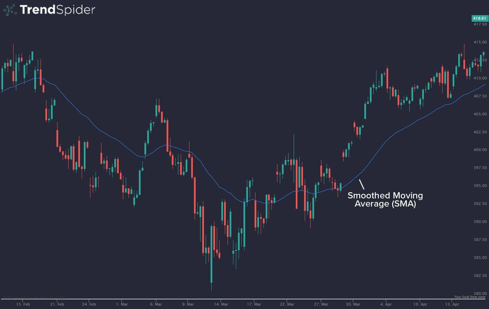

In the fast-paced world of algorithmic trading, technical indicators are essential tools that assist traders in making informed decisions. The smoothed moving average (SMMA) is a standout indicator known for its proficiency in providing a clear picture of market trends by minimizing short-term fluctuations. This article explores the concept of smoothed moving averages and their applications in trading, examining how they can enhance trading strategies. Understanding the differences between SMMA and other types of moving averages, such as simple moving averages (SMA) and exponential moving averages (EMA), will enable traders to effectively leverage its benefits. The insights presented here aim to help both novice and experienced traders incorporate SMMA into their trading strategies, enhancing their decision-making processes and overall trading performance.

## Table of Contents



## What is a Smoothed Moving Average (SMMA)?

The smoothed moving average (SMMA) is a type of moving average in technical analysis that is specifically designed to place greater emphasis on older data points alongside the most recent ones. This distinctive feature of SMMA helps in highlighting long-term market trends more effectively. Compared to other moving averages such as simple moving averages (SMA) or exponential moving averages (EMA), the SMMA is effective in reducing the noise created by short-term fluctuations in market prices.

The ability to consider all price data is a defining feature of SMMA. While a simple moving average (SMA) calculates the average of a fixed number of recent data points, and an exponential moving average (EMA) gives more weight to recent prices, the SMMA smooths out price data by considering the entire dataset. This approach works to average out minor price variations, reducing the impact of transient market volatility. As a result, the SMMA provides a smoother representation of the price movement, making it particularly useful for identifying trends without the distraction of short-lived market noise.

For traders, this translates into a more stable projection of overall market trends. By smoothing out erratic price changes and eliminating noise, SMMA allows for clearer visualization of the general direction in which a security's price is moving. This makes it an advantageous tool for those looking to base their trading strategies on persistent market movements.

## How to Calculate SMMA

Calculating a smoothed moving average (SMMA) involves elements of both simple and exponential moving averages, designed to smooth out short-term variations in price data while giving due weight to historical data. The formula for an SMMA is given by:

$$
\text{SMMA}_t = \frac{(\text{SMMA}_{t-1} \times (N-1)) + \text{Close}_t}{N}
$$

Here, $\text{SMMA}_t$ is the smoothed moving average at time $t$, $\text{SMMA}_{t-1}$ is the smoothed moving average of the previous period, $N$ is the smoothing period, and $\text{Close}_t$ is the current closing price. This recursive formula incorporates all past data in the calculation of the current average, effectively reducing [volatility](/wiki/volatility-trading-strategies) and producing a smoother curve that highlights longer-term trends.

The implementation of SMMA on trading platforms can be straightforward if the platform supports custom indicators. For platforms without native SMMA support, traders can script the formula using custom trading software. Here's a basic implementation in Python:

```python
def calculate_smma(prices, N):
    smma_values = []
    smma_prev = sum(prices[:N]) / N  # Start with a simple average

    for i in range(len(prices)):
        if i < N - 1:
            smma_values.append(None)  # Not enough data to calculate SMMA
        elif i == N - 1:
            smma_values.append(smma_prev)  # First SMMA value
        else:
            smma_current = ((smma_prev * (N - 1)) + prices[i]) / N
            smma_values.append(smma_current)
            smma_prev = smma_current

    return smma_values

prices = [23, 24, 25, 26, 27, 28, 29, 30]  # Sample closing prices
N = 3  # Smoothing period
smma = calculate_smma(prices, N)
print(smma)
```

This method ensures traders can compute SMMA independently, adapting it to their particular trading environment and strategy requirements. The resulting SMMA can be plotted to assist in visualizing trends and making informed trading decisions.

## Wilder’s Smoothed Moving Average

The concept of the smoothed moving average (SMMA) can be attributed to J. Welles Wilder Jr., a prominent figure in the field of technical analysis. Wilder is renowned for developing several influential technical indicators, including the Relative Strength Index (RSI) and the Average Directional Index (ADX). His introduction of the SMMA marked a significant advancement in technical analysis, aimed at enhancing the accuracy and predictive capabilities of trading strategies.

Wilder developed the SMMA as part of his efforts to address the issue of false signals in technical analysis. Traditional moving averages, such as the simple moving average (SMA) and the exponential moving average (EMA), are sensitive to short-term price fluctuations, which can often lead to misleading signals. By contrast, the SMMA is designed to smooth out these fluctuations, thereby providing a more stable view of long-term market trends. This is achieved through its recursive formula:

$$

\text{SMMA}_t = \frac{(\text{SMMA}_{t-1} \times (N-1) + \text{Close}_t)}{N} 
$$

In this formula, $\text{SMMA}_t$ represents the current smoothed moving average, $\text{SMMA}_{t-1}$ is the smoothed moving average of the previous period, $\text{Close}_t$ is the closing price for the current period, and $N$ is the smoothing period. The recursive nature of this formula means that all past data points have a continuing influence on the current average, which effectively reduces market 'noise' and the impact of short-term volatility.

Wilder's approach set the groundwork for the wider adoption of SMMA in trading, where it remains a crucial tool for traders seeking to filter out noise from trading data. By providing a clearer, more stable indication of market trends, the SMMA helps traders to make more informed decisions and minimize the effects of false signals. This stability makes it particularly valuable in the identification of trend reversals and confirmations, though it is important for traders to use it in conjunction with other indicators to bolster the robustness of their trading strategies.

## Why Use an SMMA?

The primary utility of the Smoothed Moving Average (SMMA) is its ability to provide traders with a clear and concise overview of market direction by reducing the noise associated with short-term price fluctuations. Unlike other moving averages, the SMMA places equal emphasis on historical and recent price data, offering a stable view of market trends over time.

Traders find SMMA particularly useful for identifying potential trend changes, as it tends to respond less to minor market price movements while highlighting more significant long-term trends. This feature makes SMMA an effective tool for observing shifts in market direction, which can be crucial for developing trading strategies.

SMMA also serves as a dynamic support or resistance level. When the price of an asset approaches the SMMA line, it often acts as a point of bounce or reversal, providing traders with a visual cue for potential entry or [exit](/wiki/exit-strategy) points. This behavior helps traders in validating and reinforcing their analysis of market trends.

Moreover, the SMMA is frequently used in conjunction with other technical indicators. This combined approach enhances trading strategies by adding a layer of confirmation to the signals generated by other indicators. For instance, traders might use SMMA alongside oscillators like the Relative Strength Index (RSI) to verify [momentum](/wiki/momentum) or consider it with other moving averages to generate crossover signals for better timing of trades.

To illustrate the application of SMMA in a trading strategy, consider integrating SMMA with Python through libraries such as `pandas` and `numpy`. A simple implementation could involve calculating the SMMA and overlaying it on a price chart to identify potential buy and sell opportunities:

```python
import pandas as pd

def calculate_smma(data, period):
    smma = [sum(data[:period]) / period]
    for price in data[period:]:
        smma.append((smma[-1] * (period - 1) + price) / period)
    return smma

# Example usage
price_data = [45, 46, 44, 43, 45, 47, 49, 48]  # Sample price data
period = 5  # Smoothing period
smma_values = calculate_smma(price_data, period)

print(smma_values)
```

In conclusion, employing the SMMA can significantly aid traders in enhancing their analysis and decision-making processes by smoothing out irregular price movements and confirming market trends. However, like all technical tools, the SMMA should be complemented with other indicators and market analysis for optimal effectiveness.

## How to Use SMMA in Trading

In trading platforms that support the smoothed moving average (SMMA), traders can readily employ this tool directly on their charts to identify prevailing market trends and pinpoint potential entry or exit points effectively. By adjusting the settings of the SMMA, traders can tailor the level of smoothing to align with their specific trading strategy, thereby enhancing the accuracy of their analysis.

For those platforms that do not provide built-in support for SMMA, traders can incorporate this moving average into their analysis by writing custom scripts. The SMMA formula, \[ SMMA_t = \frac{(SMMA_{(t-1)} \times (N-1) + Close_t)}{N} \] where $N$ is the smoothing period, facilitates the smooth integration of past data points into current price analysis. Implementing this in a programming language like Python can be achieved using packages such as NumPy and Pandas:

```python
import pandas as pd

def calculate_smma(data, period):
    smma = [sum(data[:period]) / period]  # Initial SMMA
    for price in data[period:]:
        new_smma = (smma[-1] * (period - 1) + price) / period
        smma.append(new_smma)
    return pd.Series(smma, index=data.index[period-1:])

# Example usage:
# data = pd.Series([...])  # replace [...] with your closing price data
# smma_values = calculate_smma(data, 14)  # replace 14 with your desired period
```

Traders frequently employ longer-period SMMAs to discern the main trend direction, which helps to maintain focus on overarching market movements. In contrast, they might utilize shorter-period SMMAs to detect timely entry and exit points, which is particularly useful for capitalizing on more immediate market opportunities. By combining both long and short-period SMMAs, traders can develop a comprehensive trading strategy that leverages the strengths of each to optimize decision-making and potential profitability.

## Drawbacks of Using SMMA

One major drawback of the Smoothed Moving Average (SMMA) is its inherent lag. Due to the method it uses to calculate averages, the SMMA tends to react slowly to sudden changes in market conditions. This characteristic makes it less suitable for fast-paced trading environments where quick reactions are necessary. The emphasis on older data means that the SMMA may fail to capture short-term price movements promptly, which can be a disadvantage for day traders or scalpers.

During periods of market consolidation or when prices are moving sideways, the SMMA can produce misleading signals. The smoothing effect that makes SMMA useful for reducing noise in trending markets becomes a hindrance in ranging markets. As a result, traders might encounter false signals that suggest a trend is forming when there is none. This can lead to potential trade errors, such as entering or exiting the market prematurely.

Additionally, it's important to acknowledge that, like all moving averages, the SMMA is descriptive rather than predictive. It reflects past price activity and trends rather than forecasting future movements. Consequently, the SMMA should be integrated as part of a broader trading strategy that includes other technical indicators and market analysis tools. This combination can help mitigate the limitations of SMMA by providing a more comprehensive view of the market, avoiding reliance on a single indicator for decision-making.

## Conclusion

The smoothed moving average (SMMA) stands as an effective tool for traders aiming to capitalize on enduring trends while mitigating the impacts of short-term market fluctuations. By smoothing out price movement, the SMMA offers a clearer depiction of the underlying market direction, allowing traders to focus on significant trends rather than transient noise.

Despite its advantages, it is crucial for traders to recognize the limitations of the SMMA. Due to its lagging nature, the SMMA may react slowly to rapid market changes, making it less ideal for fast-moving markets. Additionally, during periods of market stagnation or sideways movement, the SMMA can potentially provide inaccurate signals, emphasizing the importance of integrating this indicator with other analytical tools for a comprehensive market assessment. 

Traders interested in leveraging the full potential of the SMMA should consider conducting backtests on their trading strategies to evaluate its effectiveness and suitability for their specific asset classes. By incorporating the SMMA into a diversified set of indicators and strategies, traders can enhance their decision-making process and improve their ability to identify and exploit profitable trading opportunities in various market conditions.

## References & Further Reading

[1]: Wilder, J. W. (1978). ["New Concepts in Technical Trading Systems."](https://books.google.com/books/about/New_Concepts_in_Technical_Trading_System.html?id=WesJAQAAMAAJ) Trend Research.

[2]: Pring, M. J. (2002). ["Technical Analysis Explained: The Successful Investor's Guide to Spotting Investment Trends and Turning Points."](https://www.amazon.com/Technical-Analysis-Explained-Fifth-Successful/dp/0071825177) McGraw Hill Professional.

[3]: Murphy, J. J. (1999). ["Technical Analysis of the Financial Markets: A Comprehensive Guide to Trading Methods and Applications."](https://www.amazon.com/Technical-Analysis-Financial-Markets-Comprehensive/dp/0735200661) New York Institute of Finance.

[4]: Elder, A. (1993). ["Trading for a Living: Psychology, Trading Tactics, Money Management."](https://www.amazon.com/Trading-Living-Psychology-Tactics-Management/dp/0471592242) John Wiley & Sons.

[5]: Kaufman, P. J. (2005). ["New Trading Systems and Methods."](https://www.wiley.com/en-us/New+Trading+Systems+and+Methods%2C+4th+Edition-p-9780471268475) Wiley.