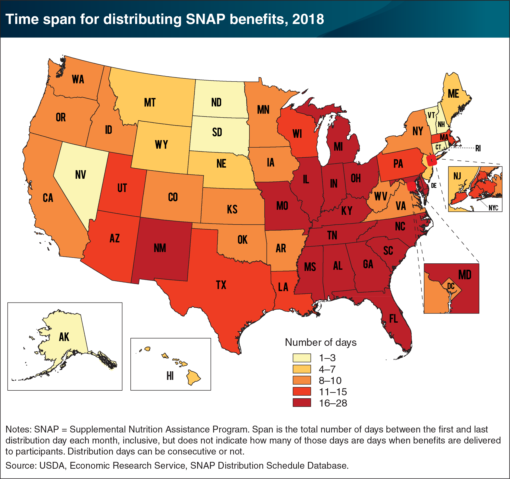

## Table of Contents

## What are SNAP benefits?

SNAP benefits, or the Supplemental Nutrition Assistance Program, help people with low income buy food. It used to be called food stamps. The government gives money on a card that works like a debit card. People can use this card to buy groceries at many stores. The amount of money you get depends on things like your income, how many people live in your home, and other costs you have.

To get SNAP benefits, you need to apply through your state's SNAP office. You will need to give information about your income, how much you spend on housing, and other details. If you are approved, you will get the card in the mail. You need to renew your benefits every year to keep getting help. SNAP is important because it helps make sure people have enough to eat, even when money is tight.

## How are SNAP benefits funded?

SNAP benefits are paid for by the government. The money comes from taxes that people pay. The program is run by the U.S. Department of Agriculture (USDA), but the money to fund it comes from the federal budget. This means that the money is set aside each year by the government to help people buy food.

Every year, the government decides how much money to spend on SNAP. This decision is made by Congress when they create the federal budget. The amount can change based on how much money the government has and how many people need help. The goal is to make sure there is enough money to help everyone who qualifies for SNAP benefits.

## Who is eligible for SNAP benefits?

To get SNAP benefits, you need to meet some rules. You have to be a U.S. citizen or a legal immigrant. Your income also has to be low enough. This means you can't make too much money. The government looks at how much money you earn and how many people live in your home. They also check if you have any other costs, like rent or medical bills, which can help you qualify even if your income is a bit higher.

There are special rules for some people. For example, if you are elderly or disabled, you might be able to get more help. Also, if you have kids, the rules might be a bit different. You need to apply through your state's SNAP office, and they will tell you if you can get benefits. If you are approved, you will get a card to buy food at stores. You need to renew your benefits every year to keep getting help.

## How does one apply for SNAP benefits?

To apply for SNAP benefits, you need to contact your state's SNAP office. You can usually do this online, by phone, or in person. When you apply, you will need to give information about your income, how many people live in your home, and other costs you have, like rent or medical bills. This helps the office figure out if you can get SNAP benefits and how much money you will get on your card.

After you apply, the SNAP office will review your information. They might ask for more details or proof of your income and costs. If you are approved, you will get a card in the mail that works like a debit card. You can use this card to buy food at many stores. You need to renew your benefits every year to keep getting help. If you have any questions or need help with the application, you can call your state's SNAP office for support.

## How are SNAP benefits distributed to recipients?

SNAP benefits are given to people on a card that works like a debit card. This card is called an EBT card, which stands for Electronic Benefits Transfer. Once you are approved for SNAP, you will get this card in the mail. You can use the EBT card to buy food at stores that accept it. The amount of money you get each month is put on the card, and you can check your balance to see how much you have.

The money is added to your EBT card on the same day every month. This day is different for everyone and depends on when you first got your benefits. You can use the card at grocery stores, some farmers' markets, and other places that sell food. It's important to keep your card safe and to remember your PIN, which is like a secret code to use the card. If you lose your card or forget your PIN, you can call the number on the back of the card to get help.

## What is the average monthly SNAP benefit per person?

The average monthly SNAP benefit per person is around $200. This number can change based on things like where you live, how much money you make, and how many people are in your home. The government looks at these details to decide how much money to put on your EBT card each month.

SNAP benefits are meant to help people buy food when they don't have enough money. The amount you get is supposed to help you buy healthy food, but it might not cover all your food costs. That's why it's important to use the benefits wisely and look for other ways to save money on food, like shopping at discount stores or using food banks.

## How does SNAP benefit distribution vary by state?

SNAP benefit distribution can be different from one state to another. Each state has its own SNAP office that handles the program. They decide how to give out the benefits and how to help people apply. Some states might have online systems that make it easier to apply, while others might need you to go to an office in person. The amount of money you get on your EBT card can also change a little bit based on the cost of living in your state.

The rules for who can get SNAP benefits are the same everywhere, but how the program works can be different. For example, some states might have special programs that let you use your EBT card at farmers' markets or for buying seeds to grow your own food. Also, the timing of when you get your benefits each month can be different depending on where you live. Even though the basic idea of SNAP is the same in every state, these small differences can affect how people use their benefits.

## What factors influence the amount of SNAP benefits a state receives?

The amount of SNAP benefits a state gets depends on how many people in that state need help. The government looks at how many people apply for SNAP and how much money they make. If a lot of people in a state have low incomes, the state will get more SNAP money. Also, the cost of living in different states can change how much money people get. If it costs more to live in a state, the SNAP benefits might be a bit higher to help people buy food.

The federal government gives money to each state for SNAP, but the states decide how to give out the benefits. They use the same rules everywhere, but they can do things a bit differently. For example, some states might have special programs to help people use their SNAP benefits at farmers' markets. The states also decide when people get their benefits each month. So, even though the basic rules are the same, the way SNAP works can be a little different in each state.

## How do states manage and administer SNAP programs?

States manage and run SNAP programs with money from the federal government. Each state has its own SNAP office that helps people apply for benefits. When someone wants to get SNAP, they have to give the state office information about their income, how many people live in their home, and other costs they have. The state office uses this information to decide if the person can get SNAP and how much money they will get on their EBT card. The states have to follow the same rules from the federal government, but they can do things a bit differently. For example, some states might have online systems to make it easier to apply, while others might need people to go to an office in person.

States also decide when people get their SNAP benefits each month. This can be different from one state to another. The states use the money they get from the federal government to help as many people as they can. They might also have special programs to help people use their SNAP benefits in different ways, like at farmers' markets or to buy seeds for growing their own food. Even though the basic rules are the same everywhere, how the SNAP program works can be a little different in each state. This is because the states have some freedom in how they run the program.

## What are the economic impacts of SNAP benefits distribution on states?

SNAP benefits help people buy food when they don't have much money. This helps the people who get the benefits, but it also helps the whole state's economy. When people use their SNAP money to buy food, it helps stores and farmers make more money. This can lead to more jobs and more money moving around in the state. So, SNAP benefits can make the economy stronger by helping more people spend money.

SNAP benefits also help make sure that people don't go hungry. When people have enough to eat, they can work better and do better in school. This can help the state in the long run because healthy people can do more for their communities. Even though SNAP costs money, it can save money in other ways, like less need for emergency help or health care. So, SNAP benefits can be good for the state's economy in many ways.

## How has the distribution of SNAP benefits changed over the past decade?

Over the past ten years, the way SNAP benefits are given out has changed a bit. The government has made it easier for people to apply for SNAP online. This means more people can get help without having to go to an office. Also, during big events like the COVID-19 pandemic, the government gave out extra SNAP money to help people who were struggling more than usual. This was to make sure people had enough to eat even when times were tough.

Another change is that some states have started special programs to let people use their SNAP benefits at farmers' markets. This helps people buy fresh fruits and vegetables and supports local farmers. The amount of SNAP money people get can also change based on the cost of living in different places. Overall, these changes have made SNAP benefits more helpful and easier to use for many people.

## What are the current policy debates surrounding SNAP benefits distribution by state?

There are a few big debates about how SNAP benefits should be given out by states. One big debate is about work rules. Some people think that adults without kids should have to work or look for work to get SNAP benefits. They say this will help people get jobs and be less dependent on help. But others think these rules are too strict and can make it hard for people to get the food they need, especially if they can't find a job or have other problems.

Another debate is about how much money states should get for SNAP. Some people want to cut the budget for SNAP to save money. They think the program costs too much. But others say that cutting SNAP would hurt people who really need help and could make other problems worse, like more people going hungry or needing emergency help. They think the government should spend more on SNAP to make sure everyone has enough to eat.

There's also a debate about how easy it should be to apply for SNAP. Some people want to make the rules simpler so more people can get help quickly. They think the current system can be too hard to use. But others worry that making it too easy could lead to people getting benefits who don't really need them. They want to keep the rules strict to make sure the money goes to the people who need it most.

## What are SNAP Benefits and how can they be understood?

The Supplemental Nutrition Assistance Program (SNAP) serves as a critical component of the United States food assistance network, primarily aiding low-income individuals and families in accessing nutritious food. As part of the U.S. Department of Agriculture (USDA), SNAP provides financial support for food purchases, thereby enhancing food security and nutrition among economically vulnerable populations. This program aims to alleviate hunger and improve dietary intake, ultimately contributing to better public health outcomes.

Eligibility for SNAP benefits hinges on several criteria, primarily centering around household income and resource limits. Generally, households must have a gross income at or below 130% of the federal poverty level to qualify. Furthermore, net income, calculated after deductions for allowable expenses such as housing and childcare, must not exceed the poverty line. In addition to income, there are asset limits, although these may vary with specific exceptions for households containing elderly or disabled members.

Nationally, the calculation for SNAP benefits is based on a formula that considers household size and income. The USDA determines a maximum benefit level annually, which reflects the cost of the Thrifty Food Plan—an estimate of budget-conscious, yet nutritious food costs for a household of four. The formula for SNAP benefits can be expressed as:

$$
\text{Benefit} = \text{Maximum Benefit} - 0.3 \times (\text{Net Income})
$$

Here, the reduction of 30% reflects the expected contribution from a household's net income towards food expenses.

In the distribution matrix, the federal government shoulders the primary responsibility for funding and setting broad eligibility guidelines for SNAP. However, state governments have significant administrative control, including determining specific implementation strategies and additional performance measures. This decentralized approach allows states to tailor the program to their unique demographics and economic circumstances, albeit within federal parameters.

Recent trends illustrate a substantial participation rate in SNAP programs across the nation. As of the latest data, approximately 42 million Americans benefit from SNAP, with households receiving an average monthly allotment aligning with fluctuations in poverty rates and economic conditions. During economic downturns, for instance, caseloads increase, underscoring the program's role as a fiscal stabilizer and its direct impact on the economy.

Furthermore, demographic changes, such as increased participation among working families and the elderly, highlight evolving patterns in SNAP usage. Policymakers and stakeholders continue to analyze these participation trends to ensure that the program adapts effectively to shifting societal needs and remains a cornerstone of national food security policy.

## References & Further Reading

[1]: [U.S. Department of Agriculture, Food and Nutrition Service SNAP Data](https://www.fns.usda.gov/pd/supplemental-nutrition-assistance-program-snap) - Comprehensive statistics on national and state-level SNAP participation.

[2]: [U.S. Census Bureau SNAP Data](https://www.census.gov/library/visualizations/interactive/snap-eligibility-access.html) - Aggregated data influencing SNAP eligibility.

[3]: Ratcliffe, C., & McKernan, S. M. (2010). ["How Much Does SNAP Reduce Food Insecurity?"](https://www.jstor.org/stable/41240383) Journal of Applied Economic Perspectives and Policy - Exploring the anti-poverty effects of SNAP.

[4]: Ganong, P., & Liebman, J. B. (2018). ["The Decline, Rebound, and Further Rise of SNAP Enrollment: Disentangling Business Cycle Fluctuations and Policy Changes."](https://www.scribd.com/document/800361405/The-Oboe-in-Jazz-Maripepa-Contreras) American Economic Journal: Economic Policy.

[5]: Chan, E. (2009). ["Quantitative Trading: How to Build Your Own Algorithmic Trading Business."](https://github.com/ftvision/quant_trading_echan_book) Wiley - Concepts for adapting algorithmic trading strategies.

[6]: Narang, R. K. (2013). ["Inside the Black Box: The Simple Truth About Quantitative Trading."](https://www.amazon.com/Inside-Black-Box-Quantitative-Trading/dp/0470432063) - Insights on algorithmic decision-making processes beyond markets.

[7]: Lopez de Prado, M. (2018). ["Advances in Financial Machine Learning."](https://www.amazon.com/Advances-Financial-Machine-Learning-Marcos/dp/1119482089) - Techniques and frameworks adaptable to public data analysis.