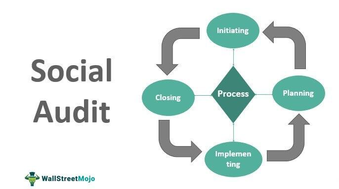

## Table of Contents

## What is a social audit?

A social audit is a way to check how well a company or organization is doing in terms of its social responsibilities. It looks at things like how the company treats its workers, how it affects the environment, and how it helps the community. The goal is to make sure the company is being fair and doing good things for people and the planet.

During a social audit, people from inside or outside the company gather information and talk to workers, community members, and others who are affected by the company's actions. They then write a report that shows what the company is doing well and where it needs to improve. This helps the company see where it can do better and helps the public know if the company is being responsible.

## Why is a social audit important for organizations?

A social audit is important for organizations because it helps them see if they are doing good things for people and the planet. It checks if the company is treating its workers well, taking care of the environment, and helping the community. By doing a social audit, an organization can find out where it is doing well and where it needs to improve. This helps the company make better choices and become more responsible.

Social audits also help build trust with the public. When a company shares its social audit report, people can see if the company is being honest and fair. This can make customers, workers, and the community feel good about supporting the company. If a company does well in its social audit, it can also attract more business and good workers who want to be part of a responsible organization.

## What are the key components of a social audit?

A social audit looks at several important things to check how well a company is doing in terms of its social responsibilities. One key part is how the company treats its workers. This includes checking if the workers are paid fairly, have safe working conditions, and are treated with respect. Another important part is the company's impact on the environment. This means looking at how the company uses resources, how much waste it produces, and what it does to protect the environment. The audit also looks at how the company helps the community, like through donations, volunteer work, or supporting local projects.

Another key component of a social audit is gathering information and talking to people. The audit team collects data from the company's records and talks to workers, community members, and other people affected by the company's actions. They ask questions to understand how the company is doing in terms of social responsibility. The audit team then writes a report that shows what the company is doing well and where it needs to improve. This report helps the company see where it can do better and helps the public know if the company is being responsible.

## How does a social audit differ from a financial audit?

A social audit and a financial audit are different in what they look at and what they want to find out. A financial audit checks the money part of a company. It looks at the company's accounts and money records to make sure they are correct and that the company is following the rules about money. The goal is to see if the company's financial reports are true and fair.

On the other hand, a social audit looks at how a company is doing in terms of its social responsibilities. It checks things like how the company treats its workers, how it affects the environment, and how it helps the community. The goal is to see if the company is being fair and doing good things for people and the planet. While a financial audit focuses on numbers and money, a social audit focuses on people and social impact.

## Who typically conducts a social audit?

A social audit can be done by people from inside the company or by people from outside. When people from inside the company do it, they are usually from a special team that checks on how the company is doing with its social responsibilities. They talk to workers, look at records, and see how the company affects the community and the environment. This helps the company see where it needs to improve and how it can do better.

Sometimes, a company might ask people from outside to do the social audit. These people might be from a special group or organization that knows a lot about social responsibility. They come in and do the same things as the inside team, but they can give a fresh look at the company's actions. This can help make sure the audit is fair and honest, and it can also help build trust with the public because they know an outside group is checking the company's work.

## What are the steps involved in performing a social audit?

Performing a social audit starts with planning. The team, whether from inside or outside the company, decides what they want to check, like how the company treats its workers, affects the environment, and helps the community. They then gather information from the company's records and talk to workers, community members, and others who are affected by the company's actions. This helps them understand how the company is doing in terms of social responsibility.

After collecting the information, the team analyzes it to see what the company is doing well and where it needs to improve. They might use special tools or methods to make sure their analysis is fair and accurate. Once the analysis is done, the team writes a report that shows their findings. This report is shared with the company and sometimes with the public, so everyone can see if the company is being responsible and where it can do better.

The last step is to follow up on the social audit. The company looks at the report and decides what changes it needs to make. It might start new programs, change how it does things, or find new ways to help the community and the environment. The company might also set goals for the future and plan to do another social audit later to check its progress. This helps the company keep improving and stay responsible.

## How can an organization prepare for a social audit?

An organization can prepare for a social audit by first understanding what the audit will check. They should look at how they treat their workers, how they affect the environment, and how they help the community. The organization can gather all the records and information that show what they are doing in these areas. They should also talk to their workers and community members to get their views and feedback. This helps the organization see where it is doing well and where it needs to improve before the audit starts.

Once the organization has gathered all the information, they should review it carefully. They can use this time to fix any problems they find and make their practices better. For example, if they see that they are not doing enough to help the environment, they can start new programs or change how they do things. The organization should also make sure everyone knows about the social audit and what it means. This way, when the audit team comes, the organization is ready to show what they are doing and how they are trying to improve.

## What are some common challenges faced during a social audit?

One common challenge during a social audit is getting honest and complete information. People might be scared to talk about problems at work or in the community. They might think they will get in trouble if they say something bad about the company. Also, the company's records might not show everything that is really happening. This makes it hard for the audit team to get a clear picture of how the company is doing.

Another challenge is deciding what is important to check. There are many things a social audit can look at, like worker rights, environmental impact, and community help. The audit team has to choose which ones are most important. This can be hard because different people might think different things are important. The team has to be fair and make sure they cover all the big areas of social responsibility.

Sometimes, there can be disagreements about the audit results. The company might not like what the audit team finds and might not want to change. The audit team has to stay strong and explain why their findings are important. They also have to make sure the public trusts the audit report. This can be tough, but it is important for the company to listen and try to do better.

## How can the results of a social audit be used to improve organizational practices?

The results of a social audit can help an organization see where it needs to improve. The audit report shows what the company is doing well and where it is not doing so well. For example, if the report says the company is not treating its workers fairly, the company can start new programs to make things better. It can also change its rules to make sure workers are paid fairly and have safe places to work. By looking at the audit results, the company can find problems and fix them, which makes it a better place for everyone.

The social audit can also help the company do more good things for the environment and the community. If the audit shows the company is not doing enough to help the environment, it can start new projects to use less energy or make less waste. If the company is not helping the community enough, it can start new programs to support local schools or help people in need. By using the audit results, the company can make plans to do better in the future. This helps the company be more responsible and build trust with the public.

## What are the best practices for reporting the findings of a social audit?

When reporting the findings of a social audit, it's important to be clear and honest. The report should explain what the audit team found out about how the company treats its workers, affects the environment, and helps the community. It should use simple words so everyone can understand it. The report should show what the company is doing well and where it needs to improve. It's also good to include examples or stories from workers and community members to make the findings more real. This helps the company see what it needs to change and helps the public trust the report.

Another best practice is to share the report with everyone who needs to see it. The company should give the report to its workers, the community, and any other people who are affected by its actions. It can also put the report on its website or in the news so more people can see it. By being open about the audit results, the company shows it cares about being responsible and wants to do better. If the company makes changes based on the audit, it should tell people about those changes too. This helps build trust and shows the company is trying to improve.

## How do regulatory frameworks influence the conduct of social audits?

Regulatory frameworks can have a big impact on how social audits are done. These frameworks are rules set by governments or other groups that say what companies must do to be responsible. They can tell companies what they need to check during a social audit, like how they treat their workers or how they affect the environment. If a company does not follow these rules, it might get in trouble or have to pay a fine. So, companies have to make sure their social audits follow these rules to stay out of trouble and show they are doing things right.

These rules can also make social audits more fair and honest. When everyone has to follow the same rules, it is easier to compare different companies and see which ones are doing a good job. The rules can also say how the audit should be done and who can do it. Sometimes, the rules might say that an outside group has to do the audit to make sure it is fair. This helps people trust the audit results more because they know the company is following the rules and being checked by someone who is not part of the company.

## What advanced methodologies can be applied to enhance the effectiveness of social audits?

One advanced method to make social audits better is using data analytics. This means using computers to look at a lot of information quickly and find patterns or problems. For example, the audit team can use data analytics to check if workers are being paid fairly or if the company is using too much energy. By using this method, the team can find issues that might be hard to see just by talking to people or looking at records. This helps the company see where it needs to improve and makes the audit more accurate.

Another way to improve social audits is by using stakeholder engagement tools. These tools help the audit team talk to workers, community members, and other people affected by the company's actions in a better way. For example, the team might use online surveys or special meetings to get more honest feedback from people. This helps the team understand how the company is really doing and what people think about it. By listening to everyone's views, the company can make better choices and show that it cares about being responsible.

## References & Further Reading

[1]: GRI Standards. ["Global Reporting Initiative."](https://www.globalreporting.org/standards) GRI Standards for Sustainability Reporting.

[2]: Henisz, W.J., Koller, T., & Nuttall, R. (2019). ["Five Ways That ESG Creates Value."](https://www.mckinsey.com/~/media/McKinsey/Business%20Functions/Strategy%20and%20Corporate%20Finance/Our%20Insights/Five%20ways%20that%20ESG%20creates%20value/Five-ways-that-ESG-creates-value.ashx) McKinsey & Company.

[3]: [Social Accountability International (SAI).](https://sa-intl.org/) SAI 8000 Standard: Social Accountability.

[4]: Kenton, W. (2021). ["Understanding Social Audits."](https://www.supermoney.com/encyclopedia/social-audit) Investopedia.

[5]: World Federation of Exchanges. (2019). ["Guidelines for Blockchain-based Markets."](https://www.world-exchanges.org/)

[6]: De Prado, M.L. (2018). ["Advances in Financial Machine Learning."](https://www.amazon.com/Advances-Financial-Machine-Learning-Marcos/dp/1119482089) Wiley.

[7]: Patterson, S. (2012). ["Dark Pools: High-Speed Traders, A.I. Bandits, and the Threat to the Global Financial System."](https://dl.acm.org/doi/10.5555/2385786) Crown Business.