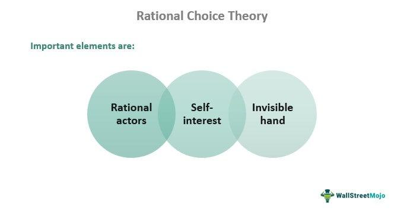

In recent years, the confluence of economic theories and technological advancements has gained unprecedented importance, reshaping how we perceive and interact with financial markets. Core to this transformation are social choice theory, decision-making models, economic models, and algorithmic trading. Social choice theory, initially conceptualized by economist Kenneth Arrow, provides a framework for aggregating individual preferences into collective decisions, thereby offering a lens to view fairness and representation in societal choices.

Economic decision-making models draw from this theory to manage complexities in selecting optimal strategies among various alternatives. These models integrate elements of social choice theory to address collective decision processes, influencing policy-making, corporate strategies, and market predictions. For instance, game theory and voting models apply these concepts to analyze potential outcomes and direct strategic actions in complex scenarios.



Algorithmic trading, a modern embodiment of these economic theories, automates the buying and selling processes in financial markets. By embedding social choice theory within these algorithms, traders can harness collective preferences, enhancing decision accuracy and aligning operations with broader economic objectives. This interdisciplinary approach not only refines trading strategies but also augments market efficiency, contributing to the overall dynamism and responsiveness of financial ecosystems.

The exploration of these intersecting fields underscores the practical applications of economic theories in real-world settings. Understanding how these theories underpin trading strategies and inform market efficiencies is crucial for navigating the evolving landscape of contemporary finance. Through this analysis, we aim to highlight the transformative potential of integrating social choice theory and sophisticated economic models in shaping the future of financial markets.

## Table of Contents

## Understanding Social Choice Theory

Social choice theory is a framework for analyzing collective decision-making, where the preferences of individuals are aggregated to reach a decision that reflects societal values. Introduced by the economist Kenneth Arrow, the theory seeks to address how a group can make fair decisions based on the diverse preferences of its members. At the core of social choice theory is Arrow's Impossibility Theorem, which demonstrates the intrinsic difficulties in designing a decision-making rule that satisfies all fairness criteria.

Arrow's theorem establishes that there is no perfect voting system capable of converting individual preferences into a collective ranking while simultaneously meeting certain pre-defined fairness conditions. These conditions include universality, responsiveness (or monotonicity), and non-dictatorship:

1. **Universality (or Unrestricted Domain):** This principle ensures that the social welfare function can accept any possible set of individual preferences and produce a unified societal preference order. Each individual's preference rankings are considered without restriction, allowing for any configuration of preferences as input.

2. **Responsiveness (Monotonicity):** Responsiveness requires that if an alternative gains more support from an individual, it should not harm its societal ranking. This condition ensures that a collective decision-making process respects changes in individual preferences that favor an alternative, thereby allowing an alternative to eventually reflect a stronger position if preferences shift in its favor.

3. **Non-Dictatorship:** This criterion ensures that the social welfare function is not solely determined by a single individual's preferences, preventing any one person from dictating the group's decisions. It preserves the essence of democratic decision-making by requiring that preferences are aggregated in a manner that reflects the diversity of the group's views.

In light of these principles, social choice theory underscores the complexities of achieving fairness in collective decision-making processes. Arrow's Impossibility Theorem poignantly illustrates the trade-offs and inherent limitations in constructing a theoretical voting system that aligns perfectly with democratic ideals.

Formally, if $N$ is the number of individuals and $A$ is the set of alternatives, social choice can be thought of as a function $F: P^N \rightarrow P$ where $P$ is the set of all preference orderings on $A$. Arrow's conditions imply that for any $F$:

- Universality: $F$ is defined for all possible profiles of individual preferences.
- Responsiveness: If an individual's preference for alternative $x$ over $y$ increases, $x$ should not lose its collective ranking compared to $y$.
- Non-Dictatorship: No single individual's preferences can solely determine the outcome without input from others.

Understanding these principles provides a critical foundation for applying social choice theory in economic decision-making, offering insights into the multifaceted dynamics of preference aggregation and the challenges of designing equitable systems.

## Decision-making in Economic Models

Economic decision-making involves selecting the optimal action from a set of alternatives, a process influenced by individual preferences and constraints. Social choice theory contributes a structured approach to deciphering these collective decision-making processes, particularly in economic models where the aggregation of various individual preferences is paramount. The integration of social choice theory into economic modeling facilitates a deeper understanding of how collective decisions can be synthesized to reflect societal preferences.

In economic models, individual preferences are often represented by utility functions, with decision-makers seeking to maximize utility subject to constraints. Social choice theory extends this by examining how to combine individual preferences into a single collective decision. One of the most significant contributions to this field is Arrow's Impossibility Theorem, which suggests that no decision-making rule can perfectly translate individual preferences into a collective decision while simultaneously satisfying all fairness criteria, such as non-dictatorship, universality, and independence of irrelevant alternatives.

Incorporating aspects of social choice theory, various economic paradigms like game theory and voting models are designed to predict outcomes and guide strategic decisions. Game theory, with its focus on strategic interactions among rational individuals, explores scenarios where the outcome for each participant depends on the choices of others. Concepts such as Nash equilibrium offer insights into stable outcomes where no participant can benefit by unilaterally changing their strategy.

Voting models provide another framework within economic decision-making, focusing on how collective preferences can be aggregated in political or organizational contexts. These models consider individual votes as expressions of preference, which must be aggregated to yield a collective decision. The Borda count and plurality voting systems exemplify mechanisms that are used to aggregate individual choices into a collective decision.

The applications of decision-making models rooted in social choice theory are expansive and include policy-making, where governments use these models to craft policies that reflect the aggregate welfare of the population. In business strategies, firms employ these models to devise strategic decisions that align with consumer preferences and competitive dynamics. Market analyses further benefit from these models by allowing the assessment of market efficiency and the prediction of market trends based on aggregated consumer behavior.

Ultimately, the infusion of social choice theory into economic decision-making models provides essential insights into how complex decisions are formulated in practice. This interdisciplinary application aids in navigating economic dilemmas by offering methodologies to synthesize individual preferences into coherent collective choices, thereby enhancing the strategic decision-making process across various economic contexts.

## The Role of Economic Models in Algorithmic Trading

Algorithmic trading has revolutionized financial markets by utilizing sophisticated economic models to automate buying and selling decisions. The integration of social choice theory into these systems enhances their ability to consider collective preferences, thereby improving decision accuracy. This is achieved by designing algorithms that not only respond to individual market signals but also aggregate preferences and data to make informed trading decisions.

Econometric models and [machine learning](/wiki/machine-learning) algorithms are pivotal to optimizing trading strategies. Econometric models, with their foundations in statistical methods, provide the quantitative frameworks necessary for understanding market dynamics and making predictions. For instance, time-series analysis, a staple in econometrics, can forecast asset prices by examining historical price data and identifying patterns. A simple example of a time-series model is the Autoregressive Integrated Moving Average (ARIMA) model, which is commonly used for predicting future points in a series:

$$

y_t = c + \theta_1y_{t-1} + \theta_2y_{t-2} + \cdots + \theta_py_{t-p} + \epsilon_t + \phi_1\epsilon_{t-1} + \cdots + \phi_q\epsilon_{t-q}
$$

where $y_t$ is the actual value at time $t$, $c$ is a constant, $\theta$ represents the coefficients for the autoregressive terms, $\phi$ corresponds to the coefficients for the moving average terms, and $\epsilon_t$ is the error term.

Machine learning algorithms add another layer of sophistication by allowing systems to learn from large datasets and improve over time. Techniques such as [reinforcement learning](/wiki/reinforcement-learning) enable algorithms to make sequential decisions by assessing outcomes from previous actions and adjusting strategies accordingly. Decision trees, neural networks, and support vector machines are prevalent in this context due to their ability to model complex nonlinear relationships in financial data.

The implementation of these models in [algorithmic trading](/wiki/algorithmic-trading) involves focusing on two critical aspects: risk assessment and market prediction. Risk assessment models evaluate the potential for loss and gauge the [volatility](/wiki/volatility-trading-strategies) of assets. They often utilize methods such as Value at Risk (VaR) and Conditional Value at Risk (CVaR) to provide insights into potential downside risks. Market prediction models, on the other hand, attempt to forecast future price movements by analyzing current market conditions and historical trends.

The advantages of using these models in a real-time trading environment are manifold. They allow for more rapid decision-making compared to manual trading, increasing the efficiency of trade executions and reducing the likelihood of human error. Furthermore, the ability to process and analyze vast amounts of data in real-time provides traders with a competitive edge, adapting swiftly to changing market dynamics.

However, challenges persist, particularly concerning data quality and computational speed. Algorithmic models are highly sensitive to the quality of input data, and inaccuracies can lead to suboptimal decisions. Additionally, the computational complexity involved in executing these models in real-time demands significant processing power and robust infrastructure, which can be costly.

In summary, the role of economic models in algorithmic trading is indispensable for automating trading decisions and optimizing strategy implementation. While advantages such as efficiency and accuracy are significant, the challenges require ongoing attention to ensure the effectiveness of these systems in dynamic financial markets.

## Implications of Combining Social Choice Theory with Algo Trading

The integration of social choice theory with algorithmic trading holds promising potential for creating more equitable and efficient financial markets. By incorporating collective preferences into trading algorithms, markets can better align with broader economic objectives and dynamically respond to market and consumer demands. This synergy offers various ways to enhance market responsiveness, promoting fairness and efficiency by accommodating a diverse set of preferences.

One of the major advantages of combining social choice theory with algorithmic trading is the potential for optimizing transaction decisions through collective insights. When trading algorithms are designed to consider a range of stakeholder preferences, the resulting trades may more accurately reflect aggregate market sentiments and social welfare. This leads to a market environment where diverse interests are considered, potentially reducing the asymmetry often exploited by traders with advanced tools and exclusive data access.

However, this integration is not without its challenges. An essential hurdle is addressing data biases that could skew the collective preferences expressed in trading algorithms. Data used in these algorithms must be representative of the entire market's preferences, rather than a limited subset, to avoid perpetuating existing disparities. Additionally, computational limitations can pose significant constraints. Algorithmic trading systems need to process vast amounts of data in real-time, requiring robust computational capabilities that can handle the complexity of integrating numerous individual preferences and constraints.

Moreover, developing algorithms that precisely reflect social choice elements involves addressing Arrow's Impossibility Theorem, which suggests difficulties in achieving a fully fair aggregation of preferences without encountering inconsistencies. As such, algorithm designers need to establish trade-offs regarding which fairness axioms to prioritize, potentially compromising on universality or non-dictatorship to meet practical trading needs.

To illustrate the practical application, consider leveraging a weighted voting system in a Python trading algorithm. Here's a simplified code snippet that could serve as a starting point:

```python
import numpy as np

def weighted_preference(votes, weights):
    """
    Aggregates preferences using a weighted sum approach.

    Parameters:
    - votes: a matrix where each row represents votes by individuals for each option.
    - weights: an array of weights for each individual.

    Returns:
    - an array representing the collective preference score for each option.
    """
    return np.dot(weights, votes)

# Sample data
votes = np.array([[5, 3, 1],   # Voter 1's preference scores
                  [4, 4, 2],   # Voter 2's preference scores
                  [3, 5, 3]])  # Voter 3's preference scores

weights = np.array([0.5, 0.3, 0.2])  # Voter weights based on influence or stake

collective_preference = weighted_preference(votes, weights)
```

This simplistic model employs a weighted voting mechanism to derive collective preferences from individual vote matrices, reflecting a balanced approach to decision-making in trading systems. Still, real-world implementations will require advanced techniques such as machine learning algorithms to handle data complexities and adapt to dynamic market environments continuously.

In conclusion, the successful integration of social choice theory into algorithmic trading necessitates careful consideration of data integrity and computational efficiency. While potential innovations abound, overcoming these obstacles is essential for realizing the benefits of a more responsive and equitable market system.

## Conclusion

Social choice theory, with its profound insights into collective decision-making, remains a cornerstone of economic studies. It plays an integral role in dissecting and understanding how individual preferences can be aggregated for societal welfare. This theoretical framework is essential for developing normative economic models that influence various sectors, notably in enhancing the capabilities of algorithmic trading systems.

When applied in tandem with economic modeling, social choice theory significantly enriches the development and functional complexities of algorithmic trading. By employing economic principles rooted in collective decision-making, algorithmic systems are better equipped to incorporate diverse market preferences and dynamics, leading to an improvement in trading accuracy and strategic adaptability. This interdisciplinary approach allows for more nuanced models capable of anticipating market behavior and optimizing trade execution in real-time.

As we gaze into the future of finance, there is a foreseeable expansion in the assimilation of such interdisciplinary methods. These approaches are expected to further enhance decision-making accuracy and boost overall market efficiency. The integration of social choice theory into financial algorithms aligns trading objectives with wider economic goals and societal expectations, paving the way for equitable and responsible financial practices.

Policymakers, traders, and economists alike are encouraged to integrate these insights into their strategic frameworks, striving toward innovation and optimization in market operations. By embracing the principles of social choice theory within algorithmic trading and broader economic modeling, these stakeholders can develop systems that are attuned not only to the desires of the market but also to the overarching societal objectives.

Exploring these themes in greater depth promises transformative changes in the operational frameworks of financial systems. Such explorations have the potential to revolutionize how these systems respond to societal needs and interact with economic environments. As this convergence of economic theory and technological innovation continues to evolve, it provides fertile ground for advancements that align financial objectives with social welfare, ensuring sustainable and inclusive economic growth.

## References & Further Reading

[1]: Ambrus, A., & Rozen, K. (2014). ["Rationalizing Choice with Multi-Self Models."](https://public.econ.duke.edu/~aa231/AmbrusRozen_Multiself.pdf) The Economic Journal, 124(574), 1242-1262.

[2]: Arrow, K. J. (1951). ["Social Choice and Individual Values."](https://en.wikipedia.org/wiki/Social_Choice_and_Individual_Values) Yale University Press.

[3]: DeGroot, M. H., & Fienberg, S. E. (1983). ["The Comparison and Evaluation of Forecasters."](https://www.jstor.org/stable/2987588) The Statistician, 32(1-2), 12-22.

[4]: Varian, H. R. (2003). ["Intermediate Microeconomics: A Modern Approach."](https://archive.org/details/intermediatemicr0006vari_b7o4) W. W. Norton & Company.

[5]: North, D. (1991). ["Institutions," Journal of Economic Perspectives](https://www.aeaweb.org/articles?id=10.1257/jep.5.1.97), 5(1), 97-112.