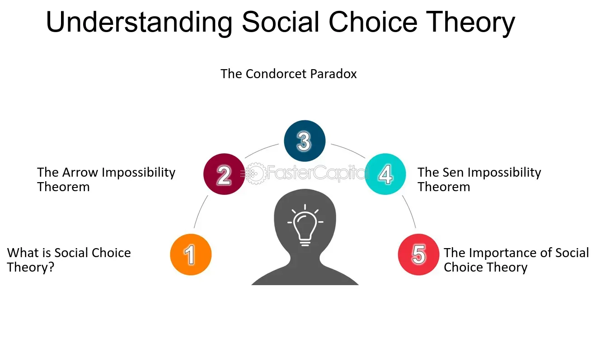

## Table of Contents

## What is Social Choice Theory?

Social Choice Theory is a part of economics and political science that looks at how groups of people make decisions together. It tries to understand how individual preferences can be combined to make a choice that represents what the group wants. This is important for voting systems, where people choose leaders or decide on policies. The theory helps us see if a voting method is fair and if it truly reflects what most people want.

One big idea in Social Choice Theory is the concept of an "Arrow's Impossibility Theorem." This theorem, named after economist Kenneth Arrow, says that no voting system can perfectly meet all the criteria we might want, like being fair and consistent. This means that any way we choose to vote will have some problems. Because of this, people who study Social Choice Theory often look for the best possible voting system, even if it's not perfect. They want to find ways to make group decisions that are as fair and effective as possible.

## Who are the key figures in the development of Social Choice Theory?

Social Choice Theory has been shaped by many important people. One of the biggest names is Kenneth Arrow. He came up with Arrow's Impossibility Theorem, which says that no voting system can be perfect. This idea changed how people think about voting and group decisions. Another key figure is Amartya Sen. He won a Nobel Prize for his work on how we can measure and improve people's well-being. Sen also looked at how different groups can make choices together in a fair way.

Another important person is Duncan Black. He worked on the idea of the median voter theorem, which helps explain how voters' preferences can affect election results. Then there's Condorcet, who lived a long time ago but had big ideas about voting. He thought about how to make voting more fair and came up with the Condorcet method, where the winner is the one who would beat every other candidate in a one-on-one vote. All these people helped build the foundation of Social Choice Theory and made us think harder about how groups can make good decisions.

## What is the Arrow's Impossibility Theorem and why is it significant?

Arrow's Impossibility Theorem, named after economist Kenneth Arrow, is a big idea in Social Choice Theory. It says that there's no perfect way to turn individual people's choices into a group decision that meets all the things we might want. For example, we might want the group choice to be fair, to reflect what most people want, and to be consistent no matter how people vote. But Arrow showed that it's impossible to have a voting system that does all these things at the same time. This means that every voting method will have some problems.

This theorem is really important because it changed how people think about voting and making group decisions. Before Arrow, many people thought that with the right voting system, we could make perfect group choices. But after Arrow's theorem, people realized that every voting system has some flaws. This made people start looking for the best possible voting system, even if it's not perfect. It also got people thinking about what's most important in a voting system and how to make choices that are as fair and effective as possible, given the limits Arrow pointed out.

## Can you explain the concept of a social welfare function?

A social welfare function is a way to figure out what a whole group of people wants based on what each person in the group wants. Imagine you and your friends are trying to decide where to go for dinner. Each of you has a favorite place, but you need to pick one spot that makes everyone happy. A social welfare function is like a rule that helps you combine everyone's choices into one group choice. It's a tool used in Social Choice Theory to make sure the group's decision reflects what most people want.

The idea is to find a fair way to turn individual preferences into a group decision. For example, if most people want pizza but a few want burgers, the social welfare function might say that pizza is the best choice for the group. But making this function work well is tricky. Kenneth Arrow's Impossibility Theorem shows that it's impossible to create a perfect social welfare function that meets all the fairness rules we might want. So, people who study social welfare functions are always trying to find the best possible way to make group decisions, even if it's not perfect.

## What are some common voting systems discussed in Social Choice Theory?

In Social Choice Theory, people talk about different ways to vote. One common voting system is called "plurality voting." This is when everyone picks their favorite choice, and the one with the most votes wins. It's simple and used a lot, but it can have problems. For example, if there are many candidates, the winner might not be the one most people really want.

Another system is "ranked choice voting," also known as "instant runoff voting." In this system, voters rank the candidates from their most favorite to least favorite. If no one gets more than half the votes, the person with the least votes is taken out, and their votes go to the next choice on those ballots. This keeps happening until someone has more than half the votes. It's meant to make sure the winner is the one most people are okay with.

There's also the "Condorcet method." This system looks at who would win in one-on-one matchups between all the candidates. The winner is the one who would beat every other candidate in a head-to-head vote. It's named after a guy named Condorcet who thought about voting a long time ago. This method tries to find the most preferred candidate overall, but it can be hard to use because it needs a lot of votes and calculations.

## How does the Borda count method work, and what are its advantages and disadvantages?

The Borda count method is a way to vote where people rank all the candidates from their favorite to their least favorite. Each ranking gets a certain number of points. For example, if there are five candidates, your first choice gets five points, your second choice gets four points, and so on, down to one point for your last choice. The candidate with the most total points from all the voters wins. This method tries to take into account not just people's top choices but also their other preferences.

One advantage of the Borda count is that it considers more of what voters want, not just their first choice. This can make the result more fair because it gives points to all the candidates someone likes, not just the top one. It can also help avoid a situation where a candidate wins even though most people don't really want them. But there are some downsides too. The Borda count can be tricky if some voters don't rank all the candidates, and it can be affected by "strategic voting," where people vote in a way to help their favorite candidate by hurting others. Also, it might not always pick the candidate who would win in a one-on-one contest, which some people think is important.

## What is the Condorcet criterion and why is it important in voting systems?

The Condorcet criterion is a rule in voting that says the winner should be the person who would beat every other candidate in a one-on-one race. Imagine you have three candidates, A, B, and C. If most voters prefer A over B, and most voters also prefer A over C, then A should win the election. This is called the Condorcet winner because they win all the head-to-head contests.

This criterion is important because it tries to make sure the winner is the one most people really want. If someone can beat every other candidate in a direct comparison, it seems fair that they should win the whole election. But not all voting systems follow this rule. Some systems might pick a winner who isn't the Condorcet winner, which can lead to results that don't feel right to voters. That's why people who study voting systems often talk about the Condorcet criterion when they're trying to make voting more fair.

## Can you describe the concept of strategic voting and its implications?

Strategic voting happens when people vote in a way that isn't their true preference because they want to help their favorite candidate win or stop someone they don't like from winning. For example, if you really like Candidate A but think they won't win, you might vote for Candidate B instead because you think B has a better chance of beating the candidate you really don't want to win. This kind of voting can change election results because it doesn't show what people really want.

The implications of strategic voting are big. It can make voting systems less fair because the results don't show what most people truly prefer. It can also make people feel like they have to play a game instead of just [picking](/wiki/asset-class-picking) their favorite. This can lead to less trust in the voting system and make people think elections aren't honest. Because of this, people who study voting systems try to find ways to make strategic voting less of a problem, so elections can be as fair as possible.

## What are some real-world applications of Social Choice Theory?

Social Choice Theory helps us understand how groups make choices, and it's used in many real situations. One big place where it's used is in elections. When people vote for leaders or decide on laws, Social Choice Theory helps us see if the voting system is fair. It looks at things like how different voting methods might change who wins and how to make sure the winner is the one most people really want. This is important for making democracy work better.

Another place where Social Choice Theory is used is in making group decisions in businesses or organizations. When a company needs to decide on a new project or policy, they might use voting or other ways to see what most people want. Social Choice Theory helps them pick the best method to make these decisions fair and effective. It can also help in figuring out how to make sure everyone's voice is heard, which can make the group work better together.

## How does Social Choice Theory address issues of fairness and equity?

Social Choice Theory helps us think about fairness and equity when groups make choices. It looks at how different ways of voting or deciding things can affect who wins or what gets chosen. For example, it asks if the voting system makes sure everyone's voice is heard equally, and if the result is what most people really want. By studying these things, Social Choice Theory helps us find the best way to make group decisions that are as fair as possible.

One big idea in Social Choice Theory is Arrow's Impossibility Theorem, which says that no voting system can be perfect in meeting all our ideas of fairness. This means that every way we choose to vote will have some problems. But knowing this helps us understand that we need to pick the best possible system, even if it's not perfect. So, Social Choice Theory pushes us to keep looking for better ways to make sure group choices are fair and reflect what most people want.

## What are the challenges in aggregating individual preferences into a collective decision?

Aggregating individual preferences into a collective decision is really hard because people want different things. Imagine you and your friends are trying to pick a movie to watch. Everyone has their own favorite, but you need to choose one movie that everyone can agree on. This is tough because what one person likes might be different from what others like. Voting systems try to solve this by combining everyone's choices, but it's not easy to make sure the final decision is fair and reflects what most people want.

One big challenge is that different voting methods can lead to different winners. For example, if you use a simple "most votes wins" system, the winner might not be the one most people really want. This can happen if there are a lot of candidates and votes are split. Another problem is that people might not vote honestly. They might vote for someone they don't like just to stop someone else from winning. This is called strategic voting, and it can make the results less fair. Social Choice Theory helps us understand these challenges and look for better ways to make group decisions that are as fair as possible.

## What recent advancements have been made in Social Choice Theory, and what are potential future research directions?

In recent years, Social Choice Theory has seen some cool advancements. One big one is the use of computers and math to study voting systems. People are using algorithms to figure out how different ways of voting might change the results of an election. This helps us see which voting systems are fairer and which ones might have problems. Another advancement is looking at how people's choices can change over time. Researchers are studying how to make voting systems that can handle changing preferences and still come up with fair results.

Looking to the future, there are a lot of exciting directions for research in Social Choice Theory. One big area is figuring out how to make voting systems work better with new technology, like online voting. Researchers want to make sure these systems are secure and fair, so people can trust them. Another future direction is understanding how to make group decisions in big, diverse groups. With more people from different backgrounds coming together, we need to find ways to make sure everyone's voice is heard and the decisions are fair. This is a big challenge, but it's important for making democracy work better.

## What is the Role of Economic Models in Algorithmic Trading?

Algorithmic trading has revolutionized financial markets by utilizing sophisticated economic models to automate buying and selling decisions. The integration of social choice theory into these systems enhances their ability to consider collective preferences, thereby improving decision accuracy. This is achieved by designing algorithms that not only respond to individual market signals but also aggregate preferences and data to make informed trading decisions.

Econometric models and [machine learning](/wiki/machine-learning) algorithms are pivotal to optimizing trading strategies. Econometric models, with their foundations in statistical methods, provide the quantitative frameworks necessary for understanding market dynamics and making predictions. For instance, time-series analysis, a staple in econometrics, can forecast asset prices by examining historical price data and identifying patterns. A simple example of a time-series model is the Autoregressive Integrated Moving Average (ARIMA) model, which is commonly used for predicting future points in a series:

$$

y_t = c + \theta_1y_{t-1} + \theta_2y_{t-2} + \cdots + \theta_py_{t-p} + \epsilon_t + \phi_1\epsilon_{t-1} + \cdots + \phi_q\epsilon_{t-q}
$$

where $y_t$ is the actual value at time $t$, $c$ is a constant, $\theta$ represents the coefficients for the autoregressive terms, $\phi$ corresponds to the coefficients for the moving average terms, and $\epsilon_t$ is the error term.

Machine learning algorithms add another layer of sophistication by allowing systems to learn from large datasets and improve over time. Techniques such as [reinforcement learning](/wiki/reinforcement-learning) enable algorithms to make sequential decisions by assessing outcomes from previous actions and adjusting strategies accordingly. Decision trees, neural networks, and support vector machines are prevalent in this context due to their ability to model complex nonlinear relationships in financial data.

The implementation of these models in [algorithmic trading](/wiki/algorithmic-trading) involves focusing on two critical aspects: risk assessment and market prediction. Risk assessment models evaluate the potential for loss and gauge the [volatility](/wiki/volatility-trading-strategies) of assets. They often utilize methods such as Value at Risk (VaR) and Conditional Value at Risk (CVaR) to provide insights into potential downside risks. Market prediction models, on the other hand, attempt to forecast future price movements by analyzing current market conditions and historical trends.

The advantages of using these models in a real-time trading environment are manifold. They allow for more rapid decision-making compared to manual trading, increasing the efficiency of trade executions and reducing the likelihood of human error. Furthermore, the ability to process and analyze vast amounts of data in real-time provides traders with a competitive edge, adapting swiftly to changing market dynamics.

However, challenges persist, particularly concerning data quality and computational speed. Algorithmic models are highly sensitive to the quality of input data, and inaccuracies can lead to suboptimal decisions. Additionally, the computational complexity involved in executing these models in real-time demands significant processing power and robust infrastructure, which can be costly.

In summary, the role of economic models in algorithmic trading is indispensable for automating trading decisions and optimizing strategy implementation. While advantages such as efficiency and accuracy are significant, the challenges require ongoing attention to ensure the effectiveness of these systems in dynamic financial markets.

## References & Further Reading

[1]: Ambrus, A., & Rozen, K. (2014). ["Rationalizing Choice with Multi-Self Models."](https://public.econ.duke.edu/~aa231/AmbrusRozen_Multiself.pdf) The Economic Journal, 124(574), 1242-1262.

[2]: Arrow, K. J. (1951). ["Social Choice and Individual Values."](https://en.wikipedia.org/wiki/Social_Choice_and_Individual_Values) Yale University Press.

[3]: DeGroot, M. H., & Fienberg, S. E. (1983). ["The Comparison and Evaluation of Forecasters."](https://www.jstor.org/stable/2987588) The Statistician, 32(1-2), 12-22.

[4]: Varian, H. R. (2003). ["Intermediate Microeconomics: A Modern Approach."](https://archive.org/details/intermediatemicr0006vari_b7o4) W. W. Norton & Company.

[5]: North, D. (1991). ["Institutions," Journal of Economic Perspectives](https://www.aeaweb.org/articles?id=10.1257/jep.5.1.97), 5(1), 97-112.