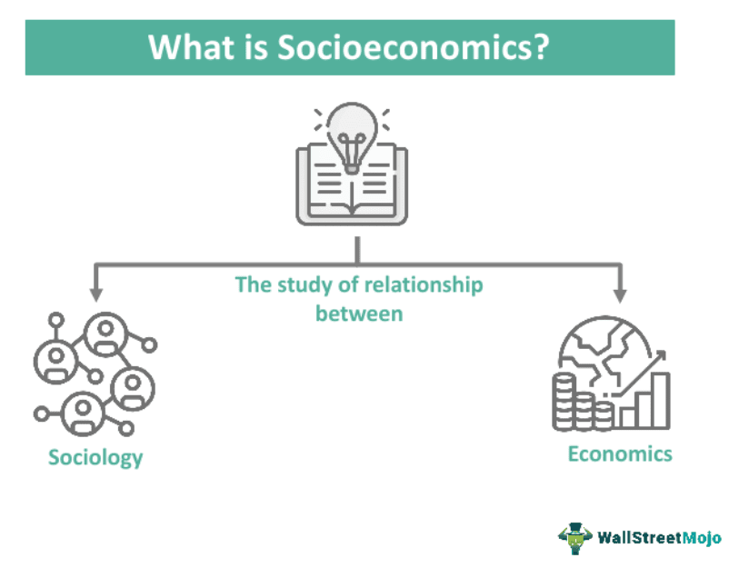

Economic theory serves as the foundational framework for understanding how economies operate and evolve. It provides a lens through which we can examine the processes that drive wealth creation, distribution, and consumption within societies. The impact of economic theory extends beyond markets and industries, influencing policy decisions, shaping social structures, and contributing to societal disparities.

As societies become increasingly interconnected, the interplay between economic theory and societal structures becomes more complex. Social economics, a branch of economics that examines how social phenomena influence economic behavior, provides insights into this intricate relationship. It explores how cultural, ethical, and social norms impact economic activities and outcomes, emphasizing the bidirectional influence between the economic environment and societal norms. Understanding this intersection is crucial for designing policies that aim to promote equitable growth and social welfare.

In parallel, algorithmic trading—a technology-driven evolution in financial markets—illustrates another dimension of modern economic systems. The automation and speed afforded by algorithmic trading have transformed market dynamics, affecting liquidity, volatility, and the accessibility of financial markets. While this innovation has increased market efficiency, it also poses ethical questions and societal challenges, particularly concerning market stability and the potential exacerbation of financial inequalities.

The purpose of this article is to provide a comprehensive guide to the societal impacts of economic theory, social economics, and algorithmic trading. By exploring these areas, we aim to deepen the understanding of how economic frameworks and technological advancements are shaping modern economies, highlighting the need for interdisciplinary approaches in addressing social and economic challenges. Through this analysis, we encourage policymakers, economists, and technologists to collaborate in fostering environments where economic innovation aligns with societal welfare.

## Table of Contents

## Economic Theory and Its Societal Impact

Economic theory is a systematic framework that attempts to explain how economies function and how economic agents interact. It is foundational in shaping economies through its influence on policy decisions, wealth distribution, and social inequalities. Economic theories provide the basis for understanding market behaviors, setting regulatory frameworks, and guiding governmental fiscal policies.

Economic theory influences policy decisions by offering models and predictions that policymakers use to shape economic strategies. For instance, the supply and demand model, a staple of classical economics, serves as a fundamental concept in determining the price mechanisms of goods and services in the market. This model suggests that prices will adjust to reflect the equilibrium where supply meets demand, thereby influencing decisions on taxation and subsidies.

Wealth distribution is another domain significantly affected by economic theories. The Keynesian economic approach, which advocates for government intervention to mitigate economic recessions, supports policies like progressive taxation and social welfare programs to alleviate income inequality. In contrast, classical and laissez-faire theories emphasize minimal government interference, promoting market-driven wealth distribution.

Social inequalities are further shaped by economic theories through their perspectives on labor and capital. Classical economics, derived from the works of Adam Smith and David Ricardo, posits that free markets lead to efficient allocation of resources, but can also inadvertently lead to disparities in wealth. Modern economic theories, such as those introducing stochastic modeling or behavioral economics, consider psychological and sociological factors in economic decision-making, highlighting the complexity of inequality.

The analysis of economic theories includes classical, Keynesian, and modern economics, each with unique implications for society. Classical economics, with its focus on the invisible hand and self-regulating markets, suggests that individuals acting in self-interest contribute to economic welfare, albeit with potential for inequality due to uneven capital accumulation.

Keynesian economics, introduced by John Maynard Keynes during the Great Depression, argues that aggregate demand—the total demand for goods and services within an economy—drives economic growth. Keynesianism advocates for active policy responses, such as fiscal stimulus during downturns, to manage economic cycles and reduce unemployment.

Modern economics encompasses a variety of schools of thought, including monetarism, which emphasizes the role of government in controlling the amount of money in circulation, and behavioral economics, which studies how psychological factors affect economic decisions. These theories offer diverse insights into how economic actions impact societal dynamics.

Overall, the interplay between economic theory and societal structures underscores the importance of understanding these theories to address contemporary social and economic challenges effectively. By influencing how resources are distributed and shaping policy frameworks, economic theories continue to play a critical role in determining the fabric of modern economies.

## Understanding Social Economics

Social economics is a significant branch of economics that examines the intricate relationship between social behavior and economic activity. It investigates the ways in which social norms, ethics, and relationships affect market outcomes, economic institutions, and resource allocation. Unlike traditional economic theories that often focus solely on market mechanisms and individual rationality, social economics acknowledges the influence of social forces and constructs in shaping economic behavior.

The interplay between social and economic behaviors is a cornerstone of social economics. Social behavior influences economic decisions in numerous ways. For instance, norms and values in a society can dictate consumer preferences, labor participation, and even investment choices. Trust and cooperation, pivotal elements of social capital, play crucial roles in facilitating economic transactions and reducing transaction costs. For example, a community characterized by high levels of trust may experience more efficient markets due to reduced reliance on costly enforcement mechanisms.

Conversely, economic behaviors also impact social structures. Economic policies and market dynamics can alter social relationships and community cohesion. For instance, widespread unemployment can lead to social unrest, while economic prosperity might enhance social well-being and integration.

Socioeconomic status (SES) is a critical determinant of individual and collective economic behaviors. SES, generally defined by income, education, and occupation, influences access to resources, opportunities, and privileges. Individuals in higher socioeconomic strata typically have better access to educational and economic opportunities, which can enhance their economic prospects and decision-making capabilities. In contrast, those in lower strata might face barriers such as limited access to financial services, education, and healthcare, which can perpetuate cycles of poverty and impede economic mobility.

The impact of socioeconomic status is evident in consumer behavior, labor market participation, and health outcomes. Higher SES often correlates with increased consumption of diverse goods and services, driven by greater disposable income and broader exposure to global markets. On the labor side, SES influences job choice, career advancement, and risk tolerance in employment decisions. Furthermore, disparities in SES can lead to significant variations in health outcomes, illustrating the intersection of social and economic dimensions in shaping quality of life.

In summary, social economics offers a comprehensive framework for understanding how social factors and economic activities interact to shape societal outcomes. By integrating social and economic perspectives, this field provides invaluable insights for addressing issues such as inequality, policy design, and sustainable development.

## Algorithmic Trading and Economic Implications

Algorithmic trading, a contemporary advancement in financial markets, involves using computer algorithms to execute trades at speeds and frequencies impossible for human traders. By leveraging mathematical models and statistical analyses, these algorithms make decisions about the timing, price, and quantity of trades, often in a matter of milliseconds. This rapid form of trading has gained significant traction, accounting for a substantial share of trading [volume](/wiki/volume-trading-strategy) across global exchanges.

The proliferation of [algorithmic trading](/wiki/algorithmic-trading) brings about notable impacts on market dynamics. One significant aspect is market stability. High-frequency trading ([HFT](/wiki/high-frequency-trading-strategies)), a subset of algorithmic trading, can enhance [liquidity](/wiki/liquidity-risk-premium), allowing for smoother transitions between buy and sell orders, which theoretically stabilizes markets. However, in certain scenarios, it can also contribute to [volatility](/wiki/volatility-trading-strategies). Sudden and substantial price movements, as a result of algorithm-driven actions, can destabilize markets, exemplified by events like the "Flash Crash" of 2010.

In terms of market efficiency, algorithmic trading has the potential to narrow bid-ask spreads and reduce transaction costs, benefiting all market participants. The reduction in [arbitrage](/wiki/arbitrage) opportunities ensures that prices reflect available information more accurately, fostering an efficient market environment. Yet, the speed of algorithmic trading can result in disparities where slower traders, including retail investors, find themselves at a disadvantage, raising concerns over market accessibility.

Ethical considerations come to the forefront with the rise of high-frequency trading. Critics argue that HFT firms possess inherent advantages due to their superior technology and proximity to exchanges, leading to a playing field that may be skewed against smaller investors. Furthermore, the opaque nature of algorithmic trading strategies can obscure market practices, making regulatory oversight challenging.

Societal implications also arise as algorithmic trading reshapes job landscapes in finance, automating roles traditionally held by human traders. While creating positions related to technology and oversight, it also enhances the demand on regulatory bodies to ensure fairness in increasingly complex markets.

Continued advancements in [machine learning](/wiki/machine-learning) and [artificial intelligence](/wiki/ai-artificial-intelligence) will likely amplify the capabilities and reach of algorithmic trading. The challenge lies in balancing technological innovation with ethical practices and market stability, requiring collaboration among financial institutions, regulators, and technologists to ensure that these modern tools serve the broader economic good.

## Integration of Economic Theories in Social Policies

Governments employ economic theories to shape both fiscal and monetary policies in ways that aim to manage economic cycles, promote growth, and address societal challenges. Fiscal policy, which includes government spending and taxation strategies, often relies on Keynesian economics. This theory advocates for increased government spending and lower taxes during economic downturns to stimulate demand and reduce unemployment, thereby stabilizing the economy. The effectiveness of such policies rests on the multiplier effect, where an initial change in spending leads to a larger overall increase in economic output.

Monetary policy is predominantly informed by modern economic principles, particularly those related to inflation targeting and [interest rate](/wiki/interest-rate-trading-strategies) adjustments. Central banks, utilizing models crafted from these theories, manipulate interest rates to either encourage spending and investment by lowering rates or control inflation by increasing them. The Taylor Rule, for instance, provides a mathematical guideline for setting interest rates based on economic conditions:

$$
i_t = r^* + \pi_t + 0.5(\pi_t - \pi^*) + 0.5(y_t - \bar{y_t})
$$

where $i_t$ is the nominal interest rate, $r^*$ is the real interest rate, $\pi_t$ is the rate of inflation, $\pi^*$ is the target inflation rate, $y_t$ is the log of real GDP, and $\bar{y_t}$ is the log of potential output.

Economic theories also inform policies addressing social issues. For instance, welfare economics provides the theoretical foundation for social safety nets such as unemployment benefits and progressive taxation systems designed to redistribute wealth and reduce poverty. Social policies based on these principles aim to enhance equity and provide essential resources to marginalized groups, thus addressing social inequalities.

Gender wage gaps and socioeconomic inequalities are other areas where economic theories find application in policy-making. Human capital theory, which links educational investment to productivity and earnings potential, underscores the importance of educational policies in narrowing gender and income disparities. Equal pay legislation and affirmative action are practical applications derived from these theories, striving to ensure fair compensation and opportunity across different demographic groups.

In conclusion, economic theories play a pivotal role in shaping a wide array of governmental policies. By interpreting these theories through policies that target fiscal balance, monetary stability, and social equity, governments attempt to foster environments conducive to comprehensive economic welfare and progress.

## The Future of Social Economics and Algorithmic Trading

Social economics is increasingly recognized as an essential framework in understanding and addressing the nuances of contemporary economic landscapes. As it evolves, it is expected to play a pivotal role in guiding policies that reflect the intersectionality between economic actions and social well-being. This involves incorporating more comprehensive analyses of societal variables and promoting inclusive growth models that focus on equity and a sustainable future.

The growing importance of social economics can be attributed to its ability to provide insights into how economic behaviors are influenced by cultural, social, and institutional contexts. As societies become more interconnected, the demand for policies that promote social equity and address disparities, such as income inequality and access to resources, is expected to intensify. Social economics will likely evolve to incorporate more interdisciplinary approaches and methods, integrating insights from sociology, psychology, and political science to create holistic economic models.

Simultaneously, algorithmic trading has been transforming the financial sector by utilizing sophisticated algorithms to execute trades at speeds and frequencies beyond human capability. This technological advancement has the potential to reshape global financial dynamics significantly. Algorithmic trading can increase market efficiency and liquidity, reducing transaction costs and facilitating the discovery of asset prices. However, it also poses risks such as market volatility, systemic risks, and ethical concerns, particularly regarding fairness and the potential exclusion of less technologically advanced market participants.

The future of algorithmic trading will likely see intensified scrutiny and regulation to mitigate these risks while maximizing benefits. Policymakers and regulators are expected to develop frameworks that ensure a balanced integration of technology in financial markets, preserving market integrity and protecting investors. This might involve employing advanced data analytics and real-time monitoring systems to detect and address manipulative trading behaviors.

To balance technological advancements with societal welfare, ongoing collaboration between economists, technologists, and policymakers is crucial. Strategies may include promoting financial literacy to democratize market participation, establishing ethical guidelines for algorithm development, and incentivizing research on the social impacts of economic technologies. By aligning technological progress with social objectives, future economic frameworks can foster an environment where innovation and equity coexist harmoniously.

## Conclusion

The intersection of economic theory, social economics, and algorithmic trading presents a multifaceted impact on society. Economic theories, ranging from classical to modern, lay the groundwork for policy decisions that impact wealth distribution and social equality. These theories have been instrumental in shaping fiscal policies and addressing issues such as gender wage gaps and socioeconomic inequalities. Meanwhile, social economics highlights the intricate relationship between social behavior and economic outcomes, emphasizing the importance of understanding socioeconomic status in shaping both individual and collective behaviors.

Algorithmic trading introduces a technological dimension, affecting market stability, efficiency, and access while raising ethical concerns. Its implications underscore the need for a balanced approach that considers both financial innovation and societal welfare.

Given these complexities, it is crucial for economic practices to be constantly examined and adapted to promote equitable growth. Policymakers, economists, and technologists must collaborate in shaping sustainable economic environments. This collaborative effort is essential to ensure that economic advancements contribute positively to society, embracing both technological progress and the imperative for social justice.

## References & Further Reading

[1]: Polanyi, K. (2001). ["The Great Transformation: The Political and Economic Origins of Our Time."](https://www.amazon.com/Great-Transformation-Political-Economic-Origins/dp/080705643X) Beacon Press.

[2]: Keynes, J.M. (1936). ["The General Theory of Employment, Interest, and Money."](https://www.files.ethz.ch/isn/125515/1366_KeynesTheoryofEmployment.pdf) Cambridge University Press.

[3]: Smith, A. (1776). ["An Inquiry into the Nature and Causes of the Wealth of Nations."](https://archive.org/details/inquiryintonatur01smit_0/) W. Strahan and T. Cadell.

[4]: Shiller, R.J. (2015). ["Irrational Exuberance: Revised and Expanded Third Edition."](https://www.jstor.org/stable/j.ctt1287kz5) Princeton University Press.

[5]: [European Central Bank. (2019). "Algorithmic Trading: A Primer."](https://www.bankingsupervision.europa.eu/framework/legal-framework/public-consultations/html/fees_201904.en.html) ECB Occasional Paper Series No. 225.