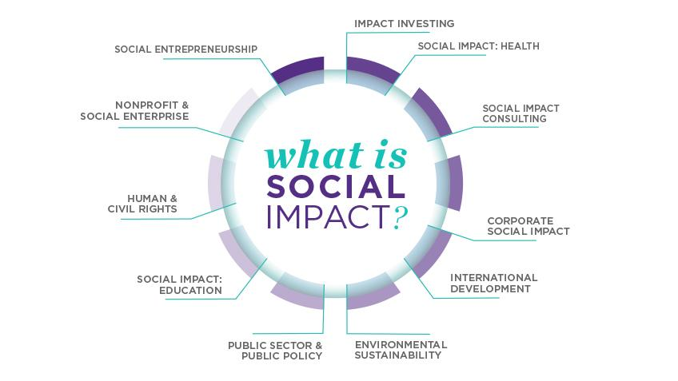

## Table of Contents

## What is social economics?

Social economics is a branch of economics that focuses on how social norms, values, and institutions affect the economy. It looks at how people's behavior and choices are influenced by their society, rather than just by money and prices. Social economists study things like how families and communities make decisions, how social policies impact economic outcomes, and how fairness and equality play a role in the economy.

This field combines ideas from sociology, psychology, and economics to understand the bigger picture of how economies work. For example, social economists might look at why some people choose to work in jobs that pay less but are more meaningful to them. They also study how government programs, like welfare or education, can help or hurt different groups in society. By understanding these social factors, social economists aim to create policies that lead to a fairer and more inclusive economy.

## How does social economics differ from traditional economics?

Social economics and traditional economics both study how people make choices and use resources, but they focus on different things. Traditional economics, often called mainstream economics, mainly looks at how people make decisions based on money and prices. It uses models and theories to predict how things like supply and demand affect the economy. Traditional economists often assume that people always make choices to maximize their own benefit, and they focus a lot on markets and how they work.

Social economics, on the other hand, pays more attention to the social side of the economy. It looks at how people's choices are influenced by their society, including things like culture, family, and community values. Social economists believe that people don't always make decisions just based on money; they also care about fairness, relationships, and social norms. So, social economics tries to understand how these social factors shape the economy and how policies can be designed to make the economy fairer and more inclusive for everyone.

## What are the key principles of social economics?

Social economics focuses on how people's choices are affected by their society, not just by money. It believes that things like culture, family, and community values play a big role in how people make decisions. Social economists think that people care about more than just their own benefit; they also care about fairness, relationships, and following social norms. This means that social economics looks at how these social factors shape the economy and influence how people behave.

Another key principle of social economics is the idea of fairness and equality. Social economists study how different groups in society are affected by economic policies and how to make the economy more inclusive. They look at how government programs, like welfare or education, can help or hurt people. By understanding these social factors, social economists aim to create policies that lead to a fairer economy where everyone has a chance to do well.

## Can you explain the concept of social capital in social economics?

Social capital is an important idea in social economics. It refers to the value of social networks and the relationships between people in a society. These networks and relationships help people work together and achieve common goals. Social capital includes things like trust, shared values, and the ability to work together. When people have strong social capital, they can rely on each other and get help when they need it. This can lead to better outcomes for individuals and communities, like getting jobs, starting businesses, or solving local problems.

In social economics, social capital is seen as a key part of how economies work. It's not just about money and markets; it's also about how people's connections and relationships affect their economic choices and opportunities. For example, a community with high social capital might be better at coming together to improve their neighborhood or support local businesses. Social economists study how social capital can be built and used to make the economy fairer and more inclusive. By understanding social capital, they can create policies that help strengthen these important social bonds and improve economic outcomes for everyone.

## How does social economics address income inequality?

Social economics looks at income inequality by thinking about how society and people's relationships affect who gets what. It says that things like trust, shared values, and working together can help make the economy fairer. Social economists believe that when people have strong connections with each other, they can help each other out more. This can mean sharing resources, supporting local businesses, or working together to solve problems. By studying how these social ties work, social economists can find ways to reduce income gaps and make sure everyone has a chance to do well.

To address income inequality, social economics suggests that policies should focus on building and using social capital. This means creating programs that help people connect with each other and build trust. For example, community centers, education programs, and support networks can all help people work together and lift each other up. By doing this, social economists hope to create a more equal economy where everyone feels included and has the resources they need to succeed.

## What role does social economics play in public policy?

Social economics helps shape public policy by looking at how people's choices are affected by their society, not just by money. It says that things like trust, shared values, and working together are important for making good policies. Social economists study how these social factors can be used to make the economy fairer and help everyone do well. When making public policy, they think about how to build and use social capital, which is the value of people's connections and relationships. This can mean creating programs that help people connect with each other and build trust, like community centers or education programs.

By understanding social capital, social economists can suggest policies that reduce income inequality and make the economy more inclusive. For example, they might support policies that help people work together to improve their neighborhoods or start businesses. These policies aim to create a fairer economy where everyone has a chance to succeed. Social economics helps policymakers see the bigger picture of how economies work, not just focusing on money and markets, but also on how people's relationships and social norms affect their choices and opportunities.

## How do social economic theories influence community development?

Social economic theories help community development by looking at how people's relationships and social values can make a community stronger. These theories say that when people trust each other and work together, they can do more to improve their neighborhood. For example, if people in a community know and help each other, they might start local businesses or fix up their streets together. Social economists think that by building these connections, or social capital, communities can become better places to live. They suggest that community development programs should focus on bringing people together and helping them build trust.

In practice, social economic theories can lead to policies that support community groups and local projects. For instance, a government might fund a community center where people can meet and work on shared goals. These centers can help people learn new skills, find jobs, or start businesses. By focusing on social capital, these policies aim to make sure everyone in the community has a chance to do well. Social economists believe that when communities are strong and connected, they can solve problems and grow in ways that benefit everyone.

## What are some real-world examples of social economics in action?

One real-world example of social economics in action is the Grameen Bank in Bangladesh. This bank gives small loans to poor people, especially women, who don't have enough money to start a business or improve their lives. The idea is that when people in a community trust each other and work together, they can help each other pay back the loans. This builds social capital and helps the whole community grow stronger. The Grameen Bank shows how social economics can help reduce poverty by focusing on people's relationships and shared goals.

Another example is community gardens in cities like Detroit. These gardens bring people together to grow their own food and improve their neighborhoods. When neighbors work together in the garden, they build trust and learn to rely on each other. This social capital helps the community solve problems and create a better place to live. By focusing on social connections, community gardens show how social economics can help make cities more inclusive and give everyone a chance to succeed.

## How does social economics measure societal well-being?

Social economics measures societal well-being by looking at more than just money. It pays attention to how happy and connected people are in their communities. Social economists believe that when people trust each other and work together, they feel better about their lives. They use things like surveys to ask people about their relationships, how safe they feel, and if they can rely on their neighbors. By understanding these social factors, social economics can tell if a community is doing well, even if people don't have a lot of money.

Another way social economics measures well-being is by looking at fairness and equality. It checks if everyone in society has a chance to do well, not just a few people. Social economists study things like income gaps and access to education and health care. They believe that when everyone feels included and has the same opportunities, the whole society does better. By focusing on these social measures, social economics helps create policies that make life better for everyone, not just those with the most money.

## What are the criticisms of social economics as a field?

Some people say social economics is too hard to study because it looks at so many different things, like how people feel and get along. They think it's tough to measure things like trust and relationships because they're not as clear as money and prices. These critics say that social economics can be too complicated and might not give clear answers about how to make the economy better.

Others argue that social economics focuses too much on feelings and fairness, and not enough on how markets and money work. They believe that traditional economics, which looks more at money and prices, can give clearer and more useful advice for making economic policies. These critics think that by focusing on social stuff, social economics might miss important ways to grow the economy and help people.

## How does social economics integrate with other social sciences?

Social economics works together with other social sciences like sociology and psychology to understand how people make choices and how societies work. Sociology looks at how groups of people live and interact with each other. Social economics uses this to see how community values and relationships affect the economy. For example, it might study how families make decisions about money or how neighborhoods work together to improve their area. By working with sociology, social economics can better understand the social side of the economy and how to make policies that help everyone.

Psychology is also important for social economics because it studies how people think and feel. Social economics uses psychology to learn why people make certain choices, even if those choices don't always make the most money. For example, it might look at why someone would choose a job that pays less but makes them happier. By understanding these feelings and thoughts, social economics can create policies that consider not just money, but also people's happiness and well-being. This way, social economics can make the economy fairer and more inclusive by working with psychology.

## What are the future trends and research directions in social economics?

In the future, social economics will likely focus more on how technology changes the way people connect and work together. As more people use social media and online platforms, social economists will study how these tools affect trust and relationships in communities. They might look at how online groups help people start businesses or share resources. By understanding these new ways of connecting, social economics can find new ways to build social capital and make the economy more inclusive. This research will help create policies that use technology to bring people together and improve their lives.

Another important trend will be studying how climate change and environmental issues affect social and economic choices. Social economists will look at how communities work together to solve problems like pollution or natural disasters. They might study how people's values and beliefs about the environment influence their economic decisions. By understanding these social factors, social economics can help create policies that protect the environment while also making the economy fairer. This research will be important for building a sustainable future where everyone has a chance to do well.

## How can economic theories be integrated into social policies?

Governments employ economic theories to shape both fiscal and monetary policies in ways that aim to manage economic cycles, promote growth, and address societal challenges. Fiscal policy, which includes government spending and taxation strategies, often relies on Keynesian economics. This theory advocates for increased government spending and lower taxes during economic downturns to stimulate demand and reduce unemployment, thereby stabilizing the economy. The effectiveness of such policies rests on the multiplier effect, where an initial change in spending leads to a larger overall increase in economic output.

Monetary policy is predominantly informed by modern economic principles, particularly those related to inflation targeting and [interest rate](/wiki/interest-rate-trading-strategies) adjustments. Central banks, utilizing models crafted from these theories, manipulate interest rates to either encourage spending and investment by lowering rates or control inflation by increasing them. The Taylor Rule, for instance, provides a mathematical guideline for setting interest rates based on economic conditions:

$$
i_t = r^* + \pi_t + 0.5(\pi_t - \pi^*) + 0.5(y_t - \bar{y_t})
$$

where $i_t$ is the nominal interest rate, $r^*$ is the real interest rate, $\pi_t$ is the rate of inflation, $\pi^*$ is the target inflation rate, $y_t$ is the log of real GDP, and $\bar{y_t}$ is the log of potential output.

Economic theories also inform policies addressing social issues. For instance, welfare economics provides the theoretical foundation for social safety nets such as unemployment benefits and progressive taxation systems designed to redistribute wealth and reduce poverty. Social policies based on these principles aim to enhance equity and provide essential resources to marginalized groups, thus addressing social inequalities.

Gender wage gaps and socioeconomic inequalities are other areas where economic theories find application in policy-making. Human capital theory, which links educational investment to productivity and earnings potential, underscores the importance of educational policies in narrowing gender and income disparities. Equal pay legislation and affirmative action are practical applications derived from these theories, striving to ensure fair compensation and opportunity across different demographic groups.

In conclusion, economic theories play a pivotal role in shaping a wide array of governmental policies. By interpreting these theories through policies that target fiscal balance, monetary stability, and social equity, governments attempt to foster environments conducive to comprehensive economic welfare and progress.

## References & Further Reading

[1]: Polanyi, K. (2001). ["The Great Transformation: The Political and Economic Origins of Our Time."](https://www.amazon.com/Great-Transformation-Political-Economic-Origins/dp/080705643X) Beacon Press.

[2]: Keynes, J.M. (1936). ["The General Theory of Employment, Interest, and Money."](https://www.files.ethz.ch/isn/125515/1366_KeynesTheoryofEmployment.pdf) Cambridge University Press.

[3]: Smith, A. (1776). ["An Inquiry into the Nature and Causes of the Wealth of Nations."](https://archive.org/details/inquiryintonatur01smit_0/) W. Strahan and T. Cadell.

[4]: Shiller, R.J. (2015). ["Irrational Exuberance: Revised and Expanded Third Edition."](https://www.jstor.org/stable/j.ctt1287kz5) Princeton University Press.

[5]: [European Central Bank. (2019). "Algorithmic Trading: A Primer."](https://www.bankingsupervision.europa.eu/framework/legal-framework/public-consultations/html/fees_201904.en.html) ECB Occasional Paper Series No. 225.