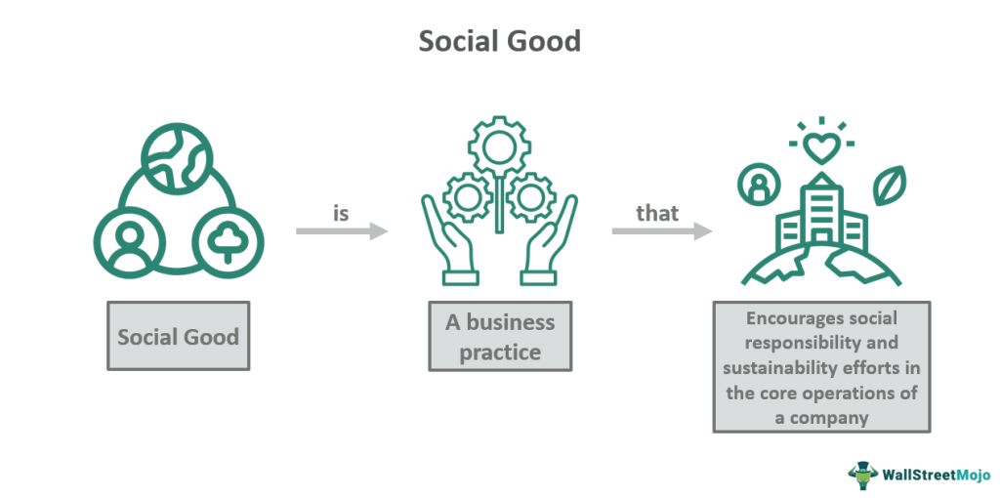

## Table of Contents

## What is social good?

Social good is when people work together to make life better for everyone in a community or society. It includes things like helping the poor, protecting the environment, and making sure everyone has a chance to succeed. When people focus on social good, they try to solve big problems that affect many people, like hunger, sickness, and not having a home.

Doing social good can be as simple as volunteering at a local shelter or as big as starting a program to help people learn new skills for jobs. It's about making the world a better place for everyone, not just for ourselves. When communities come together for social good, they can make a big difference and create a happier, healthier place for all.

## Why is social good important in society?

Social good is important in society because it helps everyone live better lives. When people work together to solve big problems like hunger, sickness, and homelessness, they make their community stronger and happier. It's like everyone is part of a big team, trying to make sure no one is left behind. This teamwork can lead to less crime, better health, and more opportunities for everyone, especially those who need help the most.

Also, focusing on social good can bring people closer together. When neighbors help each other, they build trust and friendship. This makes the community feel like a big family where everyone looks out for each other. Strong communities are better at facing challenges because they have each other's support. So, by working for social good, people not only help those in need but also create a better place for everyone to live.

## Can you provide examples of social good initiatives?

One example of a social good initiative is food banks. Food banks collect food from stores, farms, and people who want to help, and then give it to families who don't have enough to eat. This helps make sure that no one goes hungry in the community. Another example is free clinics. These are places where people can get medical help without paying a lot of money. This is important because it helps people stay healthy even if they don't have much money.

Another social good initiative is after-school programs. These programs give kids a safe place to go after school where they can do homework, play, and learn new things. This helps kids do better in school and stay out of trouble. Also, there are programs that teach adults new skills so they can get better jobs. These job training programs help people earn more money and support their families better.

Lastly, environmental clean-up projects are another example. Groups of people come together to pick up trash and clean parks and rivers. This makes the community a nicer place to live and helps protect nature. All these initiatives show how people can work together to make life better for everyone.

## How do social good efforts benefit communities?

Social good efforts help communities by making life better for everyone. When people work together to help others, they make sure that everyone has enough food, a safe place to live, and good health care. This means fewer people are hungry or sick, and more people feel safe and happy. When a community takes care of its members, it becomes stronger and more united. People trust each other more and feel like they belong to a big family that looks out for one another.

These efforts also bring people together and create a sense of teamwork. When neighbors help each other, they build friendships and trust. This makes the community feel closer and more supportive. It's easier for everyone to face challenges when they have each other's support. For example, if there's a problem like a flood or a fire, a community that works together can recover faster because everyone pitches in to help. So, social good efforts not only help those in need but also make the whole community stronger and happier.

## What are the economic impacts of social good programs?

Social good programs can have a big impact on the economy. When people have access to food, health care, and education through these programs, they can work better and earn more money. This means they spend more money in the community, which helps local businesses grow. For example, when someone gets job training and finds a good job, they can buy more things, which helps the economy. Also, when people are healthier because of free clinics, they miss fewer days of work, which is good for businesses too.

These programs can also save money in the long run. If people have enough to eat and a place to live, they are less likely to need expensive emergency help later. For example, helping homeless people find homes can cost less than dealing with the problems that come from being homeless, like going to the hospital a lot. By investing in social good, communities can avoid bigger costs down the road. This makes the economy stronger and more stable for everyone.

## How can individuals contribute to social good?

Individuals can contribute to social good by doing small, everyday actions that help others. For example, you can volunteer at a local food bank or shelter. This helps make sure that people who need food or a safe place to stay can get it. You can also donate money or things you don't need anymore, like clothes or toys, to charities. These donations can make a big difference in someone's life. Even simple acts like helping a neighbor with chores or spending time with someone who is lonely can show kindness and support.

Another way to contribute is by spreading awareness about important issues. You can talk to friends and family about problems like hunger, homelessness, or the environment. By sharing information, you help more people understand and care about these issues. You can also use social media to spread the word and encourage others to get involved. When more people know about a problem, they are more likely to help solve it. Together, these small actions can add up and make a big impact on the community.

## What role do businesses play in promoting social good?

Businesses can help a lot with social good. They can give money or things like food and clothes to people who need them. This helps make sure that everyone in the community has what they need. Businesses can also start programs to help people learn new skills or find jobs. This is good because it helps people earn more money and live better lives. When businesses do these things, they show that they care about their community and want to make it a better place for everyone.

Another way businesses can help is by being good to the environment. They can use less energy, recycle more, and make sure they don't pollute. This is important because it helps keep the world clean and safe for everyone. When businesses focus on the environment, they set a good example for others to follow. By doing these things, businesses not only help their community but also make the world a better place for everyone.

## How do governments support social good initiatives?

Governments help social good by making laws and programs that take care of people who need help. They can give money to schools so kids can learn and grow up to have good jobs. Governments also make sure that everyone has health care and a place to live. By doing this, they help make sure that no one is left behind and everyone has a chance to live a good life. This is important because it makes the whole community stronger and happier.

Governments also work to protect the environment. They can make rules that stop companies from polluting the air and water. This helps keep the world clean and safe for everyone. When governments focus on the environment, they show that they care about the future and want to leave a good world for the next generation. By helping with social good, governments make life better for everyone in the community.

## What are the challenges faced in implementing social good projects?

One big challenge in implementing social good projects is getting enough money. These projects often need a lot of money to start and keep going. Sometimes, it's hard to find people or groups willing to give money. Even when they do, there might not be enough to help everyone who needs it. This means that some people might not get the help they need right away.

Another challenge is making sure the help reaches the right people. Sometimes, it's hard to know who needs help the most. There can be a lot of paperwork and rules that make it hard for people to get the help they need. This can be frustrating for both the people trying to help and the people who need help. It's important to find ways to make the process easier so that help gets to those who need it quickly.

Lastly, keeping everyone working together can be tough. Social good projects often need many different people and groups to work together. Sometimes, they might not agree on the best way to help or how to use the money. This can slow things down and make it harder to get things done. It's important to talk and work together to find the best ways to help the community.

## How can the effectiveness of social good initiatives be measured?

The effectiveness of social good initiatives can be measured by looking at how much they help people. For example, if a food bank gives out more meals and fewer people in the community are hungry, that shows the initiative is working well. Another way to measure effectiveness is by seeing if people's lives get better. If a job training program helps more people find good jobs and earn more money, then it's making a positive impact. Surveys and feedback from the people who get help can also tell us if the initiative is doing what it's supposed to do.

It's also important to look at numbers and data. For example, if a health clinic helps more people stay healthy and fewer people need to go to the hospital, that's a good sign. Keeping track of how much money is spent and how many people are helped can show if the initiative is using its resources well. By comparing these numbers over time, we can see if the initiative is getting better at helping the community. This helps everyone understand what works and what might need to change to make things even better.

## What are some innovative approaches to advancing social good?

One innovative way to advance social good is through technology. Apps and websites can connect people who need help with those who want to help. For example, an app might let people donate money to a family in need or sign up to volunteer at a local shelter. Technology can also help spread information quickly. Social media can be used to tell people about important issues and get them involved in helping out. This makes it easier for more people to join in and make a difference.

Another approach is using data to solve problems. By collecting information about where help is needed most, groups can focus their efforts where they will do the most good. For example, a city might use data to see which neighborhoods have the most homeless people and then start programs to help them. Data can also show what kinds of help work best, so groups can learn and improve over time. This makes social good initiatives more effective and helps more people in the community.

A third innovative approach is working with businesses to create social good. Some companies have programs where they give back to the community. For example, a business might donate a portion of its profits to a food bank or start a job training program. This not only helps people who need it but also makes the business look good and brings the community together. By partnering with businesses, social good initiatives can reach more people and have a bigger impact.

## How does social good intersect with global issues like climate change and inequality?

Social good plays a big role in fighting global issues like climate change and inequality. When people work together to help the environment, they can do things like planting trees, using less energy, and cleaning up trash. These actions help slow down climate change and make the world a safer place for everyone. Social good also means helping people who don't have as much as others. By giving food, homes, and education to those in need, communities can reduce inequality and make sure everyone has a chance to live a good life.

These efforts are important because they connect local actions to big global problems. When communities focus on social good, they not only help their own neighbors but also contribute to solving bigger issues. For example, when a local group helps homeless people find homes, it's also fighting inequality. When people in a town plant trees and use less energy, they're helping to fight climate change. By working together, people can make a big difference and help create a better world for everyone.

## References & Further Reading

[1]: Bergstra, J., Bardenet, R., Bengio, Y., & Kégl, B. (2011). ["Algorithms for Hyper-Parameter Optimization."](https://dl.acm.org/doi/10.5555/2986459.2986743) Advances in Neural Information Processing Systems 24.

[2]: ["Advances in Financial Machine Learning"](https://www.amazon.com/Advances-Financial-Machine-Learning-Marcos/dp/1119482089) by Marcos Lopez de Prado

[3]: Renneboog, L., Ter Horst, J., & Zhang, C. (2008). ["Socially responsible investments: Institutional aspects, performance, and investor behavior."](https://www.sciencedirect.com/science/article/pii/S0378426607004220) The Review of Financial Studies, 21(2), 451-483.

[4]: Nakai, M., & Takeuchi, K. (2020). ["Algorithmic Trading and Market Quality: A Review of Recent Literature."](https://www.cambridge.org/core/journals/journal-of-financial-and-quantitative-analysis/article/abs/algorithmic-trading-and-market-quality-international-evidence/4B96E916E3E13AFF1DF9B5FCC188F4E0) Journal of Financial Markets, 50, 100566.

[5]: ["Machine Learning for Algorithmic Trading"](https://github.com/PacktPublishing/Machine-Learning-for-Algorithmic-Trading-Second-Edition) by Stefan Jansen

[6]: Friede, G., Busch, T., & Bassen, A. (2015). ["ESG and financial performance: aggregated evidence from more than 2000 empirical studies."](https://www.tandfonline.com/doi/full/10.1080/20430795.2015.1118917) Journal of Sustainable Finance & Investment, 5(4), 210-233.

[7]: "A Survey of Social and Environmental Accounting Research" by Jan Bebbington, Carlos Larrinaga, and Jose M. Moneva, covered in ["Accounting Review"](https://aaapubs.org/doi/full/10.2308/accr-10420).

[8]: ["Quantitative Trading: How to Build Your Own Algorithmic Trading Business"](https://www.amazon.com/Quantitative-Trading-Build-Algorithmic-Business/dp/0470284889) by Ernest P. Chan