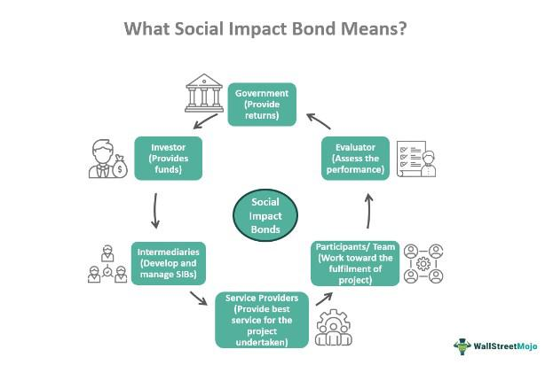

Social Impact Bonds (SIBs) represent a novel financial instrument that marries traditional finance with social welfare objectives. They are designed to channel private investment towards social programs, with returns to investors being contingent on the success of these initiatives. The primary aim of SIBs is to address and fund societal challenges, ranging from education and healthcare to housing and employment, by incentivizing successful social outcomes. This structure not only aligns with the goals of impact investing—which seeks to generate measurable social or environmental benefits alongside financial returns—but also promotes accountability in social projects through its outcomes-based payment model.

Impact investing is defined by its dual focus on financial return and positive social impact. SIBs fit neatly within this framework by ensuring that investments are directed toward results-driven social projects. The collaboration between the public sector, private investors, and non-profit organizations underpins the SIB model. The government entity outlines specific social outcomes, private investors fund initiatives to achieve these outcomes, and non-profits or social enterprises implement the projects. If the pre-defined goals are met, investors receive their capital back plus interest; if not, they risk losing their investment, thereby reinforcing the emphasis on tangible, positive social impact.



Parallel to the evolution of innovative financial products like SIBs is the rise of algorithmic trading in finance. Algorithmic trading involves the use of complex algorithms and automated systems to execute trades at high speed and volume, based on pre-set criteria. This method of trading enhances investment strategies by increasing efficiency, accuracy, and speed of trade execution while minimizing human errors and emotional biases. The ability to analyze vast datasets in real-time and execute trades based on predictive analytics positions algorithmic trading as a valuable tool in optimizing investment outcomes.

The potential integration of algorithmic trading with SIBs presents a pioneering approach to social finance. Algorithms can process data on social outcomes and financial metrics to forecast the success of various social programs under SIBs. This predictive capability could be harnessed to make data-driven decisions, thereby optimizing the allocation of resources and enhancing the success rate of such initiatives. For instance, machine learning models could identify patterns in historical social outcome data to predict future success, enabling investors to allocate capital more effectively to high-potential projects.

The synergy between these two advanced strategies—socially-driven finance and technological trading solutions—offers a new paradigm in investment. By leveraging algorithmic trading to refine the assessment and funding of social projects through SIBs, there is potential to both maximize social impact and ensure efficient capital allocation. This approach encourages a more precise connection between financial stakeholders and social outcomes, aiming to create a future where technology and finance drive significant societal benefit.

## Table of Contents

## What Are Social Impact Bonds (SIBs)?

Social Impact Bonds (SIBs) represent a compelling intersection of finance and social welfare, designed to fund public sector projects through private investment with an emphasis on achieving social outcomes. Unlike traditional bonds, which provide fixed returns based on the financial success of the funded project, SIBs hinge on the success of social interventions measured through predefined outcomes.

**Definition and Basic Mechanism**

Social Impact Bonds are a type of financial instrument that connects investors, government entities, and service providers to address social issues effectively. They are not bonds in the conventional sense but rather performance-based contracts where the financial returns are contingent upon achieving specific social outcomes. The typical structure involves the government entering into an agreement with private investors to fund social programs upfront. If these programs meet predetermined success metrics, the investors receive their principal investment plus a return from the government. If the outcomes are not achieved, investors may not receive their full investment back.

The fundamental mechanism of SIBs is built on the concept of pay-for-success (PFS). This approach shifts the risk from public entities to private investors by linking the payment to actual results rather than projected services or activities. The PFS model encourages innovation among service providers to maximize effective interventions, as their funding is directly tied to their performance.

**Outcomes-Based Approach**

The essence of Social Impact Bonds lies in their outcomes-based approach. This focuses on tangible, measurable improvements within a target population rather than activities or outputs. For instance, a SIB might target reducing recidivism rates in a specific area. Metrics such as the percentage reduction in re-offending rates over a specified period become critical indicators of success. This approach aligns incentives across all stakeholders: governments seek cost-effective social improvements, service providers aim to meet performance targets, and investors are motivated by the potential for financial returns upon successful outcomes.

**Distinguishing Features from Traditional Bonds**

Several features set Social Impact Bonds apart from traditional bonds. First, the risk distribution is altered: investors bear the risk of achieving social outcomes, while governments pay only for successful results. Second, SIBs necessitate rigorous impact measurement and data analysis to validate outcomes, requiring a level of accountability and transparency not typical in regular bond markets. This demands a robust framework for assessment and reporting, often involving third-party evaluators to ensure independent verification of outcomes. 

Additionally, the collaborative nature of SIBs differentiates them from other financial instruments. The coordination among varied stakeholders – investors, service providers, government agencies, and evaluators – fosters a partnership model focused on generating sustainable social impact rather than merely financial gain. 

In conclusion, Social Impact Bonds offer an innovative paradigm in financing, leveraging private capital to drive public good with a strong focus on measurable results. This approach not only provides a new avenue for addressing social challenges but also encourages efficiency and accountability in service delivery.

## The Role of SIBs in Impact Investing

Impact investing is a financial strategy aimed at generating positive, measurable social and environmental impact alongside a financial return. Investors in this space seek solutions to global challenges such as climate change, inequality, and access to essential services, aligning their financial goals with a broader social mission. Social Impact Bonds (SIBs) have emerged as a pivotal instrument within this strategy, aligning the financial interests of investors with outcomes that benefit society.

SIBs are innovative financing mechanisms that promote an outcomes-based approach. Unlike traditional bonds, where returns are typically determined by fixed interest rates, the repayment to investors in SIBs is contingent upon the achievement of specific social outcomes. This inherently aligns with the objectives of impact investing by establishing a direct link between financial success and positive social impact.

In the broader strategy of impact investing, SIBs offer several advantages. They encourage investment in preventive interventions by providing upfront capital for social programs, which might otherwise be underfunded due to budget constraints. This upfront funding is crucial in addressing societal challenges, allowing service providers to implement strategies that can create long-term value. For governments and social organizations, SIBs represent a shift towards a more efficient allocation of resources, targeting interventions with the potential for measurable returns on social outcomes.

Several success stories highlight the efficacy of Social Impact Bonds in driving social change. A notable example is the Peterborough SIB in the UK, aimed at reducing recidivism rates among short-sentence male prisoners. The pilot program, launched in 2010, successfully decreased reoffending rates, resulting in measurable social benefits and financial returns for investors. The success of the Peterborough SIB has spurred wider adoption of such bonds globally.

Similarly, the Massachusetts Juvenile Justice Pay for Success Initiative aimed at reducing re-incarceration rates among young adults is another success story. Despite the complicated nature of the issues tackled, the initiative was able to deliver positive outcomes over its five-year duration, which translated into financial payouts for investors and proved the merit of linking financial incentives with societal outcomes.

In conclusion, SIBs are a crucial component of impact investing, offering a unique mechanism to drive societal benefits while providing financial returns. They capitalize on the strengths of both public and private sectors, and their successful implementation in various regions and sectors underscores their viability and potential as a catalyst for societal change.

## Risks and Challenges of Social Impact Bonds

Social Impact Bonds (SIBs) present a unique risk profile due to their reliance on achieving specific social outcomes. These instruments are designed to fund public services by private investment capital, where returns are contingent upon the success of the social programs they finance. Unlike traditional bonds, SIBs do not guarantee a fixed return, which introduces significant uncertainty for investors.

One of the primary challenges with SIBs involves the measurement and achievement of social outcomes. Quantifying social impact is inherently complex because it involves variables that are qualitative and often subjective. The effectiveness of a social program is typically evaluated based on metrics that might not capture all dimensions of its impact, such as improvements in community welfare or individual well-being. Additionally, the long-term nature of social programs can delay outcome assessments and make it difficult to isolate the program's effects from other external factors.

Another significant challenge is developing appropriate performance metrics to evaluate whether the social outcomes have been met. These metrics should be rigorous yet flexible enough to accommodate the dynamic nature of social issues. Defining success in measurable terms requires robust data collection and analysis methodologies, which can be resource-intensive and prone to inaccuracies if not implemented correctly.

On the financial side, SIBs entail potential risks and investor concerns. The structure of SIBs ties financial returns to outcomes, creating an inherent risk that the social program might not achieve its intended results, leading to partial or no return on investment. This uncertainty can deter risk-averse investors who might prefer the predictability of traditional financial instruments.

Investors also face illiquidity risks, as SIBs typically have multi-year terms during which the investment is tied up, and the secondary market for these bonds is still underdeveloped. Furthermore, given the bespoke nature of SIB contracts, there is also the risk of insufficient standardization, which can lead to increased transaction costs and time-consuming negotiations.

Finally, the complexity of SIB agreements can pose governance challenges. Multiple stakeholders, including government entities, service providers, and intermediaries, must collaborate effectively. Misalignment of interests or ineffective communication between these parties can disrupt the operations of SIB-funded programs, further exacerbating the risks associated with achieving the desired outcomes.

In conclusion, while SIBs offer a novel approach to funding social programs, their unique risk profile, challenges in measuring social impact, and financial uncertainties require careful consideration by investors and policymakers. Addressing these challenges is crucial to unlocking the full potential of SIBs and ensuring their long-term viability as a tool for social impact finance.

## Algorithmic Trading and Its Impact on Investment Strategies

Algorithmic trading involves the use of computer algorithms to execute trading orders at speeds and frequencies that are impossible for human traders. Algorithms can analyze vast datasets in real time to identify trading opportunities, implement strategies, and manage risks. Their significance in modern finance lies in their ability to enhance market efficiency, [liquidity](/wiki/liquidity-risk-premium), and transparency, largely shaping today's trading landscape.

One of the primary strengths of [algorithmic trading](/wiki/algorithmic-trading) is its capacity to optimize investment strategies through automation and precision. By removing human emotion and error, algorithmic systems adhere strictly to predefined rules and strategies. For example, consider a [momentum](/wiki/momentum) trading strategy that buys stocks that have performed well over a specific period and sells those that have underperformed. The algorithm evaluates historical price data, calculates relative performance metrics, and executes trades based on real-time price fluctuations and [volume](/wiki/volume-trading-strategy) data. This systematic approach can result in more consistent performance compared to manual trading.

Algorithmic trading strategies can also exploit [arbitrage](/wiki/arbitrage) opportunities by rapidly executing trades in different markets or on different instruments to profit from price discrepancies. Furthermore, they enhance risk management through the implementation of sophisticated models that dynamically adjust positions in response to changes in market conditions. Algorithms can employ techniques such as stop-loss orders and portfolio rebalancing to ensure alignment with investment goals and risk tolerance.

Integrating algorithmic trading with impact investing presents several potential benefits. Impact investing, which aims to generate both financial returns and positive societal outcomes, can greatly benefit from the precision and efficiency offered by algorithms. For example, algorithms can analyze large datasets concerning social and environmental factors to identify investments that align with specific impact goals. This data-driven approach ensures that investments selected not only meet financial criteria but also adhere to impact objectives.

Algorithmic models can also optimize the allocation of funds within social impact investment portfolios. By continuously evaluating the performance of impact investments against predefined benchmarks, algorithms can make real-time adjustments to improve outcomes. Moreover, algorithmic trading platforms can facilitate greater transparency and accountability in impact investing by providing detailed performance analytics and reporting based on both financial and non-financial criteria.

These synergies highlight the promise of integrating advanced trading technologies into socially-driven investment strategies, offering a pathway to achieving superior financial performance while making a positive impact on society.

## Innovative Approaches: The Synergy Between SIBs and Algorithmic Trading

The integration of algorithmic trading into Social Impact Bond (SIB) investments represents a forward-thinking approach poised to transform how social finance and technology intersect. This synergy could potentially enhance the efficacy and scalability of SIBs by aligning investment strategies with sophisticated algorithmic processes, largely used in modern financial markets to optimize outcomes.

Algorithmic trading leverages computer algorithms to automate the trading process, allowing for the execution of complex strategies at high speed and volume with minimal human intervention. When applied to SIB investments, algorithmic trading can potentially offer precise monitoring, outcome-based adjustments, and predictive insights, thereby providing a more dynamic framework for managing social investments.

### Case Examples and Theoretical Models

One theoretical model involves using [machine learning](/wiki/machine-learning) algorithms to predict successful outcomes of social programs financed by SIBs. For instance, algorithms could be trained on historical data from past SIB projects to identify patterns and variables that correlate with successful outcomes. Variables might include characteristics of the target population, types of interventions used, and external economic factors. Based on this, algorithmic trading systems could adjust the funding flows to various aspects of the program, prioritizing interventions that show the highest probability of success.

Consider the following Python snippet that demonstrates a simplistic conceptual model:

```python
import numpy as np
from sklearn.linear_model import LinearRegression

# Example data: target population characteristics, types of interventions, external factors
X = np.array([[1, 2, 3], [2, 3, 1], [3, 1, 2]])
# Example outcome data
y = np.array([0.5, 0.6, 0.7])

# Train a simple model
model = LinearRegression()
model.fit(X, y)

# Predict success probability of a new intervention
new_intervention = np.array([[2, 2, 2]])
prediction = model.predict(new_intervention)

print("Predicted success probability:", prediction)
```

This model can provide decision-makers with actionable insights, enabling dynamic allocation of resources to maximize social impact.

### The Future Potential of Technology and Social Finance

The future potential of integrating algorithmic trading with SIB investments lies not only in outcome optimization but also in broader market adoption. By harnessing real-time data analytics, SIB practitioners can continuously assess and refine investment strategies, fostering a greater alignment between financial and social returns. Blockchain technology might also be employed to ensure transparency and accountability in tracking investment outcomes and impact metrics.

Furthermore, the adaptability of algorithmic trading systems could allow SIBs to respond more swiftly to changing socio-economic conditions, potentially increasing resilience and effectiveness. This could attract a broader array of investors interested in where financial performance meets measurable social benefits, thus expanding the reach and scope of impact investing.

In conclusion, the integration of algorithmic trading into SIB investments is an innovative step towards enhancing the efficiency and effectiveness of social finance, leveraging data-driven insights and technological advancements to achieve superior social outcomes.

## Conclusion

Social Impact Bonds (SIBs) offer a promising avenue for addressing societal challenges by linking financial returns to positive social outcomes. These financial instruments harness capital markets to incentivize private investment in public services, thereby aligning financial profits with social progress. The primary advantage of SIBs lies in their outcomes-based approach, which ensures that investments are directly tied to measurable social improvements. This model not only reduces the risk for public sector entities but also encourages innovation in service delivery, as private investors and service providers strive to achieve the agreed-upon outcomes to receive their returns.

However, SIBs are not without challenges. The complexity of structuring these bonds and the difficulty in accurately measuring social outcomes pose significant obstacles. Investors may be wary of the relatively novel risk profile associated with SIBs, including challenges in quantifying impact and ensuring accountability. Additionally, the requirement for robust data collection and analysis to monitor and evaluate outcomes can be resource-intensive.

Algorithmic trading, on the other hand, revolutionizes investment strategies through the application of advanced computational techniques to execute trades at high speed and precision. These methods optimize investment decisions by leveraging vast amounts of data, identifying patterns, and predicting market movements. The potential integration of algorithmic trading with SIBs could enhance the effectiveness and scalability of social impact investments. By applying algorithms to analyze social impact data, investors could more accurately predict outcomes, manage risks, and adjust investment strategies in real-time to optimize both financial and social returns.

The synergy between SIBs and algorithmic trading holds the potential to transform social finance. The integration of advanced trading technologies could lead to more effective allocation of resources, improved monitoring of social outcomes, and a more dynamic response to changing conditions on the ground. This fusion could attract a broader spectrum of investors by offering a new level of transparency, accountability, and efficiency in achieving social goals.

In conclusion, while Social Impact Bonds and algorithmic trading each have their own set of benefits and challenges, their combined application could significantly enhance societal impacts through financially innovative strategies. For investors and policymakers, this presents an opportunity to redefine the landscape of social investment, encouraging more stakeholders to participate in socially responsible initiatives. Embracing these innovative financial strategies can lead to sustainable social change, benefiting communities and society at large. It is vital for stakeholders to remain engaged in developing frameworks that facilitate such integrations, maximizing the societal benefits these financial innovations can bring.

## References & Further Reading

[1]: Bafford, B. (2016). ["Social Impact Bonds: Rethinking Finance for Social Good"](https://socialfinance.org/insight/foundations-for-social-impact-bonds-how-and-why-philanthropy-is-catalyzing-the-development-of-a-new-market/). University of Pennsylvania Scholarly Commons.

[2]: Social Finance. (2011). ["A New Tool for Scaling Impact: How Social Impact Bonds Can Mobilize Private Capital to Advance Social Good"](https://socialfinance.org/insight/a-new-tool-for-scaling-impact-how-social-impact-bonds-can-mobilize-private-capital-to-advance-social-good/).

[3]: Mulgan, G., Reeder, N., Aylott, M., & Bo'sher, L. (2011). ["Social Impact Investment: The Challenge and Opportunity of Social Impact Bonds"](https://www.youngfoundation.org/wp-content/uploads/2012/10/Social-Impact-Investment-The-opportunity-and-challenge-of-Social-Impact-Bonds-March-2011.pdf). The Young Foundation.

[4]: Manolopoulos, D. (2018). ["An Overview of Algorithmic Trading"](https://scholar.google.com/citations?user=2ySfymAAAAAJ&hl=en). arXiv:1810.03262.

[5]: OECD. (2015). ["Towards an OECD Skills Strategy."](https://www.oecd-ilibrary.org/education/oecd-skills-strategy-2019_9feb5d74-en). 

[6]: Whitfield, D. (2015). ["Alternative to Private Finance of the Welfare State: A Global Analysis of Social Impact Bond, Pay-for-Success & Development Impact Bond Projects"](https://www.researchgate.net/profile/Dexter-Whitfield/publication/287968150_Alternative_to_Private_Finance_of_the_Welfare_State_A_global_analysis_of_Social_Impact_Bond_Pay-for-Success_Development_Impact_Bond_Projects/links/567aa89908ae19758380fdba/Alternative-to-Private-Finance-of-the-Welfare-State-A-global-analysis-of-Social-Impact-Bond-Pay-for-Success-Development-Impact-Bond-Projects.pdf). European Services Strategy Unit. 

[7]: Rubalcaba, L.A. (2016). ["Social Impact Bonds: Promises & Pitfalls"](https://www.researchgate.net/publication/372806040_Social_Impact_Bonds_a_Review_of_their_Strengths_and_Weaknesses). National Institute of Standards and Technology.