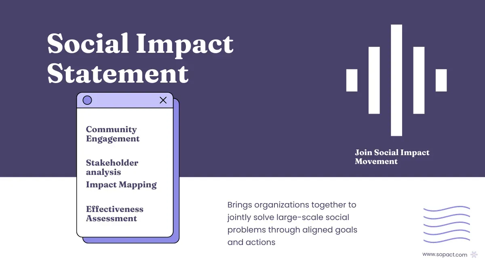

## Table of Contents

## What is a Social Impact Statement?

A Social Impact Statement is a document that explains how a project or policy will affect people and communities. It looks at both the good and bad effects that might happen because of the project. This helps people in charge make better decisions by thinking about how their choices will change the lives of others.

These statements are important because they help make sure that projects do not harm people or the environment without good reason. They are used by governments, businesses, and other groups to show that they care about the well-being of the community. By using a Social Impact Statement, they can plan ways to reduce any negative effects and make the most of the positive ones.

## Why are Social Impact Statements important?

Social Impact Statements are important because they help us understand how a project or policy will affect people and their communities. They look at both the good and bad things that might happen. This helps the people making decisions to think about how their choices will change people's lives. By doing this, they can make sure that the project does more good than harm.

These statements also show that the people in charge care about the community. They help to make sure that projects don't hurt people or the environment without a good reason. By using Social Impact Statements, groups can plan ways to make the bad effects smaller and the good effects bigger. This way, everyone can benefit from the project.

## How are Social Impact Statements typically structured?

A Social Impact Statement usually starts with an introduction that explains what the project or policy is about. It tells why the statement is being written and what it hopes to achieve. This part also gives a quick overview of the project and the area where it will happen. After the introduction, there is a section that describes the community and the environment where the project will take place. This helps everyone understand who might be affected and how.

The next part of the statement is about the possible impacts of the project. It looks at both the good and bad effects on people and the environment. This section is very important because it helps decision-makers see all the ways the project could change things. After that, there is usually a section on how to make the bad effects smaller and the good effects bigger. This part talks about plans to help the community and protect the environment. Finally, the statement ends with a summary of the main points and what should be done next.

## Who is responsible for creating Social Impact Statements?

Usually, the people or groups who want to start a project or make a new policy are the ones who need to create a Social Impact Statement. This can be a government, a business, or any other organization. They have to think about how their project will affect people and the environment, and then write it down in the statement.

Sometimes, they might need help from experts like social scientists or environmental consultants. These experts can do research and give advice on how the project might change things. This helps make sure the Social Impact Statement is complete and accurate.

## What are the common methodologies used in preparing Social Impact Statements?

When preparing Social Impact Statements, people often use different ways to gather information and understand how a project might affect the community. One common method is doing surveys and interviews with people who live in the area where the project will happen. This helps them learn about the community's needs and worries. Another way is to study the area's history and culture to see how the project might change things that are important to the people who live there. They might also look at other projects that are similar to see what happened in those cases.

Another important method is using data and statistics to predict what might happen. This can include looking at things like population numbers, health data, and economic information. By using this data, they can make guesses about how the project might change the community's life. Sometimes, they also use computer models to help understand these changes better. These models can show how different parts of the project might affect the environment and people.

Lastly, it's common to involve the community in the process. This can be done through public meetings where people can share their thoughts and ideas. By listening to the community, the people making the Social Impact Statement can make sure they understand all the possible effects of the project. This helps them create a plan that takes into account what the community needs and wants.

## Can you provide examples of projects that require Social Impact Statements?

One example of a project that needs a Social Impact Statement is building a new highway. When people want to build a highway, they have to think about how it will change the lives of the people who live near it. The highway might make it easier for people to get to work or school, but it could also make more noise and pollution. The Social Impact Statement helps them understand these things and plan ways to make the project better for everyone.

Another example is when a company wants to start mining in a new area. Mining can bring jobs and money to a community, but it can also harm the environment and the people who live there. A Social Impact Statement helps the company see how their mining project might affect the land, water, and people. This way, they can try to make the project less harmful and more helpful to the community.

A third example is when a government wants to build a new dam. Dams can help with things like providing water and making electricity, but they can also change the way rivers flow and affect the people who live nearby. A Social Impact Statement for a dam project would look at these changes and help the government find ways to make the dam as good for the community as possible.

## What are the key criticisms of Social Impact Statements?

One big criticism of Social Impact Statements is that they can be too focused on the good things and not enough on the bad things. Sometimes, the people who make these statements might want the project to happen, so they might not talk about all the possible problems. This can make it hard for people to really understand how the project might hurt them or their community. Another problem is that these statements can be hard to understand because they use a lot of big words and technical terms. This can make it tough for regular people to read them and know what is going on.

Another criticism is that Social Impact Statements might not always lead to real changes. Even if the statement finds a lot of problems, the people in charge might not do anything about it. This can make people feel like their worries are not being listened to. Also, making these statements can take a lot of time and money. Some people think that the money spent on making the statements could be used better in other ways, like helping the community right away.

## How do Social Impact Statements influence policy and decision-making?

Social Impact Statements help people who make decisions think about how their choices will change the lives of others. When a government or a company wants to start a new project, they have to write a Social Impact Statement to see how it might help or hurt the community. This helps them make better choices by looking at both the good and bad things that might happen. If the statement shows that the project could cause a lot of problems, the people in charge might decide to change the project or even stop it altogether.

Even though Social Impact Statements can help make better decisions, they don't always lead to big changes. Sometimes, the people who make these statements might focus more on the good things and not talk about all the possible problems. This can make it hard for decision-makers to see the full picture. Also, if the statement finds a lot of problems, the people in charge might not do anything about it. So, while Social Impact Statements can guide policy and decision-making, they need to be used the right way to really make a difference.

## What are the challenges in measuring the social impact accurately?

Measuring social impact accurately can be hard because it involves looking at many different things that are not easy to measure. For example, how do you measure how happy or safe people feel? These things are important but they are not like counting money or measuring how long something is. People's feelings and experiences can change a lot, and what might be good for one person might not be good for another. This makes it tricky to find a way to measure social impact that works for everyone.

Another challenge is that the effects of a project can take a long time to show up. Sometimes, you might not see the good or bad things happen right away. It might take years to see how a project really changes a community. This means that people have to keep watching and measuring over a long time, which can be hard to do. Also, the world is always changing, so what might be a good way to measure social impact now might not work in the future. This makes it even harder to get a clear picture of how a project is affecting people.

## How have Social Impact Statements evolved over time?

Social Impact Statements have changed a lot over time. At first, they were mostly about looking at how big projects like dams or highways would change the environment. People started to see that these projects also affect the lives of the people living nearby, so they began to include more about social effects. This meant looking at things like jobs, health, and community life. Now, Social Impact Statements are used for all kinds of projects, not just big ones, and they try to cover a wide range of impacts.

Over the years, the way Social Impact Statements are made has also gotten better. People have learned to use new methods like surveys, interviews, and computer models to understand how projects might affect communities. They also involve the community more, asking people what they think and what they need. This helps make sure that the statements are more accurate and fair. But even with these improvements, there are still challenges, like making sure the statements lead to real changes and that they are easy for everyone to understand.

## What role do stakeholders play in the development and review of Social Impact Statements?

Stakeholders, which are people or groups affected by a project, play a big role in making and checking Social Impact Statements. They give important information about how the project might change their lives. This can include talking about their needs, worries, and ideas. By listening to stakeholders, the people making the statement can learn more about the community and make better guesses about what might happen. Stakeholders can be involved in different ways, like through surveys, meetings, or working groups. This helps make sure the statement is fair and takes into account what the community really needs.

When it comes to reviewing the Social Impact Statement, stakeholders are also very important. They can look at the statement to see if it talks about all the possible effects on their community. If they think something is missing or wrong, they can speak up and ask for changes. This review process helps make the statement better and more accurate. It also makes sure that the people who will be affected by the project have a say in what happens. By involving stakeholders in both making and checking the statement, it becomes a tool that really helps the community.

## What future trends might affect the use and effectiveness of Social Impact Statements?

In the future, technology might change how we make and use Social Impact Statements. New tools like big data and artificial intelligence could help us understand the effects of projects better. These tools can look at a lot of information quickly and find patterns that people might miss. This could make Social Impact Statements more accurate and help us see the good and bad effects more clearly. But, we need to be careful that these new tools don't make the statements too hard for regular people to understand.

Another trend that might affect Social Impact Statements is more focus on being fair and including everyone. People are starting to see that it's important to listen to all voices in a community, especially those who are often ignored. This means that future Social Impact Statements might involve more people in the process and make sure everyone's needs are considered. This could make the statements more useful and help make sure that projects really help the community. But, it might also take more time and money to do this right.

## References & Further Reading

1. Carroll, A. B. (1991). The Pyramid of Corporate Social Responsibility: Toward the Moral Management of Organizational Stakeholders. *Business Horizons*. This paper presents the foundational framework for CSR, illustrating its different dimensions.

2. Porter, M. E., & Kramer, M. R. (2006). Strategy and Society: The Link Between Competitive Advantage and Corporate Social Responsibility. *Harvard Business Review*. This article explores the strategic integration of CSR into business practices for competitive advantage.

3. Wood, D. J. (1991). Corporate Social Performance Revisited. *Academy of Management Review*. This article revisits the concept of corporate social performance, offering insights into its measurement and impact.

4. Friedman, M. (1970). The Social Responsibility of Business is to Increase its Profits. *The New York Times Magazine*. A critical viewpoint on CSR, discussing the fundamental role of businesses in society, sparking ongoing debates.

5. Eccles, R. G., Ioannou, I., & Serafeim, G. (2014). The Impact of Corporate Sustainability on Organizational Processes and Performance. *Management Science*. The research establishes a link between sustainable practices and organizational performance.

6. Gomber, P., Arndt, B., Lutat, M., & Uhle, T. (2011). High-Frequency Trading. *Economics and Policy*. This paper provides an overview of high-frequency trading, outlining its impact on financial markets.

7. Bogle, J. C. (2009). Enough: True Measures of Money, Business, and Life. John Wiley & Sons. Discusses ethical considerations in finance and business, emphasizing long-term societal progress.

8. Tapscott, D., & Ticoll, D. (2003). The Naked Corporation: How the Age of Transparency Will Revolutionize Business. Free Press. A work on the growing demand for transparency in business, relevant to social impact statements.

9. ISO (2010). ISO 26000: Guidance on Social Responsibility. International Organization for Standardization. This standard provides guidelines for social responsibility, applicable to algo trading enterprises adopting CSR.

10. Fisher, C. (2013). Business Ethics and Values: Individual, Corporate and International Perspectives. Pearson Education. This book provides an in-depth analysis of ethics within corporate strategy, relevant to algo trading and CSR.

Each of these resources can offer diverse perspectives and further elaborate on the intersections of CSR, social impact assessments, and algorithmic trading.

